Plugins let you add logging, metrics, tools, and custom behavior to your agents. Create plugins as simple Python files - no classes needed.

```mermaid
graph TB
    subgraph "Plugin Types"
        direction LR
        TOOL["🔧 Tool<br/>Provides tools"]
        HOOK["🪝 Hook<br/>Intercepts events"]
        GUARDRAIL["🛡️ Guardrail<br/>Validates output"]
    end
    
    TOOL --> CORE["Agent<br/>Core"]
    HOOK --> CORE
    GUARDRAIL --> CORE
    
    style TOOL fill:#189AB4,color:#fff
    style HOOK fill:#189AB4,color:#fff
    style GUARDRAIL fill:#189AB4,color:#fff
    style CORE fill:#8B0000,color:#fff
```



---

## Quick Start

Create a plugin file and place it in the plugins directory:

<Steps>
<Step title="Create Plugin File">
Create `~/.praisonai/plugins/my_tools.py`:

```python
"""
Plugin Name: My Tools
Description: Custom tools for my agent
Version: 1.0.0
"""

from praisonaiagents import tool

@tool
def get_weather(city: str) -> str:
    """Get weather for a city."""
    return f"☀️ Sunny in {city}, 72°F"
```
</Step>

<Step title="Use It">
```python
from praisonaiagents import Agent, discover_and_load_plugins

# Load plugins (registers tools to global registry)
discover_and_load_plugins()

# Reference tools by name
agent = Agent(
    name="Assistant",
    instructions="Help users",
    tools=["get_weather"]  # Tool name from plugin
)
agent.start("What's the weather in Paris?")
```
</Step>
</Steps>

<Note>
**Plugin Location:** Place plugins in `~/.praisonai/plugins/` (user-wide) or `./.praisonai/plugins/` (project-specific).
</Note>

---

## Plugin Locations

| Location | Scope |
|----------|-------|
| `~/.praisonai/plugins/` | User-wide (all projects) |
| `./.praisonai/plugins/` | Project-specific |

```bash
# Create plugin directory
mkdir -p ~/.praisonai/plugins/
```

---

## Tool Plugins

Provide additional tools that agents can use.

Create `~/.praisonai/plugins/weather_tools.py`:

```python
"""
Plugin Name: Weather Tools
Description: Get weather for any city
Version: 1.0.0
"""

from praisonaiagents import tool

@tool
def get_weather(city: str) -> str:
    """Get current weather for a city."""
    return f"☀️ Sunny in {city}, 72°F"

@tool
def get_forecast(city: str, days: int = 5) -> str:
    """Get weather forecast for a city."""
    return f"📅 {days}-day forecast for {city}: Mostly sunny"
```

**Use it:**

```python
from praisonaiagents import Agent, discover_and_load_plugins

# Load plugins (registers tools to global registry)
discover_and_load_plugins()

agent = Agent(
    name="Assistant",
    instructions="Help with weather",
    tools=["get_weather", "get_forecast"]  # Reference by name
)
agent.start("What's the weather in Tokyo?")
```


---

## Hook Plugins

Intercept lifecycle events like tool calls, LLM requests, and agent start/end.

Create `~/.praisonai/plugins/my_logger.py`:

```python
"""
Plugin Name: My Logger
Description: Logs all tool calls
Version: 1.0.0
Hooks: before_tool, after_tool
"""

from praisonaiagents.hooks import add_hook

@add_hook('before_tool')
def log_before(data):
    print(f"🔧 Calling: {data.tool_name}")

@add_hook('after_tool')
def log_after(data):
    print(f"✅ Result: {str(data.result)[:50]}")
```

**Use it:**

```python
from praisonaiagents import Agent, discover_and_load_plugins

# Load plugins (registers hooks)
discover_and_load_plugins()

agent = Agent(name="Assistant", instructions="Help users")
agent.start("Search for Python tutorials")
# Hooks automatically log tool calls
```

### Available Hooks

| Hook | When Called | Can Modify |
|------|-------------|------------|
| `before_agent` | Agent starts | Prompt |
| `after_agent` | Agent finishes | Response |
| `before_tool` | Tool about to run | Arguments |
| `after_tool` | Tool finished | Result |
| `before_llm` | LLM call starting | Messages |
| `after_llm` | LLM responded | Response |

---

## Guardrail Plugins

Validate agent outputs before they're returned.

Create `~/.praisonai/plugins/safety_guardrail.py`:

```python
"""
Plugin Name: Safety Guardrail
Description: Blocks sensitive content
Version: 1.0.0
Hooks: after_agent
"""

from praisonaiagents.hooks import add_hook

BLOCKED_WORDS = ["password", "secret", "api_key", "token"]

@add_hook('after_agent')
def check_safety(data):
    response = str(data.result).lower()
    for word in BLOCKED_WORDS:
        if word in response:
            data.result = "[BLOCKED: Contains sensitive information]"
    return data
```

**Use it:**

```python
from praisonaiagents import Agent, discover_and_load_plugins

# Load plugins (registers guardrails)
discover_and_load_plugins()

agent = Agent(name="Assistant", instructions="Help users")
agent.start("Show me the password")
# Output: [BLOCKED: Contains sensitive information]
```

---

## LLM Plugins

Intercept and modify LLM calls for logging or token management.

Create `~/.praisonai/plugins/token_counter.py`:

```python
"""
Plugin Name: Token Counter
Description: Counts tokens used in LLM calls
Version: 1.0.0
Hooks: after_llm
"""

from praisonaiagents.hooks import add_hook

total_tokens = 0

@add_hook('after_llm')
def count_tokens(data):
    global total_tokens
    usage = data.usage or {}
    total_tokens += usage.get("total_tokens", 0)
    print(f"📊 Total tokens: {total_tokens}")
```

**Use it:**

```python
from praisonaiagents import Agent, discover_and_load_plugins

# Load plugins (registers LLM hooks)
discover_and_load_plugins()

agent = Agent(name="Assistant", instructions="Help users")
agent.start("Tell me a joke")
# Prints: 📊 Total tokens: 150
```

---

## Plugin File Format

Every plugin file needs a header with metadata:

```python
"""
Plugin Name: My Plugin Name
Description: What the plugin does
Version: 1.0.0
Author: Your Name (optional)
Hooks: before_tool, after_tool (optional, for hook plugins)
"""
```

| Field | Required | Description |
|-------|----------|-------------|
| `Plugin Name` | ✅ | Name of the plugin |
| `Description` | ✅ | What the plugin does |
| `Version` | ✅ | Semantic version |
| `Author` | ❌ | Plugin author |
| `Hooks` | ❌ | Hooks this plugin uses |

---

## CLI Commands

```bash
# Create a new plugin from template
praisonai plugins init my_plugin

# List all discovered plugins
praisonai plugins list

# Scan for plugins
praisonai plugins scan --verbose
```

---

## Built-in Plugins

Enable built-in plugins without creating files:

```python
from praisonaiagents import Agent, plugins

# Enable logging and metrics
plugins.enable(["logging", "metrics"])

agent = Agent(name="Assistant", instructions="Help users")
agent.start("What's the weather?")
---

## Lifecycle Hooks

Plugins intercept events at specific points in the agent lifecycle:

```mermaid
flowchart TB
    subgraph " "
        direction TB
        INPUT["📥 User Input"]
        
        subgraph AGENT_START["Agent Start"]
            BA["🪝 before_agent"]
        end
        
        subgraph TOOL_CYCLE["Tool Cycle (may repeat)"]
            BT["🪝 before_tool"]
            TOOL["🔧 Tool Executes"]
            AT["🪝 after_tool"]
        end
        
        subgraph LLM_CYCLE["LLM Call"]
            BL["🪝 before_llm"]
            LLM["🧠 LLM Generates"]
            AL["🪝 after_llm"]
        end
        
        subgraph AGENT_END["Agent Complete"]
            AA["🪝 after_agent"]
        end
        
        OUTPUT["📤 Response"]
    end
    
    INPUT --> BA
    BA --> BT
    BT --> TOOL
    TOOL --> AT
    AT --> BL
    BL --> LLM
    LLM --> AL
    AL --> AA
    AA --> OUTPUT
    
    style INPUT fill:#8B0000,color:#fff
    style OUTPUT fill:#8B0000,color:#fff
    style TOOL fill:#189AB4,color:#fff
    style LLM fill:#189AB4,color:#fff
    style BA fill:#6366F1,color:#fff
    style AA fill:#6366F1,color:#fff
    style BT fill:#10B981,color:#fff
    style AT fill:#10B981,color:#fff
    style BL fill:#F59E0B,color:#fff
    style AL fill:#F59E0B,color:#fff
```




| Hook | Stage | Can Modify |
|------|-------|------------|
| `before_agent` | Agent starts | Prompt, context |
| `before_tool` | Tool about to run | Tool arguments |
| `after_tool` | Tool finished | Tool result |
| `before_llm` | LLM call starting | Messages, params |
| `after_llm` | LLM responded | LLM response |
| `after_agent` | Agent finishing | Final response |

---

## Protocols

Type-safe plugin interfaces using Python protocols.

```mermaid
graph TB
    subgraph "Plugin Protocols"
        PP["🔌 PluginProtocol<br/>(base)"]
        
        PP --> TP["🔧 ToolPluginProtocol<br/>get_tools()"]
        PP --> HP["🪝 HookPluginProtocol<br/>before_*/after_*"]
        PP --> AP["🤖 AgentPluginProtocol<br/>before_agent/after_agent"]
        PP --> LP["🧠 LLMPluginProtocol<br/>before_llm/after_llm"]
    end
    
    style PP fill:#8B0000,color:#fff
    style TP fill:#189AB4,color:#fff
    style HP fill:#10B981,color:#fff
    style AP fill:#6366F1,color:#fff
    style LP fill:#F59E0B,color:#fff
```



| Protocol | Purpose | Key Methods |
|----------|---------|-------------|
| `PluginProtocol` | Base plugin | `name`, `version`, `on_init`, `on_shutdown` |
| `ToolPluginProtocol` | Provides tools | `get_tools()` |
| `HookPluginProtocol` | Intercepts events | `before_tool`, `after_tool`, etc. |
| `AgentPluginProtocol` | Agent lifecycle | `before_agent`, `after_agent` |
| `LLMPluginProtocol` | LLM calls | `before_llm`, `after_llm` |

```python
from praisonaiagents import (
    PluginProtocol,
    ToolPluginProtocol,
    HookPluginProtocol,
    AgentPluginProtocol,
    LLMPluginProtocol
)

# Check if object implements protocol
if isinstance(my_plugin, PluginProtocol):
    print("Valid plugin!")

# Implement specific protocol
class MyToolPlugin:
    @property
    def name(self) -> str:
        return "tool_provider"
    
    @property
    def version(self) -> str:
        return "1.0.0"
    
    def on_init(self, context):
        pass
    
    def on_shutdown(self):
        pass
    
    def get_tools(self):
        return [{"name": "my_tool", "description": "Does something"}]

# Type checker validates implementation
assert isinstance(MyToolPlugin(), ToolPluginProtocol)
```

## Available Hooks

```mermaid
graph TB
    subgraph "Plugin Hook Categories"
        A[🔧 Lifecycle] --> A1[ON_INIT]
        A --> A2[ON_SHUTDOWN]
        A --> A3[SETUP]
        
        B[🤖 Agent] --> B1[BEFORE_AGENT]
        B --> B2[AFTER_AGENT]
        B --> B3[SUBAGENT_STOP]
        
        C[🛠️ Tool] --> C1[BEFORE_TOOL]
        C --> C2[AFTER_TOOL]
        
        D[🧠 LLM] --> D1[BEFORE_LLM]
        D --> D2[AFTER_LLM]
        
        E[💬 User] --> E1[USER_PROMPT_SUBMIT]
        E --> E2[NOTIFICATION]
    end
    
    classDef lifecycle fill:#6366F1,stroke:#7C90A0,color:#fff
    classDef agent fill:#8B0000,stroke:#7C90A0,color:#fff
    classDef tool fill:#189AB4,stroke:#7C90A0,color:#fff
    classDef llm fill:#F59E0B,stroke:#7C90A0,color:#fff
    classDef user fill:#10B981,stroke:#7C90A0,color:#fff
    
    class A,A1,A2,A3 lifecycle
    class B,B1,B2,B3 agent
    class C,C1,C2 tool
    class D,D1,D2 llm
    class E,E1,E2 user
```



### Core Hooks

| Hook | When Called | Can Modify |
|------|-------------|------------|
| `ON_INIT` | Plugin initialization | Context |
| `ON_SHUTDOWN` | Plugin shutdown | - |
| `BEFORE_AGENT` | Before agent execution | Prompt |
| `AFTER_AGENT` | After agent execution | Response |
| `BEFORE_TOOL` | Before tool call | Arguments |
| `AFTER_TOOL` | After tool call | Result |
| `BEFORE_LLM` | Before LLM call | Messages, Params |
| `AFTER_LLM` | After LLM response | Response |
| `ON_PERMISSION_ASK` | Permission requested | Approval |
| `ON_CONFIG` | Configuration loaded | Config |
| `ON_AUTH` | Authentication needed | Credentials |

### Extended Hooks

| Hook | When Called | Can Modify |
|------|-------------|------------|
| `USER_PROMPT_SUBMIT` | User submits prompt | Input |
| `NOTIFICATION` | Notification sent | Message |
| `SUBAGENT_STOP` | Subagent completes | Result |
| `SETUP` | System initialization | Config |
| `BEFORE_MESSAGE` | Before message processed | Message |
| `AFTER_MESSAGE` | After message processed | Message |
| `MESSAGE_RECEIVED` | Message received | Message |
| `MESSAGE_SENDING` | Before message sent | Message |
| `MESSAGE_SENT` | After message sent | - |
| `SESSION_START` | Session begins | Context |
| `SESSION_END` | Session ends | - |
| `BEFORE_COMPACTION` | Before context compaction | Context |
| `AFTER_COMPACTION` | After context compaction | Context |
| `TOOL_RESULT_PERSIST` | Before tool result stored | Result |
| `ON_ERROR` | Error occurred | Error handling |
| `ON_RETRY` | Retry attempted | Retry config |
| `GATEWAY_START` | Gateway starts | Config |
| `GATEWAY_STOP` | Gateway stops | - |

## Single-File Plugins

Create plugins as simple Python files with WordPress-style headers. This is the **simplest** way to create plugins.


### Plugin Header Format

```python
"""
Plugin Name: Weather Tools
Description: Get weather information for any location
Version: 1.0.0
Author: Your Name
Hooks: before_tool, after_tool
Dependencies: requests
"""

from praisonaiagents import tool

@tool
def get_weather(location: str) -> str:
    """Get current weather for a location."""
    return f"Weather for {location}: Sunny, 72°F"
```

### CLI Commands

Manage single-file plugins from the command line:

<Tabs>
  <Tab title="Create Plugin">
```bash
# Create a new plugin with template
praisonai plugins init my_plugin

# With options
praisonai plugins init weather_tools --author "John Doe" --with-hook

# In a specific directory
praisonai plugins init custom --output ./my_plugins/
```
  </Tab>
  <Tab title="List & Scan">
```bash
# List all discovered plugins
praisonai plugins scan

# With details
praisonai plugins scan --verbose

# JSON output
praisonai plugins scan --json
```
  </Tab>
  <Tab title="Load & Discover">
```bash
# Load a specific plugin file
praisonai plugins load ./my_plugin.py

# Discover and load all plugins
praisonai plugins discover --verbose
```
  </Tab>
  <Tab title="Template">
```bash
# Print a plugin template to stdout
praisonai plugins template

# Save to file
praisonai plugins template > my_plugin.py

# With hook example
praisonai plugins template --with-hook
```
  </Tab>
</Tabs>

### Discovery and Loading

```python
from praisonaiagents import (
    discover_plugins,
    load_plugin,
    discover_and_load_plugins,
    get_default_plugin_dirs,
)

# Discover plugins without loading
plugins = discover_plugins()
for p in plugins:
    print(f"{p['name']} v{p['version']}")

# Load a specific plugin
metadata = load_plugin("./plugins/weather.py")
print(f"Loaded: {metadata['name']}")

# Discover and load all plugins at once
all_plugins = discover_and_load_plugins()

# Get default plugin directories
# Returns: ['./.praisonai/plugins/', '~/.praisonai/plugins/']
dirs = get_default_plugin_dirs()
```

### Plugin Directories

Plugins are discovered from these directories (in precedence order):

| Directory | Scope |
|-----------|-------|
| `./.praisonai/plugins/` | Project-specific |
| `~/.praisonai/plugins/` | User-wide |

### Generate Plugin Template

```python
from praisonaiagents import get_plugin_template, ensure_plugin_dir

# Generate a plugin template
template = get_plugin_template(
    name="My Plugin",
    description="Does something useful",
    author="Your Name"
)

# Ensure user plugin directory exists
plugin_dir = ensure_plugin_dir()  # Creates ~/.praisonai/plugins/
```

---

## Folder Structure

```
praisonaiagents/plugins/
├── __init__.py           # Public exports
├── protocols.py          # Plugin protocols
├── manager.py            # PluginManager
├── plugin.py             # Plugin base class
├── parser.py             # Single-file header parser
├── discovery.py          # Plugin discovery
├── sdk/                  # Plugin SDK
│   ├── __init__.py
│   └── decorators.py
└── builtin/              # Built-in plugins
    ├── __init__.py
    ├── logging_plugin.py
    └── metrics_plugin.py
```

## Examples

<Tabs>
  <Tab title="Function Plugin">
```python
from praisonaiagents import PluginManager, FunctionPlugin, PluginHook

def log_tool_calls(tool_name, args):
    print(f"Tool: {tool_name}, Args: {args}")
    return args

plugin = FunctionPlugin(
    name="logger",
    hooks={PluginHook.BEFORE_TOOL: log_tool_calls}
)

manager = PluginManager()
manager.register(plugin)
```
  </Tab>
  <Tab title="Directory Loading">
```python
# plugins/my_plugin.py
from praisonaiagents import Plugin, PluginInfo

class MyPlugin(Plugin):
    @property
    def info(self):
        return PluginInfo(name="my_plugin")

# main.py
from praisonaiagents import PluginManager

manager = PluginManager()
count = manager.load_from_directory("./plugins")
print(f"Loaded {count} plugins")
```
  </Tab>
  <Tab title="Tool Provider">
```python
from praisonaiagents import Plugin, PluginInfo, PluginManager

class CalculatorPlugin(Plugin):
    @property
    def info(self):
        return PluginInfo(name="calculator")
    
    def get_tools(self):
        return [{
            "name": "calculate",
            "description": "Perform math calculations",
            "function": lambda expr: eval(expr),
            "parameters": {
                "type": "object",
                "properties": {"expr": {"type": "string"}}
            }
        }]

manager = PluginManager()
manager.register(CalculatorPlugin())
tools = manager.get_all_tools()
```
  </Tab>
</Tabs>

## Performance

<Note>
Plugins use lazy loading and have zero overhead when not used. All imports are deferred until the plugin is actually accessed.
</Note>

```python
# This import is instant - no plugins loaded yet
from praisonaiagents.plugins import PluginManager

# Plugins only load when registered
manager = PluginManager()
manager.register(LoggingPlugin())  # LoggingPlugin loads here
```
