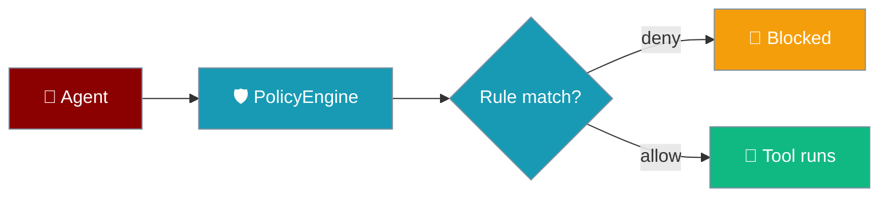
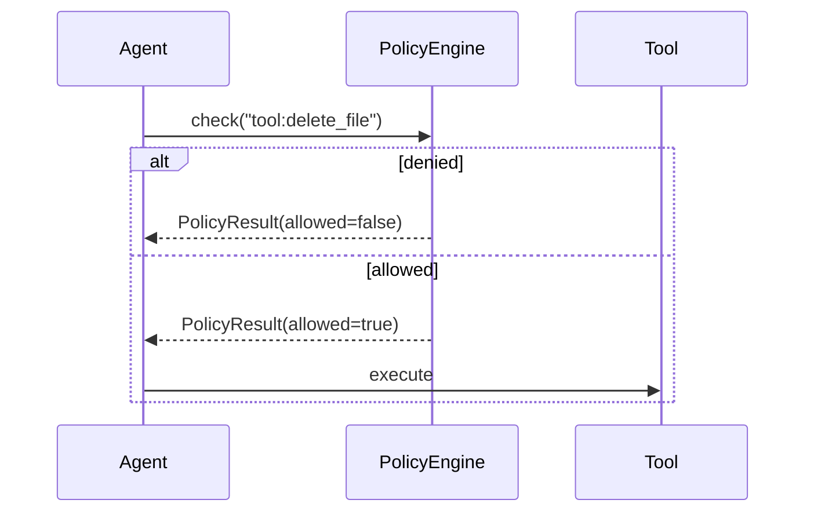

Define allow/deny rules so agents cannot run dangerous tools — attach a `PolicyEngine` before the agent starts.

```python
from praisonaiagents import Agent
from praisonaiagents.policy import PolicyEngine, Policy, PolicyRule, PolicyAction

engine = PolicyEngine()
engine.add_policy(Policy(
    name="no_delete",
    rules=[
        PolicyRule(
            action=PolicyAction.DENY,
            resource="tool:delete_*",
            reason="Delete operations blocked",
        )
    ],
))

agent = Agent(
    name="SecureAgent",
    instructions="You are a file management assistant.",
)
agent.policy = engine
agent.start("Help me organise my project files")
```

The user requests a risky action; policy rules allow or deny tools before execution.




## Quick Start

<Steps>
<Step title="Simple Usage">

Block delete tools on a file-management agent:

```python
from praisonaiagents import Agent
from praisonaiagents.policy import (
    PolicyEngine, Policy, PolicyRule, PolicyAction,
    create_read_only_policy,
)

engine = PolicyEngine()
engine.add_policy(create_read_only_policy())

agent = Agent(name="Assistant", instructions="Manage files safely.")
agent.policy = engine
agent.start("List files in the current directory")
```

</Step>

<Step title="With Configuration">

Use strict mode and custom deny lists:

```python
from praisonaiagents import Agent
from praisonaiagents.policy import (
    PolicyEngine, PolicyConfig, create_deny_tools_policy,
)

engine = PolicyEngine(PolicyConfig(strict_mode=True))
engine.add_policy(create_deny_tools_policy(
    ["execute_*", "shell_*"],
    reason="System commands are blocked",
))

agent = Agent(name="Reviewer", instructions="Read and summarise code only.")
agent.policy = engine
```

</Step>

<Step title="Denial in action">

Attach a deny policy and watch the tool call get blocked before it runs:

```python
from praisonaiagents import Agent
from praisonaiagents.policy import PolicyEngine, create_deny_tools_policy

def delete_file(path: str) -> str:
    """Delete a file at the given path."""
    return f"Deleted {path}"

engine = PolicyEngine()
engine.add_policy(create_deny_tools_policy(
    ["delete_*"], reason="Delete operations are blocked",
))

agent = Agent(
    name="ReadOnly",
    instructions="You are a read-only assistant.",
    tools=[delete_file],
)
agent.policy = engine

# The agent's tool call is denied by the policy before delete_file runs
agent.start("Please delete /etc/passwd")
```

Policy denials return an error to the model **before** the tool executes — the same pre-dispatch check applies to native and MCP tools alike. Guardrails run at this same hook: `GuardrailChain.validate_tool_call` / `LLMGuardrail.validate_tool_call` can veto a tool call before dispatch (see the **Guardrails** card below).

</Step>
</Steps>

---

## How It Works



| Component | Purpose |
|-----------|---------|
| `PolicyRule` | Wildcard resource patterns with `ALLOW`, `DENY`, `ASK`, or `LOG` |
| `PolicyEngine` | Evaluates rules by priority; optional strict mode |
| `agent.policy` | Attach the engine before `start()` |

Pattern examples: `tool:read_file`, `tool:delete_*`, `tool:*`.

---

## Configuration Options

| Option | Type | Default | Description |
|--------|------|---------|-------------|
| `strict_mode` | `bool` | `False` | Deny operations not explicitly allowed |
| `action` | `PolicyAction` | — | `ALLOW`, `DENY`, `ASK`, `LOG`, `RATE_LIMIT` |
| `resource` | `str` | `None` | Glob pattern (e.g. `tool:shell_*`) |
| `priority` | `int` | `0` | Higher priority rules evaluate first |

---

## Best Practices

<AccordionGroup>
<Accordion title="Attach policy before the first turn">
Set `agent.policy = engine` immediately after creating the agent.
</Accordion>
<Accordion title="Start with read-only presets">
Use `create_read_only_policy()` before writing custom rules.
</Accordion>
<Accordion title="Use wildcards sparingly">
Prefer `tool:delete_*` over `tool:*` deny rules so read tools keep working.
</Accordion>
<Accordion title="Enable strict mode in production">
`PolicyConfig(strict_mode=True)` blocks unknown tool names by default.
</Accordion>
</AccordionGroup>

---

## Related

<CardGroup cols={2}>
<Card title="Guardrails" icon="shield" href="/docs/features/guardrails">
  Validate agent output before returning to users
</Card>
<Card title="Approval" icon="hand" href="/docs/features/approval">
  Require human confirmation for sensitive actions
</Card>
</CardGroup>
