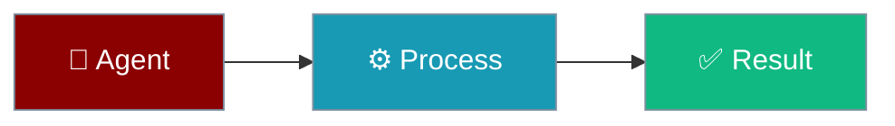

Define and enforce policies that control what agents can and cannot do. Block dangerous operations, require approval for sensitive actions, and implement fine-grained access control.




## Quick Start

<Steps>
<Step title="Basic Usage">
### Agent-Centric Usage

```python
from praisonaiagents import Agent
from praisonaiagents.policy import PolicyEngine, Policy, PolicyRule, PolicyAction

# Create policy engine with rules
engine = PolicyEngine()
engine.add_policy(Policy(
    name="no_delete",
    rules=[
        PolicyRule(
            action=PolicyAction.DENY,
            resource="tool:delete_*",
            reason="Delete operations blocked"
        )
    ]
))

# Agent with policy enforcement
agent = Agent(
    name="SecureAgent",
    instructions="You are a file management assistant.",
    policy=engine
)

# Policy is enforced during agent operations
agent.start("Help me organize and clean up my files")
# Delete operations will be blocked by policy
```
</Step>
</Steps>


## Features

- **Rule-Based Control**: Define allow/deny rules with patterns
- **Priority System**: Higher priority policies take precedence
- **Strict Mode**: Deny unknown operations by default
- **Serialization**: Save/load policies as JSON
- **Convenience Functions**: Pre-built common policies

## Policy Rules

### Rule Structure

```python
from praisonaiagents.policy import PolicyRule, PolicyAction

rule = PolicyRule(
    name="block_shell",           # Rule identifier
    action=PolicyAction.DENY,     # ALLOW, DENY, or ASK
    resource="tool:shell_*",      # Pattern to match
    reason="Shell commands blocked",  # Explanation
    conditions={"env": "production"}  # Optional conditions
)
```

### Pattern Matching

```python
# Exact match
resource="tool:read_file"

# Wildcard suffix
resource="tool:delete_*"

# Wildcard prefix
resource="*:dangerous"

# All tools
resource="tool:*"
```

## Convenience Functions

```python
from praisonaiagents.policy import (
    create_read_only_policy,
    create_deny_tools_policy,
    create_allow_tools_policy
)

# Read-only mode - block all write operations
read_only = create_read_only_policy()

# Block specific tools
deny_dangerous = create_deny_tools_policy(
    ["execute_*", "shell_*", "system_*"],
    reason="System commands are blocked"
)

# Allow only specific tools
allow_safe = create_allow_tools_policy(
    ["read_file", "list_directory", "search"]
)
```

## CLI Usage

```bash
praisonai policy list                  # List policies
praisonai policy check "tool:name"     # Check if allowed
praisonai policy init                  # Create template
```

---

## Low-level API Reference

### PolicyEngine Direct Usage

```python
from praisonaiagents.policy import (
    PolicyEngine, Policy, PolicyRule, PolicyAction
)

# Create engine
engine = PolicyEngine()

# Add a policy to block delete operations
policy = Policy(
    name="no_delete",
    rules=[
        PolicyRule(
            action=PolicyAction.DENY,
            resource="tool:delete_*",
            reason="Delete operations are blocked"
        )
    ]
)
engine.add_policy(policy)

# Check if action is allowed
result = engine.check("tool:delete_file", context={})
if not result.allowed:
    print(f"Blocked: {result.reason}")
```

### Strict Mode

In strict mode, any operation not explicitly allowed is denied:

```python
from praisonaiagents.policy import PolicyEngine, PolicyConfig

engine = PolicyEngine(PolicyConfig(strict_mode=True))

# Unknown operations are denied
result = engine.check("tool:unknown", {})
assert not result.allowed
```

### Policy Serialization

```python
# Save to dict
policy_data = policy.to_dict()

# Load from dict
restored = Policy.from_dict(policy_data)

# Save to JSON file
import json
with open("policies.json", "w") as f:
    json.dump([p.to_dict() for p in engine.policies], f)
```

## Zero Performance Impact

Policies are only evaluated when explicitly checked:

```python
# No overhead until check() is called
from praisonaiagents.policy import PolicyEngine
```
## Best Practices

<AccordionGroup>
<Accordion title="Start with defaults">
Use the built-in defaults first. Only add configuration when you hit a specific limitation.
</Accordion>
<Accordion title="Test incrementally">
Add one feature at a time and verify behaviour before combining features.
</Accordion>
<Accordion title="Monitor in production">
Watch token consumption and latency metrics when enabling advanced features in production.
</Accordion>
</AccordionGroup>

## Related

<CardGroup cols={2}>
<Card title="Approval" icon="check" href="/docs/features/approval">
  Human approval flows
</Card>
<Card title="Permissions" icon="shield" href="/docs/features/permissions">
  Control agent access
</Card>
</CardGroup>
