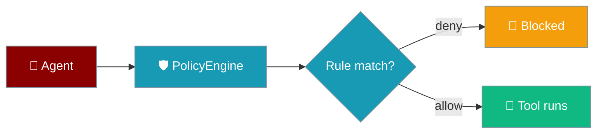
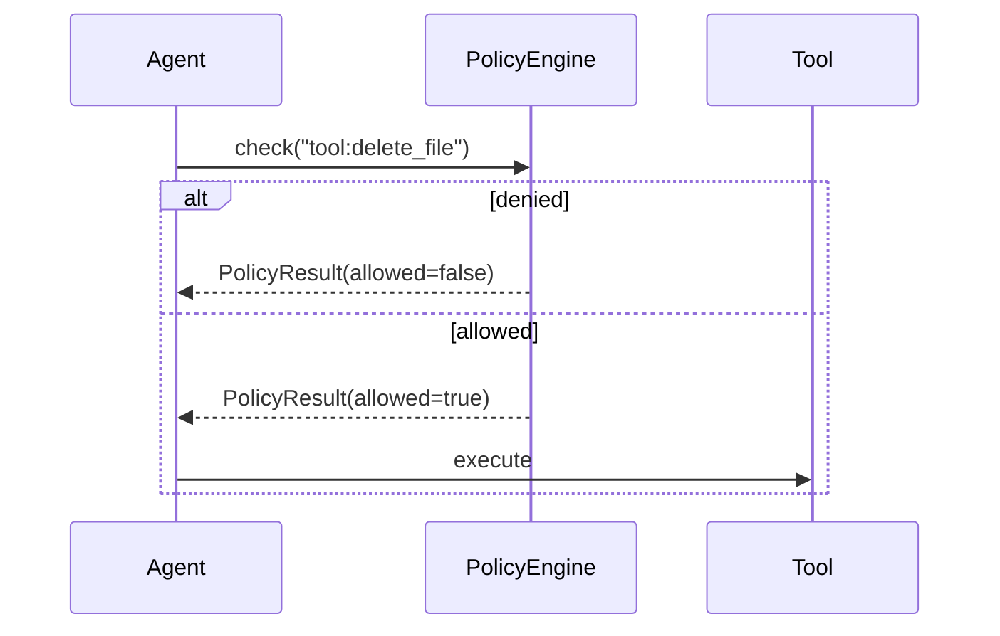
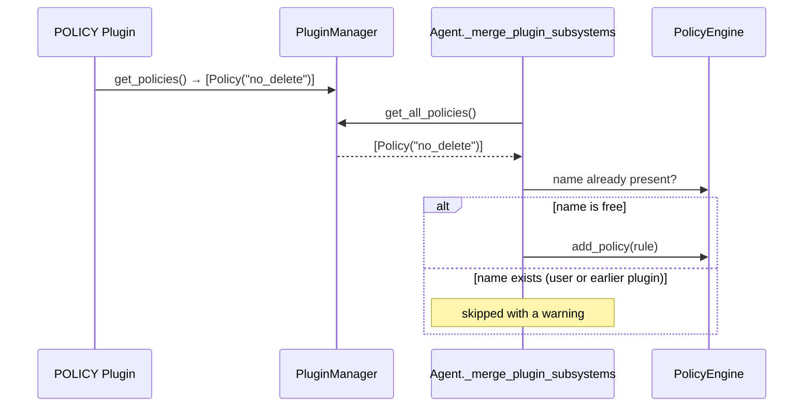

Define allow/deny rules so agents cannot run dangerous tools — attach a `PolicyEngine` before the agent starts.

```python
from praisonaiagents import Agent
from praisonaiagents.policy import PolicyEngine, Policy, PolicyRule, PolicyAction

engine = PolicyEngine()
engine.add_policy(Policy(
    name="no_delete",
    rules=[
        PolicyRule(
            action=PolicyAction.DENY,
            resource="tool:delete_*",
            reason="Delete operations blocked",
        )
    ],
))

agent = Agent(
    name="SecureAgent",
    instructions="You are a file management assistant.",
)
agent.policy = engine
agent.start("Help me organise my project files")
```

The user requests a risky action; policy rules allow or deny tools before execution.



```mermaid
graph LR
    Agent[🤖 Agent] --> Engine[🛡️ PolicyEngine]
    Engine --> Check{Rule match?}
    Check -->|deny| Block[🚫 Blocked]
    Check -->|allow| Tool[🔧 Tool runs]

    classDef agent fill:#8B0000,stroke:#7C90A0,color:#fff
    classDef policy fill:#189AB4,stroke:#7C90A0,color:#fff
    classDef result fill:#10B981,stroke:#7C90A0,color:#fff
    classDef deny fill:#F59E0B,stroke:#7C90A0,color:#fff

    class Agent agent
    class Engine,Check policy
    class Tool result
    class Block deny
```

## Quick Start

<Steps>
<Step title="Simple Usage">

Block delete tools on a file-management agent:

```python
from praisonaiagents import Agent
from praisonaiagents.policy import (
    PolicyEngine, Policy, PolicyRule, PolicyAction,
    create_read_only_policy,
)

engine = PolicyEngine()
engine.add_policy(create_read_only_policy())

agent = Agent(name="Assistant", instructions="Manage files safely.")
agent.policy = engine
agent.start("List files in the current directory")
```

</Step>

<Step title="With Configuration">

Use strict mode and custom deny lists:

```python
from praisonaiagents import Agent
from praisonaiagents.policy import (
    PolicyEngine, PolicyConfig, create_deny_tools_policy,
)

engine = PolicyEngine(PolicyConfig(strict_mode=True))
engine.add_policy(create_deny_tools_policy(
    ["execute_*", "shell_*"],
    reason="System commands are blocked",
))

agent = Agent(name="Reviewer", instructions="Read and summarise code only.")
agent.policy = engine
```

</Step>

<Step title="Denial in action">

Attach a deny policy and watch the tool call get blocked before it runs:

```python
from praisonaiagents import Agent
from praisonaiagents.policy import PolicyEngine, create_deny_tools_policy

def delete_file(path: str) -> str:
    """Delete a file at the given path."""
    return f"Deleted {path}"

engine = PolicyEngine()
engine.add_policy(create_deny_tools_policy(
    ["delete_*"], reason="Delete operations are blocked",
))

agent = Agent(
    name="ReadOnly",
    instructions="You are a read-only assistant.",
    tools=[delete_file],
)
agent.policy = engine

# The agent's tool call is denied by the policy before delete_file runs
agent.start("Please delete /etc/passwd")
```

Policy denials return an error to the model **before** the tool executes — the same pre-dispatch check applies to native and MCP tools alike. Guardrails run at this same hook: `GuardrailChain.validate_tool_call` / `LLMGuardrail.validate_tool_call` can veto a tool call before dispatch (see the **Guardrails** card below).

</Step>
</Steps>

---

## Read-only preset — what it blocks

`create_read_only_policy()` returns a `Policy` at priority `100` with **11 deny rules** — 2 file-resource rules and 9 tool-name rules — covering the SDK's built-in mutating tools.

```python
from praisonaiagents import Agent
from praisonaiagents.policy import PolicyEngine, create_read_only_policy

engine = PolicyEngine()
engine.add_policy(create_read_only_policy())

agent = Agent(
    name="Reviewer",
    instructions="Read and summarise the repo — never modify anything.",
)
agent.policy = engine

# Any of these, if attached as tools, are denied before dispatch:
#   write_file, delete_file, edit_file, apply_patch, copy_file,
#   move_file, append_file, atomic_write, hard_delete, ...
agent.start("Summarise src/main.py in five bullet points")
```

The preset matches by both **prefix** (`tool:write_*`) and **suffix** (`tool:*_write*`), so custom-named tools like `atomic_write` and `file_write` are caught too.

| Rule name | Resource pattern | What it blocks |
|---|---|---|
| `deny_write` | `file:write` | `check_file()` write path |
| `deny_delete` | `file:delete` | `check_file()` delete path |
| `deny_write_tools` | `tool:write_*` | `write_file`, `write_json`, etc. |
| `deny_write_tools_suffix` | `tool:*_write*` | `file_write`, `atomic_write`, etc. |
| `deny_delete_tools` | `tool:delete_*` | `delete_file`, `delete_row`, etc. |
| `deny_delete_tools_suffix` | `tool:*_delete*` | `soft_delete`, `hard_delete`, etc. |
| `deny_edit_tools` | `tool:edit_*` | `edit_file`, `edit_json`, etc. |
| `deny_patch_tools` | `tool:apply_patch*` | `apply_patch`, `apply_patch_batch`, etc. |
| `deny_copy_tools` | `tool:copy_*` | `copy_file`, `copy_folder`, etc. |
| `deny_move_tools` | `tool:move_*` | `move_file`, `move_folder`, etc. |
| `deny_append_tools` | `tool:append_*` | `append_file`, `append_json`, etc. |

An explicit `ALLOW` rule at higher priority still wins — a deny does not silently override it. Add `ALLOW` rules for any specific tool you need to permit.

<Warning>
**Upgrade note (PraisonAI PR #3632)**: earlier releases shipped `create_read_only_policy()` with glob patterns that never matched the SDK's real tool names. If you relied on the preset as a safety net before this release, your agent could still call `write_file` / `delete_file` / `edit_file` / etc. Upgrade to the fixed release and re-run your safety tests.
</Warning>

---

## How It Works


```mermaid
sequenceDiagram
    participant Agent
    participant Engine as PolicyEngine
    participant Tool

    Agent->>Engine: check("tool:delete_file")
    alt denied
        Engine-->>Agent: PolicyResult(allowed=false)
    else allowed
        Engine-->>Agent: PolicyResult(allowed=true)
        Agent->>Tool: execute
    end
```

| Component | Purpose |
|-----------|---------|
| `PolicyRule` | Wildcard resource patterns with `ALLOW`, `DENY`, `ASK`, or `LOG` |
| `PolicyEngine` | Evaluates rules by priority; optional strict mode |
| `agent.policy` | Attach the engine before `start()` |

Pattern examples: `tool:read_file`, `tool:delete_*`, `tool:*`.

---

## Configuration Options

| Option | Type | Default | Description |
|--------|------|---------|-------------|
| `strict_mode` | `bool` | `False` | Deny operations not explicitly allowed |
| `action` | `PolicyAction` | — | `ALLOW`, `DENY`, `ASK`, `LOG`, `RATE_LIMIT` |
| `resource` | `str` | `None` | Glob pattern (e.g. `tool:shell_*`) |
| `priority` | `int` | `0` | Higher priority rules evaluate first |

---

## Policies from Plugins

A plugin declared `PluginType.POLICY` that returns `Policy` objects from `get_policies()` is added to the Agent's `PolicyEngine` automatically. If the Agent has no user `policy=`, one is created; if it has one, plugin rules are added to the existing engine.

```python
from praisonaiagents import Agent, Plugin, PluginInfo, PluginType
from praisonaiagents.plugins import get_plugin_manager
from praisonaiagents.policy import Policy, PolicyRule, PolicyAction

class NoDeletePlugin(Plugin):
    @property
    def info(self):
        return PluginInfo(name="no_delete", plugin_type=PluginType.POLICY)
    def get_policies(self):
        return [Policy(
            name="no_delete",
            rules=[PolicyRule(
                action=PolicyAction.DENY,
                resource="tool:delete_*",
                reason="Delete operations blocked by plugin",
            )],
        )]

get_plugin_manager().register(NoDeletePlugin())
get_plugin_manager().enable("no_delete")

agent = Agent(name="Assistant", instructions="Manage files safely.")
# agent.policy now denies tool:delete_* before dispatch — no policy= needed.
agent.start("Please delete /etc/passwd")
```

On `Agent.__init__`, `_merge_plugin_subsystems()` calls `PluginManager.get_all_policies()` and adds each rule to the engine, guarded by a name-uniqueness check:


```mermaid
sequenceDiagram
    participant Plugin as POLICY Plugin
    participant Mgr as PluginManager
    participant Merge as Agent._merge_plugin_subsystems
    participant Engine as PolicyEngine

    Plugin->>Mgr: get_policies() → [Policy("no_delete")]
    Merge->>Mgr: get_all_policies()
    Mgr-->>Merge: [Policy("no_delete")]
    Merge->>Engine: name already present?
    alt name is free
        Merge->>Engine: add_policy(rule)
    else name exists (user or earlier plugin)
        Note over Merge: skipped with a warning
    end
```

### Precedence — user-supplied policy always wins

If a policy with the same name already exists on the engine when the plugin's rule is added, the plugin's rule is **logged and skipped** — a plugin can never silently loosen a user-configured restriction.

| Situation | Behaviour |
|---|---|
| User policy has a rule named `X`; plugin policy tries to add `X` | Plugin's `X` is skipped with a warning — user wins. |
| Plugin has two policies both named `X` | The **first** wins; the second is skipped with a warning. |
| Agent has no user `policy=` | A `PolicyEngine` is created, then plugin rules are added. |
| Plugin declared `PluginType.HOOK` (not `POLICY`) | Not collected — `get_policies()` output is ignored. |
| Plugin disabled | Not collected — enabled-only iteration under the manager lock. |
| `get_policies()` raises | Warning logged, other plugins keep loading, Agent construction succeeds. |

See [Typed Plugins (Guardrail / Policy / Skill)](/features/plugins#typed-plugins-guardrail--policy--skill) for the full plugin-side reference.

---

## Best Practices

<AccordionGroup>
<Accordion title="Attach policy before the first turn">
Set `agent.policy = engine` immediately after creating the agent.
</Accordion>
<Accordion title="Start with read-only presets">
`create_read_only_policy()` blocks the SDK's built-in mutating tools — `write_*`, `delete_*`, `edit_*`, `apply_patch*`, `copy_*`, `move_*`, `append_*`, and the `*_write*` / `*_delete*` suffix forms. Attach it, then add explicit `ALLOW` rules at higher priority for any specific tool you need to permit.
</Accordion>
<Accordion title="Use wildcards sparingly">
Prefer `tool:delete_*` over `tool:*` deny rules so read tools keep working.
</Accordion>
<Accordion title="Enable strict mode in production">
`PolicyConfig(strict_mode=True)` blocks unknown tool names by default.
</Accordion>
</AccordionGroup>

---

## Related

<CardGroup cols={2}>
<Card title="Guardrails" icon="shield" href="/features/guardrails">
  Validate agent output before returning to users
</Card>
<Card title="Approval" icon="hand" href="/features/approval">
  Require human confirmation for sensitive actions
</Card>
</CardGroup>
