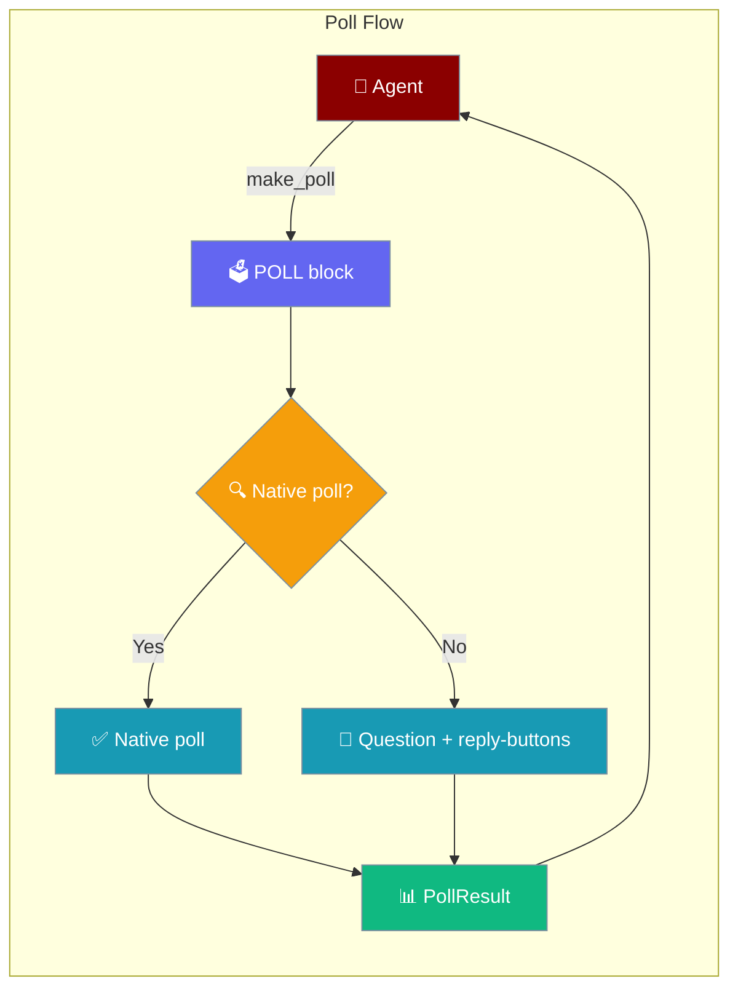
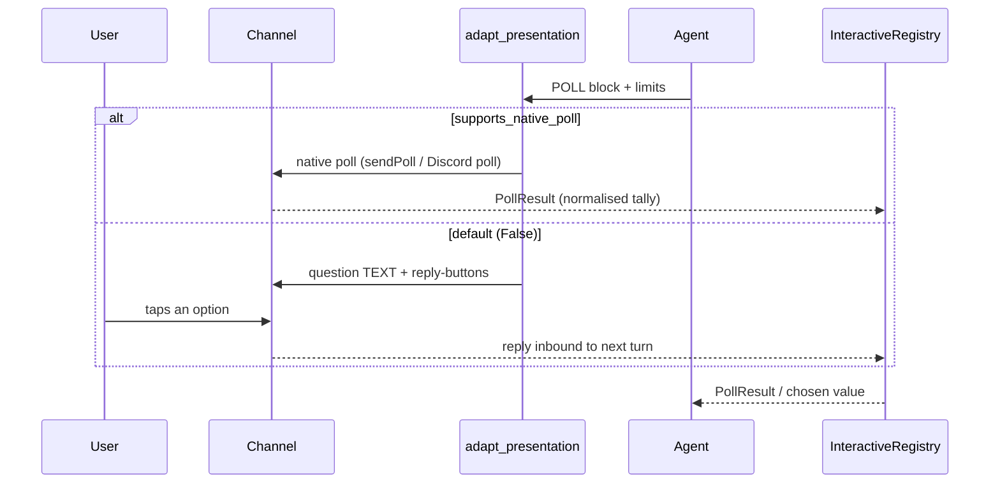
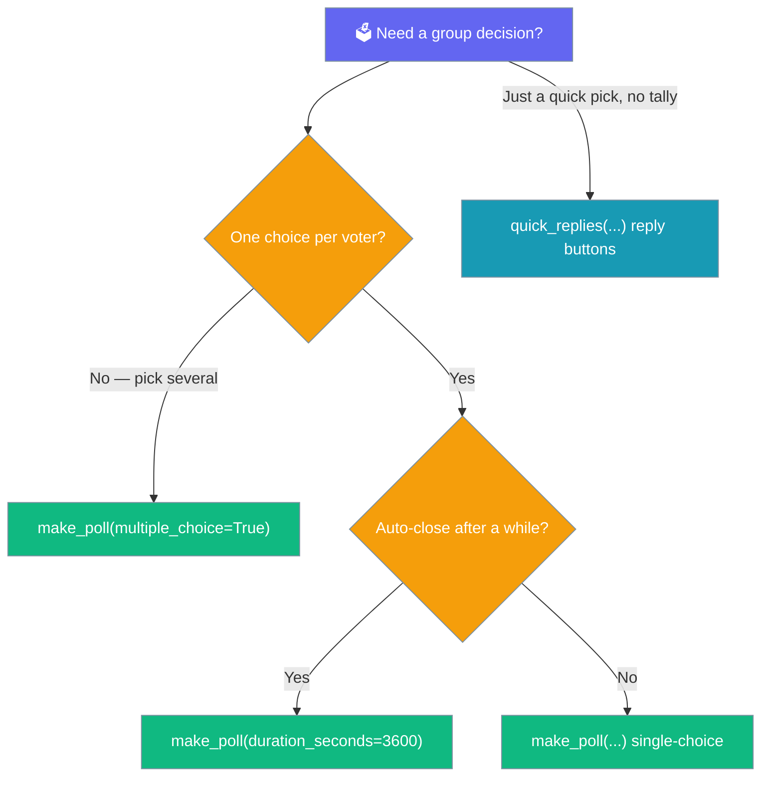

Poll blocks let an agent run a channel-neutral group vote through the same presentation surface it uses for buttons and selects.



## Quick Start

<Steps>
<Step title="Author a poll">
An agent returns a `MessagePresentation` with a POLL block — one question and two or more options:

```python
from praisonaiagents import Agent
from praisonaiagents.bots import MessagePresentation, PresentationBlock

def team_sync_agent():
    return MessagePresentation(blocks=[
        PresentationBlock.make_poll(
            question="Which time works?",
            options=["09:00", "13:00", "16:00"],
            multiple_choice=False,
            anonymous=True,
            duration_seconds=3600,
            action_id="slot",
        ),
    ])

agent = Agent(name="Scheduler", instructions="Ask the team for a preferred slot.")
```
</Step>

<Step title="Receive the tally">
Register a poll-result handler under `POLL_NAMESPACE` so the aggregated vote comes back as a typed `PollResult`:

```python
from praisonaiagents.bots import (
    create_registry,
    make_poll_result_handler,
    POLL_NAMESPACE,
)

async def on_result(result, context):
    if result.winner() is None:
        return "It's a tie — I'll pick one at random."
    return f"Booking {result.winner()}."

registry = create_registry()
registry.register(POLL_NAMESPACE, make_poll_result_handler(on_result))
```
</Step>
</Steps>

---

## How It Works

A POLL block stays native on channels that advertise `supports_native_poll=True`; everywhere else it degrades to a question TEXT block plus a reply-button per option.



| Channel supports native poll? | What ships to the user | What the agent sees back |
|---|---|---|
| Yes (`supports_native_poll=True`) | Native poll (Telegram `sendPoll`, Discord poll, Slack) | `PollResult` from the adapter's normalisation |
| No (default today for `telegram()` / `slack()` / `discord()`) | Question text + reply-buttons grid | Each tap is a normal `reply` inbound to the next agent turn |

---

## All poll options

`PresentationBlock.make_poll(question, options, *, multiple_choice=False, anonymous=True, duration_seconds=None, action_id=None)` sets these fields on the block:

| Field | Type | Default | Notes |
|-------|------|---------|-------|
| `poll_options` | `Optional[List[str]]` | `None` | 2..N answer options |
| `multiple_choice` | `bool` | `False` | Allow selecting more than one option |
| `anonymous` | `bool` | `True` | Native default on most channels |
| `duration_seconds` | `Optional[int]` | `None` | Auto-close duration |

The `question` is stored on `text`, and `action_id` correlates the inbound result.

<Warning>
`make_poll` raises `ValueError` if fewer than two options are supplied.
</Warning>

---

## Degradation reporting

On a channel with no native poll, `adapt_presentation_with_report` turns the POLL into a question TEXT block plus a reply-buttons grid, and records the loss:

```python
from praisonaiagents.bots import (
    MessagePresentation,
    PresentationBlock,
    PresentationLimits,
    adapt_presentation_with_report,
)

poll = MessagePresentation([
    PresentationBlock.make_poll("Which time works?", ["09:00", "13:00", "16:00"]),
])

adapted, report = adapt_presentation_with_report(poll, PresentationLimits())
# adapted.blocks[0] is a TEXT block with the question
# adapted.blocks[1] is a BUTTONS block with one reply-button per option
assert "poll_rendered_as_buttons" in report.reasons
```

The reason constant `DEGRADE_POLL_AS_BUTTONS = "poll_rendered_as_buttons"` imports from `praisonaiagents.bots`, and `report.dropped` reads `"poll (3 options) rendered as buttons"`. See [Degraded Delivery](/features/degraded-delivery).

---

## PollResult

The aggregated tally comes back as a typed `PollResult`, portable across channels:

| Field | Type | Default | Notes |
|-------|------|---------|-------|
| `poll_id` | `str` | required | The poll's `action_id` when set, else the native poll id |
| `counts` | `Dict[str, int]` | required | option label → vote count |
| `total_voters` | `int` | `0` | Distinct voters |
| `closed` | `bool` | `False` | Final tally flag |

`winner()` returns the top option, or `None` on a tie or an empty poll — it never silently picks:

```python
from praisonaiagents.bots import PollResult

PollResult("slot", {"09:00": 3, "13:00": 1}).winner()   # "09:00"
PollResult("slot", {"09:00": 2, "13:00": 2}).winner()   # None (tie)
PollResult("slot", {}).winner()                          # None (empty)
```

`to_dict()` / `from_dict()` round-trip a result losslessly: `PollResult.from_dict(result.to_dict()) == result`.

---

## Which option should I choose?



---

## Best Practices

<AccordionGroup>
<Accordion title="Set action_id so PollResult.poll_id maps back to the poll">
Pass `action_id="slot"` to `make_poll` and the inbound `PollResult.poll_id` carries the same value — so a workflow knows which poll a tally belongs to.
</Accordion>

<Accordion title="Handle ties explicitly — winner() returns None">
`winner()` returns `None` on a tie or empty poll rather than picking arbitrarily. Branch on `None` and decide the tie-break yourself.
</Accordion>

<Accordion title="Assume degradation on Telegram/Slack/Discord today">
`PresentationLimits.telegram()`, `.slack()`, and `.discord()` all set `supports_native_poll=False` today, so polls render as a question plus reply-buttons. Opt in via a custom `PresentationLimits(supports_native_poll=True)` once a renderer ships a native-poll branch.
</Accordion>

<Accordion title="Keep option labels short and unique">
After degradation each label doubles as a button caption and as the `reply` payload string, so short, distinct labels stay within the callback byte-cap and never collide.
</Accordion>
</AccordionGroup>

---

## Related

<CardGroup cols={2}>
<Card title="Bot Presentations" icon="hand-pointer" href="/features/bot-presentations">
  Buttons, selects, tables, charts, and polls across channels
</Card>
<Card title="Message Presentation" icon="layout" href="/features/message-presentation">
  Attach blocks to agent replies
</Card>
<Card title="Degraded Delivery" icon="signal-slash" href="/features/degraded-delivery">
  See what a channel could not render natively
</Card>
<Card title="Interactive Bot Actions" icon="hand-pointer" href="/features/interactive-bot-actions">
  Route inbound clicks and poll results to handlers
</Card>
</CardGroup>
