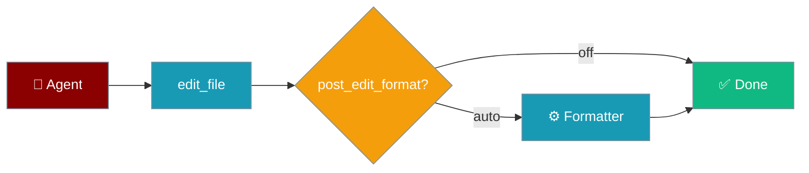
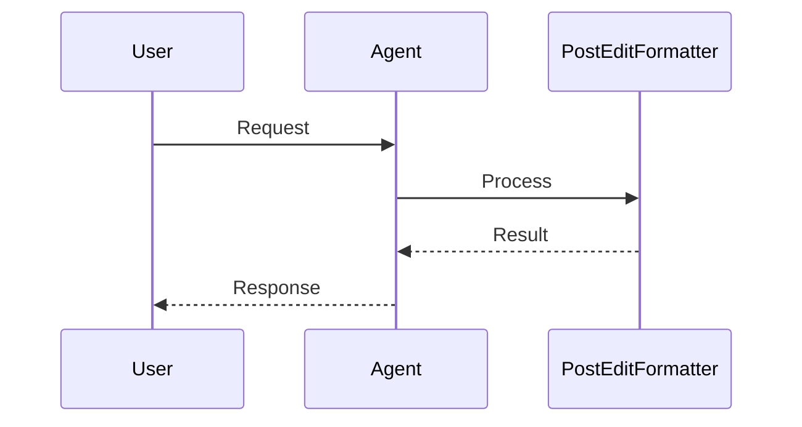
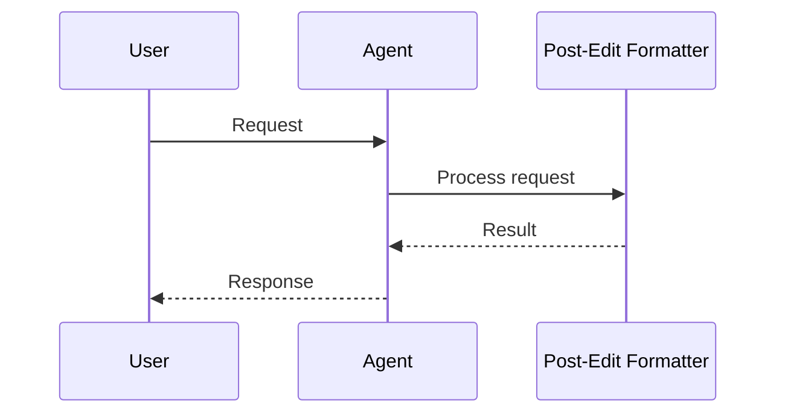

Run your project's formatter after every agent file edit so style stays consistent without extra steps.

```python
from praisonaiagents import Agent
from praisonaiagents.tools.edit_tools import create_edit_tools

edit_tools = create_edit_tools(post_edit_format="auto")

coder = Agent(
    name="Coder",
    instructions="Edit files cleanly and keep formatting consistent.",
    tools=edit_tools,
)
coder.start("Refactor utils.py to use list comprehensions")
```

The user asks for a refactor; the formatter runs automatically after each file edit.




## How It Works




## Quick Start

<Steps>
<Step title="Simple Usage">

Enable auto-formatting on edit tools:

```python
from praisonaiagents import Agent
from praisonaiagents.tools.edit_tools import create_edit_tools

edit_tools = create_edit_tools(post_edit_format="auto")

coder = Agent(
    name="Coder",
    instructions="Edit the file as requested.",
    tools=edit_tools,
)
coder.start("Add type hints to models.py")
```

</Step>

<Step title="With Configuration">

Pin formatters per extension:

```python
from praisonaiagents import Agent
from praisonaiagents.tools.edit_tools import create_edit_tools

edit_tools = create_edit_tools(
    post_edit_format="auto",
    formatters={
        ".py": ["ruff", "format", "{path}"],
        ".ts": ["./node_modules/.bin/prettier", "--write", "{path}"],
    },
)

coder = Agent(name="PolyglotCoder", instructions="Edit Python and TypeScript.", tools=edit_tools)
```

</Step>
</Steps>

<Note>
A missing or failing formatter never fails the edit — the original write is kept and errors are logged at debug level.
</Note>

---

## How It Works




After a successful `edit_file` or `apply_patch`, the pipeline detects a formatter by file extension, runs it, and re-reads the file on exit code 0.

| Extension | Default command |
|-----------|-----------------|
| `.py` | `ruff format {path}` (falls back to `black`) |
| `.js`, `.ts`, `.tsx`, `.json`, `.css`, `.md` | `prettier --no-config --no-editorconfig --write {path}` |
| `.go` | `gofmt -w {path}` |
| `.rs` | `rustfmt {path}` |

The `{path}` placeholder is the absolute path to the edited file. If omitted from your argv list, it is appended automatically.

---

## Configuration Options

| Option | Type | Default | Description |
|--------|------|---------|-------------|
| `post_edit_format` | `str` | `"off"` | `"off"`, `"auto"`, or `"on"` |
| `formatters` | `dict[str, list[str]]` | Built-in map | Per-extension formatter argv |
| `post_edit_diagnostics` | `str` | `"auto"` | Separate linter/diagnostics pass |

---

## Best Practices

<AccordionGroup>
<Accordion title="Start with auto mode">
`post_edit_format="auto"` runs a formatter only when one is on `PATH` — zero cost when none is installed.
</Accordion>
<Accordion title="Use project-local prettier">
Prefer `./node_modules/.bin/prettier` so the version matches `package.json`.
</Accordion>
<Accordion title="Pin formatter versions in CI">
Match local and CI formatter versions to avoid diff churn between runs.
</Accordion>
<Accordion title="Skip when CI already formats">
Most useful for interactive agent sessions where you want immediate clean output.
</Accordion>
</AccordionGroup>

---

## Related

<CardGroup cols={2}>
<Card title="File Editing" icon="pen-to-square" href="/docs/features/file-editing">
  Core edit and patch tools
</Card>
<Card title="Code Agent" icon="code" href="/docs/features/code">
  Code assistant configuration
</Card>
</CardGroup>
