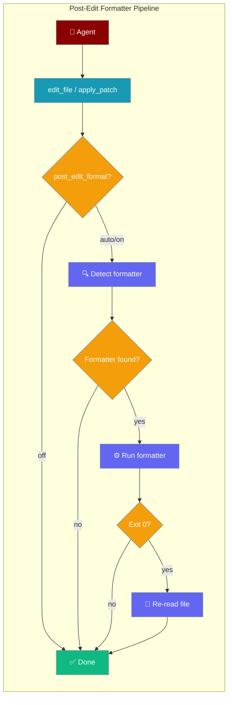
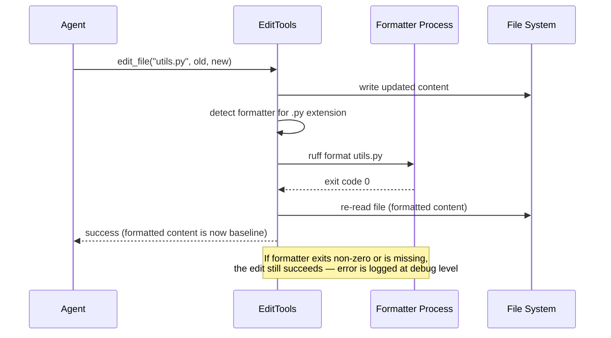

The post-edit formatter runs your preferred code formatter automatically after every agent file edit — keeping code style consistent without any extra steps.



## Quick Start

<Steps>

<Step title="Enable auto-formatting (simplest)">
```python
from praisonaiagents import Agent
from praisonaiagents.tools.edit_tools import create_edit_tools

edit_tools = create_edit_tools(post_edit_format="auto")

coder = Agent(
    name="Coder",
    instructions="Edit the file as requested.",
    tools=edit_tools,
)

coder.start("Refactor utils.py to use list comprehensions")
```
Files are formatted automatically after each edit.
</Step>

<Step title="With a project-specific formatter map">
```python
from praisonaiagents.tools.edit_tools import create_edit_tools

edit_tools = create_edit_tools(
    post_edit_format="auto",
    formatters={
        ".py": ["ruff", "format", "{path}"],
        ".ts": ["./node_modules/.bin/prettier", "--write", "{path}"],
    },
)
```
</Step>

<Step title="Disable formatting (default)">
```python
from praisonaiagents.tools.edit_tools import create_edit_tools

edit_tools = create_edit_tools(post_edit_format="off")
```
</Step>

</Steps>

---

## How It Works

After a successful `edit_file` or `apply_patch`, the formatter pipeline runs:



**Key guarantees:**
- A failing or missing formatter **never** turns a successful edit into a failure
- File hash is refreshed **only on formatter exit 0** — partial output is never adopted
- Formatted result is re-read so the agent sees the final clean version

---

## Configuration Options

### `create_edit_tools` parameters

| Option | Type | Default | Description |
|--------|------|---------|-------------|
| `post_edit_format` | `str` | `"off"` | `"off"` — disabled; `"auto"` or `"on"` — run formatter if detected. Invalid value falls back to `"off"` |
| `formatters` | `dict[str, list[str]]` | Built-in map | Per-extension formatter argv. Supports `{path}` placeholder; appended to args if absent |
| `post_edit_diagnostics` | `str` | `"auto"` | Diagnostics mode — separate from formatting |

---

## Built-in Formatter Defaults

| Extension | Default formatter command |
|-----------|--------------------------|
| `.py` | `ruff format {path}` (falls back to `black`) |
| `.js`, `.jsx`, `.mjs`, `.cjs` | `prettier --no-config --no-editorconfig --write {path}` |
| `.ts`, `.tsx` | `prettier --no-config --no-editorconfig --write {path}` |
| `.json`, `.css`, `.md`, `.yaml`, `.yml` | `prettier --no-config --no-editorconfig --write {path}` |
| `.go` | `gofmt -w {path}` |
| `.rs` | `rustfmt {path}` |

<Note>
`prettier` is always invoked with `--no-config --no-editorconfig` so repo-controlled config cannot execute arbitrary plugins. This is a security measure.
</Note>

---

## Common Patterns

### Python project with ruff

```python
from praisonaiagents import Agent
from praisonaiagents.tools.edit_tools import create_edit_tools

edit_tools = create_edit_tools(
    post_edit_format="auto",
    formatters={
        ".py": ["ruff", "format", "{path}"],
    },
)

coder = Agent(
    name="PythonCoder",
    instructions="Write clean, well-formatted Python code.",
    tools=edit_tools,
)

coder.start("Add type hints to all functions in models.py")
```

### TypeScript project with local prettier

```python
from praisonaiagents import Agent
from praisonaiagents.tools.edit_tools import create_edit_tools

edit_tools = create_edit_tools(
    post_edit_format="auto",
    formatters={
        ".ts": ["./node_modules/.bin/prettier", "--write", "{path}"],
        ".tsx": ["./node_modules/.bin/prettier", "--write", "{path}"],
    },
)

coder = Agent(
    name="TSCoder",
    instructions="Write TypeScript components.",
    tools=edit_tools,
)

coder.start("Refactor Button.tsx to use functional components")
```

### Multi-language project

```python
from praisonaiagents import Agent
from praisonaiagents.tools.edit_tools import create_edit_tools

edit_tools = create_edit_tools(
    post_edit_format="auto",
    formatters={
        ".py": ["ruff", "format", "{path}"],
        ".go": ["gofmt", "-w", "{path}"],
        ".rs": ["rustfmt", "{path}"],
    },
)

coder = Agent(
    name="PolyglotCoder",
    instructions="Edit code across Python, Go, and Rust files.",
    tools=edit_tools,
)
```

---

## The `{path}` Placeholder

The `{path}` placeholder is replaced with the absolute path to the edited file at runtime.

```python
formatters={
    ".py": ["ruff", "format", "{path}"],
}
```

If `{path}` is not included in the args list, it is automatically appended:

```python
formatters={
    ".py": ["ruff", "format"],
}
```

Both forms are equivalent.

---

## Project-Local Formatter Paths

Relative formatter paths are resolved relative to the **edited file's directory**, not the working directory:

```python
formatters={
    ".ts": ["./node_modules/.bin/prettier", "--write", "{path}"],
}
```

This means a formatter installed in `my-project/node_modules/.bin/prettier` is found when editing any file under `my-project/`.

---

## Best Practices

<AccordionGroup>

<Accordion title="Start with 'auto' mode">
Use `post_edit_format="auto"` — it runs the formatter only when one is available, never breaks existing edits, and costs nothing when no formatter is installed.
</Accordion>

<Accordion title="Pin formatter versions in CI">
The formatter is discovered from `PATH` at runtime. In CI, ensure the formatter version matches your local setup to avoid diff churn between formatter versions.
</Accordion>

<Accordion title="Use project-local prettier">
For JavaScript/TypeScript projects, prefer `./node_modules/.bin/prettier` over a global install. This ensures the version matches your `package.json` and respects project plugins — while the `--no-config --no-editorconfig` flags prevent arbitrary plugin execution.
</Accordion>

<Accordion title="Formatter failures are silent by default">
If the formatter is missing, crashes, or exits non-zero, the edit still succeeds and the original result is kept. Check your formatter's PATH and version if formatting seems not to run.
</Accordion>

<Accordion title="Don't double-format">
If your CI already runs a formatter on commit, you don't need `post_edit_format`. It's most useful for interactive agent sessions where you want immediate, clean output.
</Accordion>

</AccordionGroup>

---

## Related

<CardGroup cols={2}>
  <Card title="File Editing" icon="pen-to-square" href="/docs/features/file-editing">
    Core file editing tools and operations
  </Card>
  <Card title="Code Agent" icon="code" href="/docs/features/code">
    Code assistant agent configuration
  </Card>
</CardGroup>
