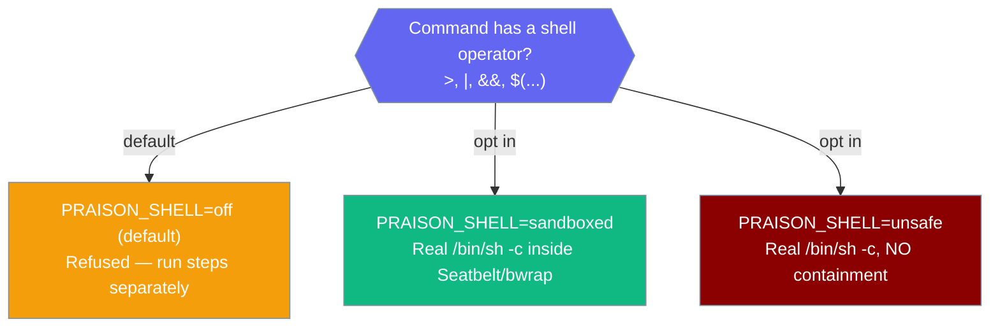

`PRAISON_SHELL` decides what `praisonai code` does when a command contains a shell operator (`>`, `|`, `&&`, `$(...)`): refuse it, run it inside an OS sandbox, or run it uncontained.



## Quick Start

<Steps>
<Step title="Default — operators are refused">
Without `PRAISON_SHELL`, the coding agent runs plain commands as before, but a command with a shell operator fails loudly instead of silently dropping it.

```bash
praisonai code
```

```text
>>> run: echo written > out.txt
Refused: this command contains the shell operator '>', which this executor
does not interpret. Do one of these instead:
  - split it into separate execute_command calls;
  - for a redirect, run the program and write its output with write_file;
  - or ask the operator to set PRAISON_SHELL=sandboxed.
```
</Step>

<Step title="Enable a real, contained shell">
Set `PRAISON_SHELL=sandboxed` to run a real `/bin/sh -c` inside OS-native containment (Seatbelt on macOS, `bwrap` on Linux).

```bash
PRAISON_SHELL=sandboxed praisonai code
```

```text
>>> run: echo written > out.txt
[approve: execute_command — critical risk?] y
exit=0 success=True sandbox=seatbelt
```
</Step>
</Steps>

---

## The Three Modes

`PRAISON_SHELL` (or the `mode=` argument to `execute_command`) selects one behaviour.

| `PRAISON_SHELL` | Behaviour |
|---|---|
| unset / `off` (default) | Shell syntax is **refused** with an error naming the operator and listing alternatives. Plain commands run exactly as before. |
| `sandboxed` | A real `/bin/sh -c` inside OS-native containment. Refuses to run if containment can't be proven — see [OS Sandbox](/features/os-sandbox). |
| `unsafe` | A real `/bin/sh -c` with **no** containment. Opt-in only, never a fallback. |

Aliases resolve to these three: `1`/`true`/`yes`/`sandbox`/`native` → `sandboxed`; `raw`/`host` → `unsafe`; empty/`0`/`false`/`no`/`none` → `off`.

---

## Why the default refuses

The plain executor runs `shlex.split` + `subprocess.Popen(shell=False)`, so an operator becomes a literal argument.

```python
execute_command("echo written > redir.txt")
# → exit_code=0, success=True, stdout='written > redir.txt\n'
#   and redir.txt was never created
```

The model is told a redirect it never performed succeeded — strictly worse than an error. Refusing names the operator and tells the agent what to do instead.

---

## Quote-Aware Detection

Detection looks for operators **outside** quotes, so ordinary strings are never refused.

| Command | Refused? | Why |
|---|---|---|
| `echo "a > b"` | No | `>` is inside double quotes |
| `git commit -m "fix: a > b"` | No | `>` is inside the message |
| `echo 'a $(id) b'` | No | single quotes suppress everything |
| `echo "$(id)"` | Yes (`$(`) | command substitution runs inside double quotes |
| `echo "`id`"` | Yes (backtick) | backticks run inside double quotes |
| `a && b` | Yes (`&&`) | active operator |

`$(...)` and backticks are detected even inside double quotes because POSIX shells evaluate them there — reporting them as inert would reintroduce the false-success bug.

---

## Approval

The real-shell path is wrapped in `require_approval(risk_level="critical")` under the tool name `execute_command`.

<Warning>
Both `sandboxed` and `unsafe` route through the same `critical`-risk approval as the plain executor — same tool identity, so existing allowlists and `path_overlap` serialisation still apply. Denying approval raises `PermissionError` and no file is written.
</Warning>

The approval wrap fails closed: if the approval machinery can't be imported, the real shell does not run.

---

## When Your Agent Hits a Refusal

An agent that hits `PRAISON_SHELL=off` refusal has three honest paths.

```python
from praisonaiagents import Agent

agent = Agent(
    name="Builder",
    instructions=(
        "When execute_command refuses a shell operator, either split the "
        "command into separate steps, or write program output with write_file "
        "instead of a '>' redirect."
    ),
)

agent.start("Build the project and save the log to build.log")
```

The operator can instead launch the session with `PRAISON_SHELL=sandboxed` to allow real operators inside a jail.

---

## Best Practices

<AccordionGroup>
<Accordion title="Keep the default off in shared or untrusted contexts">
`off` never runs an uninterpreted operator and never claims false success. Reach for `sandboxed` only when a real shell is genuinely needed.
</Accordion>

<Accordion title="Prefer sandboxed over unsafe">
`sandboxed` gives a real `/bin/sh` while a kernel keeps writes inside the workspace. `unsafe` removes that boundary entirely — use it only when you accept an uncontained shell deliberately.
</Accordion>

<Accordion title="Split multi-step commands">
Two `execute_command` calls (one per `&&` step) work in every mode and keep each step's success signal honest.
</Accordion>

<Accordion title="Write output instead of redirecting">
Replace `cmd > file.txt` with a plain `cmd` call plus `write_file`. This works in `off` mode and keeps the file-creation step explicit.
</Accordion>
</AccordionGroup>

---

## Related

<CardGroup cols={2}>
<Card title="OS Sandbox" icon="shield-check" href="/features/os-sandbox">
  Seatbelt and bwrap containment that `sandboxed` mode runs inside.
</Card>
<Card title="Safe Tools by Default" icon="lock" href="/features/safe-tools-by-default">
  Why tools refuse rather than degrade.
</Card>
<Card title="Interactive Tools" icon="wrench" href="/cli/interactive-tools">
  The `execute_command` tool in the coding session.
</Card>
<Card title="Tool Approval" icon="shield" href="/cli/tool-approval">
  The critical-risk approval wrap on the real-shell path.
</Card>
</CardGroup>
