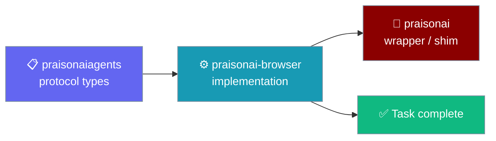

`praisonai-browser` is the standalone package that powers AI browser automation — the bridge server, CDP agent, and Playwright engine — usable on its own or inside the full `praisonai` stack.

```python
from praisonaiagents import Agent

agent = Agent(name="browser-agent", instructions="Browse the web and complete tasks in Chrome.")
agent.start("Go to google and search praisonai, then summarise the top result.")
```

The agent states a goal; `praisonai-browser` drives Chrome until the task completes.



## Quick Start

<Steps>
<Step title="Install the package">

```bash
pip install praisonai-browser
```

</Step>
<Step title="Run a goal from the CLI">

```bash
praisonai-browser run "Go to google and search praisonai"
```

<Note>
`run` performs a fast pre-flight `/health` check and exits `2` with an actionable message if the bridge is down or no extension is connected — no more 180-second silent hangs.
</Note>

</Step>
<Step title="Or use the Python API">

```python
from praisonai_browser import BrowserServer

server = BrowserServer(port=8765, model="gpt-4o")
server.start()  # Blocks until Ctrl+C / SIGTERM; connect the Chrome extension to it
```

<Note>
`BrowserServer.start()` **blocks** for the lifetime of the server (it calls `uvicorn.run`). It has no built-in port pre-check — that lives in the CLI. Programmatic callers who want the same "already running" behaviour should probe the port first:

```python
from praisonai_browser import BrowserServer
from praisonai_browser.server import _port_in_use

server = BrowserServer(port=8765, model="gpt-4o")
if _port_in_use(server.host, server.port):
    print(f"Bridge already listening on {server.port}")
else:
    server.start()  # blocks until Ctrl+C / SIGTERM
```

Alternatively, wrap `server.start()` in `try/except OSError` and check `errno.EADDRINUSE` (or `winerror == 10048` on Windows).
</Note>

</Step>
</Steps>

---

## Install

Pick the extras you need — core alone covers the CLI and CDP agent.

```bash
pip install praisonai-browser            # core
pip install "praisonai-browser[server]"  # FastAPI bridge server
pip install "praisonai-browser[playwright]"  # cross-browser Playwright engine
pip install "praisonai-browser[all]"     # everything
```

| Extra | Adds | Use it for |
|-------|------|-----------|
| _(none)_ | `rich`, `typer`, `click` | Core CLI and CDP agent |
| `server` | `fastapi`, `uvicorn`, `websockets`, `aiohttp` | Bridge server + Chrome extension |
| `playwright` | `playwright` | Firefox/WebKit and headless runs |
| `all` | Everything above | Full feature set |

<Note>
`pip install "praisonai[all]"` (or `praisonai[browser]`) installs `praisonai-browser` for you as part of the umbrella product.
</Note>

---

## Console Entry Point

The package ships a `praisonai-browser` console script that mirrors the `praisonai browser` subcommands.

```bash
praisonai-browser --help
praisonai-browser run "Go to google and search praisonai"
praisonai-browser doctor
```

Inside the full stack the same commands are available as `praisonai browser …`.

<Note>
Running `praisonai-browser start` a second time on the same port exits cleanly with an "already running" message and exit code 0 — it does not fail. See [Already running behaviour](/docs/features/browser-agent#already-running-behaviour) for the exact output and the Windows/IPv6 details.
</Note>

---

## Python API

Import the public classes straight from `praisonai_browser`.

```python
from praisonai_browser import (
    BrowserServer,
    BrowserAgent,
    SessionManager,
    CDPBrowserAgent,
    run_cdp_only,
    run_hybrid,
)
```

| Export | What it does |
|--------|--------------|
| `BrowserServer` | FastAPI + WebSocket bridge for the Chrome extension |
| `BrowserAgent` | Decides the next action from a page observation |
| `SessionManager` | SQLite-backed session and step history |
| `CDPBrowserAgent` | Drives Chrome directly over CDP (no extension) |
| `run_cdp_only` | One-call CDP automation runner |
| `run_hybrid` | CDP with on-device fallback |

### Protocol Types

The lightweight type definitions live in the agents tier and are shared across engines.

```python
from praisonaiagents.tools.protocols.browser import (
    BrowserAction,
    BrowserActionType,
    BrowserObservation,
    BrowserSession,
)
```

`BrowserActionType` includes `click`, `type`, `scroll`, `navigate`, `wait`, `screenshot`, `evaluate`, `submit`, `clear_input`, and `done`.

---

## Backward Compatibility

Everything from the pre-extraction layout keeps working.

| Old usage | Still works | Canonical form |
|-----------|-------------|----------------|
| `from praisonai.browser import BrowserServer, BrowserAgent` | ✅ | `from praisonai_browser import BrowserServer, BrowserAgent` |
| `from praisonai.browser.sessions import SessionManager` | ✅ | `from praisonai_browser import SessionManager` |
| `praisonai browser run "…"` | ✅ | `praisonai-browser run "…"` |
| `python -m praisonai.browser.server` | ✅ | `praisonai-browser start` |

<Note>
`praisonai.browser` is a compatibility shim that re-exports `praisonai_browser`, so existing scripts need no changes.
</Note>

---

## Best Practices

<AccordionGroup>
  <Accordion title="Install only the extras you use">
    Core covers the CLI and CDP agent. Add `[server]` for the Chrome extension bridge and `[playwright]` for Firefox/WebKit or headless runs.
  </Accordion>
  <Accordion title="Prefer the canonical import">
    Import from `praisonai_browser` in new code. The `praisonai.browser` shim stays for existing scripts.
  </Accordion>
  <Accordion title="Use the standalone CLI in slim environments">
    `praisonai-browser` runs without the full wrapper, keeping browser-only images small.
  </Accordion>
  <Accordion title="Run doctor before your first session">
    `praisonai-browser doctor` checks the server, Chrome debugging, extension, and session database in one pass.
  </Accordion>
</AccordionGroup>

---

## Related

<CardGroup cols={2}>
  <Card title="Browser Agent" icon="globe" href="/docs/features/browser-agent">
    Setup, CLI reference, and supported actions.
  </Card>
  <Card title="Browser Agent Deep Dive" icon="microscope" href="/docs/features/browser-agent-deep-dive">
    Execution modes, APIs, and package layout in detail.
  </Card>
</CardGroup>
