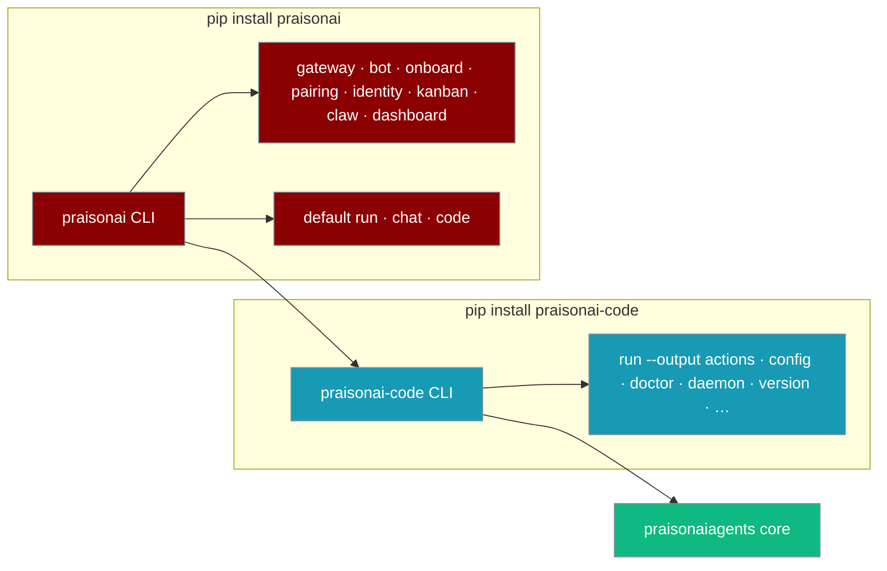
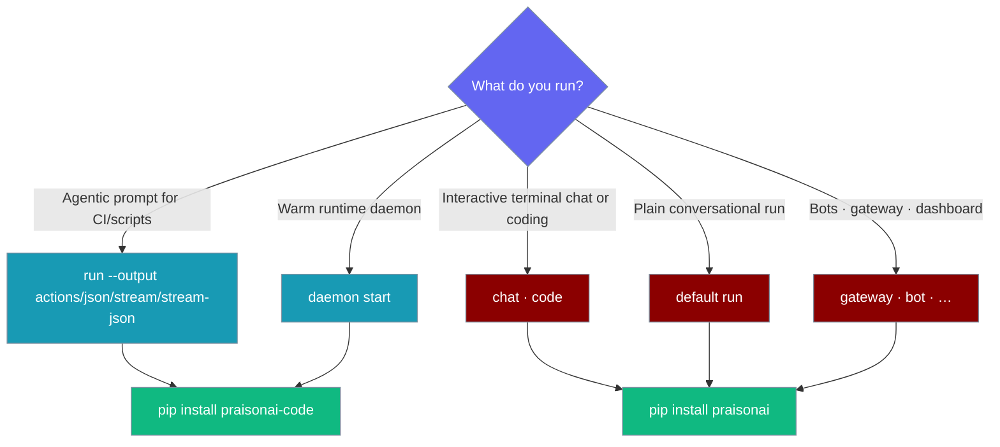
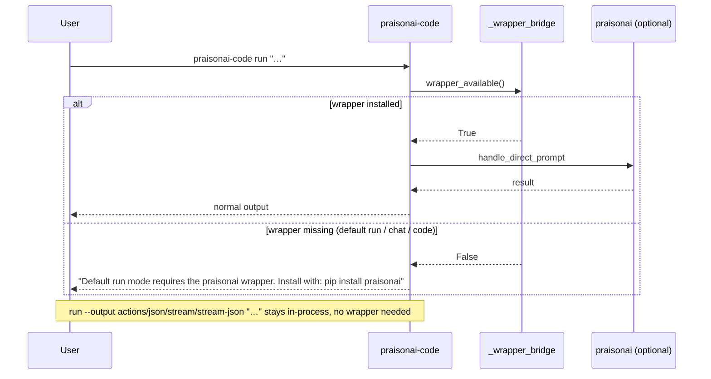
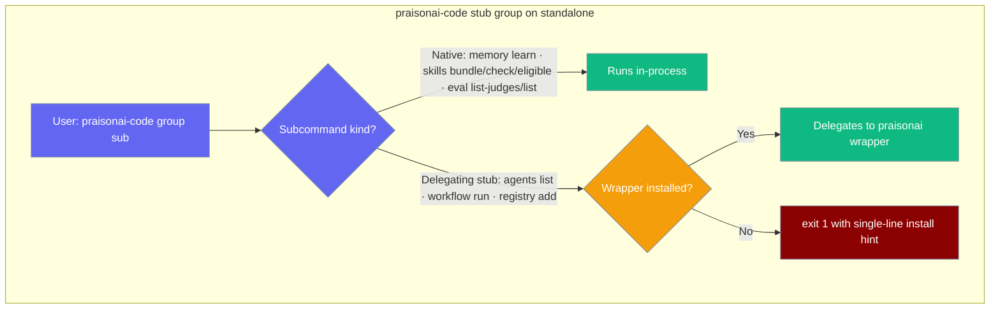

> `praisonai-code` is the terminal-native agent CLI — install it on its own for a smaller footprint when you only need agentic commands.

```python
from praisonaiagents import Agent

agent = Agent(
    name="assistant",
    instructions="You are a helpful coding assistant.",
)
agent.start("Summarise the top 3 arXiv papers on RAG this week")
```

The user runs a terminal prompt; `praisonai-code` executes the agent and streams the reply.



<Warning>
As of praisonai-code **0.0.22**, default `run "…"`, `chat`, and `code` require the `praisonai` wrapper. On a standalone install they emit an install hint. `run --output actions|json|stream|stream-json "…"` all stay standalone-safe.
</Warning>

## Which install do I need?



Both `praisonai-code` (console script) and `python -m praisonai_code` call the same entry point: configure logging, register commands, then run the Typer app.

## Quick Start

<Steps>
  <Step title="Install standalone">
    ```bash
    pip install praisonai-code
    praisonai-code version
    ```

    The panel lists **PraisonAI Code**, **PraisonAI Agents**, and **Python**. When the full wrapper is installed, a **PraisonAI Wrapper** line appears as well.

    Use `--version` for a quick one-liner (package version only, no panel):

    ```bash
    praisonai-code --version
    ```

    Run your first agent:

    ```bash
    praisonai-code run --output actions "Summarise the top 3 arXiv papers on RAG this week"
    ```

    `--output actions`, `--output json`, `--output stream`, and `--output stream-json` all run in-process with no wrapper. Default `run "…"` and `--output plain/verbose/silent` need the wrapper.

    Use any of `--output actions|json|stream|stream-json` for the standalone-safe in-process `Agent` path. Default `run "…"` and the human-readable modes (`plain`, `verbose`, `silent`) require the wrapper.
  </Step>
  <Step title="Upgrade later if you need bots or gateway">
    ```bash
    pip install praisonai
    ```

    The same `praisonai-code` binary keeps working. Wrapper-only commands (`gateway`, `bot`, `onboard`, `pairing`, `identity`, `kanban`, `claw`, `dashboard`) become available through the composed install.
  </Step>
</Steps>

## How It Works

When a command needs the `praisonai` wrapper, the CLI uses an internal bridge. If the wrapper is missing, you get a clear install hint instead of a silent failure. Plugin discovery is vendored inside `praisonai-code`, so plugin-related flows keep working without the wrapper.



The default `run "…"` guard checks `wrapper_available()` before any credential setup. When the wrapper is absent it prints:

```
Default run mode requires the praisonai wrapper. Install with: pip install praisonai
Standalone alternative: praisonai-code run --output actions "your prompt"
```

`chat` and `code` raise the parallel hint: `Error: chat requires the praisonai wrapper. Install the full wrapper: pip install praisonai` (and the same for `code`).

The vendored `_registry` module means plugins work even without the wrapper installed. Version resolution reads from the `praisonai-code` package metadata directly, not the wrapper.

## Command matrix

Three tiers decide what a command needs: fully standalone, wrapper-required (listed on a standalone install but needs the wrapper at runtime), and wrapper-only (not listed without the wrapper).

| Standalone (`pip install praisonai-code`) | Wrapper-required (listed, needs `praisonai`) | Wrapper-only (`pip install praisonai`) |
|-------------------------------------------|----------------------------------------------|----------------------------------------|
| acp · agent · agents · attach · auth · batch · benchmark · browser · call · checkpoint · command · commit · completion · config · context · debug · deploy · diag · docs · doctor · endpoints · env · eval · examples · flow · github · hooks · init · knowledge · langextract · langfuse · loop · lsp · managed · mcp · memory · models · n8n · obs · package · paths · permissions · plugins · port · profile · publish · rag · realtime · recipe · registry · replay · research · `run --output actions|json|stream|stream-json` · rules · sandbox · schedule · serve · session · setup · skills · templates · test · todo · tools · traces · tracker · train · ui · up · validate · version · workflow | `run "…"` (default) · chat · code · `run --output plain/verbose/silent` | bot · claw · daemon · dashboard · gateway · identity · kanban · onboard · pairing |

Wrapper-required commands are listed in `--help` but fail fast with an install hint when the wrapper is missing. Wrapper-only names stay out of `--help` entirely and do not load a Typer module.

The 14 stub groups below are a special mixed case — their legacy entry points are wrapper-required, but native subcommands stay standalone-safe:

| Command | Standalone | Wrapper-required |
|---------|:----------:|:----------------:|
| Stub groups (`agents`, `workflow`, `registry`, `memory`, `skills`, `hooks`, `rules`, `eval`, `package`, `templates`, `todo`, `research`, `commit`, `call`) — delegating entry points | ❌ Fail fast with hint | ✅ |
| Stub groups — native subcommands (`memory learn`, `skills bundle/check/eligible`, `eval list-judges`/`list`) | ✅ | ✅ |

<Note>
`daemon start` runs standalone in both foreground and `--background` modes — only the bot/gateway daemon sub-apps are wrapper-only.
</Note>

### Standalone limits

On a `pip install praisonai-code`-only install:

| Command | Works standalone? | Notes |
|---------|-------------------|-------|
| `run --help`, `config`, `doctor` | Yes | |
| `run --output actions "…"` | Yes | In-process `Agent` (structured events preset) |
| `run --output json "…"` | Yes | In-process `Agent` (structured JSON output) |
| `run --output stream "…"` | Yes | In-process `Agent` (streaming text) |
| `run --output stream-json "…"` | Yes | In-process `Agent` (streaming JSON events) |
| `run "…"` (default) | No | Requires `pip install praisonai` |
| `run --output plain/verbose/silent "…"` | No | Human-readable text path; requires `pip install praisonai` |
| `chat`, `code` | No | TUI / interactive legacy live in wrapper |
| `daemon start` (foreground) | Yes | |
| `daemon start --background` | Yes | Spawns `python -m praisonai_code.runtime` |
| Piped stdin (`type file.log \| praisonai-code run "…"`) | Yes | Works on Windows as of 2026-07-07 (PR #2705) via a stat-based pipe classifier; also supports `Get-Content file.log \| praisonai-code run "…"`. Interactive terminals skip the stdin read. See [Piped Input](/docs/features/cli-piped-stdin#size-cap--platform-notes). |

For full terminal UX (`chat`, `code`, default `run`), install the wrapper: `pip install praisonai`.

`praisonai-code doctor` returns exit **0** on a healthy standalone install — wrapper-presence checks (`performance_praisonai_import`, `acp_module`, `praisonai_package_structure`, `console_script_execution`) SKIP rather than FAIL ([PR #2851](https://github.com/MervinPraison/PraisonAI/pull/2851)).

### Stub command groups on standalone

Run agents standalone without the wrapper — the SDK works directly:

```python
from praisonaiagents import Agent

Agent(instructions="Summarise this URL").start("https://arxiv.org/abs/2409.12345")
```

```bash
# Same result from the CLI, standalone (in-process)
pip install praisonai-code
praisonai-code run --output actions "Summarise https://arxiv.org/abs/2409.12345"
```

Fourteen command groups — `agents`, `workflow`, `registry`, `memory`, `skills`, `hooks`, `rules`, `eval`, `package`, `templates`, `todo`, `research`, `commit`, and `call` — delegate to the `praisonai` wrapper for their legacy entry points. On a standalone `pip install praisonai-code` ([PR #2854](https://github.com/MervinPraison/PraisonAI/pull/2854)) those entry points exit `1` with a single-line install hint — no Rich traceback:

```
agents requires the full wrapper. Install the full wrapper: pip install praisonai
```

The `<group>` name changes per command (`workflow requires the full wrapper. …`, `registry requires the full wrapper. …`, and so on).

<Note>
These groups are **mixed**, not wholly wrapper-only. Their native subcommands keep working standalone — only the legacy delegating entry points fail fast.

| Group | Standalone-safe native subcommand(s) |
|-------|--------------------------------------|
| `memory` | `memory learn` (status/show/add/search/clear) |
| `skills` | `skills bundle`, `skills check`, `skills eligible` |
| `eval` | `eval list-judges`, `eval list` (alias — PR [#2848](https://github.com/MervinPraison/PraisonAI/pull/2848)) |

Run `pip install praisonai` to unlock the wrapper-delegating entry points, or use the native standalone-safe subcommand.
</Note>



### Wrapper-command loading

Wrapper-only commands (`bot`, `gateway`, `pairing`, `identity`, `onboard`, `kanban`, `dashboard`, `claw`, `daemon`) are Typer sub-apps whose implementations live in the `praisonai` wrapper. When you install `praisonai-code` standalone, these commands are not listed in `--help` and are not resolvable — `get_command()` returns `None` instead of loading a module that doesn't exist in `praisonai_code`.

```bash
# Standalone install, wrapper-only command
$ pip install praisonai-code
$ praisonai-code bot --help
Error: No such command 'bot'.
```

To use `bot`, `gateway`, `pairing`, `identity`, `onboard`, `kanban`, `dashboard`, `claw`, or `daemon`, install the full wrapper:

```bash
pip install praisonai
```

## Configuration and environment

| Variable / command | Behaviour |
|--------------------|-----------|
| `LOGLEVEL` | Read on CLI entry via `configure_cli_logging` (default `WARNING`). Controls root log verbosity for standalone runs. |
| `praisonai-code version check` | Compares your installed version with PyPI (`https://pypi.org/pypi/praisonai-code/json`). |

### Version commands

```bash
praisonai-code version
```

Shows the full version panel:

```
PraisonAI Code: 0.0.4
PraisonAI Wrapper: 1.x.x   ← only shown when praisonai is installed
PraisonAI Agents: 1.6.x
Python: 3.12.x
```

```bash
praisonai-code version --json
```

Returns structured JSON:

```json
{
  "praisonai-code": "0.0.4",
  "praisonai": "1.x.x",
  "praisonaiagents": "1.6.x",
  "python": "3.12.x"
}
```

The `praisonai` key is omitted when the wrapper is not installed.

```bash
praisonai-code version check
```

Queries PyPI and returns update status:

```json
{
  "current": "0.0.4",
  "latest": "0.0.5",
  "update_available": true
}
```

<Note>
`praisonai-code version check` needs outbound HTTPS to PyPI.
</Note>

## Best Practices

<AccordionGroup>
  <Accordion title="When to use praisonai-code alone">
    Use `praisonai-code` when you only need `run --output actions`, `config`, `doctor`, or the warm-runtime daemon — smaller install, no gateway/bot deps.
  </Accordion>
  <Accordion title="When to install the full wrapper">
    Install `praisonai` for interactive `chat`/`code`, default conversational `run "…"`, Telegram/Discord/Slack bots, the WebSocket gateway, or `kanban`/`dashboard`.
  </Accordion>
  <Accordion title="Monorepo dev install order">
    In dev, `pip install -e src/praisonai-agents && pip install -e src/praisonai-code && pip install -e src/praisonai` (this exact order) — matches the release publish order in `pypi-release.yml`.
  </Accordion>
  <Accordion title="AgentApp is a silent alias for AgentOS">
    `from praisonai import AgentOS` and `from praisonai import AgentApp` both work — `AgentApp` is a backward-compat silent alias for `AgentOS`. No deprecation warning is emitted.
  </Accordion>
</AccordionGroup>

## Related

<CardGroup cols={2}>
  <Card title="Choose your install" icon="download" href="/docs/installation">
    Compare full wrapper, code-only, and SDK installs
  </Card>
  <Card title="Architecture" icon="layers" href="/docs/concepts/architecture">
    Three-package layout and dependency direction
  </Card>
</CardGroup>
