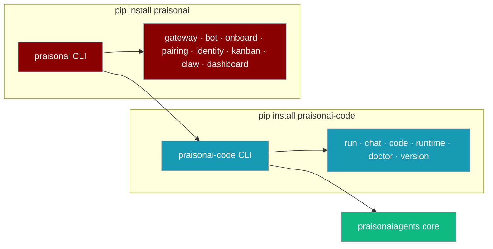
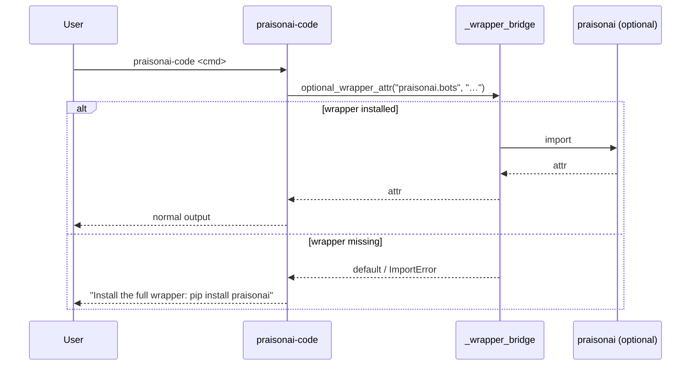

> `praisonai-code` is the terminal-native agent CLI — install it on its own for a smaller footprint when you only need agentic commands.

```python
from praisonaiagents import Agent

agent = Agent(
    name="assistant",
    instructions="You are a helpful coding assistant.",
)
agent.start("Summarise the top 3 arXiv papers on RAG this week")
```

The user runs a terminal prompt; `praisonai-code` executes the agent and streams the reply.



Both `praisonai-code` (console script) and `python -m praisonai_code` call the same entry point: configure logging, register commands, then run the Typer app.

## Quick Start

<Steps>
  <Step title="Install standalone">
    ```bash
    pip install praisonai-code
    praisonai-code version
    ```

    The panel lists **PraisonAI Code**, **PraisonAI Agents**, and **Python**. When the full wrapper is installed, a **PraisonAI Wrapper** line appears as well.

    Use `--version` for a quick one-liner (package version only, no panel):

    ```bash
    praisonai-code --version
    ```

    Run your first agent:

    ```bash
    praisonai-code run "Summarise the top 3 arXiv papers on RAG this week"
    ```
  </Step>
  <Step title="Upgrade later if you need bots or gateway">
    ```bash
    pip install praisonai
    ```

    The same `praisonai-code` binary keeps working. Wrapper-only commands (`gateway`, `bot`, `onboard`, `pairing`, `identity`, `kanban`, `claw`, `dashboard`) become available through the composed install.
  </Step>
</Steps>

## How It Works

When a command needs the `praisonai` wrapper, the CLI uses an internal bridge. If the wrapper is missing, you get a clear install hint instead of a silent failure. Plugin discovery is vendored inside `praisonai-code`, so plugin-related flows keep working without the wrapper.



Hard imports through the bridge raise the same hint: `Install the full wrapper: pip install praisonai`.

The vendored `_registry` module means plugins work even without the wrapper installed. Version resolution reads from the `praisonai-code` package metadata directly, not the wrapper.

## Command matrix

| Standalone (`pip install praisonai-code`) | Wrapper-only (`pip install praisonai`) |
|-------------------------------------------|----------------------------------------|
| acp · agent · agents · attach · auth · batch · benchmark · browser · call · chat · checkpoint · code · command · commit · completion · config · context · debug · deploy · diag · docs · doctor · endpoints · env · eval · examples · flow · github · hooks · init · knowledge · langextract · langfuse · loop · lsp · managed · mcp · memory · models · n8n · obs · package · paths · permissions · plugins · port · profile · publish · rag · realtime · recipe · registry · replay · research · rules · run · sandbox · schedule · serve · session · setup · skills · templates · test · todo · tools · traces · tracker · train · ui · up · validate · version · workflow | bot · claw · daemon · dashboard · gateway · identity · kanban · onboard · pairing |

Wrapper-only names stay out of `--help` on a standalone install. Invoking them without the wrapper does not load the Typer module.

### Wrapper-command loading

Wrapper-only commands (`bot`, `gateway`, `pairing`, `identity`, `onboard`, `kanban`, `dashboard`, `claw`, `daemon`) are Typer sub-apps whose implementations live in the `praisonai` wrapper. When you install `praisonai-code` standalone, these commands are not listed in `--help` and are not resolvable — `get_command()` returns `None` instead of loading a module that doesn't exist in `praisonai_code`.

```bash
# Standalone install, wrapper-only command
$ pip install praisonai-code
$ praisonai-code bot --help
Error: No such command 'bot'.
```

To use `bot`, `gateway`, `pairing`, `identity`, `onboard`, `kanban`, `dashboard`, `claw`, or `daemon`, install the full wrapper:

```bash
pip install praisonai
```

## Configuration and environment

| Variable / command | Behaviour |
|--------------------|-----------|
| `LOGLEVEL` | Read on CLI entry via `configure_cli_logging` (default `WARNING`). Controls root log verbosity for standalone runs. |
| `praisonai-code version check` | Compares your installed version with PyPI (`https://pypi.org/pypi/praisonai-code/json`). |

### Version commands

```bash
praisonai-code version
```

Shows the full version panel:

```
PraisonAI Code: 0.0.4
PraisonAI Wrapper: 1.x.x   ← only shown when praisonai is installed
PraisonAI Agents: 1.6.x
Python: 3.12.x
```

```bash
praisonai-code version --json
```

Returns structured JSON:

```json
{
  "praisonai-code": "0.0.4",
  "praisonai": "1.x.x",
  "praisonaiagents": "1.6.x",
  "python": "3.12.x"
}
```

The `praisonai` key is omitted when the wrapper is not installed.

```bash
praisonai-code version check
```

Queries PyPI and returns update status:

```json
{
  "current": "0.0.4",
  "latest": "0.0.5",
  "update_available": true
}
```

<Note>
`praisonai-code version check` needs outbound HTTPS to PyPI.
</Note>

## Best practices

<AccordionGroup>
  <Accordion title="When to use praisonai-code alone">
    Use `praisonai-code` when you only need `run`/`chat`/`code`/warm-runtime — smaller install, no gateway/bot deps.
  </Accordion>
  <Accordion title="When to install the full wrapper">
    Install `praisonai` when you deploy to Telegram/Discord/Slack, run the WebSocket gateway, or use `kanban`/`dashboard`.
  </Accordion>
  <Accordion title="Monorepo dev install order">
    In dev, `pip install -e src/praisonai-agents && pip install -e src/praisonai-code && pip install -e src/praisonai` (this exact order) — matches the release publish order in `pypi-release.yml`.
  </Accordion>
  <Accordion title="AgentApp is a silent alias for AgentOS">
    `from praisonai import AgentOS` and `from praisonai import AgentApp` both work — `AgentApp` is a backward-compat silent alias for `AgentOS`. No deprecation warning is emitted.
  </Accordion>
</AccordionGroup>

## Related

<CardGroup cols={2}>
  <Card title="Choose your install" icon="download" href="/docs/installation">
    Compare full wrapper, code-only, and SDK installs
  </Card>
  <Card title="Architecture" icon="layers" href="/docs/concepts/architecture">
    Three-package layout and dependency direction
  </Card>
</CardGroup>
