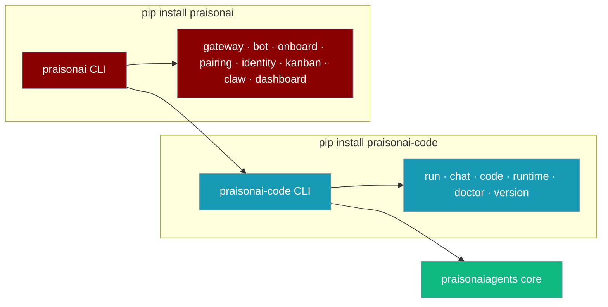
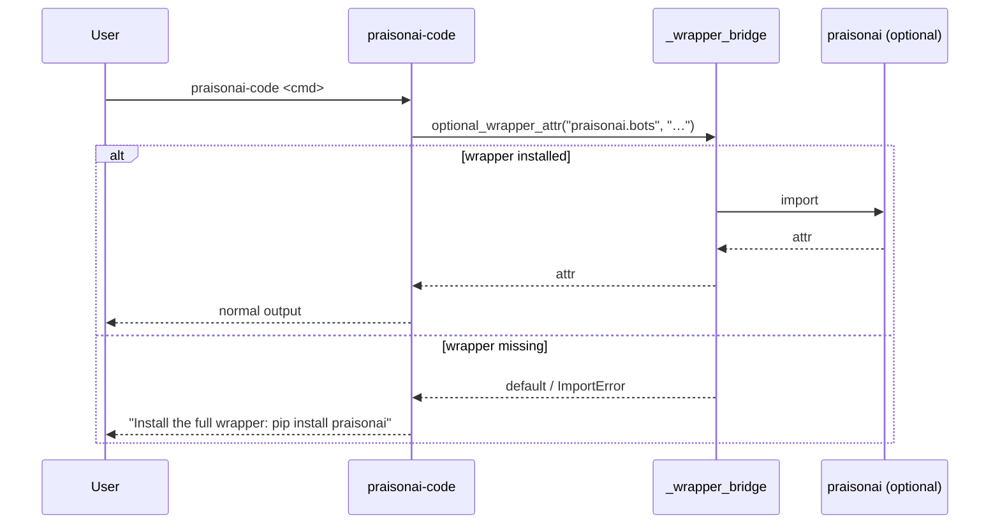

`praisonai-code` is the terminal-native agent CLI — install it on its own for a smaller footprint when you only need agentic commands.



## Quick Start

<Steps>
<Step title="Install standalone">

```bash
pip install praisonai-code
praisonai-code --version
```

Run your first agent:

```bash
praisonai-code run "Summarise the top 3 arXiv papers on RAG this week"
```

The `--version` flag shows the `praisonai-code` package version. Use `praisonai-code version` for the full version panel including `praisonaiagents` and Python versions.

</Step>

<Step title="Upgrade when you need bots or gateway">

```bash
pip install praisonai
```

`pip install praisonai` adds the full wrapper on top. The same `praisonai-code` binary keeps working, and `praisonai gateway`, `praisonai bot`, and other wrapper-only commands become available.

</Step>
</Steps>

---

## How It Works

When a `praisonai-code` command touches wrapper-only functionality, the `_wrapper_bridge` module handles the fallback gracefully:



The vendored `_registry` module means plugins work even without the wrapper installed. Version resolution reads from the `praisonai-code` package metadata directly, not the wrapper.

---

## Command Matrix

| Standalone (`pip install praisonai-code`) | Wrapper-only (`pip install praisonai`) |
|-------------------------------------------|----------------------------------------|
| `run` — Run agents | `bot` — Messaging bots with full agent capabilities |
| `chat` — Terminal-native interactive chat (REPL) | `gateway` — Multi-bot WebSocket gateway server |
| `code` — Terminal-native code assistant | `onboard` — Messaging bot onboarding wizard |
| `runtime` / `daemon` / `attach` — Warm local runtime | `pairing` — Manage bot user pairing |
| `doctor` — Health checks and diagnostics | `identity` — Manage cross-platform user identity links |
| `version` — Version information | `kanban` — Kanban task management |
| `init`, `config`, `env`, `auth`, `session` — Project setup | `claw` — PraisonAI Dashboard (full UI) |
| `mcp`, `serve`, `schedule` — Services | `dashboard` — Unified Dashboard (Flow + Claw + UI) |
| `research`, `memory`, `workflow`, `tools` — Agent features | |
| `examples`, `batch`, `loop`, `tracker` — Execution | |

---

## Configuration

| Variable | Default | Description |
|----------|---------|-------------|
| `LOGLEVEL` | `WARNING` | CLI log verbosity. Read by `configure_cli_logging` on every startup. Set to `DEBUG` to see all internal log output. |

### Version commands

```bash
praisonai-code version
```

Shows the full version panel:

```
PraisonAI Code: 0.0.4
PraisonAI Wrapper: 1.x.x   ← only shown when praisonai is installed
PraisonAI Agents: 1.6.x
Python: 3.12.x
```

```bash
praisonai-code version --json
```

Returns structured JSON:

```json
{
  "praisonai-code": "0.0.4",
  "praisonai": "1.x.x",
  "praisonaiagents": "1.6.x",
  "python": "3.12.x"
}
```

The `praisonai` key is omitted when the wrapper is not installed.

```bash
praisonai-code version check
```

Queries PyPI and returns update status:

```json
{
  "current": "0.0.4",
  "latest": "0.0.5",
  "update_available": true
}
```

<Note>
`version check` requires outbound HTTPS access to `https://pypi.org/pypi/praisonai-code/json`.
</Note>

---

## Best Practices

<AccordionGroup>
<Accordion title="Use praisonai-code for agentic terminal work">
Use `praisonai-code` when you only need `run`/`chat`/`code`/warm-runtime — smaller install, no gateway/bot deps.
</Accordion>

<Accordion title="Install praisonai for bots and gateway">
Install `praisonai` when you deploy to Telegram/Discord/Slack, run the WebSocket gateway, or use `kanban`/`dashboard`.
</Accordion>

<Accordion title="Development install order matters">
In dev, `pip install -e src/praisonai-agents && pip install -e src/praisonai-code && pip install -e src/praisonai` (this exact order) — matches the release publish order in `pypi-release.yml`.
</Accordion>

<Accordion title="AgentApp is a silent alias for AgentOS">
`from praisonai import AgentOS` and `from praisonai import AgentApp` both work — `AgentApp` is a backward-compat silent alias for `AgentOS`. No deprecation warning is emitted.
</Accordion>
</AccordionGroup>

---

## Related

<CardGroup cols={2}>
<Card
  title="Choose Your Install"
  icon="download"
  href="/docs/installation"
>
  Installation options and platform guides
</Card>
<Card
  title="Architecture"
  icon="layers"
  href="/docs/concepts/architecture"
>
  Three-package split: praisonaiagents → praisonai-code → praisonai
</Card>
</CardGroup>
