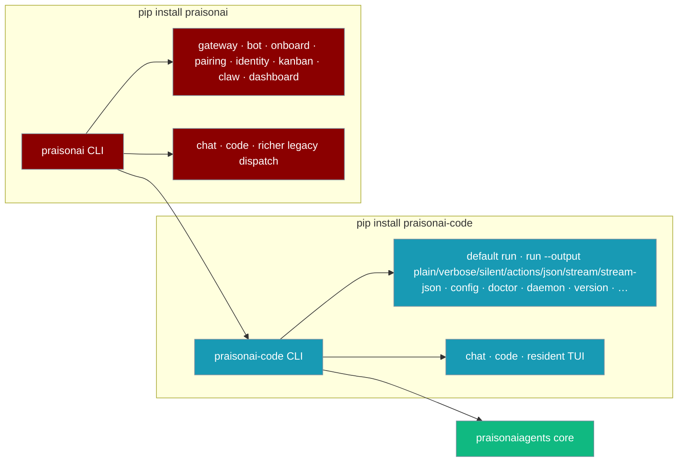
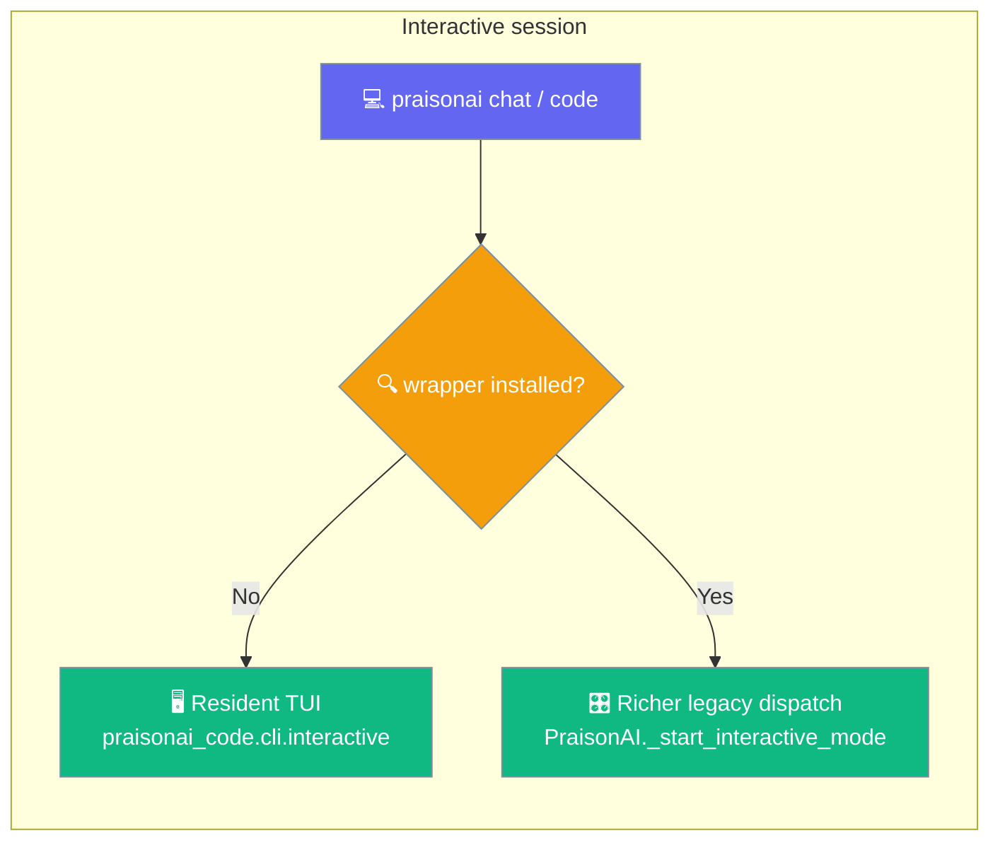
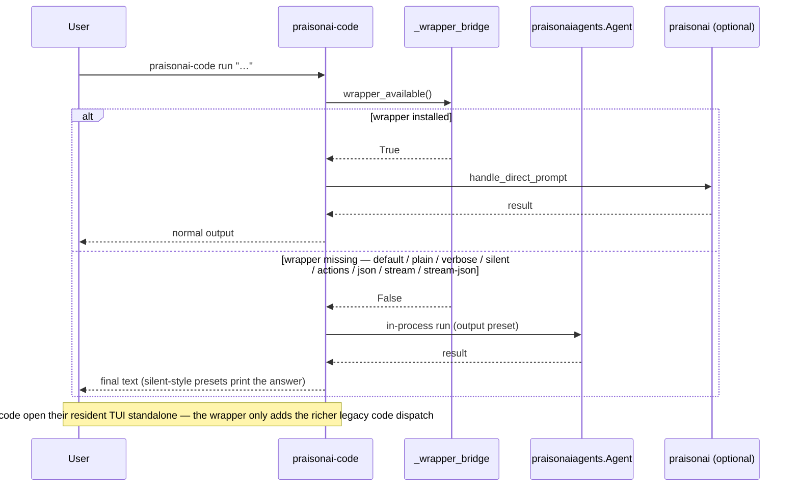
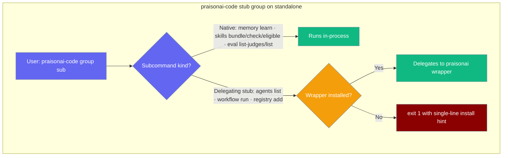

> `praisonai-code` is the terminal-native agent CLI — install it on its own for a smaller footprint when you only need agentic commands.

```python
# Standalone install — no wrapper needed
from praisonaiagents import Agent

Agent(instructions="Summarise this URL").start("https://arxiv.org/abs/2409.12345")
```

```bash
# Same result from the CLI, standalone (PR #2853)
pip install praisonai-code
praisonai-code run "Summarise https://arxiv.org/abs/2409.12345"
```

The user runs a terminal prompt; `praisonai-code` executes the agent in-process and prints the reply.

Interactive `chat` and `code` also run from `praisonai-code` alone — no wrapper (PR #3818):

```bash
pip install praisonai-code
praisonai chat        # opens the split-pane async TUI, no wrapper required
praisonai code        # opens the resident code TUI, no wrapper required
```


```mermaid
graph LR
    subgraph pip_code["pip install praisonai-code"]
        A[praisonai-code CLI] --> A1[default run · run --output plain/verbose/silent/actions/json/stream/stream-json · config · doctor · daemon · version · …]
        A --> A2[chat · code · resident TUI]
    end
    subgraph pip_wrapper["pip install praisonai"]
        B[praisonai CLI] --> B1[gateway · bot · onboard · pairing · identity · kanban · claw · dashboard]
        B --> B2[chat · code · richer legacy dispatch]
        B --> A
    end
    A --> C[praisonaiagents core]

    classDef code fill:#189AB4,stroke:#7C90A0,color:#fff
    classDef wrapper fill:#8B0000,stroke:#7C90A0,color:#fff
    classDef core fill:#10B981,stroke:#7C90A0,color:#fff
    class A,A1,A2 code
    class B,B1,B2 wrapper
    class C core
```

<Warning>
As of praisonai-code **0.0.45** (PR #2853), default `run "…"` **and** `run --output plain|verbose|silent "…"` route in-process on a standalone `pip install praisonai-code` — the same `Agent` path used by `--output actions|json|stream|stream-json`. As of PR #3818, `chat` and `code` also run their resident TUI standalone; the `praisonai` wrapper adds the *richer legacy dispatch* for `code` and the gateway/bot channels.
</Warning>

## Which install do I need?

```mermaid
graph TB
    Start{What do you run?} -->|Any text prompt: default run or --output plain/verbose/silent/actions/json/stream/stream-json| Structured[run "…"]
    Start -->|Interactive terminal chat or coding: resident TUI| Interactive[chat · code]
    Start -->|Richer legacy code dispatch| Wrapper1[chat · code legacy]
    Start -->|Bots · gateway · dashboard| Wrapper3[gateway · bot · …]
    Start -->|Warm runtime daemon| Daemon[daemon start]

    Structured --> Code[pip install praisonai-code]
    Interactive --> Code
    Daemon --> Code
    Wrapper1 --> Full[pip install praisonai]
    Wrapper3 --> Full

    classDef question fill:#6366F1,stroke:#7C90A0,color:#fff
    classDef code fill:#189AB4,stroke:#7C90A0,color:#fff
    classDef wrapper fill:#8B0000,stroke:#7C90A0,color:#fff
    classDef install fill:#10B981,stroke:#7C90A0,color:#fff
    class Start question
    class Structured,Interactive,Daemon code
    class Wrapper1,Wrapper3 wrapper
    class Code,Full install
```

Both `praisonai-code` (console script) and `python -m praisonai_code` call the same entry point: configure logging, register commands, then run the Typer app.

## Interactive Chat & Code (resident TUI)

A single `pip install praisonai-code` is enough for an interactive session — the split-pane async TUI ships inside the package (PR #3818).

```bash
pip install praisonai-code
praisonai chat        # opens the split-pane async TUI, no wrapper required
praisonai code        # opens the resident code TUI, no wrapper required
```


```mermaid
graph LR
    subgraph "Interactive session"
        I[💻 praisonai chat / code] --> C{🔍 wrapper installed?}
        C -->|No| R[🖥️ Resident TUI<br/>praisonai_code.cli.interactive]
        C -->|Yes| L[🎛️ Richer legacy dispatch<br/>PraisonAI._start_interactive_mode]
    end

    classDef input fill:#6366F1,stroke:#7C90A0,color:#fff
    classDef decision fill:#F59E0B,stroke:#7C90A0,color:#fff
    classDef result fill:#10B981,stroke:#7C90A0,color:#fff

    class I input
    class C decision
    class R,L result
```

| Dimension | Resident TUI (`praisonai-code` alone) | Richer legacy dispatch (`+ praisonai`) |
|-----------|----------------------------------------|-----------------------------------------|
| Install | `pip install praisonai-code` | `pip install praisonai` |
| Entry point | `praisonai_code.cli.interactive` | `PraisonAI._start_interactive_mode` |
| `code` command | Resident split-pane TUI | Preferred richer legacy dispatch |
| Wrapper-only helpers (`praisonai._async_bridge`, `praisonai.integration.context_files`) | Bridge fallback via `_wrapper_bridge` | Direct wrapper implementation |

The wrapper is never required for the baseline TUI — it only upgrades `code` to the richer legacy dispatch and routes the wrapper-only helpers through their direct implementation instead of the `_wrapper_bridge` fallback.

## Quick Start

<Steps>
  <Step title="Install standalone">
    ```bash
    pip install praisonai-code
    praisonai-code version
    ```

    The panel lists **PraisonAI Code**, **PraisonAI Agents**, and **Python**. When the full wrapper is installed, a **PraisonAI Wrapper** line appears as well.

    Use `--version` for a quick one-liner (package version only, no panel):

    ```bash
    praisonai-code --version
    ```

    Run your first agent:

    ```bash
    praisonai-code run "Summarise the top 3 arXiv papers on RAG this week"
    ```

    Every text mode — default `run "…"` and `--output plain|verbose|silent|actions|json|stream|stream-json` — runs standalone via the in-process `Agent` path. As of PR #3818, `chat` and `code` also open their resident interactive TUI standalone — the wrapper only adds the richer legacy dispatch for `code`.
  </Step>
  <Step title="Upgrade later if you need bots or gateway">
    ```bash
    pip install praisonai
    ```

    The same `praisonai-code` binary keeps working. Wrapper-only commands (`gateway`, `bot`, `onboard`, `pairing`, `identity`, `kanban`, `claw`, `dashboard`) become available through the composed install.
  </Step>
</Steps>

## How It Works

Text-mode `run` always executes in-process via the `Agent` path on a standalone install. When the wrapper **is** present, human-readable modes delegate to its `handle_direct_prompt`; when it is absent, they route through the in-process `Agent` with the matching output preset. `chat` and `code` open their resident TUI standalone (PR #3818); when the wrapper is installed, `code` prefers the richer legacy dispatch. Plugin discovery is vendored inside `praisonai-code`, so plugin-related flows keep working without the wrapper.


```mermaid
sequenceDiagram
    participant User
    participant CLI as praisonai-code
    participant Bridge as _wrapper_bridge
    participant Agent as praisonaiagents.Agent
    participant Wrapper as praisonai (optional)

    User->>CLI: praisonai-code run "…"
    CLI->>Bridge: wrapper_available()
    alt wrapper installed
        Bridge-->>CLI: True
        CLI->>Wrapper: handle_direct_prompt
        Wrapper-->>CLI: result
        CLI-->>User: normal output
    else wrapper missing — default / plain / verbose / silent / actions / json / stream / stream-json
        Bridge-->>CLI: False
        CLI->>Agent: in-process run (output preset)
        Agent-->>CLI: result
        CLI-->>User: final text (silent-style presets print the answer)
    end
    Note over User,CLI: chat / code open their resident TUI standalone — the wrapper only adds the richer legacy code dispatch
```

Output presets map as `plain` → `plain`, `silent`/default → `silent`, `verbose` → `verbose`; silent-style presets print the final text. `chat` and `code` open their resident interactive TUI standalone (PR #3818); when the `praisonai` wrapper is installed, `code` prefers its richer legacy dispatch (`PraisonAI._start_interactive_mode`).

The vendored `_registry` module means plugins work even without the wrapper installed. Version resolution reads from the `praisonai-code` package metadata directly, not the wrapper.

## Command matrix

Three tiers decide what a command needs: fully standalone, wrapper-boosted (works standalone but gains a richer path with the wrapper), and wrapper-only (not listed without the wrapper).

| Standalone (`pip install praisonai-code`) | Wrapper-boosted (works standalone, richer with `praisonai`) | Wrapper-only (`pip install praisonai`) |
|-------------------------------------------|-------------------------------------------------------------|----------------------------------------|
| acp · agent · agents · attach · auth · batch · benchmark · browser · call · checkpoint · `chat` · command · commit · completion · config · context · debug · deploy · diag · docs · doctor · endpoints · env · eval · examples · flow · github · hooks · init · knowledge · langextract · langfuse · loop · lsp · managed · mcp · memory · models · n8n · obs · package · paths · permissions · plugins · port · profile · publish · rag · realtime · recipe · registry · replay · research · `run "…"` (default) · `run --output plain/verbose/silent/actions/json/stream/stream-json` · rules · sandbox · schedule · serve · session · setup · skills · templates · test · todo · tools · traces · tracker · train · ui · up · validate · version · workflow | code (resident TUI standalone → richer legacy dispatch with wrapper) | bot · claw · daemon · dashboard · gateway · identity · kanban · onboard · pairing |

`chat` and `code` open their resident TUI standalone (PR #3818); `code` prefers the richer legacy dispatch when the wrapper is installed. Wrapper-only names stay out of `--help` entirely and do not load a Typer module.

The 14 stub groups below are a special mixed case — their legacy entry points are wrapper-required, but native subcommands stay standalone-safe:

| Command | Standalone | Wrapper-required |
|---------|:----------:|:----------------:|
| Stub groups (`agents`, `workflow`, `registry`, `memory`, `skills`, `hooks`, `rules`, `eval`, `package`, `templates`, `todo`, `research`, `commit`, `call`) — delegating entry points | ❌ Fail fast with hint | ✅ |
| Stub groups — native subcommands (`memory learn`, `skills bundle/check/eligible`, `eval list-judges`/`list`) | ✅ | ✅ |

<Note>
`daemon start` runs standalone in both foreground and `--background` modes — only the bot/gateway daemon sub-apps are wrapper-only.
</Note>

### Standalone limits

On a `pip install praisonai-code`-only install:

| Command | Works standalone? | Notes |
|---------|-------------------|-------|
| `run --help`, `config`, `doctor` | Yes | |
| `run --output actions "…"` | Yes | In-process `Agent` (structured events preset) |
| `run --output json "…"` | Yes | In-process `Agent` (structured JSON output) |
| `run --output stream "…"` | Yes | In-process `Agent` (streaming text) |
| `run --output stream-json "…"` | Yes | In-process `Agent` (streaming JSON events) |
| `run "…"` (default) | Yes | In-process `Agent` (silent preset; prints final text) |
| `run --output plain/verbose/silent "…"` | Yes | In-process `Agent` (plain/verbose/silent presets) |
| `chat`, `code` | Yes | Resident interactive TUI (PR #3818). `code` prefers the richer legacy dispatch when the wrapper is installed |
| `daemon start` (foreground) | Yes | |
| `daemon start --background` | Yes | Spawns `python -m praisonai_code.runtime` |
| Piped stdin (`type file.log \| praisonai-code run "…"`) | Yes | Works on Windows as of 2026-07-07 (PR #2705) via a stat-based pipe classifier; also supports `Get-Content file.log \| praisonai-code run "…"`. Interactive terminals skip the stdin read. See [Piped Input](/docs/features/cli-piped-stdin#size-cap--platform-notes). |

Interactive `chat` and `code` open their resident TUI standalone as of PR #3818. Installing the wrapper (`pip install praisonai`) adds the richer legacy dispatch for `code` and the gateway/bot channels — it is no longer required for the baseline interactive experience.

`praisonai-code doctor` returns exit **0** on a healthy standalone install — wrapper-presence checks (`performance_praisonai_import`, `acp_module`, `praisonai_package_structure`, `console_script_execution`) SKIP rather than FAIL ([PR #2851](https://github.com/MervinPraison/PraisonAI/pull/2851)).

### Stub command groups on standalone

Run agents standalone without the wrapper — the SDK works directly:

```python
from praisonaiagents import Agent

Agent(instructions="Summarise this URL").start("https://arxiv.org/abs/2409.12345")
```

```bash
# Same result from the CLI, standalone (in-process)
pip install praisonai-code
praisonai-code run --output actions "Summarise https://arxiv.org/abs/2409.12345"
```

Fourteen command groups — `agents`, `workflow`, `registry`, `memory`, `skills`, `hooks`, `rules`, `eval`, `package`, `templates`, `todo`, `research`, `commit`, and `call` — delegate to the `praisonai` wrapper for their legacy entry points. On a standalone `pip install praisonai-code` ([PR #2854](https://github.com/MervinPraison/PraisonAI/pull/2854)) those entry points exit `1` with a single-line install hint — no Rich traceback:

```
agents requires the full wrapper. Install the full wrapper: pip install praisonai
```

The `<group>` name changes per command (`workflow requires the full wrapper. …`, `registry requires the full wrapper. …`, and so on).

<Note>
These groups are **mixed**, not wholly wrapper-only. Their native subcommands keep working standalone — only the legacy delegating entry points fail fast.

| Group | Standalone-safe native subcommand(s) |
|-------|--------------------------------------|
| `memory` | `memory learn` (status/show/add/search/clear) |
| `skills` | `skills bundle`, `skills check`, `skills eligible` |
| `eval` | `eval list-judges`, `eval list` (alias — PR [#2848](https://github.com/MervinPraison/PraisonAI/pull/2848)) |

Run `pip install praisonai` to unlock the wrapper-delegating entry points, or use the native standalone-safe subcommand.
</Note>


```mermaid
graph TB
    subgraph "praisonai-code stub group on standalone"
        Cmd[User: praisonai-code group sub] --> Kind{Subcommand kind?}
        Kind -->|Native: memory learn · skills bundle/check/eligible · eval list-judges/list| InProc[Runs in-process]
        Kind -->|Delegating stub: agents list · workflow run · registry add| Guard{Wrapper installed?}
        Guard -->|Yes| Wrap[Delegates to praisonai wrapper]
        Guard -->|No| Hint[exit 1 with single-line install hint]
    end

    classDef input fill:#6366F1,stroke:#7C90A0,color:#fff
    classDef gate fill:#F59E0B,stroke:#7C90A0,color:#fff
    classDef ok fill:#10B981,stroke:#7C90A0,color:#fff
    classDef fail fill:#8B0000,stroke:#7C90A0,color:#fff

    class Cmd,Kind input
    class Guard gate
    class InProc,Wrap ok
    class Hint fail
```

### Wrapper-command loading

Wrapper-only commands (`bot`, `gateway`, `pairing`, `identity`, `onboard`, `kanban`, `dashboard`, `claw`, `daemon`) are Typer sub-apps whose implementations live in the `praisonai` wrapper. When you install `praisonai-code` standalone, these commands are not listed in `--help` and are not resolvable — `get_command()` returns `None` instead of loading a module that doesn't exist in `praisonai_code`.

```bash
# Standalone install, wrapper-only command
$ pip install praisonai-code
$ praisonai-code bot --help
Error: No such command 'bot'.
```

To use `bot`, `gateway`, `pairing`, `identity`, `onboard`, `kanban`, `dashboard`, `claw`, or `daemon`, install the full wrapper:

```bash
pip install praisonai
```

## Configuration and environment

| Variable / command | Behaviour |
|--------------------|-----------|
| `LOGLEVEL` | Read on CLI entry via `configure_cli_logging` (default `WARNING`). Controls root log verbosity for standalone runs. |
| `praisonai-code version check` | Compares your installed version with PyPI (`https://pypi.org/pypi/praisonai-code/json`). |

### Version commands

```bash
praisonai-code version
```

Shows the full version panel:

```
PraisonAI Code: 0.0.4
PraisonAI Wrapper: 1.x.x   ← only shown when praisonai is installed
PraisonAI Agents: 1.6.x
Python: 3.12.x
```

```bash
praisonai-code version --json
```

Returns structured JSON:

```json
{
  "praisonai-code": "0.0.4",
  "praisonai": "1.x.x",
  "praisonaiagents": "1.6.x",
  "python": "3.12.x"
}
```

The `praisonai` key is omitted when the wrapper is not installed.

```bash
praisonai-code version check
```

Queries PyPI and returns update status:

```json
{
  "current": "0.0.4",
  "latest": "0.0.5",
  "update_available": true
}
```

<Note>
`praisonai-code version check` needs outbound HTTPS to PyPI.
</Note>

## Best Practices

<AccordionGroup>
  <Accordion title="When to use praisonai-code alone">
    Use `praisonai-code` for any `run "…"` prompt (default or any `--output` mode), `config`, `doctor`, or the warm-runtime daemon — smaller install, no gateway/bot deps.
  </Accordion>
  <Accordion title="When to install the full wrapper">
    Install `praisonai` for the richer legacy `code` dispatch (`PraisonAI._start_interactive_mode`), Telegram/Discord/Slack bots, the WebSocket gateway, or `kanban`/`dashboard`. Baseline interactive `chat`/`code` run standalone (PR #3818).
  </Accordion>
  <Accordion title="Monorepo dev install order">
    In dev, `pip install -e src/praisonai-agents && pip install -e src/praisonai-code && pip install -e src/praisonai` (this exact order) — matches the release publish order in `pypi-release.yml`.
  </Accordion>
  <Accordion title="AgentApp is a silent alias for AgentOS">
    `from praisonai import AgentOS` and `from praisonai import AgentApp` both work — `AgentApp` is a backward-compat silent alias for `AgentOS`. No deprecation warning is emitted.
  </Accordion>
</AccordionGroup>

## Related

<CardGroup cols={2}>
  <Card title="Choose your install" icon="download" href="/installation">
    Compare full wrapper, code-only, and SDK installs
  </Card>
  <Card title="Architecture" icon="layers" href="/concepts/architecture">
    Six-package layout and dependency direction
  </Card>
</CardGroup>
