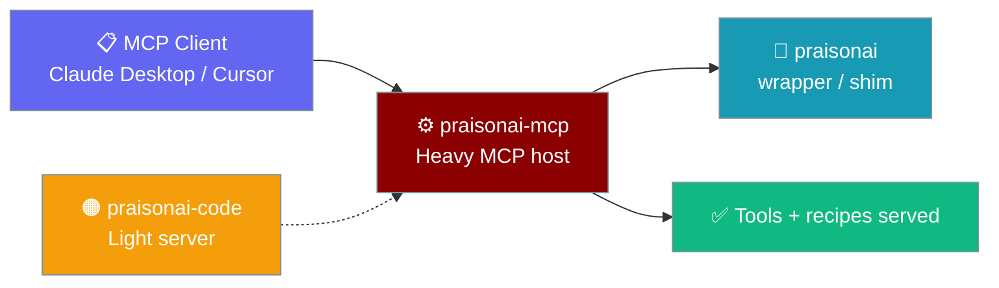
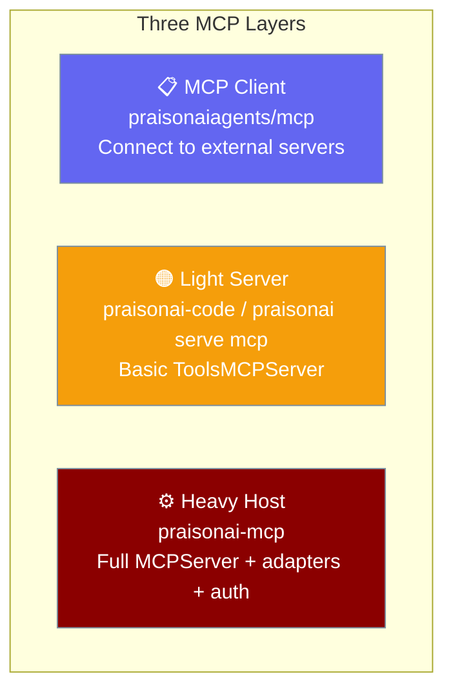

`praisonai-mcp` is the standalone package that hosts your PraisonAI agents and tools as an MCP server — reachable from Claude Desktop, Cursor, Windsurf, and any other MCP client, usable on its own or inside the full `praisonai` stack.

```python
from praisonaiagents import Agent

agent = Agent(name="assistant", instructions="Answer questions and run tasks.")
agent.start("Summarise today's release notes.")
```

Run `praisonai-mcp serve` and this agent becomes a tool your MCP client can call.



## Quick Start

<Steps>
<Step title="Install the package">

```bash
pip install praisonai-mcp
```

</Step>
<Step title="Set your API key">

```bash
export OPENAI_API_KEY=sk-...
```

</Step>
<Step title="Serve over STDIO">

```bash
praisonai-mcp serve --transport stdio
```

Point Claude Desktop or Cursor at this command and your agents appear as MCP tools.

</Step>
</Steps>

---

## Install

Pick the extras you need — core alone covers the CLI and STDIO transport.

```bash
pip install praisonai-mcp              # core CLI + STDIO
pip install "praisonai-mcp[server]"    # HTTP-stream transport
pip install "praisonai-mcp[auth]"      # OAuth 2.1 / OIDC auth
pip install "praisonai-mcp[all]"       # everything
```

| Command | Extras | Adds | Use it for |
|---------|--------|------|-----------|
| `pip install praisonai-mcp` | _(none)_ | `praisonaiagents>=1.6.126`, `mcp>=1.20.0`, `rich`, `typer`, `click` | Core CLI + STDIO transport |
| `pip install "praisonai-mcp[server]"` | `server` | `starlette>=0.36.0`, `uvicorn>=0.27.0` | HTTP-stream transport |
| `pip install "praisonai-mcp[auth]"` | `auth` | `httpx>=0.27.0` | OAuth 2.1 / OIDC auth |
| `pip install "praisonai-mcp[all]"` | `all` | server + auth | Everything |
| `pip install "praisonai[mcp]"` | via wrapper | full stack | Umbrella install |

<Note>
`pip install "praisonai[mcp]"` installs `praisonai-mcp` for you as part of the umbrella product.
</Note>

---

## Three MCP Layers

Three different packages serve three different MCP roles — don't conflate them.



| Layer | Package | Role |
|-------|---------|------|
| Client | `praisonaiagents[mcp]` | Connect agents to external MCP servers |
| Light server | `praisonai-code` (`praisonai serve mcp`) | Basic `ToolsMCPServer` |
| Heavy host | `praisonai-mcp` (this package) | Full capability / recipe MCP server |

See [The Three MCP Layers](/docs/features/mcp-three-layers) for a decision diagram.

---

## CLI Reference

The package ships a `praisonai-mcp` console script. Inside the full stack the same commands are available as `praisonai mcp …`.

### Host commands

These work with `praisonai-mcp` alone — no other package required.

```bash
praisonai-mcp serve --transport stdio      # start the MCP host
praisonai-mcp list-tools                    # list exposed tools
praisonai-mcp doctor                        # health check
praisonai-mcp doctor --json                 # machine-readable — CI, Windows cp1252
praisonai-mcp serve-recipe support-reply    # serve a recipe as MCP
```

| Command | What it does |
|---------|--------------|
| `serve` | Start the MCP server host (STDIO or HTTP-stream) |
| `list-tools` | List tools exposed by the host |
| `doctor` | Check host health, dependencies, and environment |
| `doctor --json` | Same checks, machine-readable JSON — safe for CI and Windows cp1252 consoles (see [`doctor` reference](/docs/cli/mcp-server#doctor)) |
| `serve-recipe` | Serve a recipe as a scoped MCP server — see [Recipe → MCP Bridge](/docs/features/mcp-recipe-server) |

### Config commands

These read and write the shared PraisonAI configuration, which lives in `praisonai-code`. Install it to enable them.

```bash
praisonai-mcp list                # list configured MCP servers
praisonai-mcp add fs "npx …"      # add a server
praisonai-mcp remove fs           # remove a server
praisonai-mcp test fs             # test a connection
praisonai-mcp sync                # index tool schemas
praisonai-mcp tools               # list indexed tools
praisonai-mcp describe fs read    # show a tool schema
praisonai-mcp status              # server status
praisonai-mcp run fs              # run a configured server
praisonai-mcp auth github         # OAuth login
praisonai-mcp logout github       # clear credentials
```

---

## Install Matrix

Which entrypoints exist depends on what you install.

| Install | `praisonai mcp` | `praisonai serve mcp` | `praisonai-mcp` script |
|---------|-----------------|----------------------|------------------------|
| `pip install praisonai-mcp` | — | — | ✅ |
| `pip install praisonai-code` only | hidden | ✅ (light) | — |
| `pip install "praisonai[mcp]"` | ✅ | ✅ | ✅ |
| `pip install praisonai` | ✅ | ✅ | ✅ |

---

## Graceful Install Hint

Run a config command with only `praisonai-mcp` installed and you get an actionable hint instead of a traceback.

```bash
praisonai-mcp list
```

```
MCP configuration commands require praisonai-code.
Install it with: pip install praisonai-code
(or install the full stack: pip install "praisonai[mcp]")
```

Host commands (`serve`, `list-tools`, `doctor`, `serve-recipe`) never need `praisonai-code`.

---

## Backward Compatibility

Everything from the pre-extraction layout keeps working.

| Old usage | Still works | Canonical form |
|-----------|-------------|----------------|
| `from praisonai.mcp_server.server import MCPServer` | ✅ | `from praisonai_mcp.mcp_server.server import MCPServer` |
| `from praisonai.cli.commands.mcp import app` | ✅ | `from praisonai_mcp.cli.commands.mcp import app` |
| `praisonai mcp serve …` | ✅ | `praisonai-mcp serve …` |

<Note>
`praisonai.mcp_server` is a compatibility shim that re-exports `praisonai_mcp.mcp_server`, so existing scripts need no changes.
</Note>

---

## Best Practices

<AccordionGroup>
  <Accordion title="Install only the extras you use">
    Core covers the CLI and STDIO transport. Add `[server]` for HTTP-stream and `[auth]` for OAuth 2.1 / OIDC. `[all]` bundles both.
  </Accordion>
  <Accordion title="Co-install praisonai-code for config management">
    Host commands run standalone, but `list`, `add`, `sync`, and friends read the shared config that ships with `praisonai-code`.
  </Accordion>
  <Accordion title="Use the standalone CLI in slim environments">
    `praisonai-mcp` runs without the full wrapper, keeping MCP-host images small.
  </Accordion>
  <Accordion title="Run doctor before your first serve">
    `praisonai-mcp doctor` checks protocol version, registered components, API keys, and dependencies in one pass. Add `--json` in CI or pre-flight deploy scripts — it emits parseable output (`{"error": "...", "ready": false}` on failure) and never trips on Windows cp1252 consoles.
  </Accordion>
  <Accordion title="STDIO transport reliability">
    The STDIO transport is hardened for real MCP clients. It runs on Windows + Python 3.13 (previously blocked by `WinError 6`) by reading stdin on a dedicated thread, turns malformed input into a JSON-RPC `-32700` parse error instead of crashing, bounds the input queue to `1000` lines with backpressure, and shuts down cleanly on Ctrl+C or client disconnect. See [MCP STDIO Server Transport](/docs/features/mcp-stdio-server-transport).
  </Accordion>
</AccordionGroup>

---

## Related

<CardGroup cols={2}>
  <Card title="PraisonAI MCP Server" icon="server" href="/docs/mcp/praisonai-mcp-server">
    Heavy MCP host reference and client setup.
  </Card>
  <Card title="The Three MCP Layers" icon="layer-group" href="/docs/features/mcp-three-layers">
    Client vs light server vs heavy host, with a decision diagram.
  </Card>
  <Card title="Package Tiers" icon="layer-group" href="/docs/features/architecture-tiers">
    How the seven packages stack.
  </Card>
  <Card title="MCP Integration" icon="plug" href="/docs/features/mcp">
    Connect agents to external MCP servers.
  </Card>
</CardGroup>
