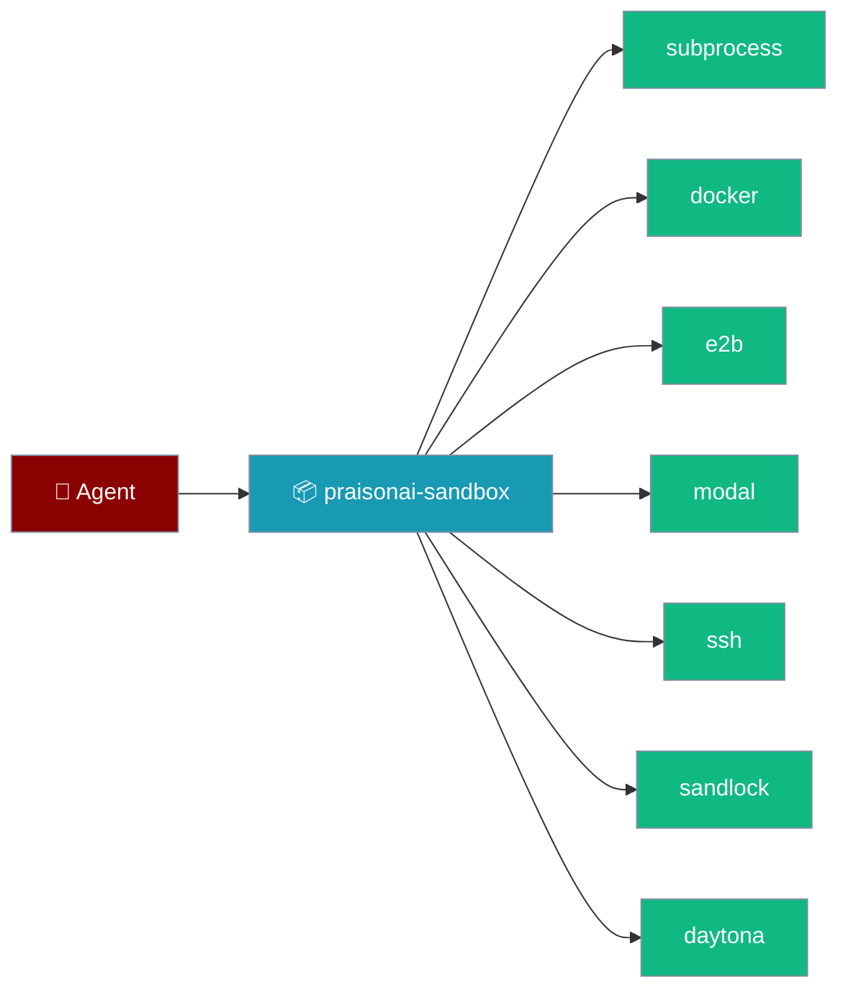
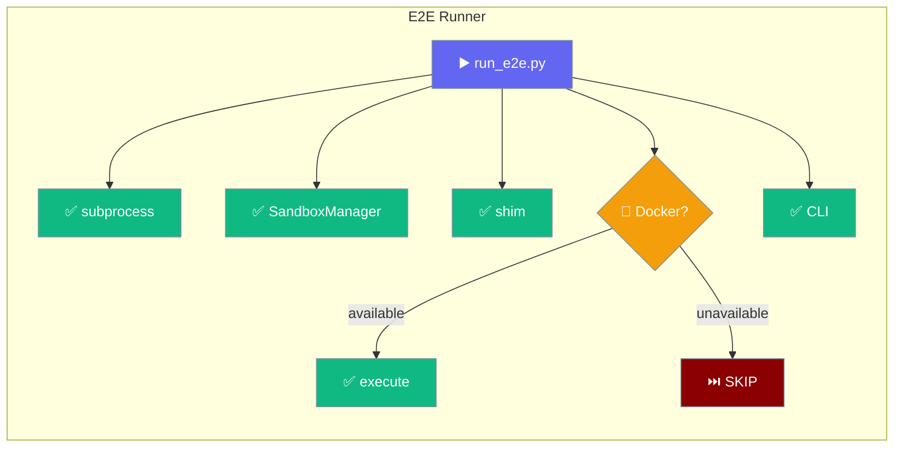

Use `praisonai-sandbox` when you only need sandboxed execution — no gateway, no CLI wrapper — or when you want the sandbox backends on a slim install. It's a standalone Tier‑2 package extracted from the `praisonai` wrapper, so agents keep the same `sandbox=True` behaviour with a much smaller dependency tree.

```python
from praisonaiagents import Agent

agent = Agent(
    name="Coder",
    instructions="Run code safely",
    sandbox=True,  # subprocess backend, no extras needed
)
agent.start("Print the current directory tree")
```

The user asks the agent to run code; the sandbox package executes it in an isolated backend and returns the result.



## Quick Start

<Steps>
<Step title="Run an agent with the default backend">

The `subprocess` backend ships in the base install — nothing else to configure:

```python
from praisonaiagents import Agent

agent = Agent(
    name="Coder",
    instructions="Run code safely",
    sandbox=True,
)
agent.start("Print the current directory tree")
```

</Step>

<Step title="Install the slim package and optional backends">

```bash
pip install praisonai-sandbox                 # slim install, subprocess backend
pip install "praisonai-sandbox[docker]"
pip install "praisonai-sandbox[e2b]"
pip install "praisonai-sandbox[modal]"
pip install "praisonai-sandbox[ssh]"
pip install "praisonai-sandbox[sandlock]"
pip install "praisonai-sandbox[daytona]"      # pulls daytona-sdk; set DAYTONA_API_KEY
pip install "praisonai-sandbox[all]"          # every backend at once
```

</Step>

<Step title="List available backends">

```bash
praisonai-sandbox backends
```

```
daytona: unavailable
docker: unavailable
e2b: unavailable
modal: unavailable
sandlock: unavailable
ssh: unavailable
subprocess: available
```

Each backend reports `available` or `unavailable` based on whether its optional dependency is installed.

</Step>
</Steps>

<Note>
The standalone `praisonai-sandbox` console script currently exposes `--help` and `backends`. To **run** code or open an interactive **shell**, use the wrapper CLI — `praisonai sandbox run` / `praisonai sandbox shell` (see [Sandbox CLI](/docs/cli/sandbox)).
</Note>

## Backends included

Every backend is selectable by name through `praisonaiagents.sandbox.SandboxManager` — the same registry the wrapper uses.

| Name | Class | Typical use |
|------|-------|-------------|
| `subprocess` | `SubprocessSandbox` | Fast local development (base install) |
| `sandlock` | `SandlockSandbox` | Hardened local sandbox (`[sandlock]`) |
| `docker` | `DockerSandbox` | Container isolation for production (`[docker]`) |
| `ssh` | `SSHSandbox` | Remote server execution (`[ssh]`) |
| `modal` | `ModalSandbox` | Modal cloud sandboxes (`[modal]`) |
| `e2b` | `E2BSandbox` | E2B cloud code interpreter (`[e2b]`) |
| `daytona` | `DaytonaSandbox` | Daytona cloud sandboxes (`[daytona]` + `DAYTONA_API_KEY`) |

<Note>
Only `subprocess` ships in the base `praisonai-sandbox` install. Every other backend — including `sandlock` — requires its matching extra. This differs from the full `praisonai` wrapper, where `subprocess` **and** `sandlock` are both built in.
</Note>

## Use the backends directly

Import a backend class straight from the package when you want the isolated runtime without an `Agent`:

```python
import asyncio
from praisonaiagents.sandbox import SandboxConfig, SandboxManager

async def main():
    manager = SandboxManager(SandboxConfig.subprocess())
    result = await manager.run_code("print('hello from the sandbox')")
    print(result.stdout)

asyncio.run(main())
```

## Platform support

`praisonai-sandbox` runs on Linux, macOS, and Windows — the subprocess backend enforces different isolation on each, and the cloud backends (Docker, E2B, Modal, Daytona, SSH) behave identically everywhere.

| Backend | Linux / macOS | Windows |
|---------|---------------|---------|
| `subprocess` | Full `setrlimit`, process-group kill, symlink escape rejection | No `setrlimit`, leader-only kill; symlink protection only when Developer Mode / `SeCreateSymbolicLinkPrivilege` is present |
| `docker` | ✅ Full container isolation | ✅ Full container isolation (Docker Desktop) |
| `e2b`, `modal`, `daytona` | ✅ Cloud isolation | ✅ Cloud isolation |
| `ssh` | ✅ Isolation is provided by the remote host | ✅ Isolation is provided by the remote host |
| `sandlock` | ✅ Landlock / seatbelt | ❌ Not available |

<Warning>
On Windows, the built-in `subprocess` backend enforces fewer platform limits than on POSIX. Use `docker` or a cloud backend when running untrusted code. See the [main sandbox page](/docs/features/sandbox#resource-limits-in-practice) for the full capability matrix and [PR #3224](https://github.com/MervinPraison/PraisonAI/pull/3224) for background.
</Warning>

## Validating your install

Run the single-command smoke suite from a repo checkout to confirm every backend you have installed is wired up correctly.



```bash
cd src/praisonai-sandbox
python e2e-validation/run_e2e.py
```

The runner prints a PASS / FAIL / SKIP table and exits `0` when every required check passes. No API keys are needed for the subprocess path; Docker is optional and is skipped gracefully when the daemon or base image is unavailable.

<Note>
The `e2e-validation/` bundle ships with the source repository, **not** the published wheel. Run these commands from a checkout of [`MervinPraison/PraisonAI`](https://github.com/MervinPraison/PraisonAI) under `src/praisonai-sandbox/`, not from a `pip install`ed environment.
</Note>

| Check | Required | Notes |
|-------|----------|-------|
| Subprocess execute | ✅ | No dependencies |
| SandboxManager subprocess | ✅ | Via `praisonaiagents.sandbox` |
| Backward-compat shim | ✅ | `praisonai.sandbox` → `praisonai_sandbox` (skipped if the `praisonai` wrapper isn't installed) |
| Docker execute | ⬜ optional | Skipped when Docker daemon/image is unavailable |
| CLI backends smoke | ✅ | `praisonai-sandbox backends` |

Set `PRAISONAI_SANDBOX_E2E_DOCKER_TIMEOUT` (seconds, default `180`) to raise the bound on the optional Docker check for slow networks:

```bash
PRAISONAI_SANDBOX_E2E_DOCKER_TIMEOUT=300 python e2e-validation/run_e2e.py
```

See [`MANUAL-E2E-GUIDE.md`](https://github.com/MervinPraison/PraisonAI/blob/main/src/praisonai-sandbox/e2e-validation/MANUAL-E2E-GUIDE.md) for step-by-step manual validation of each backend path.

## Best Practices

<AccordionGroup>
<Accordion title="Install only the backends you use">
The base package is intentionally slim. Add `[docker]`, `[e2b]`, `[modal]`, `[ssh]`, `[sandlock]`, or `[daytona]` extras individually instead of `[all]` to keep the dependency tree small.
</Accordion>

<Accordion title="Set cloud credentials before selecting cloud backends">
`daytona` needs `DAYTONA_API_KEY` (and optional `DAYTONA_API_URL`); `e2b` and `modal` need their own provider credentials. Selecting a backend without its credentials fails fast.
</Accordion>

<Accordion title="Check availability in CI">
Run `praisonai-sandbox backends` in CI to confirm the expected backend is installed before a pipeline depends on it.
</Accordion>

<Accordion title="Smoke every backend before shipping">
Run `python e2e-validation/run_e2e.py` from `src/praisonai-sandbox/` to smoke every backend you've installed. It's the fastest way to catch a broken Docker daemon or a missing extra before an agent hits it in production. See the [Validating your install](#validating-your-install) section above.
</Accordion>

<Accordion title="Prefer the wrapper CLI for run / shell">
The standalone script lists backends; the `praisonai sandbox run` / `shell` commands execute code and open REPLs with full flag support.
</Accordion>
</AccordionGroup>

## Related

<CardGroup cols={2}>
  <Card title="Sandbox Backends" icon="shield" href="/docs/features/sandbox-backends">
    All seven backends, the registry, and backend selection guide
  </Card>
  <Card title="Sandbox CLI" icon="terminal" href="/docs/cli/sandbox">
    `praisonai sandbox run`, `shell`, and `backends` commands
  </Card>
</CardGroup>
