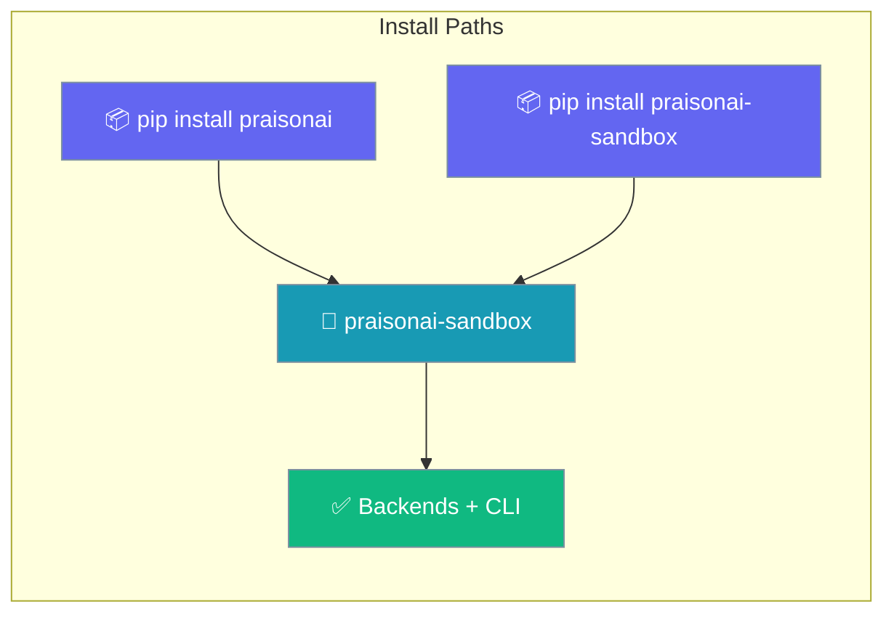
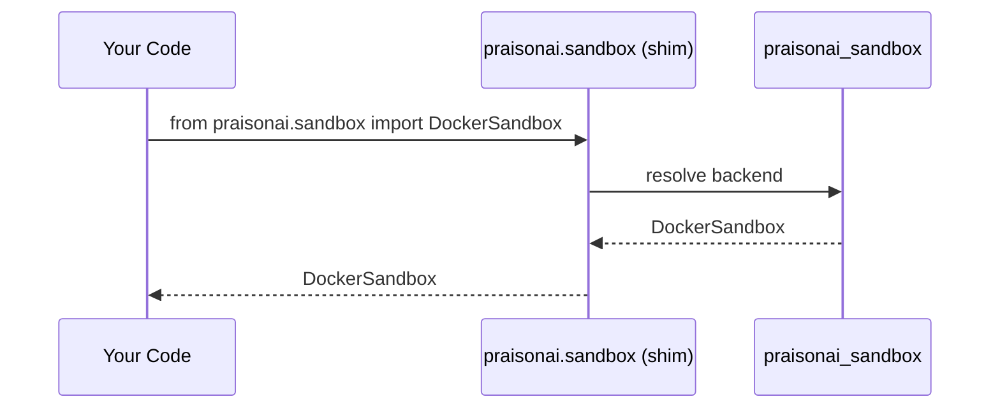

Sandbox backends ship in the standalone **`praisonai-sandbox`** package, installable on its own or pulled in transitively by `praisonai`.

```python
from praisonaiagents import Agent, SandboxConfig

agent = Agent(
    name="Coder",
    instructions="Run code in an isolated sandbox.",
    sandbox=SandboxConfig(sandbox_type="daytona"),
)
agent.start("Print the Python version")
```



## Quick Start

<Steps>
<Step title="Install standalone">

Install just the sandbox backends when you don't need the rest of the framework:

```bash
pip install praisonai-sandbox
```

Add optional backends as extras:

```bash
pip install "praisonai-sandbox[docker,e2b,daytona,modal,sandlock,ssh]"
```

</Step>

<Step title="Existing imports keep working">

A compatibility shim keeps every `praisonai.sandbox.*` import working — existing agent code does not change:

```python
from praisonai.sandbox import SubprocessSandbox  # still works via shim

sandbox = SubprocessSandbox()
```

</Step>
</Steps>

---

## How It Works

`pip install praisonai` pulls in `praisonai-sandbox` transitively, so top-level users get every backend automatically. Standalone users install only what they need, and legacy `praisonai.sandbox.*` imports resolve through a shim.



| Install command | What you get |
|-----------------|--------------|
| `pip install praisonai` | Full framework + `praisonai-sandbox` (transitive) |
| `pip install praisonai-sandbox` | Sandbox backends + `praisonai-sandbox` CLI only |
| `pip install "praisonai-sandbox[daytona]"` | Sandbox backends + Daytona cloud support |

---

## Standalone CLI

The package installs a dedicated `praisonai-sandbox` binary. List backend availability without the rest of the framework:

```bash
praisonai-sandbox backends
```

**Output:**
```
docker: unavailable
subprocess: available
sandlock: available
ssh: unavailable
modal: unavailable
daytona: unavailable
e2b: unavailable
```

Both `praisonai sandbox` and `praisonai-sandbox` share the same commands.

---

## Common Patterns

### Standalone sandbox execution

```python
from praisonaiagents.sandbox import SandboxManager, SandboxConfig

manager = SandboxManager(SandboxConfig.subprocess())
for name, info in sorted(manager.get_available_types().items()):
    print(name, "available" if info["available"] else "unavailable")
```

### Backward-compatible imports

```python
# Old path — still supported via the shim
from praisonai.sandbox import DockerSandbox

# Standalone path — same class
from praisonai_sandbox import DockerSandbox
```

---

## Best Practices

<AccordionGroup>
<Accordion title="Install only the backends you need">
Each cloud backend is an optional extra. Install just `daytona`, `e2b`, or `modal` instead of pulling in every dependency.

```bash
pip install "praisonai-sandbox[daytona]"
```
</Accordion>

<Accordion title="Keep existing imports unchanged">
The `praisonai.sandbox.*` shim means you do not need to rewrite imports after the extraction. Migrate to `praisonai_sandbox.*` only if you drop the `praisonai` wrapper entirely.
</Accordion>

<Accordion title="Probe availability before selecting a backend">
Run `praisonai-sandbox backends` (or `praisonai sandbox backends`) in CI to confirm a backend is installed before relying on it.
</Accordion>
</AccordionGroup>

---

## Related

<CardGroup cols={2}>
<Card title="Sandbox Backends" icon="shield" href="/docs/features/sandbox-backends">
  All built-in backends, install commands, and selection guide
</Card>
<Card title="Sandbox CLI" icon="terminal" href="/docs/cli/sandbox">
  praisonai sandbox run, shell, and backends commands
</Card>
</CardGroup>
