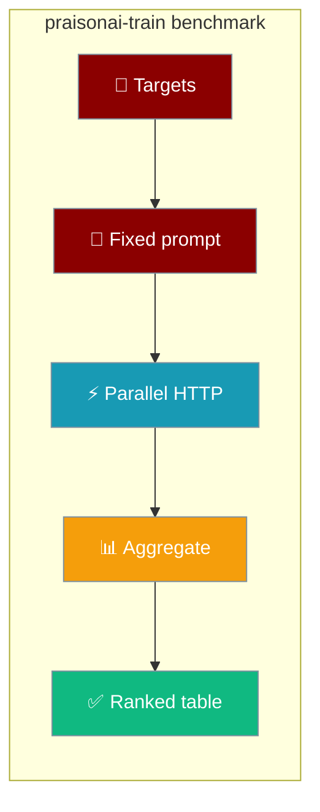
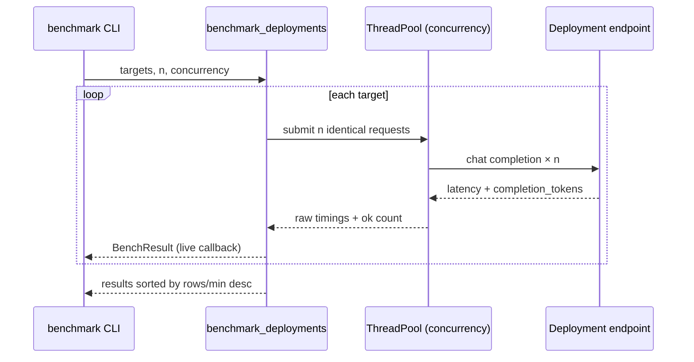
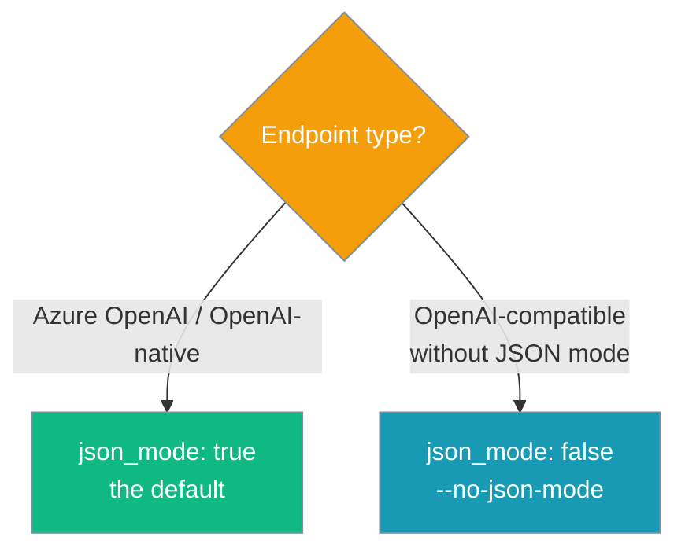

Send the same request N times to each deployment and get a ranked table — fastest first — of throughput and latency.



Compare deployments before you fine-tune — `pip install praisonai-train` is enough, no GPU or `[llm]` extras needed.

## Quick Start

<Steps>
<Step title="Benchmark two deployments">
Pass one or more `--deployment` flags. Endpoint and key are read from the `AZURE_OPENAI_*` / `OPENAI_*` environment.

```bash
pip install praisonai-train

praisonai-train benchmark -d gpt-4o -d gpt-4o-mini
```

Each target prints as it finishes, then a table ranks them by `rows/min`:

```
  measured gpt-4o: 87 rows/min, 4123 tok/s, ok=24/24
  measured gpt-4o-mini: 142 rows/min, 5210 tok/s, ok=24/24
```
</Step>

<Step title="Drive it from a YAML config">
Put the deployments and knobs in a file and point `--config` at it — the same idiom as `generate` and `validate`.

```bash
praisonai-train benchmark --config benchmark.yaml
```

```yaml
# benchmark.yaml
deployments:
  - gpt-4o
  - gpt-4o-mini
n: 24
concurrency: 8
azure: true
api_version: "2024-10-21"
output: bench_results.json
```
</Step>
</Steps>

---

## How It Works

The benchmark reuses the data generator's own HTTP path (`build_chat_request` / `resolve_cfg`), so measurements reflect a real generation workload — no duplicated request code.



| Metric | Meaning |
|--------|---------|
| `rows/min` | Throughput per wall-clock minute — the ranking key |
| `tok/s` | Completion tokens per second (counted for `ok=True` only) |
| `avg_lat` / `p50` / `p95` | Per-request latency in seconds |
| `out_tok` | Average output tokens per successful request |
| `ok` | Successful requests over total (`ok/n`) |

---

## Which `json_mode`?

`json_mode` sends a `response_format={"type":"json_object"}` hint. Turn it off for endpoints that don't support JSON mode so you measure speed, not JSON-mode support.



---

## CLI Flags

| Flag | Short | YAML key | Type | Default | Description |
|------|-------|----------|------|---------|-------------|
| `--config` | `-c` | — | path | none | YAML config file |
| `--deployment` | `-d` | `deployments` / `targets` | str (repeatable) | required | Deployment/model to benchmark |
| `--n` | `-n` | `n` | int | `24` | Requests per deployment |
| `--concurrency` | — | `concurrency` | int | `8` | In-flight requests per deployment |
| `--api-version` | — | `api_version` | str | `"2024-10-21"` | Azure OpenAI api-version |
| `--max-tokens` | — | `max_tokens` | int | `2048` | `max_completion_tokens` per request |
| `--recipe` | `-r` | `recipe` | str | `"tamil"` | Recipe supplying the default prompt |
| `--json-mode` / `--no-json-mode` | — | `json_mode` | bool | `True` | Send the JSON-mode hint; disable for endpoints without it |
| `--output` | `-o` | `output` | path | none | Write ranked results as JSON |

YAML-only keys: `endpoint`, `api_key`, `azure`, `prompt` (a `{system, user}` dict), and `request_timeout` (default `180`).

<Note>
`--deployment` is required via flag or config. `n < 1` or `concurrency < 1` raises `ValueError`, and a `prompt` dict without a non-empty `user` field also raises. If every request fails, the CLI exits `1` with `error: every request failed — check endpoint/api_key/deployment and provider availability`.
</Note>

---

## Python API

Call `benchmark_deployments` directly for notebooks, dashboards, or CI gates.

```python
from praisonai_train.data import benchmark_deployments, BenchResult

results: list[BenchResult] = benchmark_deployments(
    ["gpt-4o", "gpt-4o-mini"],
    n=24,
    concurrency=8,
    json_mode=True,
)

for r in results:  # already ranked fastest-first
    print(r.deployment, r.rows_per_min, "rows/min")
```

`BenchResult` is a dataclass — serialise any result with `.as_dict()`.

| Field | Type | Description |
|-------|------|-------------|
| `deployment` | `str` | Deployment name |
| `n` | `int` | Requests sent |
| `ok` | `int` | Successful requests |
| `wall_s` | `float` | Wall-clock seconds for the batch |
| `rows_per_min` | `float` | Throughput (ranking key) |
| `compl_tok_per_s` | `float` | Completion tokens per second |
| `avg_latency_s` | `float` | Mean per-request latency |
| `p50_s` / `p95_s` | `float` | Latency percentiles |
| `avg_out_tok` | `float` | Average output tokens per success |

---

## Common Patterns

### Benchmark across endpoints in one run

Each target may be a dict overriding `endpoint`, `api_key`, `azure`, or `api_version` — compare an Azure deployment against a self-hosted OpenAI-compatible server side by side.

```python
from praisonai_train.data import benchmark_deployments

results = benchmark_deployments(
    [
        {"deployment": "gpt-4o", "azure": True},
        {"deployment": "llama-3.1-70b", "endpoint": "https://my-host/v1", "azure": False},
    ],
    n=24,
    json_mode=False,  # the OpenAI-compatible host has no JSON mode
)
```

### Use your real prompt

Set an explicit `prompt` so the benchmark exercises the exact shape you generate with.

```python
results = benchmark_deployments(
    ["gpt-4o"],
    prompt={"system": "You generate concise answers.",
            "user": "Write one short factual paragraph about photosynthesis."},
)
```

### Stream progress with a callback

`on_result` fires as each target finishes — ideal for a live dashboard.

```python
benchmark_deployments(
    ["gpt-4o", "gpt-4o-mini"],
    on_result=lambda r: print(f"{r.deployment}: {r.rows_per_min} rows/min"),
)
```

---

## Best Practices

<AccordionGroup>
<Accordion title="Match concurrency to your provider quota">
`concurrency` is in-flight requests per deployment. Raise it to saturate a high-quota deployment; lower it to stay under a rate limit. Throughput is measured per wall-clock second, so it already reflects the concurrency you set.
</Accordion>

<Accordion title="Disable json_mode for OpenAI-compatible endpoints">
Set `--no-json-mode` (or `json_mode: false`) for servers without JSON-mode support, otherwise a rejected `response_format` shows up as failures rather than a speed number.
</Accordion>

<Accordion title="Keep n representative, not huge">
The default `n=24` is enough to stabilise p50/p95 without a large bill. Raise it only when you need tighter tail-latency numbers.
</Accordion>

<Accordion title="Write JSON output for regressions">
Pass `--output bench.json` (or `output:` in YAML) and diff runs over time to catch a deployment slowing down.
</Accordion>
</AccordionGroup>

---

## Related

<CardGroup cols={2}>
<Card title="praisonai-train" icon="graduation-cap" href="/docs/features/praisonai-train-package">
  The training package and all its subcommands.
</Card>
<Card title="Dataset Tooling" icon="database" href="/docs/features/praisonai-train-dataset-tooling">
  Generate and quality-check instruction datasets.
</Card>
<Card title="Cross-file dedup" icon="layer-group" href="/docs/features/praisonai-train-dataset-tooling#cross-file-dedup">
  Merge parallel generation batches into one deduped file before you fine-tune.
</Card>
<Card title="Train CLI" icon="terminal" href="/docs/cli/train">
  Full flag reference for every train subcommand.
</Card>
<Card title="Installation Extras" icon="puzzle-piece" href="/docs/features/installation-extras">
  The train install matrix.
</Card>
</CardGroup>
