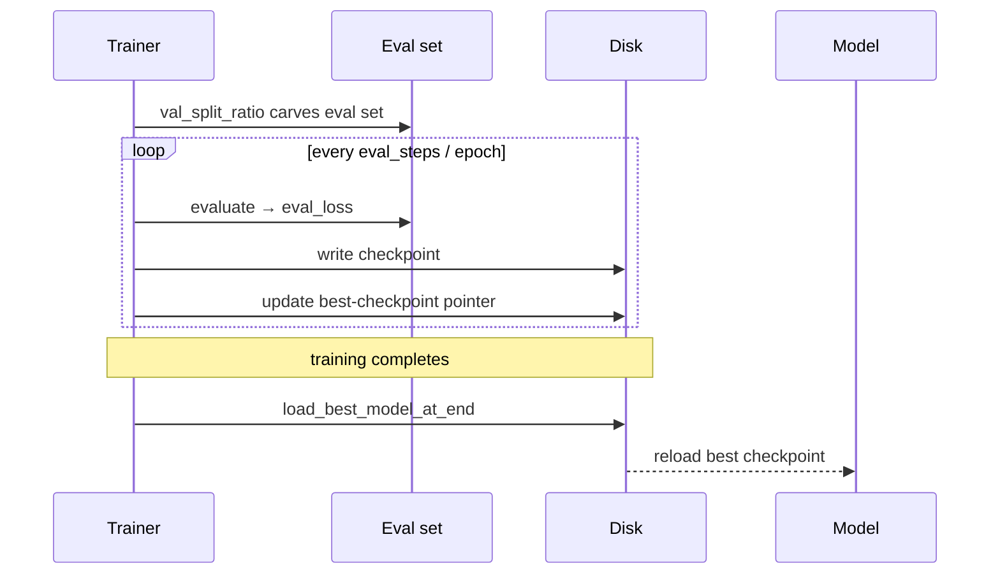

Save checkpoints during a long run so an interruption never costs you the whole training — then resume from the latest, or reload the best-scoring checkpoint at the end.


<Info>
Checkpointing is config-driven — add `save_strategy` / `save_steps` to `config.yaml`. Add `val_split_ratio` to carve an eval set and the best-checkpoint and early-stopping keys light up.
</Info>

## Quick Start

<Steps>
<Step title="Save every N steps">

Write a checkpoint on a step interval so a crash loses at most `save_steps` worth of work.

```yaml
# config.yaml
model_name: "unsloth/gemma-2-2b-it-bnb-4bit"
max_seq_length: 2048
dataset:
  - name: "yahma/alpaca-cleaned"

save_strategy: "steps"
save_steps: 50
```

</Step>
<Step title="Resume after an interruption">

Re-launch with `resume_from_checkpoint: true` — the trainer picks the latest checkpoint in `output_dir`.

```yaml
save_strategy: "steps"
save_steps: 50
resume_from_checkpoint: true
```

</Step>
<Step title="Keep only the most recent K">

Bound disk usage — keep only the N newest checkpoints.

```yaml
save_strategy: "steps"
save_steps: 50
save_total_limit: 3
```

</Step>
<Step title="Load the best model at the end">

Hold out an eval set, then reload the best-scoring checkpoint when training finishes.

```yaml
val_split_ratio: 0.05
load_best_model_at_end: true
metric_for_best_model: "eval_loss"
```

</Step>
</Steps>

---

## How It Works

`val_split_ratio` carves an eval set from the training data; the trainer evaluates on a schedule, tracks the best checkpoint, and reloads it when `load_best_model_at_end` is set.



<Note>
`load_best_model_at_end` auto-aligns `save_strategy` to `eval_strategy` (and `save_steps` to `eval_steps` under `"steps"`) — the Trainer requires them to match.
</Note>

---

## Configuration Options

### Checkpointing & Resume

| Key | Type | Default | Description |
|-----|------|---------|-------------|
| `save_strategy` | `"no" \| "steps" \| "epoch"` | `"steps"` if `save_steps` set, else `"no"` | When to write checkpoints. |
| `save_steps` | `int` | `100` | Step interval when `save_strategy: steps`. |
| `save_total_limit` | `int` | *unset* | Keep only the N most recent checkpoints. |
| `save_safetensors` | `bool` | `true` | Serialise in safetensors format (dropped with a warning if the installed TRL doesn't accept it). |
| `resume_from_checkpoint` | `bool \| str` | `false` | `true` = latest in `output_dir`; a path = that checkpoint. |
| `final_model_dir` | `str` | `"lora_model"` | Where the final adapter is saved (and where post-training inference reloads it). |

### Evaluation & Best-Checkpoint

| Key | Type | Default | Description |
|-----|------|---------|-------------|
| `val_split_ratio` | `float` | *unset* | Fraction of training data held out as eval (e.g. `0.05`). Required for `load_best_model_at_end` and `early_stopping_patience`. |
| `eval_strategy` | `"no" \| "steps" \| "epoch"` | `"steps"` if `eval_steps` set, else `"epoch"` | When to evaluate. |
| `eval_steps` | `int` | `100` | Step interval when `eval_strategy: steps`. |
| `per_device_eval_batch_size` | `int` | inherits `per_device_train_batch_size` (or `2`) | Batch size for eval. |
| `load_best_model_at_end` | `bool` | `false` | Reload the best checkpoint at end of training. Auto-aligns save/eval strategies. |
| `metric_for_best_model` | `str` | `"eval_loss"` | Metric to rank checkpoints on. |
| `greater_is_better` | `bool` | `false` | Direction of the ranking metric. |

### Early Stopping

| Key | Type | Default | Description |
|-----|------|---------|-------------|
| `early_stopping_patience` | `int` | *unset* | Stop after N evals with no improvement. **Requires `val_split_ratio`** (raises `ValueError` otherwise). Auto-enables `load_best_model_at_end`. |
| `early_stopping_threshold` | `float` | `0.0` | Minimum change to count as improvement. |

---

## Common Patterns

### Keep the best model and stop when it plateaus

Hold out 5% for eval, keep the best checkpoint, and stop early after 3 flat evals.

```yaml
val_split_ratio: 0.05
load_best_model_at_end: true
metric_for_best_model: "eval_loss"
early_stopping_patience: 3
```

```bash
praisonai-train llm config.yaml
```

### Resume a long run after a crash

Save often, keep a handful, and resume from the latest on re-launch.

```yaml
save_strategy: "steps"
save_steps: 50
save_total_limit: 5
resume_from_checkpoint: true
```

### Resume from a specific checkpoint

Point `resume_from_checkpoint` at an explicit path instead of the latest.

```yaml
resume_from_checkpoint: "outputs/checkpoint-150"
```

---

## Best Practices

<AccordionGroup>
<Accordion title="Set save_total_limit to bound disk">
Frequent checkpoints fill disk fast. `save_total_limit: 3` keeps only the newest few — enough to resume, without running out of space mid-run.
</Accordion>

<Accordion title="Use final_model_dir for a stable output path">
`final_model_dir` (default `lora_model`) is where the final adapter is written and where post-training inference reloads it. Keep it stable so `load_model` finds the adapter — this fixes the old bug where the adapter was saved and read from different directories.
</Accordion>

<Accordion title="save_strategy must match eval_strategy for load_best_model_at_end">
The Trainer requires the two to match. The trainer auto-aligns them when `load_best_model_at_end: true`, but if you set both by hand, keep `save_strategy` and `eval_strategy` (and `save_steps` / `eval_steps`) identical.
</Accordion>

<Accordion title="early_stopping_patience needs val_split_ratio">
Early stopping ranks checkpoints on the eval metric, so it requires a held-out eval set. Set `val_split_ratio` (e.g. `0.05`) — without it the trainer raises `ValueError`.
</Accordion>
</AccordionGroup>

---

## Related

<CardGroup cols={2}>
<Card title="Train" icon="graduation-cap" href="/docs/train">
  Fine-tuning overview and full config reference.
</Card>
<Card title="Multi-GPU" icon="microchip" href="/docs/features/praisonai-train-multigpu">
  Fine-tune across multiple GPUs with torchrun.
</Card>
<Card title="Train CLI" icon="terminal" href="/docs/cli/train">
  Resume and multi-GPU launch from the CLI.
</Card>
<Card title="praisonai-train Package" icon="graduation-cap" href="/docs/features/praisonai-train-package">
  Install and use training without the full wrapper.
</Card>
</CardGroup>
