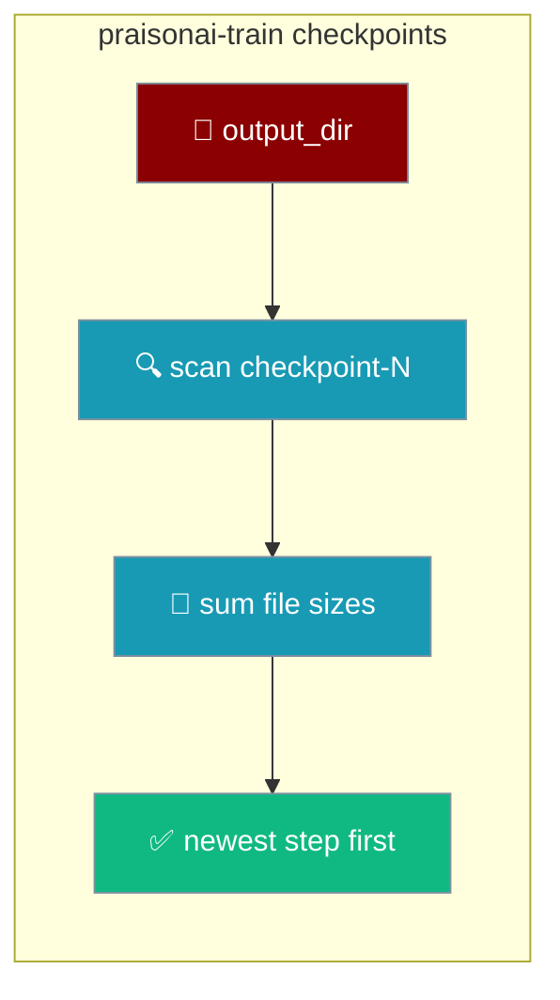
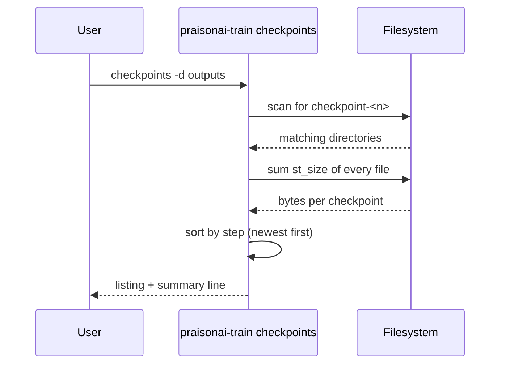

List the checkpoints a training run saved — no `ls`, no guessing the path.

```bash
praisonai-train checkpoints
praisonai-train checkpoints -d outputs --json
```



## Quick Start

<Steps>
<Step title="List the checkpoints">

Point at the run's output directory and see every saved step, newest first.

```bash
praisonai-train checkpoints -d outputs
```

```text
checkpoint-1000   4.21 GB   outputs/checkpoint-1000
checkpoint-200    4.21 GB   outputs/checkpoint-200
2 checkpoint(s); newest is step 1000.
```

</Step>

<Step title="Get JSON for scripts">

Add `--json` to emit a machine-readable array your shell can parse.

```bash
praisonai-train checkpoints -d outputs --json
```

```json
[
  {"step": 1000, "path": "outputs/checkpoint-1000", "bytes": 4521984000},
  {"step": 200, "path": "outputs/checkpoint-200", "bytes": 4521984000}
]
```

</Step>
</Steps>

---

## How It Works

The command scans `output_dir` for `checkpoint-<n>` directories, sums each one's file sizes, and sorts by step — newest first.



Only directories named `checkpoint-<n>` count — `checkpoint-final` is skipped, not read as step 0. Sorting is numeric, so `checkpoint-1000` comes before `checkpoint-200`.

---

## Configuration Options

| Option | Short | Type | Default | Description |
|--------|-------|------|---------|-------------|
| `--model-dir` | `-d` | `Path` | `outputs` | Directory the run wrote to (i.e. its `output_dir`). |
| `--json` | `-j` | `bool` | `False` | Emit a JSON array instead of the human listing. |

<Note>
An empty or missing directory exits with code `1` and prints a remediation suggesting `save_steps` in config or `--model-dir` pointing at the run's `output_dir`.
</Note>

---

## JSON Output

Each entry has three fields — the step number, the checkpoint path, and its size in bytes.

| Field | Type | Description |
|-------|------|-------------|
| `step` | `int` | The checkpoint's step number (the `<n>` in `checkpoint-<n>`). |
| `path` | `str` | Path to the checkpoint directory. |
| `bytes` | `int` | Size on disk — sum of `st_size` of every file under the checkpoint. |

```json
{"step": 1000, "path": "outputs/checkpoint-1000", "bytes": 4521984000}
```

---

## Common Patterns

### Auto-pick the newest step for export

Pipe `--json` through `jq` to grab the newest checkpoint path, then hand it to `export`.

```bash
NEWEST=$(praisonai-train checkpoints -d outputs --json | jq -r '.[0].path')
praisonai-train export ollama --model-dir "$NEWEST" --ollama me/my-model
```

The list is sorted newest-first, so `.[0]` is always the latest step.

### Confirm a run actually saved

Run it right after an interrupted job to see what survived before deciding whether to resume.

```bash
praisonai-train checkpoints -d outputs
```

---

## Best Practices

<AccordionGroup>
<Accordion title="Only checkpoint-<n> directories count">
The scan matches `checkpoint-<n>` exactly. A directory called `checkpoint-final` is ignored — it is never listed as step 0. Rename or move stray directories if you expect them in the listing.
</Accordion>

<Accordion title="Run against output_dir, not final_model_dir">
Checkpoints live under the run's `output_dir` (default `outputs`), not `final_model_dir` (default `lora_model`). Point `-d` at the same `output_dir` the run used.
</Accordion>

<Accordion title="Use save_total_limit to control disk">
Each checkpoint is the full adapter size. Set `save_total_limit` in `config.yaml` to keep only the newest few — the listing then stays short and disk stays bounded.
</Accordion>

<Accordion title="Combine --json with jq in shell scripts">
`--json` gives a stable `{step, path, bytes}` schema. Parse it with `jq` to auto-select a checkpoint instead of hardcoding a step number that changes every run.
</Accordion>
</AccordionGroup>

---

## Related

<CardGroup cols={2}>
<Card title="Checkpointing" icon="database" href="/features/praisonai-train-checkpointing">
  Config keys — `save_strategy`, `save_steps`, `save_total_limit`, `resume_from_checkpoint`.
</Card>
<Card title="Export a trained model" icon="upload" href="/features/praisonai-train-export">
  Publish a chosen checkpoint to HF, GGUF, or Ollama.
</Card>
<Card title="Infer CLI" icon="wand-magic-sparkles" href="/features/praisonai-train-infer">
  Prompt a model you just trained and watch it stream.
</Card>
<Card title="Train CLI" icon="terminal" href="/cli/train">
  Full flag reference for every subcommand.
</Card>
</CardGroup>
