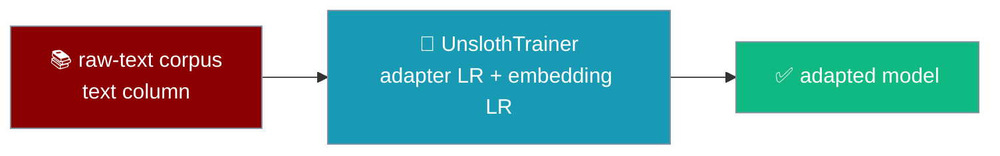
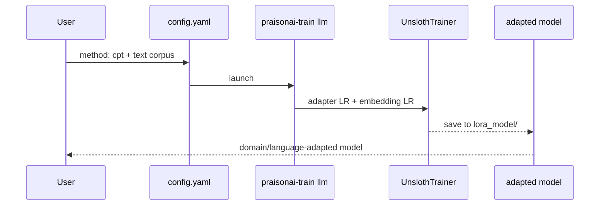
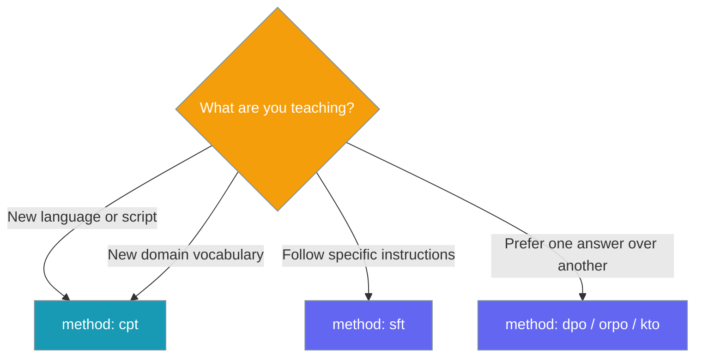

Continued pretraining teaches a base model a new domain, language, or vocabulary from a plain-text corpus by training the embeddings at their own, much lower learning rate.



<Info>
CPT is a `config.yaml` method, not a code import. Set `method: cpt`, point at a dataset with a `text` column, and make the embeddings trainable with `modules_to_save: [embed_tokens, lm_head]`.
</Info>

## Quick Start

<Steps>
<Step title="Minimal CPT run">

Set `method: cpt`, give it a raw-text dataset, and make the vocabulary trainable.

```yaml
model_name: unsloth/gemma-2-2b-it-bnb-4bit
max_seq_length: 2048
method: cpt
modules_to_save: [embed_tokens, lm_head]
dataset:
  - name: your-domain-corpus.jsonl   # rows with a "text" column
```

```bash
praisonai-train llm your-domain-corpus.jsonl --model unsloth/gemma-2-2b-it-bnb-4bit
```

</Step>

<Step title="With a custom embedding learning rate">

The embedding LR defaults to `learning_rate / 10`. Set it explicitly to override.

```yaml
model_name: unsloth/gemma-2-2b-it-bnb-4bit
max_seq_length: 2048
method: cpt
modules_to_save: [embed_tokens, lm_head]
learning_rate: 2e-4
embedding_learning_rate: 2e-5      # defaults to learning_rate / 10
dataset:
  - name: your-domain-corpus.jsonl
```

</Step>
</Steps>

---

## How It Works

CPT drives the trainer from `config.yaml` — the same `praisonai-train llm` entry point as SFT, switched to `UnslothTrainer` by `method: cpt`.



CPT is a separate method from SFT because it trains a different part of the model.

| CPT needs | Why |
|---|---|
| A lower `embedding_learning_rate` | Embeddings train at a fraction of the adapter rate. That field lives on `UnslothTrainer` / `UnslothTrainingArguments`, not `SFTTrainer`. |
| `modules_to_save: [embed_tokens, lm_head]` | Without it, no embeddings are trainable and CPT adapts no vocabulary. |
| A `text` column | CPT trains on raw text directly, not on formatted chat turns. |

---

## When to use CPT

Pick the method that matches the change you want to make.



<Tip>
CPT teaches the corpus; SFT teaches the model to follow instructions on it. For a task-ready model, run CPT first, then SFT.
</Tip>

---

## Dataset shape

CPT needs a dataset with a `text` column — each row is one plain-text example.

```json
{"text": "Continued pretraining adapts a model to a new domain."}
{"text": "Each row is one plain-text example the model reads as-is."}
```

ShareGPT (`conversations`) and Alpaca (`instruction` / `input` / `output`) still take priority when present, so a stray `text` column on those shapes is ignored. Non-string rows become `""` and are then dropped.

If every row formats to empty text, the trainer names all three shapes so you can fix the columns:

```text
All examples formatted to empty text. The dataset columns are [...]; this trainer understands ShareGPT ('conversations'), Alpaca ('instruction'/'input'/'output') and raw text ('text'). Rename your columns to one of those shapes, or set chat_template to match your data.
```

---

## Configuration

Two keys turn a run into continued pretraining; a third makes the vocabulary trainable.

| Key | Type | Default | Description |
|---|---|---|---|
| `method` | `str` | `"sft"` | Set to `"cpt"` to enable continued pretraining. |
| `embedding_learning_rate` | `float` | `learning_rate / 10` | Learning rate for `embed_tokens` and `lm_head` when they are in `modules_to_save`. |
| `modules_to_save` | `list[str]` | *unset* | Include `embed_tokens` and `lm_head` to actually move the vocab. Without this, CPT trains no embeddings and prints a NOTE. |

The copy-paste block for any CPT run:

```yaml
method: cpt
modules_to_save: [embed_tokens, lm_head]
embedding_learning_rate: 2e-5      # defaults to learning_rate / 10
```

---

## Common Patterns

**Domain adaptation** — teach a base model a specialised corpus (medical, legal) on its own tokenizer.

```yaml
model_name: unsloth/gemma-2-2b-it-bnb-4bit
max_seq_length: 2048
method: cpt
modules_to_save: [embed_tokens, lm_head]
dataset:
  - name: medical-corpus.jsonl   # rows with a "text" column
```

**Language adaptation** — teach a base model a new language (e.g. Tamil) with a tokenizer whose vocab covers the target script.

```yaml
model_name: unsloth/gemma-2-2b-it-bnb-4bit
max_seq_length: 2048
method: cpt
chat_template: gemma
modules_to_save: [embed_tokens, lm_head]
dataset:
  - name: tamil-corpus.jsonl     # rows with a "text" column
```

---

## Best Practices

<AccordionGroup>
<Accordion title="Always set modules_to_save: [embed_tokens, lm_head]">
CPT without it trains no embeddings — the run adapts no vocabulary and prints a NOTE. Include both so continued pretraining actually moves the vocab.
</Accordion>

<Accordion title="Keep embedding_learning_rate at least 10× below learning_rate">
The default (`learning_rate / 10`) is the safe recipe. Training embeddings at the full adapter LR is the known-bad case — that is exactly why `UnslothTrainer` ships an `embedding_learning_rate` field.
</Accordion>

<Accordion title="Upgrade unsloth if UnslothTrainer is unavailable">
Older `unsloth` versions leave `UnslothTrainer` / `UnslothTrainingArguments` as `None`. CPT then fails fast and tells you which package to upgrade — run `pip install -U unsloth`.
</Accordion>

<Accordion title="Follow CPT with SFT for task adaptation">
CPT teaches the model the corpus; SFT teaches it to follow instructions on it. Run CPT first, then an SFT pass on instruction data for a task-ready model.
</Accordion>
</AccordionGroup>

---

## Related

<CardGroup cols={2}>
<Card title="Train" icon="graduation-cap" href="/docs/train">
  Full fine-tuning config reference and methods.
</Card>
<Card title="CLI: train" icon="terminal" href="/cli/train">
  Run the trainer from the command line.
</Card>
<Card title="Multi-GPU Training" icon="microchip" href="/features/praisonai-train-multigpu">
  Scale a CPT run across every GPU with torchrun.
</Card>
</CardGroup>
