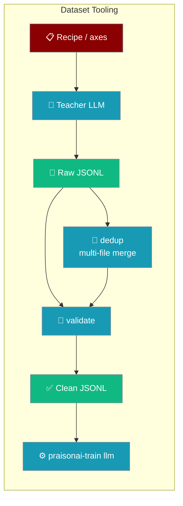
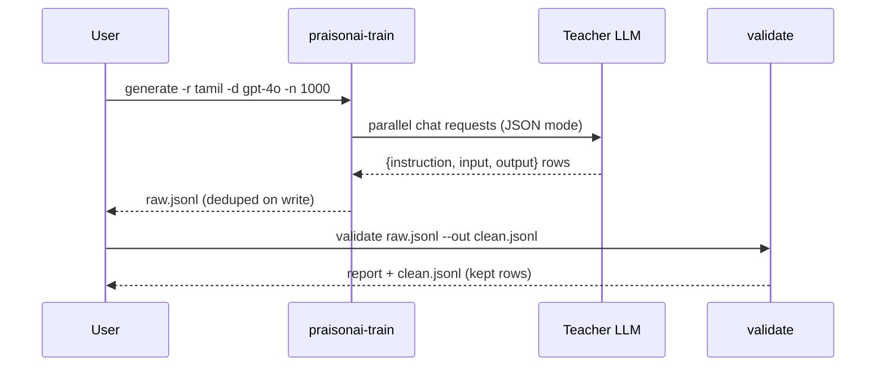
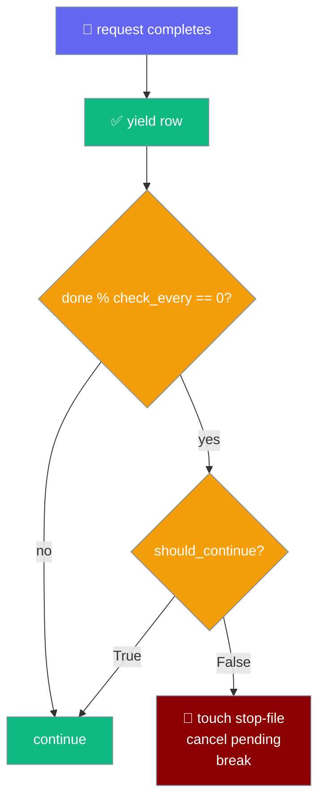
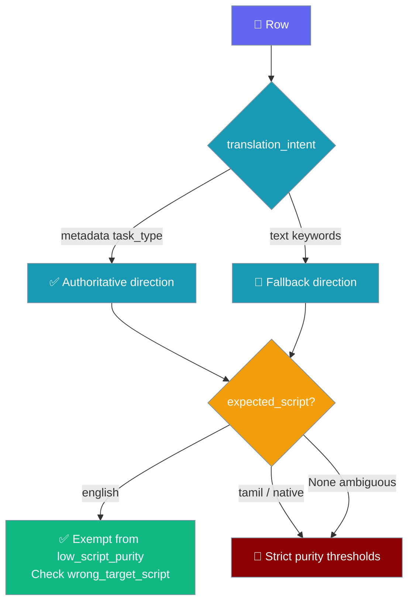
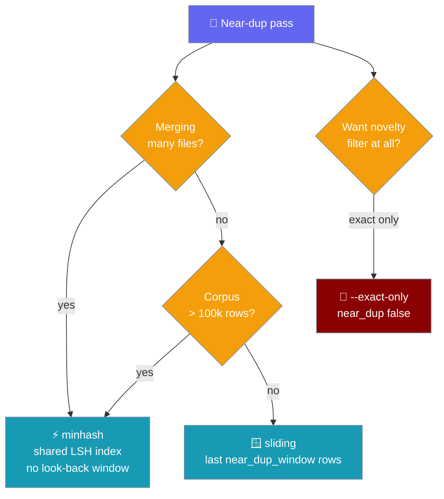

Generate an instruction dataset from a teacher LLM, merge parallel batches, then quality-check it before fine-tuning — three commands that compose into a clean training corpus.



`generate` calls an OpenAI-compatible endpoint to synthesise `{instruction, input, output}` rows from a recipe; `dedup` merges parallel batches across files with one shared index; `validate` filters them with research-backed QC checks. All three are YAML-driven, like `praisonai-train llm`.

## Quick Start

<Steps>
<Step title="Generate a dataset">

One command turns a recipe into a JSONL dataset. Set your teacher endpoint via env vars first.

```bash
pip install praisonai-train

export OPENAI_API_KEY="sk-..."          # or AZURE_OPENAI_KEY + AZURE_OPENAI_ENDPOINT
export OPENAI_BASE_URL="https://api.openai.com/v1"

praisonai-train generate -r tamil -d gpt-4o -n 1000 -o data/tamil.jsonl
```

</Step>

<Step title="Validate and filter">

Quality-check the raw dataset and write the kept rows to a clean file.

```bash
praisonai-train validate data/tamil.jsonl --out data/clean.jsonl
```

</Step>

<Step title="Fine-tune on the clean dataset">

Feed the clean JSONL straight into the trainer.

```bash
pip install "praisonai-train[llm]"

praisonai-train llm data/clean.jsonl --model unsloth/gemma-2-2b-it-bnb-4bit
```

See [praisonai-train Package](/docs/features/praisonai-train-package) for the full `llm` reference.

</Step>
</Steps>

---

## How It Works

`generate` fans a recipe's diversity axes into teacher prompts, streams unique rows to JSONL, and `validate` scores each row against pluggable QC checks.



| Stage | What happens |
|-------|--------------|
| Recipe | Crosses task × topic × style × audience × variant axes into diverse prompts |
| Teacher | Parallel OpenAI/Azure requests in JSON mode; retries once per request |
| Dedup | Normalised `instruction` hashed on write — duplicates skipped across runs |
| Validate | Drop/flag checks + dataset-level diversity metrics |

---

## `generate`

Synthesise `{instruction, input, output}` rows from a recipe, streamed to a JSONL file with dedup, snapshots, and a stop-file circuit-breaker.

### CLI flags

| Flag | Short | YAML key | Type | Required | Description |
|------|-------|----------|------|----------|-------------|
| `--config` | `-c` | — | path | no | YAML config file (all keys below can live here) |
| `--output` | `-o` | `output` | path | **yes** | JSONL file to write rows to |
| `--recipe` | `-r` | `recipe` | str or dict | no (default `tamil`) | Registered recipe name, or an inline `{name, system, template, axes}` dict |
| `--deployment` | `-d` | `deployment` | str | **yes** | Teacher model (OpenAI model id) or Azure deployment name |
| `--num` | `-n` | `num_examples` | int | **yes** | Number of examples to generate |
| `--concurrency` | — | `concurrency` | int | no (default `32`) | Parallel teacher requests |
| `--start-offset` | — | `start_offset` | int | no (default `0`) | Prompt-index offset — use disjoint values across parallel workers |
| `--snapshot-every` | — | `snapshot_every` | int | no | Copy the output to `snapshots/{stem}_{n}.jsonl` every N rows |

### YAML-only keys

These have no CLI flag — set them in the config file.

| Key | Type | Default | Description |
|-----|------|---------|-------------|
| `endpoint` | `str` | env `AZURE_OPENAI_ENDPOINT` / `OPENAI_BASE_URL` | Chat completions endpoint |
| `api_key` | `str` | env `AZURE_OPENAI_KEY` / `OPENAI_API_KEY` | Bearer / Azure api-key |
| `azure` | `bool` | auto (true if `AZURE_OPENAI_ENDPOINT` set or `openai.azure.com` in endpoint) | Force Azure vs OpenAI routing |
| `api_version` | `str` | `2024-10-21` | Azure only |
| `max_completion_tokens` | `int` | `2048` | Teacher `max_completion_tokens` |
| `request_timeout` | `int` | `120` | Per-request HTTP timeout (seconds) |
| `dedup_from` | `list` | `[]` | JSONL paths (or inline row lists) whose `instruction` values are excluded |
| `stop_file` | `path` | `~/.praisonai_train_stop` | Touch this file to halt immediately |
| `snapshot_dir` | `path` | `snapshots` | Directory for `--snapshot-every` snapshots |
| `subscription_id` | `str` | env `AZ_SUBSCRIPTION` | Azure subscription id — when set (and no `should_continue` is passed), the built-in [Azure sponsorship guard](#continuation-guard) is wired in automatically |
| `sponsor_check_rows` | `int` | `5000` | How often the continuation guard is re-checked (once every N completed requests). Coerced to a safe minimum of `1` — `0` and negative values are corrected; `None` keeps the `5000` default |

### Behaviour worth knowing

- **`output` + `num_examples` are validated up-front** — missing either exits `1` with `error: 'output' and 'num_examples' (or --num) are required`.
- **The output file is only truncated after the first row arrives** — a run that fails on credentials, recipe, or the first request never wipes an existing file, and a self-referential `dedup_from` is read before it would be emptied.
- **Dedup is on-write and cross-run** — the normaliser hashes `instruction`; rows whose normalised instruction is already seen (from `dedup_from` or earlier in the run) are silently skipped.
- **Zero unique rows exits `1`** with `error: no rows generated — check endpoint/api_key/deployment and provider JSON-mode support`.
- **Progress bar:** when `tqdm` is importable the CLI shows a live bar (`generating: 42/1000 [00:12<04:38] req kept=39`); otherwise it prints `  ...500/1000 requests (487 kept)` every 500 requests. `tqdm` stays optional — the import is guarded.
- **Per-row provenance** — each emitted row carries `model` (the teacher deployment), plus `task_type` and `topic` when the recipe stamps them (built-in `tamil` and any `_AxisRecipe` subclass do). Downstream QC and category splits key off this metadata instead of brittle text detection. Backward compatible — keys are added only when values are available (see [Per-row provenance](#per-row-provenance)).

### Example config

Mirror `setup/generate.yaml`.

```yaml
recipe: tamil
deployment: gpt-4o
azure: true
# endpoint / api_key come from AZURE_OPENAI_ENDPOINT / AZURE_OPENAI_KEY (or OPENAI_*)
num_examples: 5000
concurrency: 50
start_offset: 0
output: data/tamil.jsonl
snapshot_every: 1000
dedup_from:
  - data/existing.jsonl
# stop_file: ~/.praisonai_train_stop   # touch to halt immediately
```

```bash
praisonai-train generate --config generate.yaml
```

### Python API — `generate_dataset()`

Import and drive the generator yourself.

```python
from praisonai_train.data import generate_dataset

config = {
    "recipe": "tamil",
    "deployment": "gpt-4o",
    "num_examples": 1000,
    # endpoint / api_key read from env if omitted
}

rows = list(generate_dataset(config))
```

Full signature:

```python
def generate_dataset(
    config: dict,
    on_row: Callable[[dict], None] | None = None,
    progress_callback: Callable[[int, int, int], None] | None = None,
    should_continue: Callable[[], bool] | None = None,
) -> Iterator[dict]
```

| Parameter | Type | Default | Description |
|-----------|------|---------|-------------|
| `config` | `dict` | required | Same keys as the YAML config above |
| `on_row` | `fn(row) -> None` | `None` | Called once per **kept** row, before it's yielded |
| `progress_callback` | `fn(done, total, kept) -> None` | `None` | Fires once up-front with `(0, total, 0)` and again after each completed request. `done` = requests finished; `kept` = unique rows emitted so far |
| `should_continue` | `fn() -> bool` | `None` | Continuation guard re-checked every `sponsor_check_rows` completed requests. Returns `False` to halt the run cleanly (see [Continuation guard](#continuation-guard)). When omitted, a `subscription_id` / `AZ_SUBSCRIPTION` auto-wires the built-in Azure guard |

Returns an `Iterator[dict]` of `{"instruction", "input", "output"}` — plus `model`, `task_type`, and `topic` when available (see [Per-row provenance](#per-row-provenance)). The caller drives the run by iterating.

<Note>
`progress_callback` guarantees (verified by the SDK tests): `done` is monotonic non-decreasing, `kept` is monotonic non-decreasing, `kept <= done` always, final `done == total`, and final `kept == len(rows)`. When duplicates collapse everything, `done` still reaches `total` but `kept` plateaus. Keep the callback cheap — it runs on the hot path. `progress_callback=None` preserves the original behaviour exactly.
</Note>

### Continuation guard

Halt a run from inside the loop when a billing or quota check flips — a belt-and-suspenders companion to the external stop-file circuit-breaker.

`should_continue` is a `fn() -> bool` re-checked every `sponsor_check_rows` completed requests. When it returns `False`, the run halts via the same clean shutdown as the [stop-file](#circuit-breaker): touch the stop-file → cancel pending futures → break.

The guard is resolved in a fixed order.



| Order | Source | Result |
|-------|--------|--------|
| 1 | Explicit `should_continue` callback | Wins if supplied |
| 2 | `subscription_id` or env `AZ_SUBSCRIPTION` | Built-in Azure sponsorship guard |
| 3 | Neither | No guard — unguarded (same as before) |

Key behaviours:

- **Fail-OPEN** — `azure_sponsorship_guard` returns `True` on any transient error (az CLI missing, network blip, unparseable output). It never halts a healthy run on a flaky check. Pair it with an external watchdog for hard budget enforcement.
- **Trigger row is emitted, not dropped** — the just-completed row is yielded *before* the guard runs, so the paid, already-finished request that trips the check is never silently lost.
- **`sponsor_check_rows` coercion** — `0` (divide-by-zero) and negative (never-poll) values are corrected to `1`; `None` keeps the `5000` default.

Pass any billing or quota check as a custom callback.

```python
from praisonai_train.data import generate_dataset

def under_budget() -> bool:
    return my_billing_client.remaining_credit_usd() > 10

rows = list(generate_dataset(
    {"recipe": "tamil", "deployment": "gpt-4o", "num_examples": 100_000,
     "sponsor_check_rows": 1000},
    should_continue=under_budget,
))
```

Auto-wire the built-in Azure sponsorship guard with just a subscription id — no callback needed.

```yaml
recipe: tamil
deployment: gpt-4o
num_examples: 100000
subscription_id: 00000000-0000-0000-0000-000000000000   # or set AZ_SUBSCRIPTION
sponsor_check_rows: 5000
output: data/tamil.jsonl
```

```bash
praisonai-train generate --config generate.yaml
# The run halts automatically once the Azure subscription's quotaId flips
# away from "Sponsored_2016-01-01" (i.e. sponsorship converts to pay-as-you-go).
```

Or build the guard directly and pass it as `should_continue`.

```python
from praisonai_train.data import azure_sponsorship_guard, generate_dataset

guard = azure_sponsorship_guard("sub-123")   # default quota_id="Sponsored_2016-01-01"
rows = list(generate_dataset(config, should_continue=guard))
```

`azure_sponsorship_guard(subscription_id, quota_id="Sponsored_2016-01-01")` returns a `fn() -> bool` that is `True` while the subscription still reads as sponsored, and fail-OPEN on any error.

### Per-row provenance

Emitted rows are self-describing: the generator stamps `model` (from `deployment`) and passes `task_type` / `topic` through from the recipe when present.

| Key | Source | When it's added |
|-----|--------|-----------------|
| `model` | `deployment` | Whenever a deployment is set (always — it's required) |
| `task_type` | recipe spec | Whenever the recipe stamps it |
| `topic` | recipe spec | Whenever the recipe stamps it |

Any [axis recipe](#recipes) (`tamil`, `CustomRecipe`, or any `_AxisRecipe` subclass) stamps `task_type` and `topic` automatically, so QC and category splits key off metadata instead of brittle text detection.

```jsonc
// Recipe that doesn't stamp (still valid):
{"instruction": "...", "input": "", "output": "..."}

// Built-in tamil / any _AxisRecipe subclass:
{
  "instruction": "...",
  "input": "",
  "output": "...",
  "model": "gpt-4o",
  "task_type": "படைப்பாக்க எழுத்து",
  "topic": "தமிழ் இலக்கியம்"
}
```

Rows describe themselves — no re-detection needed.

```python
from praisonai_train.data import generate_dataset

rows = list(generate_dataset({
    "recipe": "tamil",
    "deployment": "gpt-4o",
    "num_examples": 10,
}))

for r in rows:
    print(r["model"], r["task_type"], r["topic"])
    # gpt-4o  ஒரு விளக்கம்  அறிவியல்
    # gpt-4o  படைப்பாக்க எழுத்து  தமிழ் இலக்கியம்
```

### Recipes

`tamil` is the built-in recipe — a Tamil-language instruction recipe crossing five diversity axes (task × topic × style × audience × variant), registered automatically at import.

Define one **inline** (YAML or dict) without writing Python — pass `recipe:` as a dict with `system`, `template`, and `axes` (the first two axis keys are the task × topic grid). The `template` receives `{task}`, `{topic}`, `{style}`, `{audience}`, `{variant}` at format time.

```yaml
recipe:
  name: spanish
  system: "You are a Spanish-language instruction dataset assistant. Write natural Spanish."
  template: |
    Generate a unique Spanish training example.
    Task: {task}
    Topic: {topic}
    Style: {style}
    Audience: {audience}
    Variant: {variant}
    Return only JSON: {{"instruction": "...", "input": "", "output": "..."}}
  axes:
    task: ["question-answer", "explanation", "summary", "translation"]
    topic: ["history", "science", "food", "travel"]
    style: ["simple", "detailed"]
    audience: ["students", "professionals"]
deployment: gpt-4o
num_examples: 1000
output: data/spanish.jsonl
```

Register a **custom Python recipe** to reuse it by name from the CLI.

```python
from praisonai_train.data.registry import recipes
from praisonai_train.data.recipes import _AxisRecipe

@recipes.register
class Spanish(_AxisRecipe):
    name = "spanish"
    system = "You are a Spanish-language instruction dataset assistant."
    template = (
        "Generate a unique Spanish training example. Task: {task}\n"
        "Topic: {topic}\nStyle: {style}\nAudience: {audience}\nVariant: {variant}\n"
        'Return only JSON: {{"instruction": "...", "input": "", "output": "..."}}'
    )
    axes = {
        "task": ["question-answer", "explanation", "summary"],
        "topic": ["history", "science", "food"],
        "style": ["simple", "detailed"],
        "audience": ["students", "professionals"],
    }
```

Once imported anywhere, `--recipe spanish` (or `recipe: spanish` in YAML) works from the CLI.

Any `_AxisRecipe` recipe (including `tamil` and inline `CustomRecipe`) automatically stamps `task_type` (its first axis) and `topic` (its second axis) onto every emitted row — see [Per-row provenance](#per-row-provenance). That metadata is what makes the task-aware QC checks and the `metrics.translation` by-direction breakdown reliable: they resolve direction from authoritative labels rather than brittle text detection. For the Tamil recipe, the `EN_TA_TASK` axis value becomes the stamped `task_type` on translation rows.

---

## `validate`

Quality-check an instruction dataset — dedup, boilerplate/refusal, script purity, truncation, restates-question — plus dataset-level diversity metrics. Thresholds mirror Self-Instruct / LIMA / AlpaGasus / Deita defaults.

### CLI flags

| Flag | Short | YAML key | Type | Required | Description |
|------|-------|----------|------|----------|-------------|
| `dataset` (positional) | — | `input` | path | **yes** | JSONL dataset to validate |
| `--config` | `-c` | — | path | no | YAML config for thresholds |
| `--out` | `-o` | `output` | path | no | Write filtered (kept) rows to this JSONL |
| `--no-near-dup` | — | `near_dup: false` | flag | no | Skip the O(n²) near-dup pass on very large datasets |

### YAML-only keys

| Key | Type | Default | Description |
|-----|------|---------|-------------|
| `near_dup` | `bool` | `true` | Enable near-duplicate detection |
| `near_dup_method` | `str` | `"sliding"` | Engine — `"sliding"` (bounded window) or `"minhash"` (MinHash + LSH, no bounded look-back). See [Cross-file dedup](#cross-file-dedup) |
| `near_dup_jaccard` | `float` | `0.7` | 4-gram Jaccard threshold (≈ Self-Instruct ROUGE-L 0.7) |
| `near_dup_window` | `int` | `3000` | Sliding look-back size (`≤ 0` = unbounded); sliding only |
| `minhash_perm` | `int` | `128` | MinHash signature length (minhash only; `≥ 1`) |
| `ngram_n` | `int` | `4` | Character n-gram size (minhash only; `≥ 1`) |
| `minhash_seed` | `int` | `1` | Deterministic permutation seed (minhash only) |
| `min_output_chars` | `int` | `20` | Below this, output is dropped as `too_short` |
| `script_range` | `[int, int]` | `[2944, 3071]` (Tamil block) | Unicode range that defines the target script |
| `script_drop` | `float` | `0.5` | Drop rows whose output has less than this fraction of chars in `script_range` |
| `script_flag` | `float` | `0.7` | Flag (but keep) rows between `script_drop` and this |
| `task_aware_purity` | `bool` | `true` | When `true`, exempt resolved translation-into-English rows from `low_script_purity` / `script_review`. Set `false` to restore strict purity behaviour. |
| `verify_translation_target` | `bool` | `true` | Enable the `wrong_target_script` flag (asked for English, output still in source script). Set `false` to disable that flag. |

### Checks

Drop checks remove a row; flag checks keep it but count it.

| Check | Kind | Trips when |
|-------|------|-----------|
| `exact_dup` | drop | Identical normalised instruction+input+output already seen |
| `too_short` | drop | `len(output) < min_output_chars` |
| `boilerplate_refusal` | drop | Output matches an "as an AI" / refusal pattern |
| `low_script_purity` | drop | Script ratio below `script_drop`. When `task_aware_purity` is on, a resolved translation-into-English row is exempted (its correct output *is* English). |
| `near_dup` | drop | 4-gram Jaccard above `near_dup_jaccard` |
| `script_review` | flag | Script ratio between `script_drop` and `script_flag`. When `task_aware_purity` is on, a resolved translation-into-English row is exempted (its correct output *is* English). |
| `wrong_target_script` | flag | Task asked for English output but the output is still mostly in the source script (a failed translation). Only fires when `task_aware_purity` and `verify_translation_target` are both on. Silent to a naive purity filter — net-new signal. |
| `maybe_truncated` | flag | Output doesn't end in terminal punctuation / closing fence |
| `restates_question` | flag | First sentence overlaps the instruction (Jaccard > 0.6) |

### Report

`validate` prints a text report to stdout.

```text
─── QC: data/tamil.jsonl ───
  in=500  kept=406 (81.2%)
  drops: {'exact_dup': 12, 'near_dup': 38, 'too_short': 21, 'boilerplate_refusal': 3, 'low_script_purity': 20}
  flags: {'restates_question': 47}
  metrics: {'distinct_2': 0.87, 'length_cv': 0.62, 'top_prefix_share': 0.008, 'translation': {'share': 0.12, 'by_direction': {'en_ta': 43, 'ta_en': 18, 'unknown': 0}, 'exempted': 15}}
  ✓ no diversity warnings
  wrote 406 filtered rows -> data/clean.jsonl
```

`metrics.translation.share` is the fraction of kept rows that are translation tasks; `by_direction` counts them by direction (`en_ta`, `ta_en`, `unknown`); `exempted` is the number of English-target rows the task-aware exemption actually rescued from the `low_script_purity` drop. Because both the exemption and the metric use the same detector (`translation_intent`), the numbers always reconcile.

Malformed JSONL lines are skipped with a `⚠ skipping malformed JSON on line N` warning — the run still succeeds on the remaining rows.

### Example config

Mirror `setup/validate.yaml`.

```yaml
input: data/tamil.jsonl
output: data/tamil.clean.jsonl
min_output_chars: 20
near_dup: true
near_dup_jaccard: 0.7
script_range: [2944, 3071]      # Tamil block U+0B80-U+0BFF; change per language
script_drop: 0.50
script_flag: 0.70
```

```bash
praisonai-train validate --config validate.yaml
```

### Task-aware script purity

A naive script-purity filter deletes legitimate translation outputs written in the target script — a Tamil→English row's correct output *is* English, so a Tamil-purity check would wrongly drop it.

Only a *resolved English target* exempts a row from the Tamil-purity drop. `en→ta`, ambiguous, and native rows keep the strict thresholds.



The detector resolves intent in a fixed order: ground-truth `task_type` metadata is authoritative → instruction-text keyword fallback for external rows → an ambiguous direction yields *no* exemption (the safe default). That `task_type` metadata is now stamped automatically by any [axis recipe](#recipes) (not just the Tamil recipe's `EN_TA_TASK` task), so freshly-generated corpora resolve direction from authoritative labels out of the box.

<Note>
`task_aware_purity: false` restores strict purity behaviour (English translation outputs are dropped again). `verify_translation_target: false` disables the `wrong_target_script` flag while leaving the exemption on.
</Note>

### Translation composition metric

`metrics.translation` reports `{share, by_direction, exempted}` — the corpus-level view of how much of the kept dataset is translation.

The metric uses the same `translation_intent()` detector as the per-row exemption, so the numbers can never disagree with the checks they describe.

```python
from praisonai_train.data import score

rows = [{"instruction": "...", "input": "", "output": "..."}]

result = score(rows, cfg={"near_dup": False})
share = result["metrics"]["translation"]["share"]   # 0.0–1.0
```

### Python API — `score()` / `filter_rows()`

Run the same QC from Python.

```python
from praisonai_train.data import score, filter_rows

rows = [{"instruction": "...", "input": "", "output": "..."}]

result = score(rows, cfg={"near_dup": True, "near_dup_jaccard": 0.7})
# result = {"in", "kept", "kept_n", "drops", "flags", "metrics", "warnings"}

clean_rows = filter_rows(rows, cfg={"min_output_chars": 20})   # just the kept list
```

Diversity warnings fire when `distinct_2 < 0.5`, `length_cv < 0.4`, or `top_prefix_share > 0.01` — the "healthy dataset" bar.

`translation_intent()` is the shared detector behind both task-aware purity and the translation metric — call it directly to inspect a single row's intent.

```python
from praisonai_train.data import translation_intent

intent = translation_intent(
    "Translate the following into English: வணக்கம்",
    task_type=None,  # or the recipe's stamped label
)
# intent == {"is_translation": True, "direction": "ta_en", "expected_script": "english"}
```

| Key | Type | Values |
|-----|------|--------|
| `is_translation` | `bool` | `True` if the row is a translation task |
| `direction` | `str \| None` | `"en_ta"`, `"ta_en"`, `"unknown"`, or `None` |
| `expected_script` | `str \| None` | `"tamil"`, `"english"`, or `None` (unresolved → no exemption) |

### Custom row checks

Register a `RowCheck` to add a QC rule — no core change.

```python
from praisonai_train.data.registry import checks

@checks.register
class NoUrls:
    name = "no_urls"
    kind = "drop"   # or "flag"

    def triggered(self, instruction, input, output, cfg):
        return "http://" in output or "https://" in output
```

Once imported, it participates in the next `score()` / `validate` run automatically.

---

## Cross-file dedup

Merge many JSONL batch files into one deduped file with a single shared MinHash+LSH index — the cross-file duplicates that per-file `validate` (whose dedup state resets each call) always misses.

You generated N batches in parallel with disjoint `--start-offset` values. `cat`-ing them and re-running `validate` still leaves near-duplicates across files. `dedup` catches them because one index spans every file.

```bash
praisonai-train dedup batch_*.jsonl --out merged.jsonl
```

### CLI flags

| Flag | Short | YAML key | Type | Required | Description |
|------|-------|----------|------|----------|-------------|
| `inputs` (positional, N ≥ 1) | — | `inputs` (list) or `input` (single) | paths | **yes** (via CLI or YAML) | JSONL files to dedup across |
| `--config` | `-c` | — | path | no | YAML config file |
| `--out` | `-o` | `output` | path | **yes** | JSONL destination for the merged, deduped rows |
| `--method` | — | `near_dup_method` | `minhash` or `sliding` | no (default `minhash`) | Near-dup engine — `dedup` defaults to `minhash` because a shared index is the whole point |
| `--threshold` | — | `near_dup_jaccard` | float 0–1 | no (default `0.7`) | Jaccard threshold |
| `--exact-only` | — | `near_dup: false` | flag | no | Skip near-dup, keep exact-dedup only |

### YAML-only keys

| Key | Type | Default | Description |
|-----|------|---------|-------------|
| `inputs` | `list` | — | JSONL paths to dedup across (or use `input` for a single path) |
| `minhash_perm` | `int` | `128` | MinHash signature length (`≥ 1`) |
| `ngram_n` | `int` | `4` | Character n-gram size (`≥ 1`) |
| `minhash_seed` | `int` | `1` | Deterministic permutation seed |

### Behaviour worth knowing

- **Atomic write** — the command writes to a sibling temp file and does `os.replace()` on success, so an `--out` that aliases an input is never truncated before its rows are read, and a malformed line never leaves a partial file.
- **Exact-dup key** = sha1 of the normalised `instruction + input + output`, removed first; near-dup runs on the survivors.
- **Missing path** raises `FileNotFoundError: dedup source not found: PATH` — a clear error, not a cryptic `AttributeError`.
- **Report** prints at the end:
  ```text
  ─── cross-file dedup: 3 file(s) ───
    in=15000  kept=12873  removed=2127 (14.2% dup)
    wrote 12873 unique rows -> merged.jsonl
  ```

### Which engine to pick

`dedup` defaults to `minhash`; `validate`/`score` default to `sliding`. Pick by scale and intent.



### Example config

```yaml
inputs:
  - data/batch_a.jsonl
  - data/batch_b.jsonl
  - data/batch_c.jsonl
output: data/merged.jsonl
near_dup_method: minhash   # default for dedup; set to 'sliding' for classic window semantics
near_dup_jaccard: 0.7
near_dup: true             # set false for exact-only
minhash_perm: 128
ngram_n: 4
minhash_seed: 1
```

```bash
praisonai-train dedup --config dedup.yaml
```

### Python API — `global_dedup()`

Deduplicate rows across many JSONL paths or in-memory row lists with one shared exact + LSH index — streaming unique rows in source order.

```python
from praisonai_train.data import global_dedup

merged = list(global_dedup(
    ["data/batch_a.jsonl", "data/batch_b.jsonl", "data/batch_c.jsonl"],
    cfg={"near_dup_jaccard": 0.7},
))
print(f"{len(merged)} unique rows")
```

Full signature:

```python
def global_dedup(
    sources: Iterable,       # JSONL paths (str) or in-memory row lists — mix freely
    cfg: dict | None = None,
) -> Iterator[dict]
```

| Parameter | Type | Default | Description |
|-----------|------|---------|-------------|
| `sources` | `Iterable[str \| list[dict]]` | required | JSONL file paths **or** in-memory row lists — mix freely |
| `cfg` | `dict \| None` | `None` | Same config keys as `near_dedup`; `near_dup_method` defaults to `"minhash"` here |

Missing paths raise `FileNotFoundError: dedup source not found: PATH`.

### Python API — `near_dedup()` and `MinHashLSH`

Drop near-duplicate rows by instruction over either engine — this is what `validate`'s near-dup pass now delegates to.

```python
from praisonai_train.data import near_dedup

rows = [{"instruction": "...", "input": "", "output": "..."}]

kept, dropped = near_dedup(rows, cfg={"near_dup_method": "minhash"})
```

Full signature:

```python
def near_dedup(
    rows: Iterable[dict],
    cfg: dict | None = None,
    index: "MinHashLSH | None" = None,
) -> tuple[list[dict], int]
```

| Parameter | Type | Default | Description |
|-----------|------|---------|-------------|
| `rows` | `Iterable[dict]` | required | Rows to dedup |
| `cfg` | `dict \| None` | `None` → all defaults | Config keys — `near_dup_method`, `near_dup_jaccard`, `near_dup_window`, `minhash_perm`, `ngram_n`, `minhash_seed` |
| `index` | `MinHashLSH \| None` | `None` → build fresh | Reuse a shared LSH across successive batches (minhash only) |

Reuse the same index to dedup across a stream of batches — the whole corpus becomes the look-back.

```python
from praisonai_train.data import near_dedup, MinHashLSH

shared = MinHashLSH(threshold=0.7, num_perm=128, seed=1)
cfg = {"near_dup_method": "minhash"}

for batch in stream_of_batches():
    kept, dropped = near_dedup(batch, cfg, index=shared)
    save(kept)
    print(f"batch: kept={len(kept)} dropped={dropped}  index size={len(shared)}")
```

`MinHashLSH(threshold=0.7, num_perm=128, n=4, seed=1)` is the pure-stdlib index behind both (no `datasketch` / `numpy`).

| Method | Signature | Returns |
|--------|-----------|---------|
| `add_if_new(text)` | `str -> bool` | `True` (and indexes it) if `text` is new; `False` if it's a near-dup |
| `is_near_dup(text)` | `str -> bool` | `True` if `text` is a near-dup of anything indexed (does **not** insert) |
| `query(text)` | `str -> tuple[signature, set[int]]` | Signature + candidate keys sharing ≥ 1 band |
| `__len__()` | — | Rows currently indexed |

<Note>
`near_dup_method` defaults to `"sliding"` in `score`/`validate` but `"minhash"` in `global_dedup`/`dedup`. Existing `validate` configs are unchanged unless you opt in. An unknown method raises `ValueError("unknown near_dup_method 'X'; use 'sliding' or 'minhash'")`.
</Note>

---

## Common Patterns

### Disjoint parallel workers

Split a large run across two shells with disjoint `--start-offset` values, then dedup on both output files.

```bash
# Shell A
praisonai-train generate -r tamil -d gpt-4o -n 5000 --start-offset 0 -o data/a.jsonl

# Shell B (offset past A's slice so prompts never overlap)
praisonai-train generate -r tamil -d gpt-4o -n 5000 --start-offset 5000 -o data/b.jsonl
```

```yaml
# each worker's config can dedup against the other's output
dedup_from:
  - data/a.jsonl
  - data/b.jsonl
```

### Merge parallel batches

Two shells generate disjoint slices, then one `dedup` command merges and cross-dedups them before `validate`.

```bash
# Two shells generate disjoint slices…
praisonai-train generate -r tamil -d gpt-4o -n 5000 --start-offset 0 -o data/a.jsonl
praisonai-train generate -r tamil -d gpt-4o -n 5000 --start-offset 5000 -o data/b.jsonl
# …then one command merges + dedups them.
praisonai-train dedup data/a.jsonl data/b.jsonl --out data/merged.jsonl
praisonai-train validate data/merged.jsonl --out data/clean.jsonl
```

### Live progress in a notebook

Pass a `progress_callback` to drive a UI in Jupyter or Streamlit.

```python
from praisonai_train.data import generate_dataset

def on_progress(done, total, kept):
    print(f"\r{done}/{total} requests, {kept} kept", end="")

rows = list(generate_dataset(
    {"recipe": "tamil", "deployment": "gpt-4o", "num_examples": 1000},
    progress_callback=on_progress,
))
```

### Circuit-breaker

Halt a rogue run without losing kept rows — queued requests cancel, in-flight ones drain. Two routes trip the same clean shutdown:

- **External / manual** — touch the stop-file from another shell.
- **In-loop / automatic** — a `should_continue` guard (or an auto-wired Azure subscription id) halts the run when a billing or quota check flips, without you touching anything. See [Continuation guard](#continuation-guard).

```bash
touch ~/.praisonai_train_stop
```

```python
from praisonai_train.data import generate_dataset

rows = list(generate_dataset(
    {"recipe": "tamil", "deployment": "gpt-4o", "num_examples": 100_000,
     "subscription_id": "00000000-0000-0000-0000-000000000000"},
))
# Halts automatically once the Azure sponsorship converts to pay-as-you-go.
```

### Custom recipe for another language

Point `recipe:` at an inline dict — no Python needed. See the Spanish example under [Recipes](#recipes).

### Audit a translation corpus

Read `metrics.translation` before fine-tuning to verify how much of the corpus is translation and in which direction.

```python
from praisonai_train.data import score

result = score(rows, cfg={"near_dup": False})
t = result["metrics"]["translation"]

print(f"translation share: {t['share']:.0%}")
print(f"by direction: {t['by_direction']}")   # {'en_ta': ..., 'ta_en': ..., 'unknown': ...}
print(f"english outputs rescued: {t['exempted']}")
```

---

## Best Practices

<AccordionGroup>
<Accordion title="Use dedup_from across re-runs so cost never doubles">
List prior output files under `dedup_from`. Their normalised instructions load into the `seen` set before the run starts, so a re-run only pays for genuinely new rows.
</Accordion>

<Accordion title="Set snapshot_every on multi-hour runs">
`--snapshot-every 1000` copies the output to `snapshots/{stem}_{n}.jsonl` every N rows. A crash then costs at most N rows, not the whole run.
</Accordion>

<Accordion title="Use near_dup_method: minhash on 100k+ datasets">
The default sliding pass is O(n·`near_dup_window`) and structurally blind to near-dups more than `near_dup_window` rows apart. The MinHash + LSH engine has no bounded look-back window and scales sub-linearly. `--no-near-dup` is still available for exact-dedup-only runs.
</Accordion>

<Accordion title="Merge parallel batches with dedup, not manual concatenation">
Running `praisonai-train generate` with disjoint `--start-offset` values still produces near-duplicates across files. `praisonai-train dedup batch_*.jsonl --out merged.jsonl` removes both exact and near cross-file dups with a shared MinHash+LSH index; `cat`-ing the files then re-running `validate` cannot (its dedup state is rebuilt per call).
</Accordion>

<Accordion title="Keep progress_callback cheap">
The callback runs on the hot path after every completed request. Throttle any printing or UI updates inside it so it never becomes the bottleneck.
</Accordion>

<Accordion title="Match script_range to your language">
The defaults target the Tamil block (`[2944, 3071]`). Set `script_range` to your language's Unicode block so `low_script_purity` and `script_review` measure the right script.
</Accordion>

<Accordion title="Prefer task_type metadata over text detection">
Any `_AxisRecipe` recipe now stamps `task_type` automatically — not just Tamil translation rows — so the detector resolves direction from authoritative metadata instead of the instruction-text fallback. When you build a recipe outside the axis base class, stamp `task_type` yourself to keep this signal.
</Accordion>

<Accordion title="Set sponsor_check_rows low enough to catch sponsorship flips fast">
The default is `5000`. On a fast teacher endpoint that can still be many minutes and dollars of overrun before the guard fires. Match the interval to your acceptable overrun — lower for expensive endpoints.
</Accordion>

<Accordion title="Treat the guard as belt-and-suspenders, not the hard billing stop">
`azure_sponsorship_guard` fails OPEN on transient errors (missing az CLI, network blip), so it never halts a healthy run on a flaky check — but that also means it can miss a real flip during an outage. Run an external watchdog too for hard budget enforcement.
</Accordion>

<Accordion title="Split datasets by task_type / topic instead of re-detecting">
Every axis-recipe row is stamped with `task_type` and `topic`, so downstream evaluation and category splits can group by these metadata fields directly — no text-heuristic classifier needed.
</Accordion>

<Accordion title="Keep verify_translation_target on for translation datasets">
It surfaces `wrong_target_script` — failed translations whose output is still in the source script. A naive purity filter keeps these silently because the wrong-script output still passes a same-script purity check.
</Accordion>
</AccordionGroup>

---

## Related

<CardGroup cols={2}>
<Card title="praisonai-train Package" icon="graduation-cap" href="/docs/features/praisonai-train-package">
  The standalone training package and its subcommands.
</Card>
<Card title="Train CLI" icon="terminal" href="/docs/cli/train">
  Full flag reference for every train subcommand.
</Card>
<Card title="Multi-GPU Training" icon="microchip" href="/docs/features/praisonai-train-multigpu">
  Fine-tune the clean dataset across multiple GPUs.
</Card>
<Card title="Checkpointing" icon="database" href="/docs/features/praisonai-train-checkpointing">
  Save, resume, and keep the best checkpoint.
</Card>
<Card title="Speed Benchmark" icon="gauge" href="/docs/features/praisonai-train-benchmark">
  Rank deployments by generation speed — it reuses the same HTTP path as `generate`.
</Card>
</CardGroup>
