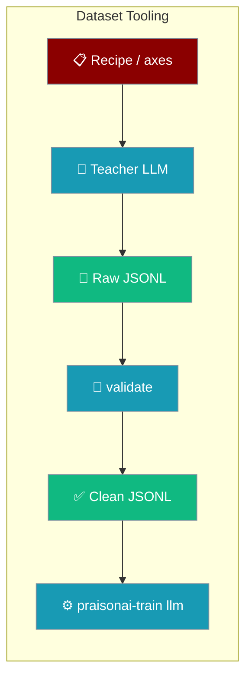
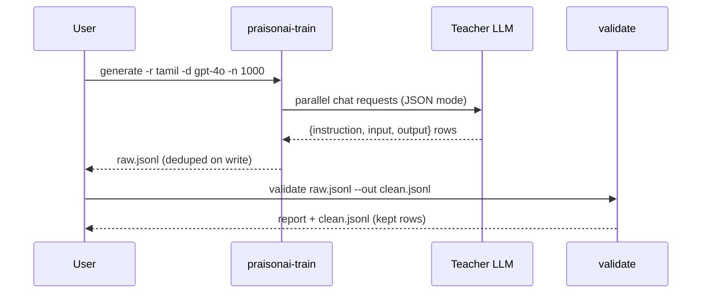

Generate an instruction dataset from a teacher LLM, then quality-check it before fine-tuning — two commands that compose into a clean training corpus.



`generate` calls an OpenAI-compatible endpoint to synthesise `{instruction, input, output}` rows from a recipe; `validate` filters them with research-backed QC checks. Both are YAML-driven, like `praisonai-train llm`.

## Quick Start

<Steps>
<Step title="Generate a dataset">

One command turns a recipe into a JSONL dataset. Set your teacher endpoint via env vars first.

```bash
pip install praisonai-train

export OPENAI_API_KEY="sk-..."          # or AZURE_OPENAI_KEY + AZURE_OPENAI_ENDPOINT
export OPENAI_BASE_URL="https://api.openai.com/v1"

praisonai-train generate -r tamil -d gpt-4o -n 1000 -o data/tamil.jsonl
```

</Step>

<Step title="Validate and filter">

Quality-check the raw dataset and write the kept rows to a clean file.

```bash
praisonai-train validate data/tamil.jsonl --out data/clean.jsonl
```

</Step>

<Step title="Fine-tune on the clean dataset">

Feed the clean JSONL straight into the trainer.

```bash
pip install "praisonai-train[llm]"

praisonai-train llm data/clean.jsonl --model unsloth/gemma-2-2b-it-bnb-4bit
```

See [praisonai-train Package](/docs/features/praisonai-train-package) for the full `llm` reference.

</Step>
</Steps>

---

## How It Works

`generate` fans a recipe's diversity axes into teacher prompts, streams unique rows to JSONL, and `validate` scores each row against pluggable QC checks.



| Stage | What happens |
|-------|--------------|
| Recipe | Crosses task × topic × style × audience × variant axes into diverse prompts |
| Teacher | Parallel OpenAI/Azure requests in JSON mode; retries once per request |
| Dedup | Normalised `instruction` hashed on write — duplicates skipped across runs |
| Validate | Drop/flag checks + dataset-level diversity metrics |

---

## `generate`

Synthesise `{instruction, input, output}` rows from a recipe, streamed to a JSONL file with dedup, snapshots, and a stop-file circuit-breaker.

### CLI flags

| Flag | Short | YAML key | Type | Required | Description |
|------|-------|----------|------|----------|-------------|
| `--config` | `-c` | — | path | no | YAML config file (all keys below can live here) |
| `--output` | `-o` | `output` | path | **yes** | JSONL file to write rows to |
| `--recipe` | `-r` | `recipe` | str or dict | no (default `tamil`) | Registered recipe name, or an inline `{name, system, template, axes}` dict |
| `--deployment` | `-d` | `deployment` | str | **yes** | Teacher model (OpenAI model id) or Azure deployment name |
| `--num` | `-n` | `num_examples` | int | **yes** | Number of examples to generate |
| `--concurrency` | — | `concurrency` | int | no (default `32`) | Parallel teacher requests |
| `--start-offset` | — | `start_offset` | int | no (default `0`) | Prompt-index offset — use disjoint values across parallel workers |
| `--snapshot-every` | — | `snapshot_every` | int | no | Copy the output to `snapshots/{stem}_{n}.jsonl` every N rows |

### YAML-only keys

These have no CLI flag — set them in the config file.

| Key | Type | Default | Description |
|-----|------|---------|-------------|
| `endpoint` | `str` | env `AZURE_OPENAI_ENDPOINT` / `OPENAI_BASE_URL` | Chat completions endpoint |
| `api_key` | `str` | env `AZURE_OPENAI_KEY` / `OPENAI_API_KEY` | Bearer / Azure api-key |
| `azure` | `bool` | auto (true if `AZURE_OPENAI_ENDPOINT` set or `openai.azure.com` in endpoint) | Force Azure vs OpenAI routing |
| `api_version` | `str` | `2024-10-21` | Azure only |
| `max_completion_tokens` | `int` | `2048` | Teacher `max_completion_tokens` |
| `request_timeout` | `int` | `120` | Per-request HTTP timeout (seconds) |
| `dedup_from` | `list` | `[]` | JSONL paths (or inline row lists) whose `instruction` values are excluded |
| `stop_file` | `path` | `~/.praisonai_train_stop` | Touch this file to halt immediately |
| `snapshot_dir` | `path` | `snapshots` | Directory for `--snapshot-every` snapshots |

### Behaviour worth knowing

- **`output` + `num_examples` are validated up-front** — missing either exits `1` with `error: 'output' and 'num_examples' (or --num) are required`.
- **The output file is only truncated after the first row arrives** — a run that fails on credentials, recipe, or the first request never wipes an existing file, and a self-referential `dedup_from` is read before it would be emptied.
- **Dedup is on-write and cross-run** — the normaliser hashes `instruction`; rows whose normalised instruction is already seen (from `dedup_from` or earlier in the run) are silently skipped.
- **Zero unique rows exits `1`** with `error: no rows generated — check endpoint/api_key/deployment and provider JSON-mode support`.
- **Progress bar:** when `tqdm` is importable the CLI shows a live bar (`generating: 42/1000 [00:12<04:38] req kept=39`); otherwise it prints `  ...500/1000 requests (487 kept)` every 500 requests. `tqdm` stays optional — the import is guarded.

### Example config

Mirror `setup/generate.yaml`.

```yaml
recipe: tamil
deployment: gpt-4o
azure: true
# endpoint / api_key come from AZURE_OPENAI_ENDPOINT / AZURE_OPENAI_KEY (or OPENAI_*)
num_examples: 5000
concurrency: 50
start_offset: 0
output: data/tamil.jsonl
snapshot_every: 1000
dedup_from:
  - data/existing.jsonl
# stop_file: ~/.praisonai_train_stop   # touch to halt immediately
```

```bash
praisonai-train generate --config generate.yaml
```

### Python API — `generate_dataset()`

Import and drive the generator yourself.

```python
from praisonai_train.data import generate_dataset

config = {
    "recipe": "tamil",
    "deployment": "gpt-4o",
    "num_examples": 1000,
    # endpoint / api_key read from env if omitted
}

rows = list(generate_dataset(config))
```

Full signature:

```python
def generate_dataset(
    config: dict,
    on_row: Callable[[dict], None] | None = None,
    progress_callback: Callable[[int, int, int], None] | None = None,
) -> Iterator[dict]
```

| Parameter | Type | Default | Description |
|-----------|------|---------|-------------|
| `config` | `dict` | required | Same keys as the YAML config above |
| `on_row` | `fn(row) -> None` | `None` | Called once per **kept** row, before it's yielded |
| `progress_callback` | `fn(done, total, kept) -> None` | `None` | Fires once up-front with `(0, total, 0)` and again after each completed request. `done` = requests finished; `kept` = unique rows emitted so far |

Returns an `Iterator[dict]` of `{"instruction", "input", "output"}` — the caller drives the run by iterating.

<Note>
`progress_callback` guarantees (verified by the SDK tests): `done` is monotonic non-decreasing, `kept` is monotonic non-decreasing, `kept <= done` always, final `done == total`, and final `kept == len(rows)`. When duplicates collapse everything, `done` still reaches `total` but `kept` plateaus. Keep the callback cheap — it runs on the hot path. `progress_callback=None` preserves the original behaviour exactly.
</Note>

### Recipes

`tamil` is the built-in recipe — a Tamil-language instruction recipe crossing five diversity axes (task × topic × style × audience × variant), registered automatically at import.

Define one **inline** (YAML or dict) without writing Python — pass `recipe:` as a dict with `system`, `template`, and `axes` (the first two axis keys are the task × topic grid). The `template` receives `{task}`, `{topic}`, `{style}`, `{audience}`, `{variant}` at format time.

```yaml
recipe:
  name: spanish
  system: "You are a Spanish-language instruction dataset assistant. Write natural Spanish."
  template: |
    Generate a unique Spanish training example.
    Task: {task}
    Topic: {topic}
    Style: {style}
    Audience: {audience}
    Variant: {variant}
    Return only JSON: {{"instruction": "...", "input": "", "output": "..."}}
  axes:
    task: ["question-answer", "explanation", "summary", "translation"]
    topic: ["history", "science", "food", "travel"]
    style: ["simple", "detailed"]
    audience: ["students", "professionals"]
deployment: gpt-4o
num_examples: 1000
output: data/spanish.jsonl
```

Register a **custom Python recipe** to reuse it by name from the CLI.

```python
from praisonai_train.data.registry import recipes
from praisonai_train.data.recipes import _AxisRecipe

@recipes.register
class Spanish(_AxisRecipe):
    name = "spanish"
    system = "You are a Spanish-language instruction dataset assistant."
    template = (
        "Generate a unique Spanish training example. Task: {task}\n"
        "Topic: {topic}\nStyle: {style}\nAudience: {audience}\nVariant: {variant}\n"
        'Return only JSON: {{"instruction": "...", "input": "", "output": "..."}}'
    )
    axes = {
        "task": ["question-answer", "explanation", "summary"],
        "topic": ["history", "science", "food"],
        "style": ["simple", "detailed"],
        "audience": ["students", "professionals"],
    }
```

Once imported anywhere, `--recipe spanish` (or `recipe: spanish` in YAML) works from the CLI.

---

## `validate`

Quality-check an instruction dataset — dedup, boilerplate/refusal, script purity, truncation, restates-question — plus dataset-level diversity metrics. Thresholds mirror Self-Instruct / LIMA / AlpaGasus / Deita defaults.

### CLI flags

| Flag | Short | YAML key | Type | Required | Description |
|------|-------|----------|------|----------|-------------|
| `dataset` (positional) | — | `input` | path | **yes** | JSONL dataset to validate |
| `--config` | `-c` | — | path | no | YAML config for thresholds |
| `--out` | `-o` | `output` | path | no | Write filtered (kept) rows to this JSONL |
| `--no-near-dup` | — | `near_dup: false` | flag | no | Skip the O(n²) near-dup pass on very large datasets |

### YAML-only keys

| Key | Type | Default | Description |
|-----|------|---------|-------------|
| `near_dup` | `bool` | `true` | Enable near-duplicate detection |
| `near_dup_jaccard` | `float` | `0.7` | 4-gram Jaccard threshold (≈ Self-Instruct ROUGE-L 0.7) |
| `min_output_chars` | `int` | `20` | Below this, output is dropped as `too_short` |
| `script_range` | `[int, int]` | `[2944, 3071]` (Tamil block) | Unicode range that defines the target script |
| `script_drop` | `float` | `0.5` | Drop rows whose output has less than this fraction of chars in `script_range` |
| `script_flag` | `float` | `0.7` | Flag (but keep) rows between `script_drop` and this |

### Checks

Drop checks remove a row; flag checks keep it but count it.

| Check | Kind | Trips when |
|-------|------|-----------|
| `exact_dup` | drop | Identical normalised instruction+input+output already seen |
| `too_short` | drop | `len(output) < min_output_chars` |
| `boilerplate_refusal` | drop | Output matches an "as an AI" / refusal pattern |
| `low_script_purity` | drop | Script ratio below `script_drop` |
| `near_dup` | drop | 4-gram Jaccard above `near_dup_jaccard` |
| `script_review` | flag | Script ratio between `script_drop` and `script_flag` |
| `maybe_truncated` | flag | Output doesn't end in terminal punctuation / closing fence |
| `restates_question` | flag | First sentence overlaps the instruction (Jaccard > 0.6) |

### Report

`validate` prints a text report to stdout.

```text
─── QC: data/tamil.jsonl ───
  in=500  kept=406 (81.2%)
  drops: {'exact_dup': 12, 'near_dup': 38, 'too_short': 21, 'boilerplate_refusal': 3, 'low_script_purity': 20}
  flags: {'restates_question': 47}
  metrics: {'distinct_2': 0.87, 'length_cv': 0.62, 'top_prefix_share': 0.008}
  ✓ no diversity warnings
  wrote 406 filtered rows -> data/clean.jsonl
```

Malformed JSONL lines are skipped with a `⚠ skipping malformed JSON on line N` warning — the run still succeeds on the remaining rows.

### Example config

Mirror `setup/validate.yaml`.

```yaml
input: data/tamil.jsonl
output: data/tamil.clean.jsonl
min_output_chars: 20
near_dup: true
near_dup_jaccard: 0.7
script_range: [2944, 3071]      # Tamil block U+0B80-U+0BFF; change per language
script_drop: 0.50
script_flag: 0.70
```

```bash
praisonai-train validate --config validate.yaml
```

### Python API — `score()` / `filter_rows()`

Run the same QC from Python.

```python
from praisonai_train.data import score, filter_rows

rows = [{"instruction": "...", "input": "", "output": "..."}]

result = score(rows, cfg={"near_dup": True, "near_dup_jaccard": 0.7})
# result = {"in", "kept", "kept_n", "drops", "flags", "metrics", "warnings"}

clean_rows = filter_rows(rows, cfg={"min_output_chars": 20})   # just the kept list
```

Diversity warnings fire when `distinct_2 < 0.5`, `length_cv < 0.4`, or `top_prefix_share > 0.01` — the "healthy dataset" bar.

### Custom row checks

Register a `RowCheck` to add a QC rule — no core change.

```python
from praisonai_train.data.registry import checks

@checks.register
class NoUrls:
    name = "no_urls"
    kind = "drop"   # or "flag"

    def triggered(self, instruction, input, output, cfg):
        return "http://" in output or "https://" in output
```

Once imported, it participates in the next `score()` / `validate` run automatically.

---

## Common Patterns

### Disjoint parallel workers

Split a large run across two shells with disjoint `--start-offset` values, then dedup on both output files.

```bash
# Shell A
praisonai-train generate -r tamil -d gpt-4o -n 5000 --start-offset 0 -o data/a.jsonl

# Shell B (offset past A's slice so prompts never overlap)
praisonai-train generate -r tamil -d gpt-4o -n 5000 --start-offset 5000 -o data/b.jsonl
```

```yaml
# each worker's config can dedup against the other's output
dedup_from:
  - data/a.jsonl
  - data/b.jsonl
```

### Live progress in a notebook

Pass a `progress_callback` to drive a UI in Jupyter or Streamlit.

```python
from praisonai_train.data import generate_dataset

def on_progress(done, total, kept):
    print(f"\r{done}/{total} requests, {kept} kept", end="")

rows = list(generate_dataset(
    {"recipe": "tamil", "deployment": "gpt-4o", "num_examples": 1000},
    progress_callback=on_progress,
))
```

### Circuit-breaker

Halt a rogue run without losing kept rows — queued requests cancel, in-flight ones drain.

```bash
touch ~/.praisonai_train_stop
```

### Custom recipe for another language

Point `recipe:` at an inline dict — no Python needed. See the Spanish example under [Recipes](#recipes).

---

## Best Practices

<AccordionGroup>
<Accordion title="Use dedup_from across re-runs so cost never doubles">
List prior output files under `dedup_from`. Their normalised instructions load into the `seen` set before the run starts, so a re-run only pays for genuinely new rows.
</Accordion>

<Accordion title="Set snapshot_every on multi-hour runs">
`--snapshot-every 1000` copies the output to `snapshots/{stem}_{n}.jsonl` every N rows. A crash then costs at most N rows, not the whole run.
</Accordion>

<Accordion title="Use --no-near-dup on 100k+ datasets">
The pairwise 4-gram Jaccard pass is O(n²). On very large datasets, skip it with `--no-near-dup` (or `near_dup: false`) and rely on the exact-dup + on-write dedup instead.
</Accordion>

<Accordion title="Keep progress_callback cheap">
The callback runs on the hot path after every completed request. Throttle any printing or UI updates inside it so it never becomes the bottleneck.
</Accordion>

<Accordion title="Match script_range to your language">
The defaults target the Tamil block (`[2944, 3071]`). Set `script_range` to your language's Unicode block so `low_script_purity` and `script_review` measure the right script.
</Accordion>
</AccordionGroup>

---

## Related

<CardGroup cols={2}>
<Card title="praisonai-train Package" icon="graduation-cap" href="/docs/features/praisonai-train-package">
  The standalone training package and its subcommands.
</Card>
<Card title="Train CLI" icon="terminal" href="/docs/cli/train">
  Full flag reference for every train subcommand.
</Card>
<Card title="Multi-GPU Training" icon="microchip" href="/docs/features/praisonai-train-multigpu">
  Fine-tune the clean dataset across multiple GPUs.
</Card>
<Card title="Checkpointing" icon="database" href="/docs/features/praisonai-train-checkpointing">
  Save, resume, and keep the best checkpoint.
</Card>
</CardGroup>
