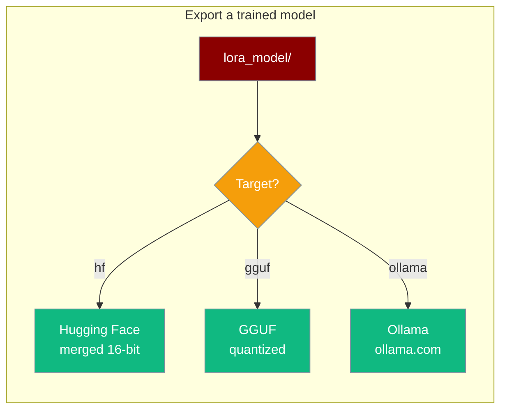
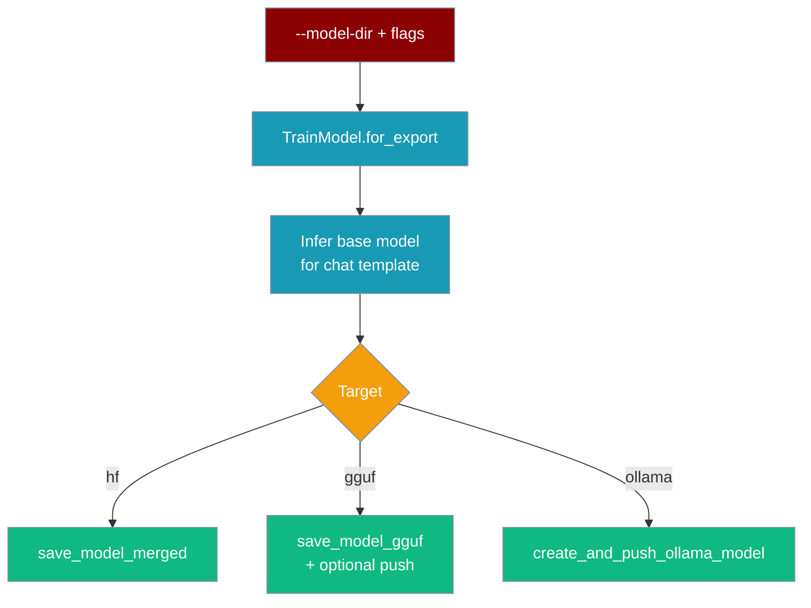

Publish a model you already trained to Hugging Face, GGUF, or Ollama — no re-training, one command.



<Tip>
**Discover the model-dir first.** List the checkpoints a run saved, pick a step, then point `--model-dir` at it — no `ls` needed.

```bash
praisonai-train checkpoints -d outputs --json | jq -r '.[0].path'
praisonai-train export ollama --model-dir outputs/checkpoint-1000 --ollama me/my-model
```

See [List Checkpoints](/features/praisonai-train-checkpoints).
</Tip>

## Quick Start

You already have a trained model in `lora_model/`. Pick a target and publish.

<Steps>
<Step title="Publish to Hugging Face">
Merge and push FP16 weights to a Hub repo.

```bash
praisonai-train export hf --model-dir lora_model --hf me/my-model
```
</Step>

<Step title="Publish a GGUF build">
Write a local `.gguf` — add `--hf` to also push it to the Hub.

```bash
# Local .gguf only
praisonai-train export gguf --model-dir lora_model --quant q4_k_m

# Local .gguf + push to the Hub
praisonai-train export gguf --model-dir lora_model --hf me/my-model --quant q4_k_m
```
</Step>

<Step title="Publish to Ollama">
Create and push a quantized model to `ollama.com`.

```bash
praisonai-train export ollama --model-dir lora_model --ollama me/my-model --quant q4_k_m
```

<Note>
**Ollama export ≤ PR #4239 shipped an indented `TEMPLATE`.** The Modelfile embedded four leading spaces on every continuation line, so the served prompt format tokenised differently from training and degraded fine-tune quality. Re-export any Ollama model built before this fix — the export itself takes seconds and does not re-train. Fixed in [PraisonAI PR #4239](https://github.com/MervinPraison/PraisonAI/pull/4239).
</Note>
</Step>
</Steps>

---

## When to use this

You already trained a model (e.g. `lora_model/` exists) and don't want to spend an hour re-running training just to publish it to a different target, fix a `chat_template`, or try a different quantization. `export` loads the trained weights once and publishes them.

---

## How It Works



Export skips the training-only preflight, so it runs on CPU — there's nothing to fine-tune. The base model name drives chat-template selection so the exported model isn't garbled.

---

## CLI flags

| Flag | Short | Purpose | Default |
|---|---|---|---|
| `TARGET` (positional) | — | `ollama` \| `gguf` \| `hf` | required |
| `--model-dir` | `-d` | Directory of the already-trained model | required |
| `--config` | `-c` | Optional `config.yaml` for extra export knobs | — |
| `--ollama` | — | Ollama model name, e.g. `me/my-model` | — |
| `--hf` | — | Hugging Face repo id, e.g. `me/my-model` | — |
| `--quant` | — | Quantization method for gguf/ollama, e.g. `q4_k_m` | — |
| `--base-model` | — | Base model id (for chat-template selection) | inferred |
| `--mtp-draft` | — | Also fetch the stock MTP drafter (Gemma-4 only) for fast inference | `false` |

<Note>
`gguf` always writes a **local** `.gguf` (so you can serve it). Add `--hf me/my-model` to additionally push it to the Hub. Without `--hf`, the GGUF is written under `<model-dir>/gguf`.
</Note>

---

## How the base model is inferred

The base model name selects the chat template, so the exported model formats prompts correctly. Resolution order:

1. `--base-model` if passed.
2. else `model_name` in `--config`.
3. else `_name_or_path` from `<model-dir>/config.json`.
4. else the model-dir name itself.

---

## Prerequisites

<AccordionGroup>
<Accordion title="Hugging Face export">
`HF_TOKEN` env var **or** a cached `huggingface-cli login`. The token must have **write** scope and the repo must be under your own username.

```bash
export HF_TOKEN=hf_...
# or
huggingface-cli login
```
</Accordion>

<Accordion title="Ollama export">
- `ollama` CLI installed (from https://ollama.com).
- Your signing key registered at https://ollama.com/settings/keys — public key lives at `~/.ollama/id_ed25519.pub`.
- Enough free space on `$OLLAMA_MODELS` (defaults to `~/.ollama/models`).
</Accordion>

<Accordion title="No GPU needed">
CUDA is **not** required for export-only. CPU is fine because there is nothing to fine-tune.
</Accordion>
</AccordionGroup>

---

## Valid `--quant` values

Any of these quantization methods (from `VALID_QUANTIZATION_METHODS`):

```
q2_k  q3_k_m  q4_0  q4_1  q4_k_m  q5_0  q5_1  q5_k_m  q6_k  q8_0  f16  bf16
```

<Tip>
A typo like `q4km` fails fast with the full list of valid choices — no long run wasted.
</Tip>

---

## Failure modes → clean errors

Every known failure prints a single actionable message instead of a raw traceback.

| You'll see | What happened | Fix |
|---|---|---|
| `Hugging Face rejected the token (401)...` | HF token invalid/expired | `huggingface-cli login` or `export HF_TOKEN=hf_...` with a **write** token |
| `No write access to '<repo>' (403)...` | Repo not under your username, or token lacks write scope | Set `--hf me/my-model` (your username); regenerate a write token |
| `Ollama rejected the push (unauthorized)...` (your public key printed inline) | Ollama signing key not registered | Add the printed `~/.ollama/id_ed25519.pub` key at https://ollama.com/settings/keys |
| `Not enough disk for the Ollama model: X GB free on '...', need ~Y GB` | `$OLLAMA_MODELS` volume too small | `export OLLAMA_MODELS=/big/disk/ollama-models` |
| `ollama serve did not become ready in 15 seconds. ollama serve output: ...` | Daemon failed to start (port busy, bad `OLLAMA_HOST`) | Inspect the stderr shown in the message |
| `quantization_method 'q4km' is not valid. Choose one of: ...` | Typo in `--quant` | Pick a value from the list above |

<Note>
The readiness probe honours `OLLAMA_HOST` and confirms `GET /api/version` — a healthy remote or non-default daemon is used instead of being ignored.
</Note>

---

## Python API

Script exports with the `TrainModel.for_export()` classmethod — it builds an export-only trainer (no dataset required) and validates the quantization up front.

```python
from praisonai_train.train.llm.trainer import TrainModel

trainer = TrainModel.for_export({
    "final_model_dir": "lora_model",
    "model_name": "unsloth/gemma-2-2b-it-bnb-4bit",
    "hf_model_name": "me/my-model",
    "quantization_method": "q4_k_m",
})
model, tokenizer = trainer.load_model()
trainer.model, trainer.hf_tokenizer = model, tokenizer

trainer.save_model_merged()      # Hugging Face merged 16-bit
# trainer.save_model_gguf()      # local GGUF
# trainer.push_model_gguf()      # push GGUF to the Hub
# trainer.create_and_push_ollama_model()  # Ollama
```

---

## Best Practices

<AccordionGroup>
<Accordion title="Namespace repos to your own username">
Set `--hf me/my-model` (not a bare name). A namespaced repo id is treated as a Hub target, never a local directory to delete.
</Accordion>

<Accordion title="Quantize at export time">
Pass `--quant q4_k_m` so the model is packed small. Ollama exports run `ollama create --quantize`, avoiding a huge FP16 intermediate.
</Accordion>

<Accordion title="Set the base model when in doubt">
If the exported model's output looks garbled, pass `--base-model` explicitly (e.g. `unsloth/gemma-2-2b-it-bnb-4bit`) so the right chat template is used.
</Accordion>
</AccordionGroup>

---

## Related

<CardGroup cols={2}>
<Card title="Checkpoints CLI" icon="list-check" href="/features/praisonai-train-checkpoints">
List what a run saved, then export the step you pick.
</Card>
<Card title="Infer CLI" icon="wand-magic-sparkles" href="/features/praisonai-train-infer">
Prompt a model you just trained and watch it stream.
</Card>
<Card title="Train" icon="graduation-cap" href="/train">
Full fine-tuning flow and config.yaml reference.
</Card>
<Card title="Train CLI" icon="terminal" href="/cli/train">
Every `praisonai train` subcommand, including `export`.
</Card>
<Card title="praisonai-train Package" icon="box" href="/features/praisonai-train-package">
Install matrix for the standalone trainer.
</Card>
<Card title="Multi-GPU Training" icon="server" href="/features/praisonai-train-multigpu">
Fine-tune across every GPU with torchrun.
</Card>
</CardGroup>
