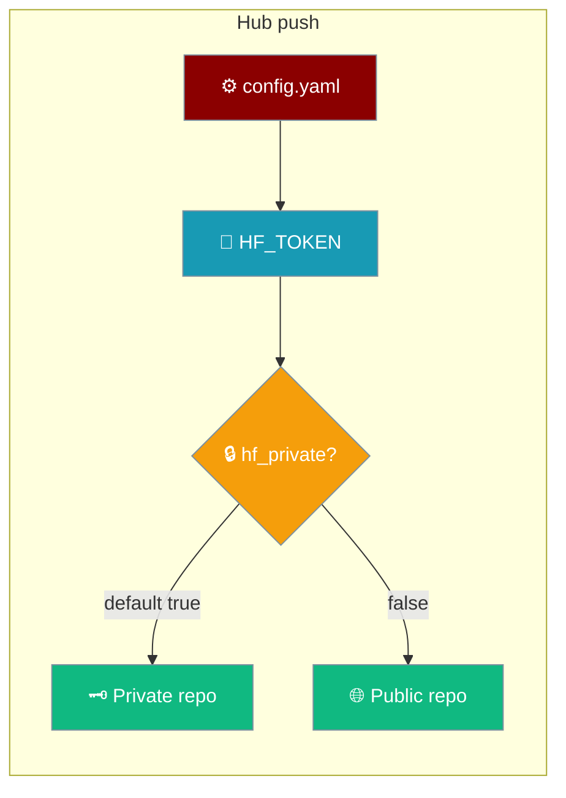

Every Hub push from `praisonai-train` is private by default. Set `hf_private: false` in `config.yaml` to publish.

<Warning>
Prior to PraisonAI [PR #4357](https://github.com/MervinPraison/PraisonAI/pull/4357), every training run that set `huggingface_save: true` uploaded to a **public** repo, silently — LLM, vision, and standalone upload paths alike. From this release the default is **private**. If you were relying on the old behaviour, add `hf_private: false` to your config.
</Warning>



## Quick Start

Publish to a public repo — opt out of the private default with one key.

```yaml
# config.yaml
model_name: unsloth/gemma-2-2b-it-bnb-4bit
hf_model_name: me/my-model         # namespaced, always
huggingface_save: true             # push after training
hf_private: false                  # opt-in to publish publicly
commit_message: "v0.1 from praisonai-train"
tags: ["praisonai", "gemma-2"]
```

```bash
praisonai train
```

Omit `hf_private` entirely and the repo is created **private** — the safe default.

## Config keys

Every key that shapes a Hub push, read from `_hub.py::hub_push_kwargs` and the trainer's `KNOWN_KEYS`.

| Key | Type | Default | Description |
|-----|------|---------|-------------|
| `hf_private` | bool | `true` | Push as a private repo. Accepts the YAML string `"false"` / `"0"` / `"no"` as opt-out. |
| `save_method` | string | `"merged_16bit"` | Passed to Unsloth's `push_to_hub_merged`. Previously hardcoded to `merged_16bit` at every push site. |
| `commit_message` | string | — | Optional commit message on the Hub. Only sent when set. |
| `tags` | list[string] | — | Optional tags on the Hub repo. Only sent when set. |
| `hf_model_name` | string | required | Hub repo id (e.g. `me/my-model`) — see the safety note below. |

<Note>
`commit_message` and `tags` are only forwarded to the Hub when you set them — leave them out and nothing extra is sent.
</Note>

## Authentication

A write-scoped token, from an env var **or** a cached login — either works.

```bash
export HF_TOKEN=hf_...
# or
huggingface-cli login
```

The token must have **write** scope, and the repo must be under your own username or an org you can write to.

## Error translation

A rejected push turns into a one-line fix, not a stack trace — now shared by all three push sites (LLM, vision, and `upload-vision`) via `_hub.py::raise_hf_push_error`.

| Status | Message keyword | What to do |
|--------|-----------------|-----------|
| 401 | "rejected the credentials" | Run `huggingface-cli login`, or `export HF_TOKEN=…` with write scope |
| 403 | "refused write access" | Repo must be under your username / an org you can write to; token needs write scope |
| other | "upload to '&lt;repo&gt;' failed" | Raw upstream error preserved after the actionable prefix |

## Safety note on `hf_model_name`

Always use the namespaced form `me/model`, never a bare name.

`praisonai-train` deletes a **local** stale output directory of that name before an upload (`_hub.py::clean_local_repo_dir`), but a namespaced repo id like `me/model` is **never** treated as a path to delete — even if `./me/model` exists locally. A bare name with no `/` **is** treated as a local directory and removed.

<Warning>
Setting `hf_model_name` to a bare directory name (no `/`) makes `praisonai-train` treat it as a **local** path and delete it before an export. Always prefer the namespaced form (`me/model`) so no local directory of that name can be wiped. This was a real defect in `upload_vision.py` before PR #4357.
</Warning>

## Best Practices

<AccordionGroup>
<Accordion title="Leave hf_private unset for private repos">
The default is private. Only add `hf_private: false` when you deliberately want a public repo — and double-check the dataset was public too.
</Accordion>

<Accordion title="Always namespace hf_model_name">
Use `me/model`, never a bare `model`. A namespaced id is a Hub target and is never deleted as a local path.
</Accordion>

<Accordion title="Set a write token once">
Run `huggingface-cli login` (cached tokens count) or `export HF_TOKEN=hf_...` with write scope before the run — [preflight](/features/praisonai-train#preflight-validation) fails fast if it's missing.
</Accordion>

<Accordion title="Add commit_message and tags for traceability">
`commit_message` and `tags` are only sent when set — use them to label each upload on the Hub.
</Accordion>
</AccordionGroup>

## Related

<CardGroup cols={2}>
<Card title="Export a trained model" icon="upload" href="/features/praisonai-train-export">
Publish an already-trained model to HF, GGUF, or Ollama without re-training.
</Card>
<Card title="Train" icon="graduation-cap" href="/train">
Full fine-tuning flow and config.yaml reference.
</Card>
<Card title="Preference Tuning" icon="scale-balanced" href="/features/praisonai-train-preference-tuning">
Fine-tune with DPO, ORPO, or KTO preference pairs.
</Card>
</CardGroup>
