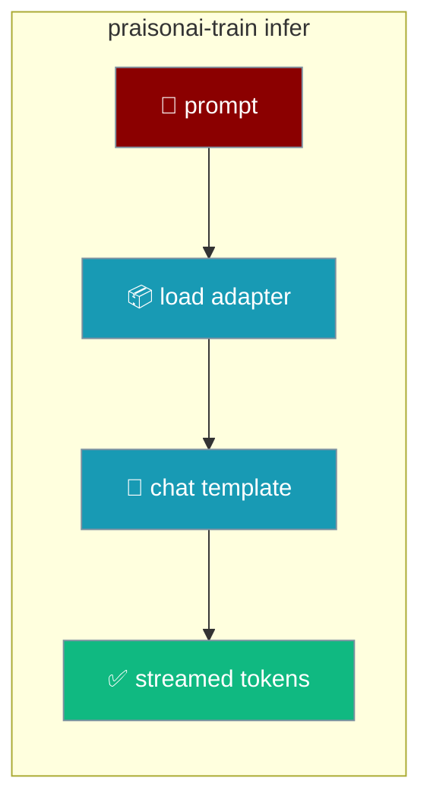
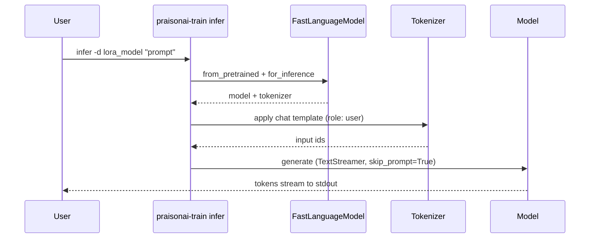
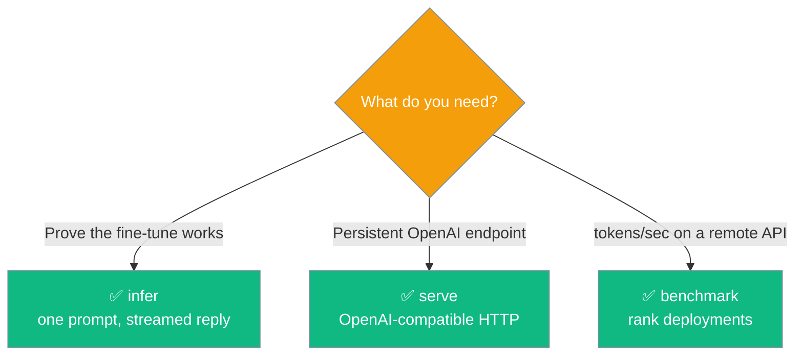

Prompt a model you just trained and watch it stream a reply — the fastest way to answer "did it work?".

```bash
praisonai-train infer -d lora_model "Summarise this release."
```



<Note>
The command is named `infer`, **not** `generate` — `generate` is dataset generation and reusing it would displace that command.
</Note>

## Quick Start

<Steps>
<Step title="Prompt the trained model">

Point at a trained adapter and pass a prompt — the reply streams token-by-token.

```bash
praisonai-train infer -d lora_model "Summarise this release."
```

</Step>

<Step title="Tune the output length and sampling">

Bump `--max-new-tokens` for longer replies; lower `--temperature` for more focused output.

```bash
praisonai-train infer -d lora_model "Write release notes." \
    --max-new-tokens 512 --temperature 0.3
```

</Step>
</Steps>

---

## How It Works

`infer` loads the trained model with Unsloth, applies the tokenizer's chat template with a `user` role, and streams the generation straight to stdout.



The model is loaded via Unsloth's `FastLanguageModel.from_pretrained` + `for_inference`, and generation streams through `TextStreamer(tokenizer, skip_prompt=True)`.

---

## Configuration Options

| Option | Short | Type | Default | Description |
|--------|-------|------|---------|-------------|
| `prompt` (positional) | — | `str` | *required* | What to send the model. |
| `--model-dir` | `-d` | `Path` (must exist) | `lora_model` | Path to a trained adapter or model. |
| `--max-new-tokens` | — | `int` | `256` | Maximum new tokens to generate. |
| `--temperature` | — | `float` | `0.7` | Sampling temperature. |
| `--max-seq-length` | — | `int` | `2048` | Context length used when loading the model. |
| `--load-in-4bit` / `--no-load-in-4bit` | — | `bool` | `True` | Load the model in 4-bit quantisation. |

<Note>
If the Unsloth / Transformers stack isn't installed, `infer` prints an error with the remediation `pip install "praisonai-train[llm]"` and exits `1`.
</Note>

---

## Streaming

The prompt is skipped (`skip_prompt=True`), so only the model's reply prints — the first token is your "is it alive?" signal, arriving long before the last on a large model.

---

## Choosing between infer, serve, benchmark

Three commands touch a trained model — pick by what you're trying to answer.



`infer` runs a single local generation; `serve` stands up an OpenAI-compatible endpoint; `benchmark` measures throughput on already-deployed remote APIs.

---

## Best Practices

<AccordionGroup>
<Accordion title="Install the [llm] extra first">
`infer` needs the Unsloth / Transformers stack. Run `pip install "praisonai-train[llm]"` — otherwise the command exits `1` with that exact remediation.
</Accordion>

<Accordion title="Keep the defaults for a sanity check">
`temperature=0.7` and `max-new-tokens=256` are deliberately usable defaults. Leave them for a first "did my fine-tune take?" check and only bump `--max-new-tokens` when you need longer outputs.
</Accordion>

<Accordion title="Disable 4-bit only when you need to">
Turn off `--load-in-4bit` only if the model doesn't fit in 4-bit or you're comparing against full-precision output. The 4-bit default keeps memory low.
</Accordion>

<Accordion title="One prompt, one generation">
`infer` is not a chat loop — it sends a single prompt and streams one reply, then exits. For a persistent endpoint use `serve` instead.
</Accordion>
</AccordionGroup>

---

## Related

<CardGroup cols={2}>
<Card title="Checkpoints CLI" icon="list-check" href="/features/praisonai-train-checkpoints">
  Discover what a training run saved without `ls`.
</Card>
<Card title="Serve & MTP Fast-Inference" icon="rocket" href="/features/praisonai-train-serve">
  Serve a GGUF over an OpenAI-compatible endpoint.
</Card>
<Card title="Export a trained model" icon="upload" href="/features/praisonai-train-export">
  Publish a trained model to HF, GGUF, or Ollama.
</Card>
<Card title="Train CLI" icon="terminal" href="/cli/train">
  Full flag reference for every subcommand.
</Card>
</CardGroup>
