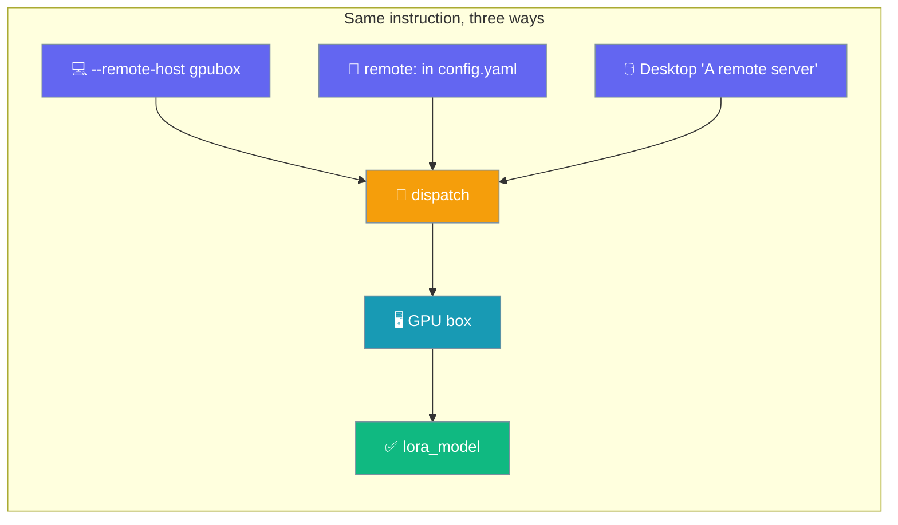
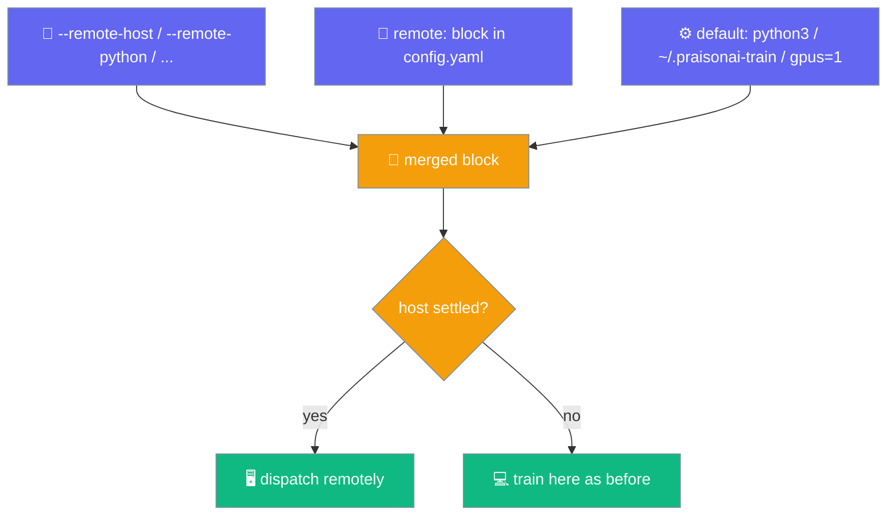

Add `--remote-host gpubox` to `praisonai-train llm`, put a `remote:` block in your config file, or pick "A remote server" in the desktop's fine-tune form — the same instruction, three ways. The run happens on the other box; your laptop can close.



## Quick Start

<Steps>
<Step title="Set up key auth once">

The runner never accepts a password prompt — it uses your ssh agent and `~/.ssh/config`.

```bash
ssh-copy-id gpubox
ssh gpubox echo ok   # must print `ok` without a prompt
```

</Step>

<Step title="Send it with a flag">

```bash
praisonai-train llm dataset.json \
    --model unsloth/gemma-2-2b-it-bnb-4bit \
    --remote-host gpubox
```

Streams the log while training. Ctrl-C stops the remote run — not just the tail.

</Step>

<Step title="Or put it in the config file">

```yaml
# config.yaml
model_name: "unsloth/gemma-2-2b-it-bnb-4bit"
dataset:
  - name: "yahma/alpaca-cleaned"
remote:
  host: gpubox
```

```bash
praisonai-train llm --config config.yaml
```

</Step>

<Step title="Or pick 'A remote server' in the desktop">

Open **Fine-tune a model**, set **Run on → A remote server**, and type the SSH alias. The remote python and remote directory fields reveal themselves with sensible defaults.

</Step>
</Steps>

---

## What Settles What — `flag > YAML > default`

The presence of a settled `host` is what routes the run remotely; there is no separate mode flag.



- **No `host` → train here**, exactly as before.
- **A flag overrides the file.** An absent flag does *not* erase what the YAML says — only non-empty overrides win.
- **A local run in the desktop posts no `remote:` block**, even if you typed a host and then switched back to "This computer".

---

## Options

Every key is expressible as a flag, in YAML, and in the desktop. All three drive the same code.

| Key | Flag | YAML | Type | Default | Description |
|-----|------|------|------|---------|-------------|
| `host` | `--remote-host` | `remote.host` | `str` | *(none)* | SSH alias from `~/.ssh/config`. Omit to train locally. |
| `python` | `--remote-python` | `remote.python` | `str` | `python3` | Interpreter on the remote host. |
| `workdir` | `--remote-workdir` | `remote.workdir` | `str` | `~/.praisonai-train` | Directory on the remote host to work in. |
| `gpus` | `--remote-gpus` | `remote.gpus` | `int` | `1` | How many GPUs the run expects to find. |

---

## What Is Shipped, and What Is Not

The dispatcher rewrites the config before sending it so the far side does the right thing.

<Steps>
<Step title="The remote: block is stripped">

The remote host reads a config file too. Leaving `remote:` in would make it find a host and dispatch again. The dispatcher removes it before shipping.

</Step>

<Step title="A dataset file is copied; a Hub dataset is not">

`praisonai-train llm dataset.jsonl --remote-host gpubox` copies `dataset.jsonl` alongside the config. A `dataset: [{name: "..."}]` in YAML is left untouched — the remote host loads it from the Hub. A `dataset: "path.jsonl"` string is rewritten to `[{name: "path.jsonl"}]` for the remote trainer.

</Step>

<Step title="Credentials are refused up front">

`password`, `passphrase`, `token`, `key`, `secret`, `identity_file`, `private_key` in the `remote:` block are refused before any SSH — the file is shipped to the remote host and printed by `--dry-run`, so a credential in it would leak. Use your ssh agent and `~/.ssh/config`.

</Step>
</Steps>

<Note>
The dispatcher writes to a `NamedTemporaryFile`, never to a `config.yaml` in the directory you launched from — a remote run never rewrites a file where you happen to be standing.
</Note>

---

## Preview Before You Spend the GPU-hours

`--dry-run` prints the resolved config, including the `remote:` block, and sends nothing.

```bash
praisonai-train llm --config config.yaml --remote-host gpubox --dry-run
```

Answers "what am I about to do, and where?" before an hour of rented GPU.

---

## Ctrl-C Stops the Remote Run

Ctrl-C during the log tail is not "just close the local tab". The dispatcher forwards `SIGINT` / `SIGTERM` to the remote runner, which stops the training process — the same as the desktop **Stop** button.

<Warning>
Without this, the signal would end the tail and leave the run holding a rented GPU while reporting "cancelled" for a job that is still training. Signal forwarding falls back cleanly on non-main threads and platforms that refuse `signal.signal`.
</Warning>

---

## Common Refusals (all before any SSH)

Each of these exits `1` before a connection is opened. The forbidden value is never echoed back.

| You wrote | What happens |
|-----------|--------------|
| `remote: {host: h, password: hunter2}` | Refused — must not carry a credential. This file is copied to the remote host and printed by `--dry-run`. Use an ssh agent instead. Value never echoed. |
| `remote: {host: "gpu; rm -rf /"}` | Refused — not a plain SSH alias. Put connection details in `~/.ssh/config` and name the alias here. |
| `remote: {host: h, workdir: "$(pwd)"}` | Refused — the workdir is expanded by the remote shell; only `letters, digits, ._-/~` allowed. |
| `remote: {host: h, python: "python; whoami"}` | Refused — same character set as `workdir`. |
| `remote: gpubox` *(a string, not a mapping)* | Refused — must be `remote: {host: gpubox, ...}`. |
| `remote: {host: h, gpus: 0}` | Refused — `gpus` must be a positive integer. |
| `remote: {host: h, hostname: typo}` | Refused — unknown key `hostname`. Known keys: host, python, workdir, gpus. |

<Note>
The credential check runs **before** the unknown-key check on purpose. A forbidden key like `password` is also technically "unknown", but telling the user "you misspelled it" is the wrong advice — the fix for a typo is to spell it right, which here would mean trying harder to put a password in a file that gets shipped to another machine.
</Note>

---

## Best Practices

<AccordionGroup>
<Accordion title="Put connection details in ~/.ssh/config">
Name only the alias in PraisonAI; keep host, user, and key in your ssh config:

```
Host gpubox
    HostName gpu-01.example.com
    User me
    IdentityFile ~/.ssh/id_ed25519
```

Then `--remote-host gpubox`, `remote: {host: gpubox}`, and the desktop's alias field all mean the same thing.
</Accordion>

<Accordion title="Dry-run before you rent the GPU">
`--dry-run` prints the resolved config with the `remote:` block and sends nothing. It catches a wrong host or wrong workdir before an hour of rented GPU.
</Accordion>

<Accordion title="Use this for 'kick it off and watch it'">
This shortcut is one command — good for a single job you want to launch and tail. For manual preflight, detached start, reattach later, fetch the adapter, and stop, use the standalone [`praisonai-train remote` sub-app](/features/praisonai-train-remote).
</Accordion>

<Accordion title="Combine with multi-GPU on the remote box">
`praisonai-train llm --config config.yaml --remote-host gpubox --remote-gpus 4` sets the GPU expectation for the remote run. See [Multi-GPU](/features/praisonai-train-multigpu) for the launcher side.
</Accordion>
</AccordionGroup>

---

## Related

<CardGroup cols={2}>
<Card title="praisonai-train Package" icon="graduation-cap" href="/features/praisonai-train-package">
  The full `praisonai-train` CLI including `llm`, `serve`, `export`, and `remote`.
</Card>
<Card title="Remote Sub-app" icon="server" href="/features/praisonai-train-remote">
  Manual preflight, detached start, reattach, fetch, stop.
</Card>
<Card title="Multi-GPU Training" icon="microchip" href="/features/praisonai-train-multigpu">
  torchrun across every GPU on the host.
</Card>
<Card title="Train" icon="book" href="/train">
  Local training flow and full `config.yaml` reference.
</Card>
</CardGroup>
