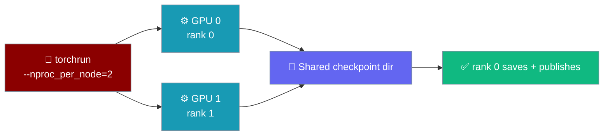
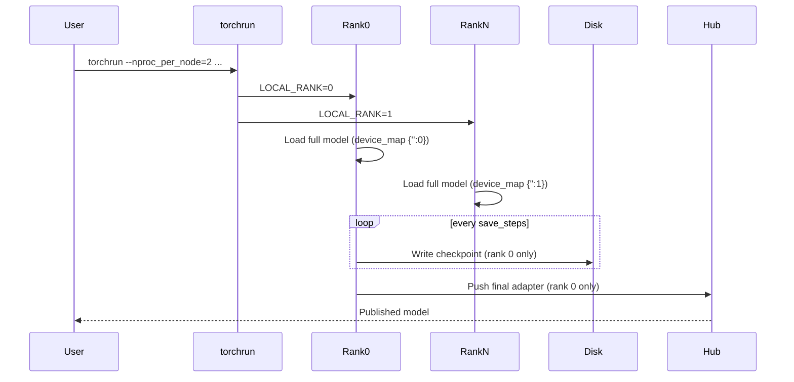

Launch a fine-tune across every GPU on the box with one `torchrun` command — the trainer detects the distributed launch and handles DDP for you.



<Info>
Multi-GPU is a launch mode, not a config flag. Run the trainer under `torchrun` and it loads the full model per rank, routes Unsloth through its DDP-safe checkpointing path, and lets only rank 0 save and publish.
</Info>

## Quick Start

<Steps>
<Step title="One GPU (baseline)">

Run the trainer normally — a single-process, single-GPU run.

```bash
praisonai-train llm config.yaml
```

</Step>
<Step title="Two GPUs">

Launch the same config under `torchrun`. `--nproc_per_node` is the number of GPUs.

```bash
torchrun --nproc_per_node=2 -m praisonai_train.train.llm.trainer train --config config.yaml
```

</Step>
<Step title="Two GPUs + checkpointing + resume">

Add checkpoint keys to `config.yaml` so an interrupted run picks up where it left off.

```yaml
# config.yaml
model_name: "unsloth/gemma-2-2b-it-bnb-4bit"
max_seq_length: 2048
dataset:
  - name: "yahma/alpaca-cleaned"

save_strategy: "steps"
save_steps: 50
save_total_limit: 3
final_model_dir: "lora_model"
resume_from_checkpoint: true   # picks the latest checkpoint in output_dir
```

```bash
torchrun --nproc_per_node=2 -m praisonai_train.train.llm.trainer train --config config.yaml
```

</Step>
</Steps>

---

## How It Works

`torchrun` spawns one process per GPU; each loads the full model onto its own device, and only rank 0 touches the filesystem and the Hub.



| Step | What the trainer does |
|------|-----------------------|
| Detect launch | Reads `LOCAL_RANK` / `WORLD_SIZE` set by `torchrun`; `WORLD_SIZE > 1` enables DDP. |
| Set checkpointing path | Sets `UNSLOTH_USE_NEW_MODEL=1` **before** unsloth is imported, so backward uses the DDP-safe non-reentrant path. |
| Load per rank | `device_map = {"": local_rank}` — each rank loads the full model on its own GPU (not `"auto"`/`"balanced"`). |
| Guard unused params | `ddp_find_unused_parameters` defaults to `True` so multimodal / MoE models don't crash on unfired adapters. |
| Save once | Only rank 0 writes the final adapter and publishes to HF / Ollama. |

<Warning>
Do **not** set `device_map: "auto"` or `"balanced"` for multi-GPU. Those are single-process model-parallel and conflict with DDP — the trainer sets `device_map = {"": local_rank}` for you under `torchrun`.
</Warning>

---

## Environment Variables

`torchrun` sets the distributed variables automatically; you only set your Hugging Face token.

| Variable | Set by | Purpose |
|----------|--------|---------|
| `LOCAL_RANK` | `torchrun` | This process's GPU index on the node. |
| `WORLD_SIZE` | `torchrun` | Total number of processes / GPUs. |
| `RANK` | `torchrun` | Global process rank (`0` = main process). |
| `UNSLOTH_USE_NEW_MODEL` | **trainer** | Set to `1` under DDP before unsloth imports (DDP-safe checkpointing). |
| `HF_TOKEN` | **you** | Needed only when publishing to Hugging Face. |

---

## Configuration Options

The DDP-relevant keys — all optional, all live in `config.yaml`.

| Key | Type | Default | Description |
|-----|------|---------|-------------|
| `ddp_find_unused_parameters` | `bool` | `true` (under DDP) | Keep `true` for multimodal / MoE / elastic models; set `false` for a small speedup on dense-text models. |
| `save_strategy` | `"no" \| "steps" \| "epoch"` | `"steps"` if `save_steps` set, else `"no"` | When rank 0 writes checkpoints. |
| `save_total_limit` | `int` | *unset* | Keep only the N most recent checkpoints. |
| `final_model_dir` | `str` | `"lora_model"` | Stable path where rank 0 saves the final adapter. |
| `resume_from_checkpoint` | `bool \| str` | `false` | `true` = latest in `output_dir`; a path = that checkpoint. |

<Card title="Checkpointing, Resume & Best-Checkpoint" icon="database" href="/docs/features/praisonai-train-checkpointing">
  Full reference for the checkpoint, eval, and early-stopping keys.
</Card>

---

## Common Patterns

### Two GPUs on one node

The most common case — split a run across both cards on a single machine.

```bash
torchrun --nproc_per_node=2 -m praisonai_train.train.llm.trainer train --config config.yaml
```

### Resume after preemption

Set `resume_from_checkpoint: true` and re-launch the same command — rank 0 loads the latest checkpoint from `output_dir`.

```yaml
save_strategy: "steps"
save_steps: 50
resume_from_checkpoint: true
```

```bash
torchrun --nproc_per_node=2 -m praisonai_train.train.llm.trainer train --config config.yaml
```

### Push checkpoints during training

Stream checkpoints to the Hub as they're written — rank 0 handles every push.

```yaml
push_to_hub: true
hub_model_id: "yourname/gemma-2-2b-lora"
hub_strategy: "every_save"
save_strategy: "steps"
save_steps: 50
```

```bash
export HF_TOKEN="${HF_TOKEN:?Set HF_TOKEN in your shell}"
torchrun --nproc_per_node=2 -m praisonai_train.train.llm.trainer train --config config.yaml
```

---

## Best Practices

<AccordionGroup>
<Accordion title="Leave ddp_find_unused_parameters at the default for multimodal / MoE">
The trainer defaults it to `true` under DDP so models with adapters that don't fire in text-only training (e.g. Gemma 4 E4B's vision/audio paths) don't crash with "Expected to have finished reduction...". Only set `false` on pure dense-text models for a small speedup.
</Accordion>

<Accordion title="Set save_total_limit to bound disk">
Checkpoints add up fast across many steps. Set `save_total_limit: 3` to keep only the most recent few and avoid filling the disk mid-run.
</Accordion>

<Accordion title="Always set final_model_dir to a stable path">
`final_model_dir` (default `lora_model`) is where rank 0 writes the final adapter and where post-training inference reloads it from. Keep it stable so `load_model` finds the adapter.
</Accordion>

<Accordion title="Don't use device_map auto/balanced under torchrun">
Those select single-process model-parallel and conflict with DDP. The trainer sets `device_map = {"": local_rank}` automatically when it detects a distributed launch.
</Accordion>
</AccordionGroup>

---

## Related

<CardGroup cols={2}>
<Card title="Train" icon="graduation-cap" href="/docs/train">
  Fine-tuning overview and full config reference.
</Card>
<Card title="Checkpointing" icon="database" href="/docs/features/praisonai-train-checkpointing">
  Save, resume, and keep the best checkpoint.
</Card>
<Card title="Train CLI" icon="terminal" href="/docs/cli/train">
  Multi-GPU launch and resume from the CLI.
</Card>
<Card title="praisonai-train Package" icon="graduation-cap" href="/docs/features/praisonai-train-package">
  Install and use training without the full wrapper.
</Card>
</CardGroup>
