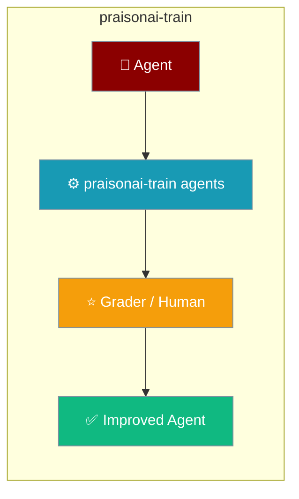
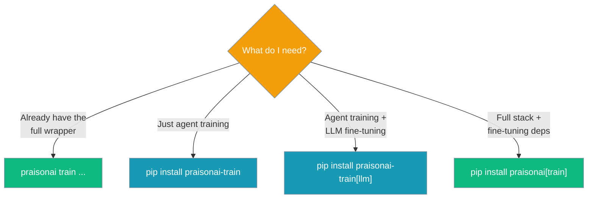

Train agents or fine-tune LLMs without installing the full PraisonAI wrapper.



The `praisonai-train` PyPI package (import: `praisonai_train`) is Tier 2c — it sits on top of `praisonaiagents` and gives you the `train` CLI group and a standalone `praisonai-train` console script.

## Quick Start

<Steps>
<Step title="Agent Training">

Improve an agent iteratively — no ML dependencies required.

```python
from praisonaiagents import Agent

agent = Agent(instructions="You are a helpful assistant.")
```

```bash
pip install praisonai-train

praisonai-train agents --input "What is Python?"
```

</Step>

<Step title="LLM Fine-tuning">

Add the `[llm]` extra to pull the Unsloth/torch stack.

```bash
pip install "praisonai-train[llm]"

praisonai-train llm dataset.json \
    --model unsloth/Meta-Llama-3.1-8B-Instruct-bnb-4bit
```

</Step>
</Steps>

---

## When to Use `praisonai-train` vs `praisonai train`

Install the standalone package when you only need training; use the wrapper's `praisonai train` when you already run the full stack.



Both entry points expose the same commands: every `praisonai train <sub>` also runs as `praisonai-train <sub>`.

---

## CLI Subcommands

Five subcommands cover fine-tuning and agent training.

| Subcommand | Purpose |
|------------|---------|
| `praisonai-train llm DATASET` | Fine-tune an LLM via Unsloth |
| `praisonai-train agents [AGENT_FILE]` | Iteratively train an agent |
| `praisonai-train list` | List training sessions |
| `praisonai-train show SESSION_ID` | Show a session's iterations and best score |
| `praisonai-train apply SESSION_ID` | Apply learned suggestions to an agent |

See [Train CLI](/docs/cli/train) for full flags.

---

## Common Patterns

### Train, review, apply

Run a training session, inspect the iterations, then bake the best one into your agent.

```bash
praisonai-train agents --input "Explain AI" --human
praisonai-train list
praisonai-train show train-abc123 --iterations
praisonai-train apply train-abc123 --run "Explain AI"
```

### Apply in Python

Apply a session's suggestions to an agent directly.

```python
from praisonaiagents import Agent
from praisonai_train.train.agents import apply_training

agent = Agent(instructions="You are a helpful assistant.")
apply_training(agent, session_id="train-abc123")
```

---

## Best Practices

<AccordionGroup>
<Accordion title="Install the base package for agent training">
`pip install praisonai-train` pulls only `praisonaiagents` — enough for `agents`, `list`, `show`, and `apply`. Add `[llm]` only when you need Unsloth fine-tuning.
</Accordion>

<Accordion title="Use the standalone script when you don't want the wrapper">
The `praisonai-train` console script exposes the full `train` group without installing `praisonai`. Ideal for lightweight training-only environments.
</Accordion>

<Accordion title="Old imports keep working">
Existing `praisonai.train.*`, `praisonai.train_vision`, and `praisonai.upload_vision` imports still resolve to the same module objects in `praisonai_train`. Nothing to migrate.
</Accordion>
</AccordionGroup>

<Note>
Backward-compatible: if you already have the wrapper installed, `praisonai.train.*` imports and the `setup-conda-env` entry point continue to work unchanged.
</Note>

---

## Related

<CardGroup cols={2}>
<Card title="Train" icon="graduation-cap" href="/docs/train">
  Training overview and fine-tuning setup.
</Card>
<Card title="Train CLI" icon="terminal" href="/docs/cli/train">
  Full flag reference for the five subcommands.
</Card>
<Card title="Installation Extras" icon="puzzle-piece" href="/docs/features/installation-extras">
  The train install matrix.
</Card>
<Card title="Package Tiers" icon="layer-group" href="/docs/features/architecture-tiers">
  How the five packages stack.
</Card>
</CardGroup>
