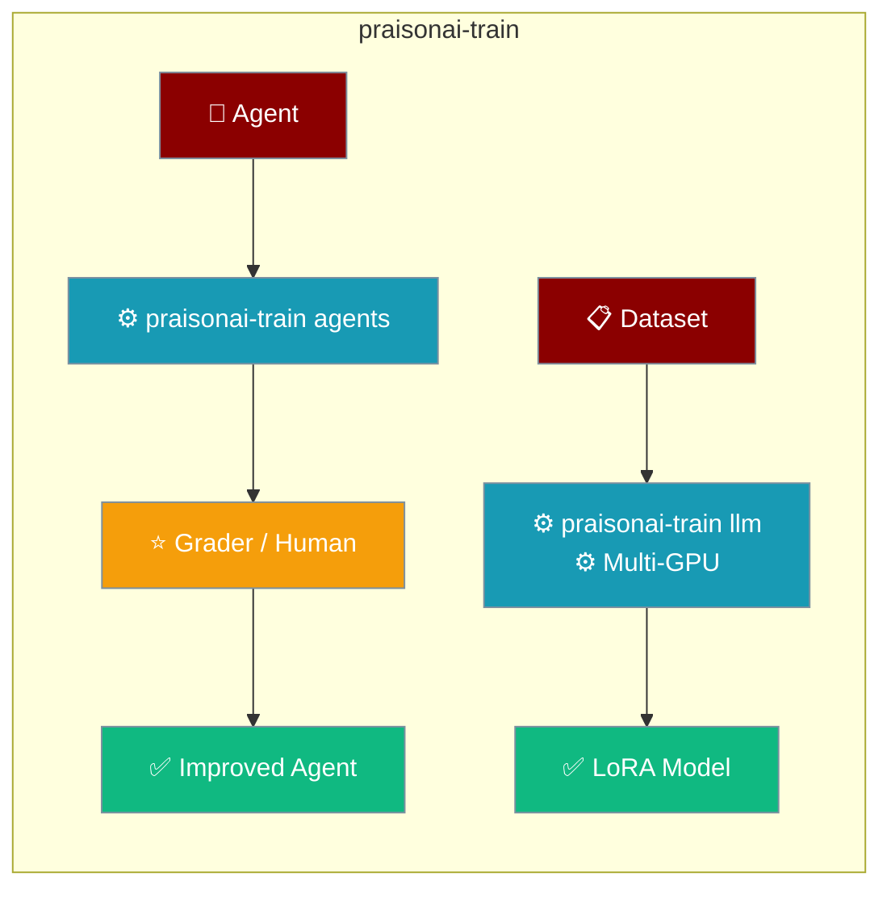
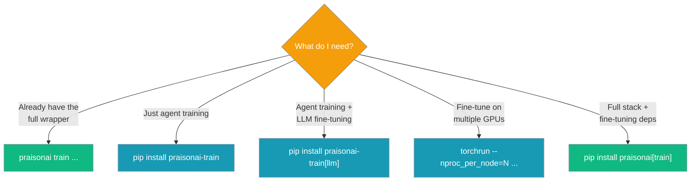
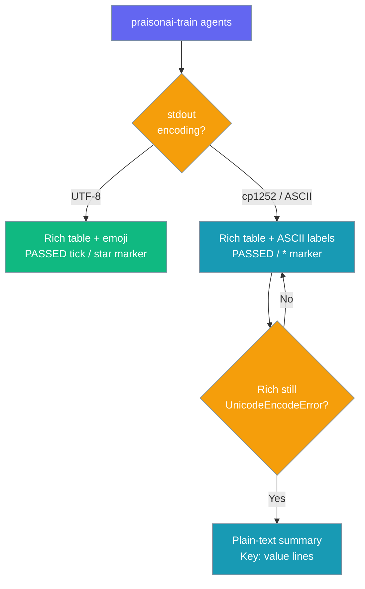

Train agents or fine-tune LLMs without installing the full PraisonAI wrapper.



The `praisonai-train` PyPI package (import: `praisonai_train`) is Tier 2c — it sits on top of `praisonaiagents` and gives you the `train` CLI group and a standalone `praisonai-train` console script.

## Quick Start

<Steps>
<Step title="Agent Training">

Improve an agent iteratively — no ML dependencies required.

```python
from praisonaiagents import Agent

agent = Agent(instructions="You are a helpful assistant.")
```

```bash
pip install praisonai-train

praisonai-train agents --input "What is Python?"
```

</Step>

<Step title="LLM Fine-tuning">

Add the `[llm]` extra to pull the modern Unsloth/torch stack (`unsloth>=2025.9.1`, `trl>=0.18.2`, `transformers>=4.51.3`, `torch>=2.6.0`). The trainer uses each model's own chat template, so `chat_template` is optional.

```bash
pip install "praisonai-train[llm]"
```

<Tabs>
<Tab title="Llama">

```bash
praisonai-train llm dataset.json \
    --model unsloth/Meta-Llama-3.1-8B-Instruct-bnb-4bit
```

<Note>
The base install now uses the modern TRL API (`SFTConfig` + `SFTTrainer`) and pulls the current Unsloth / TRL / torch 2.6+ stack. On old pins, upgrade with `pip install -U "praisonai-train[llm]"`.
</Note>

</Tab>
<Tab title="Gemma">

```bash
praisonai-train llm dataset.json \
    --model unsloth/gemma-2-2b-it-bnb-4bit
```

</Tab>
<Tab title="Qwen">

```bash
praisonai-train llm dataset.json \
    --model unsloth/Qwen2.5-0.5B-Instruct-bnb-4bit
```

</Tab>
</Tabs>

</Step>
</Steps>

---

## Beginner-safe defaults

A minimal fine-tuning config trains locally and pushes nowhere unless you opt in.

```yaml
model_name: "unsloth/gemma-2-2b-it-bnb-4bit"
max_seq_length: 2048
dataset:
  - name: "yahma/alpaca-cleaned"
    num_samples: 20   # subset for a fast smoke test
```

```bash
# Trains locally, saves LoRA to lora_model/, no push.
praisonai-train llm dataset.yaml
```

Three headline safety guarantees (PraisonAI [#3279](https://github.com/MervinPraison/PraisonAI/pull/3279)):

- **A minimal config trains locally** — publishing to Hugging Face or Ollama is opt-in (set the flag **and** its target).
- **`assistant_only_loss: auto` never crashes** on a stock Gemma / Qwen / Llama template — it falls back to full-sequence SFT.
- **Unknown / misnamed keys warn instead of crashing** — a typo logs `WARNING: ignoring unknown config key '...'` and training continues.

Just before training, the trainer prints a run-summary block confirming the resolved model, example count, loss mask, steps, and output dir — see [Train → Run summary](/docs/train#run-summary).

---

## When to Use `praisonai-train` vs `praisonai train`

Install the standalone package when you only need training; use the wrapper's `praisonai train` when you already run the full stack.



Both entry points expose the same commands: every `praisonai train <sub>` also runs as `praisonai-train <sub>`.

---

## CLI Subcommands

Five subcommands cover fine-tuning and agent training.

| Subcommand | Purpose |
|------------|---------|
| `praisonai-train llm DATASET` | Fine-tune an LLM via Unsloth |
| `praisonai-train agents [AGENT_FILE]` | Iteratively train an agent |
| `praisonai-train list` | List training sessions |
| `praisonai-train show SESSION_ID` | Show a session's iterations and best score |
| `praisonai-train apply SESSION_ID` | Apply learned suggestions to an agent |

See [Train CLI](/docs/cli/train) for full flags.

---

## Supported models

`praisonai-train llm` fine-tunes any Unsloth-supported model. The trainer uses each model's own chat template, so `chat_template` is optional — set it only to override.

| Model family | Example `--model` | Optional `chat_template` |
|---|---|---|
| Llama | `unsloth/Meta-Llama-3.1-8B-Instruct-bnb-4bit` | `llama-3.1` / `llama-3` |
| Gemma | `unsloth/gemma-2-2b-it-bnb-4bit` | `gemma` / `gemma-2` |
| Qwen | `unsloth/Qwen2.5-0.5B-Instruct-bnb-4bit` | `qwen-2.5` / `qwen-3` |
| Mistral | `unsloth/mistral-7b-instruct-v0.3-bnb-4bit` | `mistral` |
| Phi | `unsloth/Phi-3-mini-4k-instruct-bnb-4bit` | `phi-3` |
| DeepSeek | `unsloth/DeepSeek-R1-Distill-Qwen-1.5B` | `qwen-2.5` |

<Note>
PraisonAI PR #3274 validated `unsloth/Qwen2.5-0.5B-Instruct-bnb-4bit` and `unsloth/gemma-2-2b-it-bnb-4bit` end-to-end. See [Train → Model & template keys](/docs/train#model--template-keys) for the full `chat_template` reference.
</Note>

---

## Common Patterns

### Fine-tune a non-Llama base (Gemma / Qwen)

Point `--model` at any Gemma or Qwen base — the trainer uses each model's own chat template automatically.

```bash
pip install "praisonai-train[llm]"

# Gemma 2 (uses the model's own template automatically)
praisonai-train llm dataset.json \
    --model unsloth/gemma-2-2b-it-bnb-4bit

# Qwen 2.5
praisonai-train llm dataset.json \
    --model unsloth/Qwen2.5-0.5B-Instruct-bnb-4bit
```

<Note>
The trainer previously force-applied the Llama-3.1 template to every model, corrupting Gemma / Qwen runs. Fixed as of PraisonAI PR #3274 — set `chat_template` in `config.yaml` only when a base model has no built-in template.
</Note>

### Fine-tune on 2 GPUs with checkpointing

Launch under `torchrun` and add a handful of checkpoint keys — an interrupted run resumes from the latest. See [Multi-GPU](/docs/features/praisonai-train-multigpu).

```yaml
# config.yaml
model_name: "unsloth/gemma-2-2b-it-bnb-4bit"
max_seq_length: 2048
dataset:
  - name: "yahma/alpaca-cleaned"
save_strategy: "steps"
save_steps: 50
resume_from_checkpoint: true
```

```bash
torchrun --nproc_per_node=2 -m praisonai_train.train.llm.trainer train --config config.yaml
```

### Train, review, apply

Run a training session, inspect the iterations, then bake the best one into your agent.

```bash
# --iterations N is a max — training stops early on a score >= 9.5 in LLM mode
praisonai-train agents --input "Explain AI" --human
praisonai-train list
praisonai-train show train-abc123 --iterations
praisonai-train apply train-abc123 --run "Explain AI"
```

### Apply in Python

Apply a session's suggestions to an agent directly.

```python
from praisonaiagents import Agent
from praisonai_train.train.agents import apply_training

agent = Agent(instructions="You are a helpful assistant.")
apply_training(agent, session_id="train-abc123")
```

### Train on any console

The same commands run identically on macOS, Linux, and Windows — no encoding configuration needed.

```python
# Works identically on macOS/Linux/Windows — no encoding config needed
from praisonaiagents import Agent

agent = Agent(instructions="You are a helpful assistant.")
```

```bash
# On a Windows cp1252 console, the summary renders as plain ASCII
# and the session is still persisted for later review.
praisonai-train agents --input "What is Python?"
praisonai-train show train-abc123
```

### Force all iterations

Benchmarks, regression tests, and demos that need to observe the feedback loop across every iteration should pass `--no-early-stop` (CLI) or `no_early_stop=True` (Python) so the 9.5 threshold is bypassed.

```bash
# CLI — always runs all 3 iterations
praisonai-train agents --input "What is Python?" --iterations 3 --no-early-stop
```

```python
from praisonaiagents import Agent
from praisonai_train.train.agents import AgentTrainer, TrainingScenario

agent = Agent(instructions="You are a helpful assistant.")
trainer = AgentTrainer(agent=agent, iterations=3, no_early_stop=True)
trainer.scenarios.append(TrainingScenario(input_text="What is Python?"))
report = trainer.run()
```

Without this flag, `--iterations` behaves as a **maximum** in LLM-as-Judge mode — training stops as soon as any iteration scores ≥ 9.5.

---

## Windows & non-UTF-8 Consoles

`praisonai-train agents` renders its summary table with emoji (`✅ PASSED`, `❌ NEEDS WORK`, `★` best-iteration marker) when stdout supports UTF-8, and automatically falls back to ASCII (`PASSED`, `NEEDS WORK`, `*`) when it doesn't. It detects the console's encoding at runtime.



<Note>
The ASCII summary is the correct output on a cp1252 Windows console — not a truncation. The session is saved either way; `praisonai-train show <session-id>` re-renders it in whichever encoding your current console supports.
</Note>

---

## Exit Codes

`praisonai-train agents` reports three distinct outcomes.

| Exit | Meaning |
|------|---------|
| `0`  | Training completed and the report was persisted (`praisonai-train list` will show it). A warning is printed if only the console display failed to encode. |
| `1`  | Training itself failed — the run raised an exception (including encoding errors that hit before `save_report`) or arguments were invalid. No report is persisted. |
| `130`| Interrupted by `Ctrl-C`. |

<Tip>
On a cp1252 Windows console, a completed training session now exits `0` even if Rich cannot render the summary emoji — you'll see `Training complete but summary could not be displayed: 'charmap' codec can't encode ...`. Run `praisonai-train show <session-id>` to inspect the persisted result. If you want the full emoji summary, run `chcp 65001` first or set `PYTHONIOENCODING=utf-8`.
</Tip>

---

## Best Practices

<AccordionGroup>
<Accordion title="Install the base package for agent training">
`pip install praisonai-train` pulls `praisonaiagents` plus `litellm` (needed for LLM-as-Judge grading) — enough for `agents`, `list`, `show`, and `apply`. Add `[llm]` only when you need Unsloth fine-tuning.
</Accordion>

<Accordion title="Use the standalone script when you don't want the wrapper">
The `praisonai-train` console script exposes the full `train` group without installing `praisonai`. Ideal for lightweight training-only environments.
</Accordion>

<Accordion title="Old imports keep working">
Existing `praisonai.train.*`, `praisonai.train_vision`, and `praisonai.upload_vision` imports still resolve to the same module objects in `praisonai_train`. Nothing to migrate.
</Accordion>

<Accordion title="Let the tokenizer's native template win">
For LLM fine-tuning, only set `chat_template` for models without one, or to force a specific one. Forcing `llama-3.1` on Gemma/Qwen was the old default and silently corrupted training — the trainer now uses each model's own template by default. See [Train → Chat Template](/docs/train#chat-template).
</Accordion>

<Accordion title="Update to the modern Unsloth stack">
The `[llm]` extra now requires `unsloth>=2025.9.1`, `trl>=0.18.2`, `transformers>=4.51.3`, and `torch>=2.6.0`. If you had pinned `trl<0.9.0`, upgrade — the pre-0.9 TRL API is no longer supported.
</Accordion>
</AccordionGroup>

<Note>
Backward-compatible: if you already have the wrapper installed, `praisonai.train.*` imports and the `setup-conda-env` entry point continue to work unchanged.
</Note>

---

## Related

<CardGroup cols={2}>
<Card title="Train" icon="graduation-cap" href="/docs/train">
  Training overview and fine-tuning setup.
</Card>
<Card title="Train CLI" icon="terminal" href="/docs/cli/train">
  Full flag reference for the five subcommands.
</Card>
<Card title="Multi-GPU Training" icon="microchip" href="/docs/features/praisonai-train-multigpu">
  Fine-tune across multiple GPUs with torchrun.
</Card>
<Card title="Checkpointing" icon="database" href="/docs/features/praisonai-train-checkpointing">
  Save, resume, and keep the best checkpoint.
</Card>
<Card title="Installation Extras" icon="puzzle-piece" href="/docs/features/installation-extras">
  The train install matrix.
</Card>
<Card title="Package Tiers" icon="layer-group" href="/docs/features/architecture-tiers">
  How the six packages stack.
</Card>
<Card title="Windows Terminal Encoding" icon="terminal" href="/docs/features/windows-terminal-encoding">
  Fix Rich crashes and ASCII rendering on legacy Windows consoles.
</Card>
</CardGroup>
