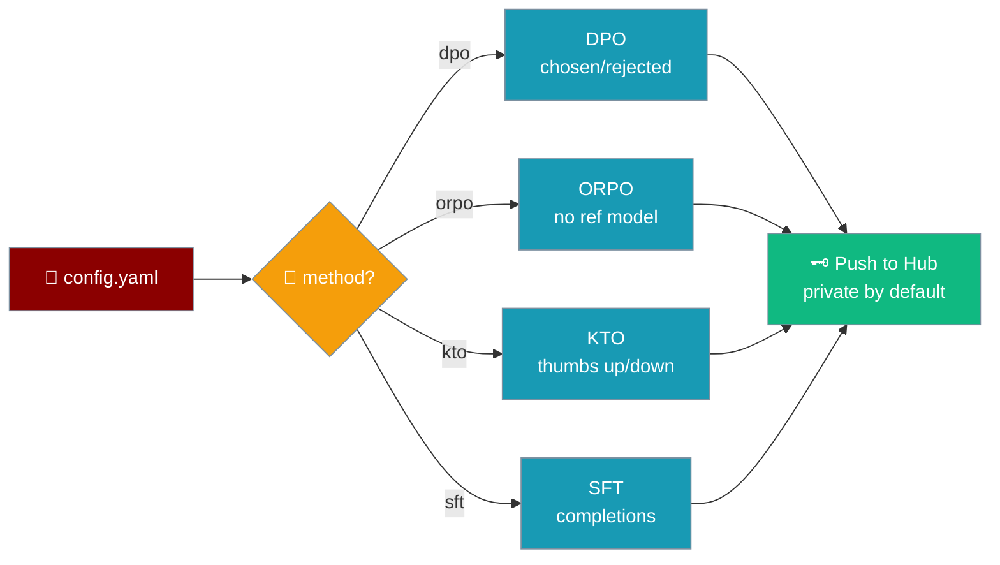
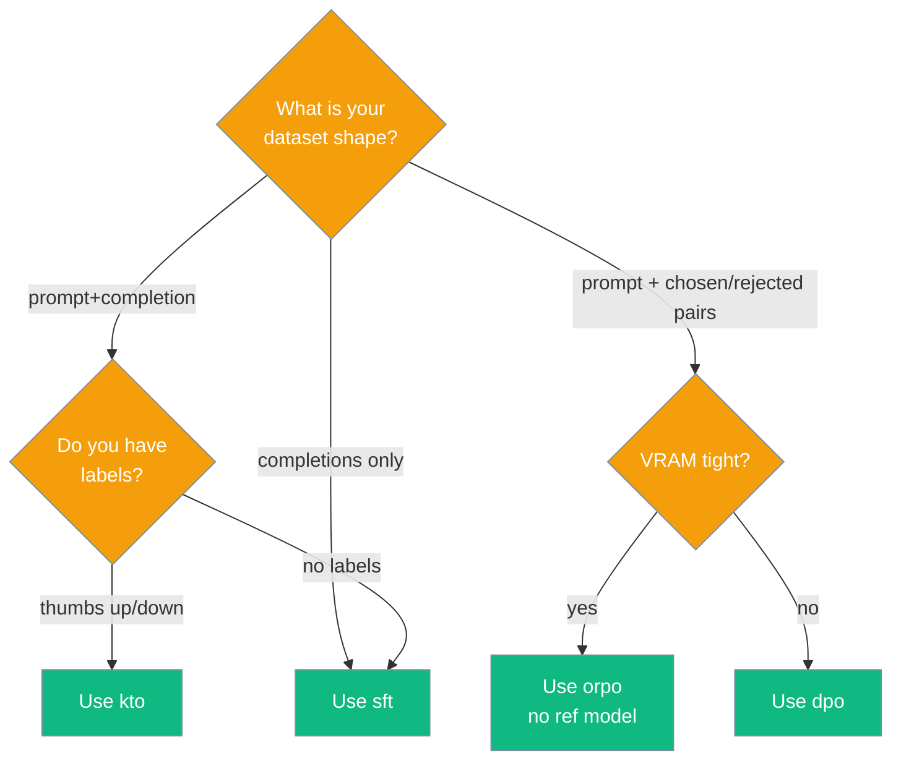
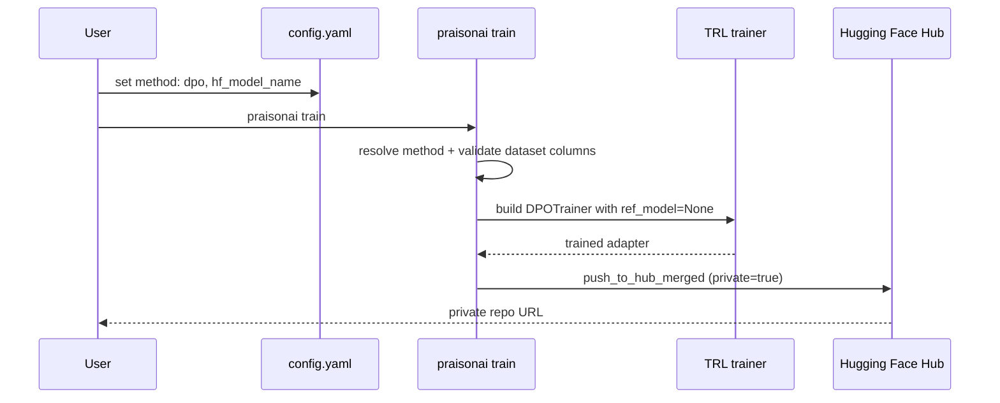

Fine-tune with preference pairs — DPO, ORPO or KTO — by setting `method:` in `config.yaml`.



## Quick Start

Start with the smallest possible DPO run, then layer on ORPO or KTO.

<Steps>
<Step title="Simplest DPO run">

DPO trains on `chosen` / `rejected` pairs with a frozen base as the reference model.

```yaml
# config.yaml
model_name: unsloth/gemma-2-2b-it-bnb-4bit
max_seq_length: 2048
method: dpo
dataset:
  - name: trl-lib/ultrafeedback_binarized
    split: train
hf_model_name: me/my-dpo-model
huggingface_save: true
```

```bash
praisonai train
```

</Step>

<Step title="ORPO — no reference model, saves VRAM">

ORPO folds the reference into its loss, so there's no second model to hold in VRAM.

```yaml
method: orpo
beta: 0.1
max_prompt_length: 1024
```

</Step>

<Step title="KTO — thumbs up/down labels">

KTO learns from `prompt` / `completion` / `label` rows — a single up/down signal per example.

```yaml
method: kto
desirable_weight: 1.0
undesirable_weight: 1.0
```

</Step>
</Steps>

## Methods

Four methods, selected with `method:` — read from `TRAINING_METHODS` in `trainer.py`.

| Method | Dataset columns | Needs reference model | Summary |
|--------|----------------|----------------------|---------|
| `sft` | any (flattened to `text`) | no | Supervised fine-tuning on completions (default) |
| `dpo` | `prompt`, `chosen`, `rejected` | yes (frozen base) | Direct preference optimisation |
| `orpo` | `prompt`, `chosen`, `rejected` | no (ref folded into loss) | Odds-ratio preference optimisation, saves VRAM |
| `kto` | `prompt`, `completion`, `label` | yes | Kahneman-Tversky optimisation on thumbs-up/down labels |

<Note>
`method` is case-insensitive and defaults to `sft`. An unsupported value fails fast with the list of valid methods and their summaries.
</Note>

## Which method?

Pick a method from the shape of your dataset and your VRAM budget.



## Config keys

Preference-specific keys, read from `KNOWN_KEYS` in `trainer.py` — all optional, all backward-compatible.

| Key | Type | Default | Applies to | Description |
|-----|------|---------|------------|-------------|
| `method` | string | `"sft"` | all | One of `sft`, `dpo`, `orpo`, `kto`. Case-insensitive. |
| `beta` | float | TRL default | dpo, orpo, kto | Preference strength (β in the DPO paper). |
| `max_prompt_length` | int | `max_seq_length // 2` | dpo, orpo, kto | Max prompt tokens; the rest of `max_seq_length` is completion. |
| `desirable_weight` | float | `1.0` | kto | Weight for thumbs-up examples. |
| `undesirable_weight` | float | `1.0` | kto | Weight for thumbs-down examples. |

## Dataset-shape validation

PraisonAI validates dataset columns **before** the run starts, naming exactly which columns are missing — so a shape mismatch fails in seconds rather than minutes-in from a TRL collator traceback.

Preference datasets are **not** flattened to a `text` column (that's SFT-only behaviour) — the `prompt` / `chosen` / `rejected` (or `prompt` / `completion` / `label`) columns survive to the trainer.

<Tip>
Verify columns locally before a long run:

```python
from datasets import load_dataset

print(load_dataset("trl-lib/ultrafeedback_binarized", split="train").column_names)
```
</Tip>

## How it works

Set `method` and a repo, run one command — the trainer resolves the method, validates columns, builds the right TRL trainer, and pushes privately by default.



For DPO and KTO the trainer passes `ref_model=None`, which reuses the frozen base weights through the PEFT adapter — no second full model in VRAM.

<Note>
**TRL version note** — the preference trainers are imported *individually and lazily*, so an older TRL that lacks e.g. `KTOTrainer` still supports the others. If a method is unavailable, the error names both the missing class and tells you to `Upgrade trl, or use method: sft`.
</Note>

## Best Practices

<AccordionGroup>
<Accordion title="Start with orpo when VRAM is tight">
ORPO folds the reference model into its loss, so there's no second model to hold — the cheapest preference method to run.
</Accordion>

<Accordion title="Match max_prompt_length to your dataset">
The default is `max_seq_length // 2`. If your prompts are long, raise `max_prompt_length` so completions aren't truncated (and vice-versa).
</Accordion>

<Accordion title="Use dpo's conservative default beta first">
Leave `beta` unset for the first run to inherit TRL's default, then tune it once you have a baseline.
</Accordion>

<Accordion title="Verify columns before a long run">
Check `datasets.load_dataset(...).column_names` locally so a shape mismatch fails in seconds, not minutes.
</Accordion>
</AccordionGroup>

## Related

<CardGroup cols={2}>
<Card title="Train" icon="graduation-cap" href="/train">
Full fine-tuning flow and config.yaml reference.
</Card>
<Card title="Hub Privacy & Upload Options" icon="lock" href="/features/praisonai-train-hub-privacy">
Every Hub push is private by default — opt in to publish.
</Card>
<Card title="Dataset Tooling" icon="database" href="/features/praisonai-train-dataset-tooling">
Generate and quality-check instruction datasets.
</Card>
</CardGroup>
