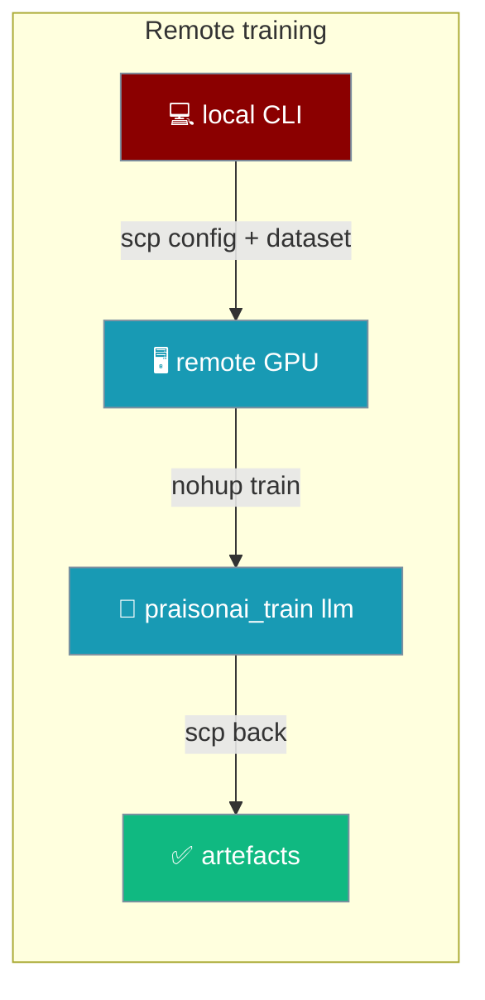
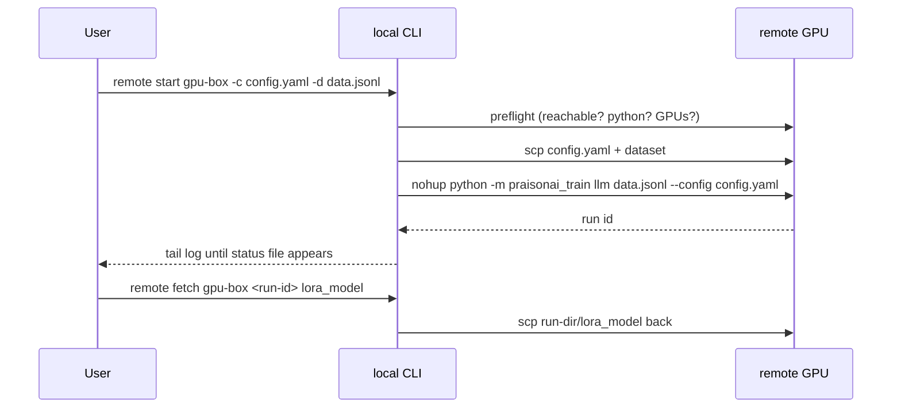

Remote training runs your `praisonai-train llm` job on another machine you reach over SSH — the tiny local CLI stays on your laptop, the GPU box does the heavy work, and the artefacts come back to you.



<Note>
Reachable through the integrated CLI (`praisonai train remote …`) from PraisonAI [PR #4367](https://github.com/MervinPraison/PraisonAI/pull/4367) onward — before that the whole group was unregistered and only worked from a standalone `praisonai-train` install. It speaks plain `ssh`/`scp` through `subprocess`, so there is **no third-party dependency**: any host in your `~/.ssh/config` works.
</Note>

## Quick Start

<Steps>
<Step title="Check the host and start a run">

Have SSH access to a machine with a GPU and a working `praisonai-train[llm]` install. Point the CLI at it by its SSH alias. `start` prints a run id and streams the log until the run ends.

```bash
praisonai train remote start gpu-box --config config.yaml --dataset data.jsonl
```
</Step>

<Step title="Check on it later">

Every command reattaches from just the host and run id, so a dropped laptop connection never kills training.

```bash
praisonai train remote status gpu-box run-1787667005
```
</Step>

<Step title="Fetch the artefacts back">

Pull the adapter (or any file inside the run directory) home.

```bash
praisonai train remote fetch gpu-box run-1787667005 lora_model --out ./out
```
</Step>
</Steps>

---

## How it works

The run is launched under `setsid` (or plain `nohup` on macOS, which has no `setsid`), so it **outlives the SSH session that started it** and its children — dataloader workers, torchrun ranks — sit in one process group `stop` can take down together. The run id names a directory on the far host; that id is enough to reattach, inspect, fetch, or stop the run later.



Before shipping anything, `start` runs a **preflight**: the host must be reachable, its Python importable, and `nvidia-smi` must report at least `--gpus` GPUs. A shortfall refuses the run rather than wasting an upload.

---

## Commands

Every command takes the SSH `host` alias first. Runs are addressed by the run id `start` prints.

### `remote preflight`

Check the host can train, before shipping anything to it.

```bash
praisonai train remote preflight gpu-box --gpus 1
```

| Option | Type | Default | Description |
|--------|------|---------|-------------|
| `host` (arg) | str | **required** | SSH alias, as in `~/.ssh/config`. |
| `--gpus` | int | `1` | How many GPUs the host must have. |
| `--python` | str | `python3` | Interpreter to use on the host. |
| `--workdir` | str | `~/.praisonai-train` | Directory to work in on the host. See the [workdir rules](#workdir). |
| `--json` / `-j` | flag | `false` | Emit a machine-readable verdict. A not-ready host still exits `1`. |

### `remote start`

Ship the job and start it. The run outlives this command.

```bash
praisonai train remote start gpu-box --config config.yaml --dataset data.jsonl
```

| Option | Type | Default | Description |
|--------|------|---------|-------------|
| `host` (arg) | str | **required** | SSH alias, as in `~/.ssh/config`. |
| `--config` / `-c` | path | **required** | Training config to ship (must exist locally). |
| `--dataset` / `-d` | path | — | Local dataset to ship alongside it (must exist). |
| `--gpus` | int | `1` | How many GPUs the run expects to find. |
| `--run-id` | str | auto (`run-<epoch>`) | Name the run directory. Must pass the [run-id rules](#run-ids). |
| `--python` | str | `python3` | Interpreter on the remote host. |
| `--workdir` | str | `~/.praisonai-train` | Directory to work in on the host. See the [workdir rules](#workdir). |
| `--follow` / `--no-follow` | flag | `--follow` | Stream the log until the run ends. |

### `remote tail`

Reattach to a running job's log; prints the final status when it ends.

```bash
praisonai train remote tail gpu-box run-1787667005
```

| Option | Type | Default | Description |
|--------|------|---------|-------------|
| `host` (arg) | str | **required** | SSH alias. |
| `run_id` (arg) | str | **required** | The run id `start` printed. |
| `--python` | str | `python3` | Interpreter on the host. |
| `--workdir` | str | `~/.praisonai-train` | Directory to work in on the host. See the [workdir rules](#workdir). |

### `remote status`

Whether a run is still going, and how it ended if not — prints `running`, `completed`, `failed (exit N)`, or `unknown`.

```bash
praisonai train remote status gpu-box run-1787667005
```

| Option | Type | Default | Description |
|--------|------|---------|-------------|
| `host` (arg) | str | **required** | SSH alias. |
| `run_id` (arg) | str | **required** | The run id. |
| `--python` | str | `python3` | Interpreter on the host. |
| `--workdir` | str | `~/.praisonai-train` | Directory to work in on the host. See the [workdir rules](#workdir). |

### `remote fetch`

Bring an artefact back — the adapter, a checkpoint, the log.

```bash
praisonai train remote fetch gpu-box run-1787667005 lora_model --out ./out
```

| Option | Type | Default | Description |
|--------|------|---------|-------------|
| `host` (arg) | str | **required** | SSH alias. |
| `run_id` (arg) | str | **required** | The run id. |
| `remote_path` (arg) | str | **required** | Path inside the run directory. Must pass the [fetch-path rules](#fetch-paths). |
| `--out` / `-o` | path | `.` | Local directory to copy into. |
| `--python` | str | `python3` | Interpreter on the host. |
| `--workdir` | str | `~/.praisonai-train` | Directory to work in on the host. See the [workdir rules](#workdir). |

### `remote stop`

Stop a run. Signals the whole process group on the host — the wrapper, the trainer, and its dataloader / torchrun children — then re-probes to confirm the group is gone before reporting success. `stopped` means the run is actually off the GPU, not just that `kill -TERM` was issued.

```bash
praisonai train remote stop gpu-box run-1787667005
```

Three outcomes:

| Outcome | When | Output |
|---------|------|--------|
| Stopped | The group is gone after SIGTERM. | `stopped <run-id> on <host>` |
| Nothing to stop | No pid file, or the pid was already dead. | `<run-id> was not running on <host>` |
| Refused to lie | A process in the group survived SIGTERM, or the pid resolves to this SSH session's own group (a corrupt pid file). | `RemoteError: … did not stop …` or `RemoteError: refused to stop …` |

<Note>
Fixed in PraisonAI [PR #4551](https://github.com/MervinPraison/PraisonAI/pull/4551) (closes [#4547](https://github.com/MervinPraison/PraisonAI/issues/4547)) — the remote counterpart of [#4491](https://github.com/MervinPraison/PraisonAI/pull/4491). Earlier releases signalled only the recorded pid (the wrapper shell), so real fine-tune children survived `stop`, reparented to init, and kept the GPU; and `stop` reported success the moment `kill -TERM` was issued, letting a UI label a live paid run "cancelled".
</Note>

| Option | Type | Default | Description |
|--------|------|---------|-------------|
| `host` (arg) | str | **required** | SSH alias. |
| `run_id` (arg) | str | **required** | The run id. |
| `--python` | str | `python3` | Interpreter on the host. |
| `--workdir` | str | `~/.praisonai-train` | Directory to work in on the host. See the [workdir rules](#workdir). |

---

## Run IDs

`--run-id` (when passed) must be a plain identifier: **letters, digits, dot, dash and underscore only; starting with a letter or digit; up to 64 characters**. Anything else is refused:

```text
RemoteError: run id 'x;touch /tmp/pwned' is not usable: letters, digits, dot, dash and underscore only, starting with a letter or digit, up to 64 chars.
```

This validator was added in [PR #4367](https://github.com/MervinPraison/PraisonAI/pull/4367): a shell metacharacter inside `--run-id` was interpolated into the remote path and executed by the far-side shell. Values like `x;touch /tmp/pwned`, `$(id)`, `` `id` ``, `a b`, `../escape`, `/absolute`, an empty string, and `-leading-dash` are all refused. `run-1787667005` and `my_run.2` are fine.

## Workdir

`--workdir` (the remote directory the run lives in, default `~/.praisonai-train`) is expanded by the remote shell, so it must survive being passed unquoted. The runner refuses anything outside a **safe character set: letters, digits, `.`, `_`, `-`, `/`, and an optional leading `~`.** Anything else is rejected before any SSH is opened:

```text
RemoteError: gpu-box: workdir '~/x; rm -rf /' may only contain letters, digits and ._-/~ -- it is expanded by the remote shell.
```

The `~` is expanded by the remote shell (not the local one), so `~/.praisonai-train` lands in the remote user's real home. The directory is created with `mkdir -p -m 700`, so on a shared GPU box the umask does not decide who can read the shipped config and dataset.

<Note>
**Migration note (PraisonAI [PR #4550](https://github.com/MervinPraison/PraisonAI/pull/4550)).** Before this fix, the workdir was quoted before the remote shell saw it, so a directory **literally named `~`** was created in the login directory and every derived path (config, logs, checkpoints) landed there while `~/.praisonai-train` stayed empty. If you ran remote training on an older release, log in to the box and check:
```bash
ssh gpu-box 'ls -ld ~ ~/\~ 2>/dev/null'
```
A `~` directory (yes, one whose name is a single tilde character) is safe to remove after moving any artefacts you still want out of it:
```bash
ssh gpu-box 'ls ~/\~'          # inspect
ssh gpu-box 'rm -rf -- ~/\~'   # remove when you're done
```
On the current release, `praisonai train remote` creates and uses the real `~/.praisonai-train` instead.
</Note>

## Fetch paths

`fetch <run> <path>` treats `<path>` as **relative to the run directory** on the remote host. These are refused up-front:

- absolute paths (`/etc/passwd`)
- any path containing `..` (`../../../../etc/passwd`, `a/../../b`)
- empty or whitespace-only paths

```text
RemoteError: '../../../../etc/passwd' points outside the run directory. Fetch paths are relative to it, e.g. 'lora_model' or 'train.log'.
```

The runner also `shlex.quote()`s the scp target, so a shell metacharacter that survives validation cannot be executed on the remote side — validation catches the typo, quoting catches everything else. `lora_model` and `outputs/checkpoint-100` are accepted.

## Command shape on the remote side

The remote invocation is:

```bash
python -m praisonai_train llm [DATASET] --config config.yaml
```

Not `python -m praisonai_train llm config.yaml [DATASET]` — that earlier shape produced two positionals, which Typer rejected with exit `2` before the GPU was touched. If a `remote start` log ends in `Error: Got unexpected extra argument` on an old version, upgrade to a release carrying [PR #4367](https://github.com/MervinPraison/PraisonAI/pull/4367).

---

## Best Practices

<AccordionGroup>
<Accordion title="Keep run ids to the safe alphabet">
`--run-id my_run.2` is fine. Anything a shell would interpret is rejected up-front. Don't try to be clever — the safe alphabet is intentional.
</Accordion>

<Accordion title="Keep workdirs to the safe alphabet">
`--workdir ~/.praisonai-train` (the default) is fine. Only letters, digits, `.`, `_`, `-`, `/`, and an optional leading `~` are allowed; `$(pwd)`, spaces, `;`, and quotes are refused before any SSH. See [Workdir](#workdir).
</Accordion>

<Accordion title="Fetch only from the run directory">
Fetch is scoped to the run's own artefacts. If you need something outside the run directory, log into the box directly with `ssh` — the CLI won't do it.
</Accordion>

<Accordion title="Use a short ~/.ssh/config alias">
Everything the CLI does is one hop, per-alias. A short entry with the host, user, and identity keeps the CLI arguments short.
</Accordion>

<Accordion title="Ship the config you want">
`remote start` ships the config you pass and overwrites `config.yaml` on the box too. Don't rely on the box to already have a matching one.
</Accordion>
</AccordionGroup>

---

## Related

<CardGroup cols={2}>
<Card title="CLI: train" icon="terminal" href="/cli/train">
  All `praisonai train` subcommands.
</Card>
<Card title="Train" icon="graduation-cap" href="/train">
  `config.yaml` reference for the run that ships to the box.
</Card>
</CardGroup>
