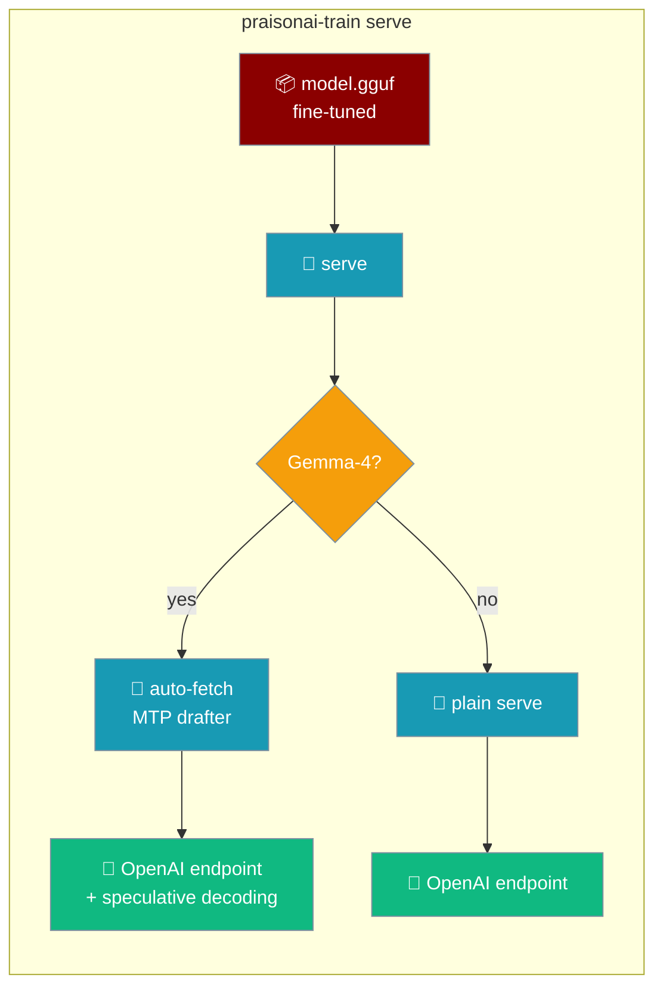
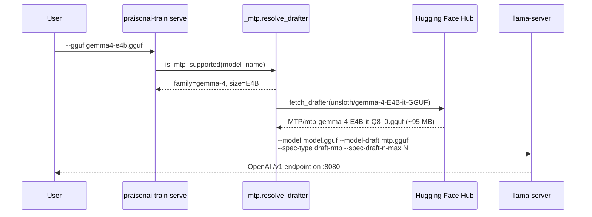

Serve any fine-tuned GGUF over an OpenAI-compatible HTTP endpoint. For Gemma-4, add MTP to get **lossless 1.4–2.2× faster generation** — no drafter retraining, one flag.



## Quick Start

<Steps>
<Step title="Serve a trained model">

Point at a GGUF and get an OpenAI-compatible endpoint on `127.0.0.1:8080`.

```bash
pip install "praisonai-train[llm]"

praisonai-train serve --gguf model.gguf
```

</Step>

<Step title="Use it from any OpenAI client">

The endpoint is OpenAI-compatible, so `praisonaiagents` (and every other OpenAI SDK) talks to it out of the box.

```python
from praisonaiagents import Agent

agent = Agent(
    instructions="You are a helpful assistant.",
    llm={
        "model": "openai/local",
        "base_url": "http://127.0.0.1:8080/v1",
        "api_key": "not-used",
    },
)
agent.start("Explain MTP in one sentence.")
```

</Step>

<Step title="Benchmark and see the MTP win">

`--benchmark` is a one-shot: it prints tokens-per-second plus draft acceptance for Gemma-4, then exits.

```bash
praisonai-train serve --gguf gemma4-e4b.gguf --benchmark
```

</Step>

<Step title="Export the GGUF with its MTP drafter">

Pass `--mtp-draft` when exporting a Gemma-4 model — the stock drafter is fetched and placed next to the GGUF so `serve` picks it up automatically.

```bash
praisonai-train export gguf --model-dir lora_model --mtp-draft
```

</Step>
</Steps>

---

## How It Works

MTP proposes several tokens with a small drafter, then the fine-tuned model verifies them in one pass — so the output is bitwise identical to plain serving.



The drafter is a **separate artifact** and is never contained in a plain `q4_K_M` GGUF — that is why the fetch step exists. Verification is done by the fine-tuned target model, so the generation is **lossless**: identical output, fewer forward passes.

| Step | What happens |
|------|--------------|
| Resolve target | `--gguf` or the first non-drafter `.gguf` under `--model-dir` |
| Detect family | Base model name from `--base-model`, `--config`, or `config.json` |
| Fetch drafter | Stock MTP GGUF pulled from the Hub for a Gemma-4 target |
| Launch | `llama-server` starts with the speculative-decoding flags |

---

## Configuration Options

Two surfaces: CLI flags on `serve`, and config-file keys the trainer accepts when you `export --mtp-draft`.

### CLI flags — `praisonai-train serve`

Provide either `--gguf` or `--model-dir` to pick the target.

| Flag | Short | Type | Default | Description |
|------|-------|------|---------|-------------|
| `--model-dir` | `-d` | path | — | Directory of the trained model — the target GGUF is auto-detected (drafter files are skipped). |
| `--gguf` | — | path | — | Explicit path to the target GGUF to serve. |
| `--config` | `-c` | path | — | Optional `config.yaml` for base-model / MTP knobs. |
| `--base-model` | — | str | — | Base model id used to select the MTP drafter. |
| `--mtp-draft` / `--no-mtp-draft` | — | bool | `True` | Use the stock MTP drafter (auto: on when the family supports it). |
| `--spec-draft-n-max` | — | int | `2` | Max tokens the MTP drafter proposes per step. |
| `--port` | — | int | `8080` | Port for `llama-server`. |
| `--ngl` | — | int | `99` | Number of layers to offload to GPU. |
| `--benchmark` | — | bool | `False` | Run a one-shot speed benchmark instead of serving. |

<Note>
Provide `--gguf` **or** `--model-dir` — without either, `serve` exits with `Nothing to serve: provide --gguf or --model-dir.` The server binds to `127.0.0.1` (there is no `--host` flag).
</Note>

### Config keys — `export --mtp-draft`

These keys are accepted by the trainer's config (`config.yaml`) alongside `export`.

| Key | Type | Default | Description |
|-----|------|---------|-------------|
| `mtp_draft` | `bool` | `False` | Fetch and publish the stock MTP drafter alongside the exported GGUF. |
| `mtp_draft_repo` | `str` | *auto (Gemma-4 map)* | Reserved override for the Hub repo the drafter is fetched from. |
| `mtp_draft_file` | `str` | *auto (Gemma-4 map)* | Reserved override for the drafter filename within the repo. |
| `spec_draft_n_max` | `int` | `2` | Passed through to `llama-server --spec-draft-n-max`. |

<Note>
`mtp_draft_repo` and `mtp_draft_file` are recognized config keys reserved for a custom drafter; the current fetch path resolves the repo and filename automatically from the Gemma-4 family + size.
</Note>

---

## Common Patterns

### Serve any GGUF (non-Gemma-4)

Plain serving works for every fine-tuned model. A non-Gemma family falls back to plain serving with a clear message.

```bash
praisonai-train serve --gguf qwen-finetune.gguf
```

```text
MTP fast inference isn't available for '<model>' (only the Gemma-4 family). Serving without a drafter.
```

### Serve from a model directory

Point at a directory and the target GGUF is auto-detected (drafter files are skipped).

```bash
praisonai-train serve --model-dir lora_model
```

### Benchmark before you ship

`--benchmark` prints raw tokens/sec and (for Gemma-4) draft acceptance in one line — confirm the MTP win on your box before flipping traffic over.

```bash
praisonai-train serve --gguf gemma4-e4b.gguf --benchmark
```

### Talk to it from `praisonaiagents`

Any Agent that already speaks OpenAI works — point `base_url` at `http://<host>:<port>/v1`.

```python
from praisonaiagents import Agent

agent = Agent(
    instructions="You are a helpful assistant.",
    llm={
        "model": "openai/local",
        "base_url": "http://127.0.0.1:8080/v1",
        "api_key": "not-used",
    },
)
agent.start("Say hello.")
```

---

## Supported models

Only **Gemma-4** ships a stock MTP drafter. Verified mapping (from `_mtp.py`):

| Base model family | Base repo (Unsloth GGUF) | Drafter file | Drafter size (~) |
|-------------------|--------------------------|--------------|------------------|
| Gemma-4 E2B | `unsloth/gemma-4-E2B-it-GGUF` | `MTP/mtp-gemma-4-E2B-it-Q8_0.gguf` | ~40 MB |
| Gemma-4 E4B | `unsloth/gemma-4-E4B-it-GGUF` | `MTP/mtp-gemma-4-E4B-it-Q8_0.gguf` | ~95 MB |
| Gemma-4 12B | `unsloth/gemma-4-12b-it-GGUF` | `MTP/mtp-gemma-4-12b-it-Q8_0.gguf` | — |

The drafter precision is `Q8_0` by default; `bf16` and `f16` variants resolve to `BF16` / `F16` filenames.

Non-Gemma models (Llama / Qwen / Mistral / Phi / DeepSeek) do **not** ship MTP drafters. `serve --gguf` still works on them — just without the speculative-decoding pathway. Do not expect a 1.4× on a Qwen fine-tune.

---

## Field notes

<Warning>
**Runtime maturity.** Gemma-4 E4B (MatFormer / per-layer-embedding arch) currently *loads but stalls on generation* in mainline llama.cpp `b10107` across CPU / Vulkan / CUDA on the validation box. The feature is correct and ready; it lights up as llama.cpp's E4B support matures and for the other sizes. Measured MTP speedup via the canonical HF-Transformers `assistant_model` path (E4B, one A6000, transformers 5.14.1): **7.04 → 9.86 tok/s = 1.40×**, within Unsloth's quoted 1.4–2.2× band.
</Warning>

<Note>
**Old GGUF converters may be incompatible.** A `q4_K_M` GGUF exported by an *older* converter may be tensor-incompatible with current llama.cpp. Re-export from merged weights with an up-to-date converter before serving.
</Note>

<Note>
**llama.cpp is required at runtime.** The `serve` path shells out to `llama-server` (auto-discovered via `find_llama_binary()`, or set `LLAMA_CPP_BIN`). Grab a build from [llama.cpp releases](https://github.com/ggml-org/llama.cpp/releases) — Homebrew, apt, or a manual `cmake -B build && cmake --build build` all work. MTP needs the `--spec-type draft-mtp` support from [ggml-org/llama.cpp#25148](https://github.com/ggml-org/llama.cpp/pull/25148).
</Note>

<Note>
**"Lossless" means bitwise-identical.** MTP only changes *how* the tokens are produced (draft + verify), not *which* tokens — a served GGUF returns the same output as plain serving. The 1.4× figure above is measured on the HF-Transformers path; the llama.cpp path lights up as its Gemma-4 support matures.
</Note>

---

## Best Practices

<AccordionGroup>
<Accordion title="Serve first, benchmark second, ship third">
`--benchmark` catches drafter compatibility and llama.cpp version drift before real traffic hits the endpoint. Run it once on your box, confirm the tok/s and draft-acceptance line, then serve.
</Accordion>

<Accordion title="Keep MTP opt-in on export">
`--mtp-draft` on `export` adds a ~95 MB artifact next to your GGUF. Leave it off for size-constrained deploys — you can always fetch the drafter later by serving with `--mtp-draft` (the default).
</Accordion>

<Accordion title="Match the drafter's quantization to your compute budget">
The default `Q8_0` drafter fits comfortably on CPU inference. For edge devices, consider a smaller variant if a matching one is published upstream.
</Accordion>

<Accordion title="Non-Gemma-4? Plain serve is still useful">
Any GGUF from `praisonai-train export gguf` can be served by this command — MTP is the bonus, not the point. A non-Gemma family falls back to plain serving with a clear message.
</Accordion>
</AccordionGroup>

---

## Related

<CardGroup cols={2}>
<Card title="Train" icon="graduation-cap" href="/train">
  Training overview and fine-tuning setup.
</Card>
<Card title="Train CLI" icon="terminal" href="/cli/train">
  Full flag reference for every subcommand.
</Card>
<Card title="praisonai-train Package" icon="graduation-cap" href="/features/praisonai-train-package">
  The standalone package guide.
</Card>
<Card title="Speed Benchmark" icon="gauge" href="/features/praisonai-train-benchmark">
  Rank deployments by generation speed (distinct from `serve --benchmark`).
</Card>
<Card title="Multi-GPU Training" icon="microchip" href="/features/praisonai-train-multigpu">
  Fine-tune across multiple GPUs with torchrun.
</Card>
<Card title="Installation Extras" icon="puzzle-piece" href="/features/installation-extras">
  The train install matrix.
</Card>
</CardGroup>
