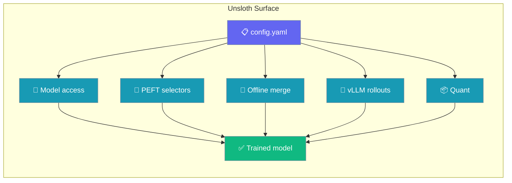
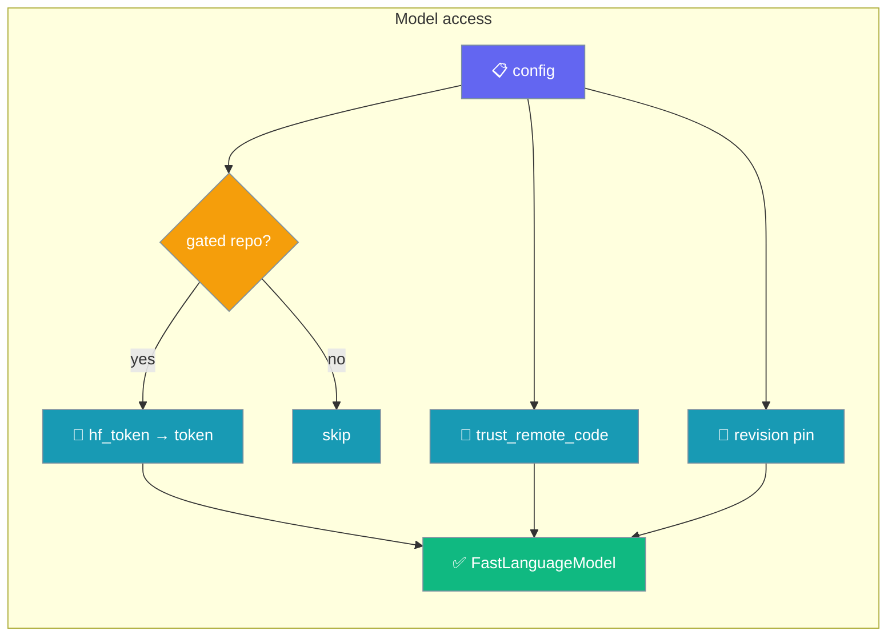
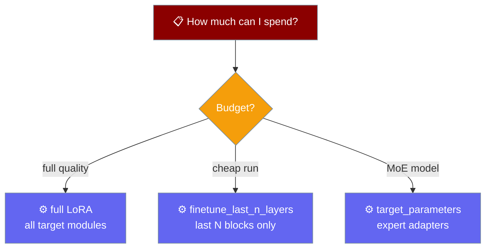
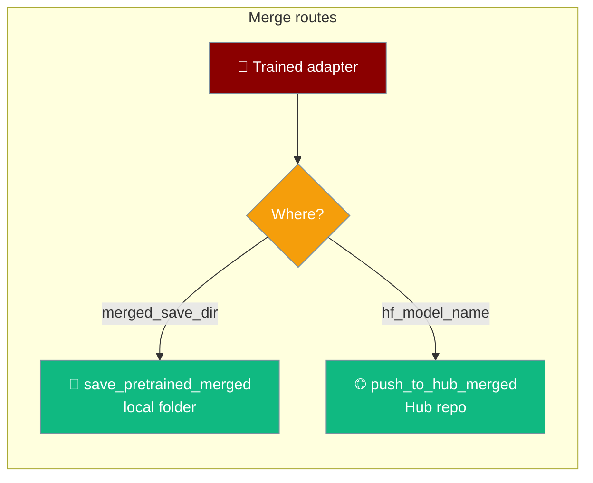
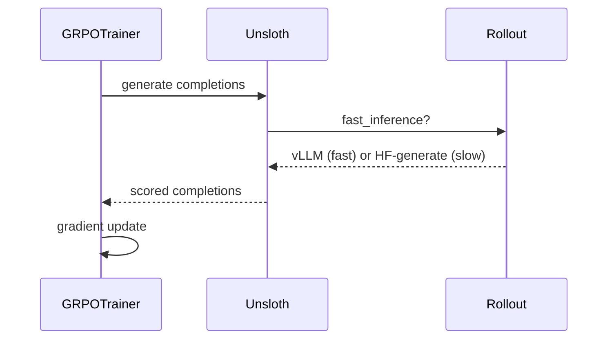
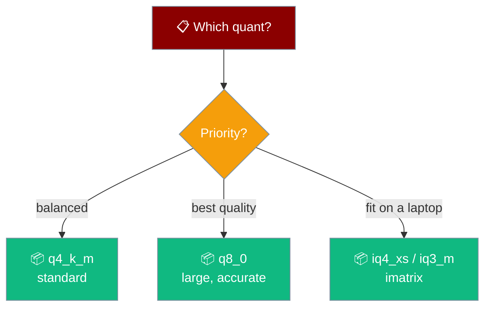

Reach gated and custom-code models, LoRA only the layers you want, merge offline into a folder, and turn on fast vLLM rollouts for GRPO — all from `config.yaml`.



These keys were always accepted by Unsloth but never forwarded — set any of them today and the run does exactly what you asked. All are additive; existing configs keep working.

## Quick Start

Train a gated Llama base with a token, pin the revision, and merge offline — no Hub account needed.

<Steps>
<Step title="Start from an Agent">

Pick the model you want to fine-tune, then reach it from a config.

```python
from praisonaiagents import Agent

agent = Agent(instructions="Answer briefly and correctly.")
agent.start("What is the capital of France?")
```

</Step>
<Step title="Reach a gated base and pin a revision">

```yaml
# config.yaml
model_name: "meta-llama/Meta-Llama-3.1-8B-Instruct"
max_seq_length: 2048
hf_token: "hf_xxx"          # or leave unset and use HF_TOKEN
revision: "main"            # pin so a multi-day run is reproducible
trust_remote_code: false
dataset:
  - name: "yahma/alpaca-cleaned"
```

</Step>
<Step title="Merge into a folder, no Hub">

```yaml
merged_save_dir: "./merged-model"
save_method: "merged_16bit"   # default
```

```bash
pip install "praisonai-train[llm]"
praisonai-train llm config.yaml
```

</Step>
</Steps>

---

## Model access

`hf_token`, `trust_remote_code`, and `revision` decide **which** weights load and how they are reached.



<Steps>
<Step title="Gated model (Llama / Gemma)">

```yaml
# config.yaml
model_name: "meta-llama/Meta-Llama-3.1-8B-Instruct"
max_seq_length: 2048
hf_token: "hf_xxx"          # config-level equivalent of HF_TOKEN
dataset:
  - name: "yahma/alpaca-cleaned"
```

</Step>
<Step title="Custom-code model">

```yaml
model_name: "some-org/custom-arch-model"
trust_remote_code: true      # required to run the repo's model code
```

</Step>
<Step title="Pin a revision for reproducibility">

```yaml
model_name: "meta-llama/Meta-Llama-3.1-8B-Instruct"
revision: "main"             # a branch, tag, or commit SHA
```

</Step>
</Steps>

| Key | Type | Default | Description |
|-----|------|---------|-------------|
| `hf_token` | `str` | — | Forwarded to Unsloth as `token`. Renamed so it can't collide with the trainer's own token handling. Only sent when set. |
| `trust_remote_code` | `bool` | — | Required for custom-code models. Only sent when set. |
| `revision` | `str` | — | Pin a HF branch, tag, or SHA for a reproducible multi-day run. Only sent when set. |

<Note>
Config `hf_token` is the config-level twin of the `HF_TOKEN` env var. Precedence: `HF_TOKEN` env var wins, then a cached `huggingface-cli login`, then config `hf_token`. See [Hub Privacy & Upload Options](/features/praisonai-train-hub-privacy).
</Note>

---

## PEFT selectors

Choose exactly which layers and parameters LoRA touches — from the last N transformer blocks to a MoE model's experts.



<Steps>
<Step title="Cheap run — last N layers">

Tune only the last few transformer blocks to cut memory and time.

```yaml
model_name: "unsloth/Qwen2.5-32B-Instruct-bnb-4bit"
max_seq_length: 2048
finetune_last_n_layers: 8
dataset:
  - name: "yahma/alpaca-cleaned"
```

</Step>
<Step title="MoE expert LoRA">

`target_parameters` is what lets LoRA reach a Mixture-of-Experts model's experts.

```yaml
model_name: "unsloth/mistral-8x7b-instruct-v0.3-bnb-4bit"
max_seq_length: 2048
target_parameters:
  - "mlp.experts"           # selector; confirm the exact name in Unsloth's docs
dataset:
  - name: "yahma/alpaca-cleaned"
```

</Step>
<Step title="Explicit layers and init scheme">

```yaml
layers_to_transform: [0, 1, 2, 3]     # explicit layer indices
layers_pattern: "model.layers"        # pattern for layer selection
init_lora_weights: "gaussian"         # "gaussian", "pissa", "olora", ...
```

</Step>
</Steps>

| Key | Type | Default | Description |
|-----|------|---------|-------------|
| `finetune_last_n_layers` | `int` | — | Tune only the last N transformer blocks — the cheap-run recipe. |
| `layers_to_transform` | `int \| list[int]` | — | Explicit layer indices to adapt. |
| `layers_pattern` | `str` | — | Regex / pattern selecting which layers to adapt. |
| `target_parameters` | `list[str]` | — | Parameter selectors — required to LoRA MoE experts. |
| `init_lora_weights` | `str \| bool` | — | LoRA init scheme, e.g. `"gaussian"`, `"pissa"`, `"olora"`. |

Each is forwarded to `FastLanguageModel.get_peft_model` only when set, so they compose with the existing `lora_r`, `lora_alpha`, `use_dora`, and `rank_pattern` keys.

---

## Offline merged export

`merged_save_dir` writes merged weights to a folder on this disk — no Hub account, no token, no network.



<Steps>
<Step title="Merge into a folder">

```yaml
model_name: "unsloth/gemma-2-2b-it-bnb-4bit"
max_seq_length: 2048
merged_save_dir: "./merged-model"
save_method: "merged_16bit"   # default; also "merged_4bit_forced", "lora"
dataset:
  - name: "yahma/alpaca-cleaned"
```

</Step>
</Steps>

| Key | Type | Default | Description |
|-----|------|---------|-------------|
| `merged_save_dir` | `str` | — | Merge the adapter into this local directory via `save_pretrained_merged`. No-op when unset. |
| `save_method` | `str` | `"merged_16bit"` | Merge precision — `"merged_16bit"`, `"merged_4bit_forced"`, or `"lora"`. |

Every run calls the merge step; it does nothing unless `merged_save_dir` is set. Contrast this with the Hub-push flow in [Export a trained model](/features/praisonai-train-export), which needs a repo id, a write token, and a network.

---

## vLLM fast rollouts (GRPO)

`fast_inference` swaps GRPO's slow HF-generate loop for vLLM rollouts — one line.



<Steps>
<Step title="Turn on fast rollouts">

```yaml
method: grpo
model_name: "unsloth/gemma-2-2b-it-bnb-4bit"
max_seq_length: 2048
fast_inference: true
gpu_memory_utilization: 0.6
max_lora_rank: 32
num_generations: 8
reward_funcs:
  - myproject.rewards:length_penalty
dataset:
  - name: "your-org/your-prompts"
```

</Step>
</Steps>

| Key | Type | Default | Description |
|-----|------|---------|-------------|
| `fast_inference` | `bool` | `false` | Turn on vLLM rollouts for GRPO. GRPO previously always ran the slow HF-generate path. |
| `gpu_memory_utilization` | `float` | — | vLLM GPU memory fraction. Only forwarded when `fast_inference` is truthy. |
| `max_lora_rank` | `int` | — | Max LoRA rank vLLM allocates for. Only forwarded when `fast_inference` is truthy. |

<Note>
`gpu_memory_utilization` and `max_lora_rank` are ignored unless `fast_inference` is on. See [Reward Functions & GRPO](/features/train-reward-functions).
</Note>

---

## Expanded quant list

Unsloth's exporter accepts 35 quantization methods — 24 standard plus 11 importance-matrix (IQ) quants. The IQ family is what lets a 30B model fit on a laptop.



### Standard (24)

```
bf16  f16  f32  fast_quantized  not_quantized  quantized
q2_k  q2_k_l  q3_k_l  q3_k_m  q3_k_s  q3_k_xs
q4_0  q4_1  q4_k  q4_k_m  q4_k_s
q5_0  q5_1  q5_k  q5_k_m  q5_k_s
q6_k  q8_0
```

### IMatrix — large-model / laptop-fit (11)

```
iq1_m  iq1_s  iq2_m  iq2_s  iq2_xs  iq2_xxs
iq3_m  iq3_s  iq3_xxs  iq4_nl  iq4_xs
```

<Steps>
<Step title="Imatrix quant — 30B on a laptop">

```yaml
model_name: "unsloth/Qwen2.5-32B-Instruct-bnb-4bit"
max_seq_length: 2048
quantization_method: iq4_xs      # imatrix quant — auto-fetches the matrix
# imatrix_file: "./my.imatrix"   # optional; supply your own
dataset:
  - name: "yahma/alpaca-cleaned"
```

</Step>
</Steps>

| Key | Type | Default | Description |
|-----|------|---------|-------------|
| `quantization_method` | `str` | `"q4_k_m"` | Any of the 35 valid quants above. Validated up front — a typo fails fast. |
| `imatrix_file` | `str` | — | Path to a precomputed importance matrix; forwarded to `push_to_hub_gguf`. Only sent when set — Unsloth otherwise auto-fetches one from `unsloth/<base>-GGUF`. |

Full quant reference lives in [Export a trained model](/features/praisonai-train-export#valid-quant-values).

---

## Best Practices

<AccordionGroup>
<Accordion title="Prefer config hf_token inside CI">
Config-level `hf_token` keeps the token out of environment inspection in CI. Outside CI, `export HF_TOKEN=hf_...` is simpler — the env var wins over config.
</Accordion>
<Accordion title="Pin revision for any run longer than a day">
A branch moves. Set `revision` to a tag or SHA so a run you resume tomorrow loads the same weights.
</Accordion>
<Accordion title="Reach for finetune_last_n_layers on big models">
Tuning the last 8 blocks of a 32B model is a fraction of the memory of full LoRA — start there, widen only if quality needs it.
</Accordion>
<Accordion title="Merge offline before you decide to publish">
`merged_save_dir` gives you the merged weights on disk with no Hub round-trip. Inspect them, then push separately only if you want to.
</Accordion>
<Accordion title="Use an imatrix quant to fit a large model on a laptop">
`iq4_xs` / `iq3_m` pack a 30B model small enough to run locally. Unsloth fetches the matrix automatically; supply `imatrix_file` only if you built your own.
</Accordion>
</AccordionGroup>

---

## Related

<CardGroup cols={2}>
<Card title="Train" icon="graduation-cap" href="/train">
Full fine-tuning flow and config.yaml reference.
</Card>
<Card title="Train CLI" icon="terminal" href="/cli/train">
Every `praisonai train` subcommand and config key.
</Card>
<Card title="Export a trained model" icon="upload" href="/features/praisonai-train-export">
Publish to HF, GGUF, or Ollama — full 35-quant reference.
</Card>
<Card title="Hub Privacy & Upload Options" icon="lock" href="/features/praisonai-train-hub-privacy">
Private-by-default pushes and the `hf_token` precedence ladder.
</Card>
<Card title="Reward Functions & GRPO" icon="scale-balanced" href="/features/train-reward-functions">
Score completions with Python and turn on vLLM fast rollouts.
</Card>
</CardGroup>
