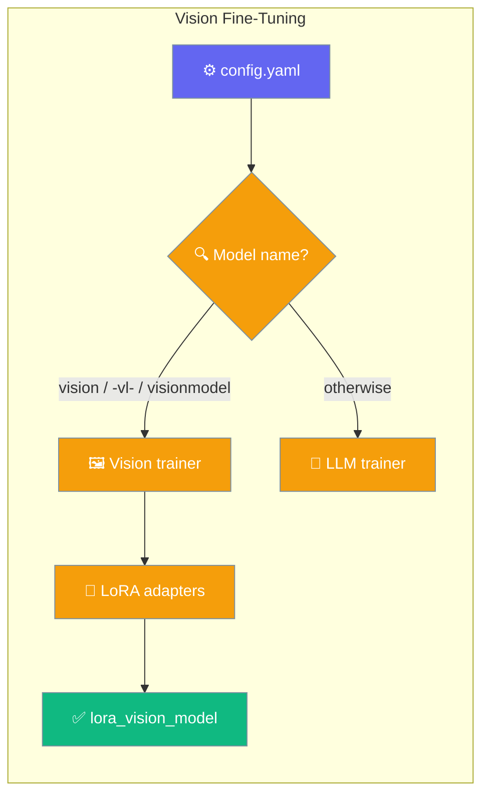
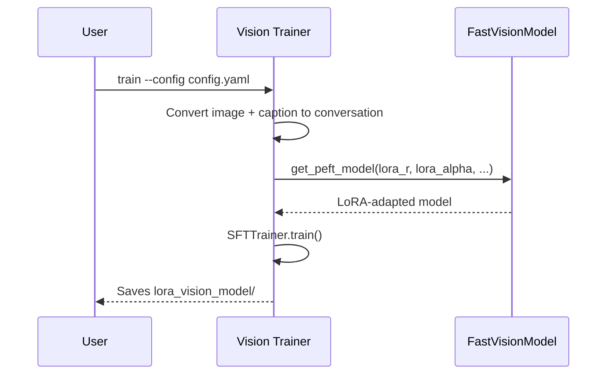

`praisonai-train` fine-tunes vision-language models on image-caption datasets, auto-selecting the vision trainer for any model whose name contains `vision`, `-vl-`, or `visionmodel`.



## Quick Start

<Steps>
<Step title="Write a vision config">
Point `model_name` at a vision model and list an image-caption dataset. A plain config trains locally and publishes nothing.

```yaml
model_name: unsloth/Llama-3.2-11B-Vision-Instruct
load_in_4bit: true
max_seq_length: 2048

dataset:
  - name: unsloth/Radiology_mini
    split_type: train

vision_instruction: "You are an expert radiographer. Describe accurately what you see in this image."
```
</Step>

<Step title="Train">
```bash
python -m praisonai_train.train_vision train --config config.yaml
```
</Step>
</Steps>

---

## How It Works

The vision trainer converts each image-caption row into a chat conversation, attaches vision-specific LoRA adapters via Unsloth's `FastVisionModel`, and trains with TRL's `SFTTrainer`.



<Note>
**Config now honoured (PraisonAI [#4879](https://github.com/MervinPraison/PraisonAI/pull/4879)).** Before #4879 the vision trainer ignored every `lora_*` / `random_state` / `use_rslora` key and always trained at the hardcoded literals `r=16, lora_alpha=16, lora_dropout=0, random_state=3407, use_rslora=False`. It now reads them from config with those literals as defaults, so an unchanged config produces an identical run.
</Note>

---

## Configuration Options

These keys are read by the vision trainer. Defaults match the source so an omitted key trains as before.

### LoRA & adapter targeting

| Key | Type | Default | Description |
|---|---|---|---|
| `finetune_vision_layers` | `bool` | `false` | Train the vision tower's layers. |
| `finetune_language_layers` | `bool` | `true` | Train the language layers. |
| `finetune_attention_modules` | `bool` | `true` | Train attention modules. |
| `finetune_mlp_modules` | `bool` | `true` | Train MLP modules. |
| `lora_r` | `int` | `16` | LoRA rank. **Honoured from config as of #4879.** |
| `lora_alpha` | `int` | `16` | LoRA alpha. **Honoured from config as of #4879.** |
| `lora_dropout` | `float` | `0` | LoRA dropout. **Honoured from config as of #4879.** |
| `lora_bias` | `str` | `"none"` | LoRA bias mode. |
| `random_state` | `int` | `3407` | PEFT seed. **Honoured from config as of #4879.** |
| `use_rslora` | `bool` | `false` | Enable RS-LoRA. **Honoured from config as of #4879.** |

### Run control & publishing

| Key | Type | Default | Description |
|---|---|---|---|
| `train` | `bool` | `true` | Set `false` to skip training. YAML `true` and `"true"` both work. |
| `huggingface_save` | `bool` | `false` | Push merged LoRA to the Hub. Requires `hf_model_name`. **Default flipped OFF in #4879** (was `"true"`). |
| `huggingface_save_gguf` | `bool` | `false` | Push GGUF quantizations to the Hub. Requires `hf_model_name`. **Default flipped OFF in #4879.** |
| `ollama_save` | `bool` | `false` | Push to Ollama. Requires `ollama_model`. **Default flipped OFF in #4879.** |
| `hf_model_name` | `str` | — | Target Hub repo. Required when `huggingface_save` / `huggingface_save_gguf` is on. |
| `ollama_model` | `str` | — | Target Ollama model. Required when `ollama_save` is on. |

<Note>
**Publishing is opt-in (PraisonAI [#4879](https://github.com/MervinPraison/PraisonAI/pull/4879)).** A vision config that omits `huggingface_save` used to push to the Hub — or crash with `KeyError: 'hf_model_name'` after training completed. Publishing now runs only when the flag **and** its target are both set, matching the LLM trainer. See [Hub Privacy](/features/praisonai-train-hub-privacy) for repo visibility.
</Note>

---

## Common Patterns

Train locally, publish nothing — omit every publish key:

```yaml
model_name: unsloth/Qwen2-VL-7B-Instruct
dataset:
  - name: unsloth/Radiology_mini
    split_type: train
```

Train and publish a private LoRA — set the flag, its target, and keep the default private visibility:

```yaml
model_name: unsloth/Llama-3.2-11B-Vision-Instruct
dataset:
  - name: unsloth/Radiology_mini
    split_type: train
huggingface_save: true
hf_model_name: me/my-vision-model
```

Override the LoRA rank — now honoured on the vision path:

```yaml
model_name: mistral-community/pixtral-12b
lora_r: 8
lora_alpha: 8
dataset:
  - name: unsloth/Radiology_mini
    split_type: train
```

---

## Best Practices

<AccordionGroup>
<Accordion title="Keep publish keys out of local runs">
Omit `huggingface_save` / `huggingface_save_gguf` / `ollama_save` entirely for local experiments — no target, no push, no crash. Set the flag and its target only when publishing.
</Accordion>

<Accordion title="Set LoRA keys intentionally">
Drop the `lora_*` keys to keep the `r=16, lora_alpha=16, lora_dropout=0` defaults, or set them deliberately — as of #4879 they take effect on the vision path instead of being ignored.
</Accordion>

<Accordion title="Match the instruction to your dataset">
`vision_instruction` becomes the user turn for every sample. Set it to describe the task your captions answer, so the fine-tune learns the right response style.
</Accordion>

<Accordion title="Use YAML booleans freely">
Both `train: true` and `train: "true"` work in vision configs from #4879 — the old code crashed calling `.lower()` on a real boolean.
</Accordion>
</AccordionGroup>

---

## Related

<CardGroup cols={2}>
<Card title="Training Reference" icon="graduation-cap" href="/train">
  Full config reference for the LLM and vision trainers.
</Card>
<Card title="Hub Privacy" icon="lock" href="/features/praisonai-train-hub-privacy">
  Private-by-default Hub pushes and visibility options.
</Card>
</CardGroup>
