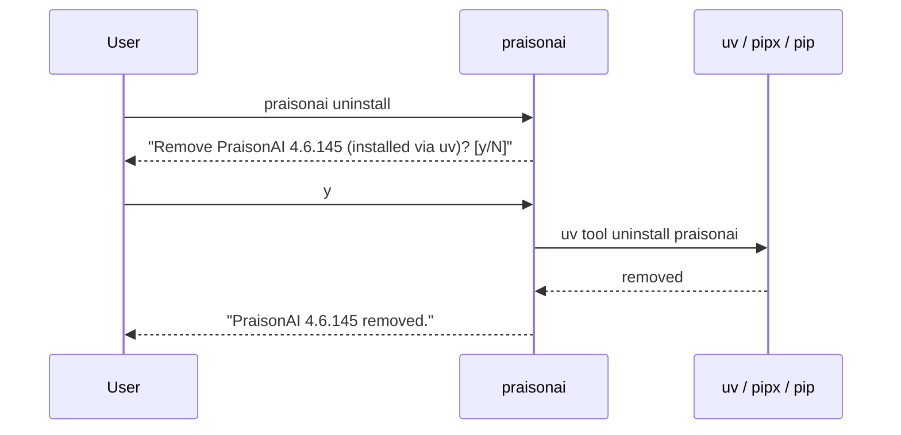

`praisonai uninstall` removes the managed CLI install and its global `praisonai` shim, confirming first unless you pass `--yes`.


## Quick Start

<Steps>
<Step title="Remove interactively">
```bash
praisonai uninstall
```
Asks `Remove PraisonAI X.Y.Z (installed via uv)? [y/N]`, then removes via the detected manager.
</Step>

<Step title="Remove without a prompt (CI)">
```bash
praisonai uninstall --yes
```
Skips confirmation — the CI-safe form. `-y` is the short alias.
</Step>
</Steps>

---

## How It Works

`praisonai uninstall` detects how the CLI was installed and runs the matching removal command.



| Detected manager | Uninstall command |
|------------------|-------------------|
| `uv` | `uv tool uninstall praisonai` |
| `pipx` | `pipx uninstall praisonai` |
| `pip` (library install) | `pip uninstall -y praisonai` |

<Note>
This is **CLI self-management only** — `praisonaiagents` (the SDK) is **not** removed by this command.
</Note>

---

## Options

| Flag | Description |
|------|-------------|
| `--yes`, `-y` | Skip the confirmation prompt (non-interactive/CI). |

### JSON output

Add `--output json` for machine-readable output.

```json
{"manager": "uv", "removed": "4.6.145"}
```

<Warning>
JSON mode never prompts. It proceeds as if `--yes` were passed, so only use `--output json` when you intend to remove without confirmation.
</Warning>

---

## Common Patterns

Remove in a CI teardown step.

```bash
praisonai uninstall --yes
```

Capture the result for a report.

```bash
praisonai uninstall --yes --output json
```

---

## Non-Managed Installs

When automatic uninstall isn't supported for the detected manager, PraisonAI prints a clear error and exits non-zero.

```
Automatic uninstall is not supported for a 'pip' install.
Remove manually with: pip uninstall praisonai
```

---

## Best Practices

<AccordionGroup>
<Accordion title="Use --yes only in automation">
Keep the confirmation prompt on for interactive use. Reach for `--yes` (or `-y`) only in CI teardown or scripted fleet removal.
</Accordion>

<Accordion title="Uninstall removes the CLI, not the SDK">
If you embed `praisonaiagents` in your own app, `praisonai uninstall` leaves it intact. Remove the SDK separately with `pip uninstall praisonaiagents`.
</Accordion>

<Accordion title="Let the detected manager do the work">
The command runs the same manager that installed the CLI, so the isolated `uv tool` / `pipx` environment is removed cleanly without leftover shims.
</Accordion>
</AccordionGroup>

---

## Related

<CardGroup cols={2}>
  <Card title="praisonai upgrade" icon="arrow-up" href="/docs/features/praisonai-upgrade">
    Update the CLI in place
  </Card>
  <Card title="Update Hint" icon="bell" href="/docs/features/praisonai-update-hint">
    Non-blocking "update available" notice
  </Card>
  <Card title="Installer Internals" icon="gear" href="/docs/install/installer">
    How install.sh provisions the CLI
  </Card>
  <Card title="Quick Install" icon="bolt" href="/docs/install/quickstart">
    One-liner install
  </Card>
</CardGroup>
