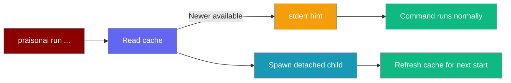
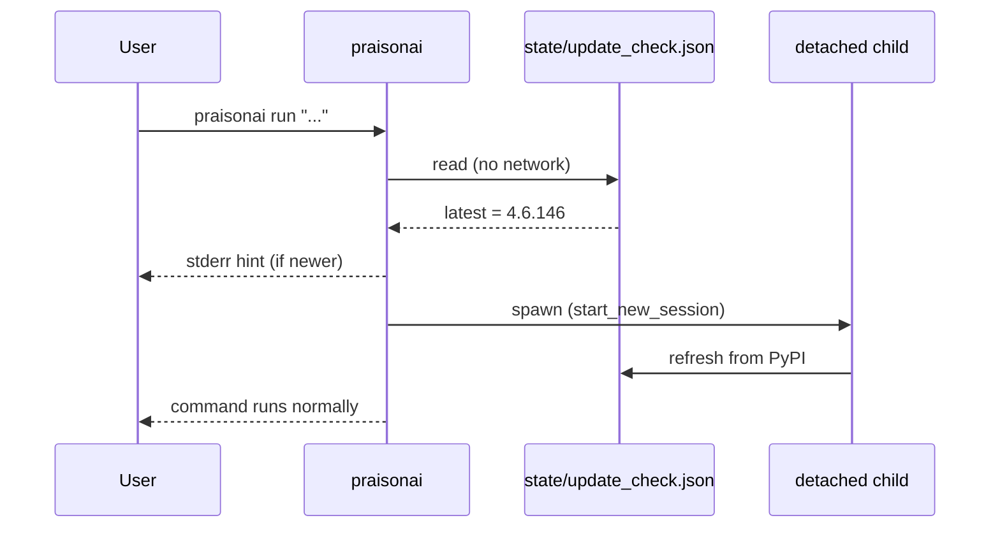

The update hint prints a one-line "a newer version is available" notice at start-up, refreshing its cache in a fully detached background process so it never blocks or slows the CLI.



## Quick Start

<Steps>
<Step title="See the hint">
Run any command. If a newer release is cached, PraisonAI prints this to stderr:
```
A newer PraisonAI is available: 4.6.145 -> 4.6.146. Run: praisonai upgrade
```
</Step>

<Step title="Opt out">
```bash
export PRAISONAI_NO_UPDATE_CHECK=1
```
Suppresses both the hint and the background refresh.
</Step>
</Steps>

---

## How It Works

Every text-mode, non-quiet start reads a cached version file, prints a hint if a newer release is known, then warms the cache for the *next* start in a detached child.



| Aspect | Behaviour |
|--------|-----------|
| Cache location | `<user_config_dir>/state/update_check.json` |
| Cache TTL | 24 hours |
| Where it prints | stderr, text mode only |
| Parent-process network I/O | Never — the parent only reads the cache |
| Refresh process | Fully detached child (`start_new_session=True` on POSIX; `CREATE_NO_WINDOW | DETACHED_PROCESS` on Windows) |

<Note>
The hint **never blocks start-up, never performs network I/O in the parent process, and never raises.** A missing, stale, or unwritable cache simply yields no hint.
</Note>

---

## Options

Control the hint with one environment variable.

| Variable | Values | Description |
|----------|--------|-------------|
| `PRAISONAI_NO_UPDATE_CHECK` | `1`, `true`, `yes`, `on` (case-insensitive) | Suppress both the hint and the background cache refresh. |

The hint is also suppressed automatically in `--output json` mode — only text mode emits it.

---

## Common Patterns

Disable the hint for a single command.

```bash
PRAISONAI_NO_UPDATE_CHECK=1 praisonai run "2+2"
```

Disable it permanently in CI by exporting the variable in your environment.

```bash
export PRAISONAI_NO_UPDATE_CHECK=1
```

---

## Best Practices

<AccordionGroup>
<Accordion title="Leave it on for interactive use">
The hint costs nothing at start-up (cache-only read) and reminds you when a fix or feature ships. Keep it enabled on developer machines.
</Accordion>

<Accordion title="Opt out in CI and headless jobs">
Set `PRAISONAI_NO_UPDATE_CHECK=1` in pipelines to avoid stderr noise and the background refresh spawn.
</Accordion>

<Accordion title="Warm the cache with --check">
`praisonai upgrade --check` refreshes the same cache, so a one-off check makes the next start's hint accurate without waiting for the 24h TTL.
</Accordion>
</AccordionGroup>

---

## Related

<CardGroup cols={2}>
  <Card title="praisonai upgrade" icon="arrow-up" href="/docs/features/praisonai-upgrade">
    Update the CLI in place
  </Card>
  <Card title="praisonai uninstall" icon="trash" href="/docs/features/praisonai-uninstall">
    Cleanly remove the managed install
  </Card>
</CardGroup>
