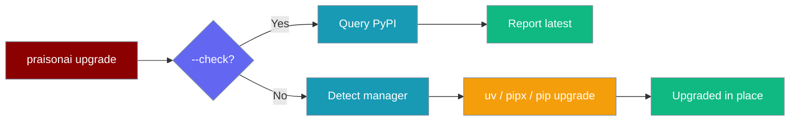
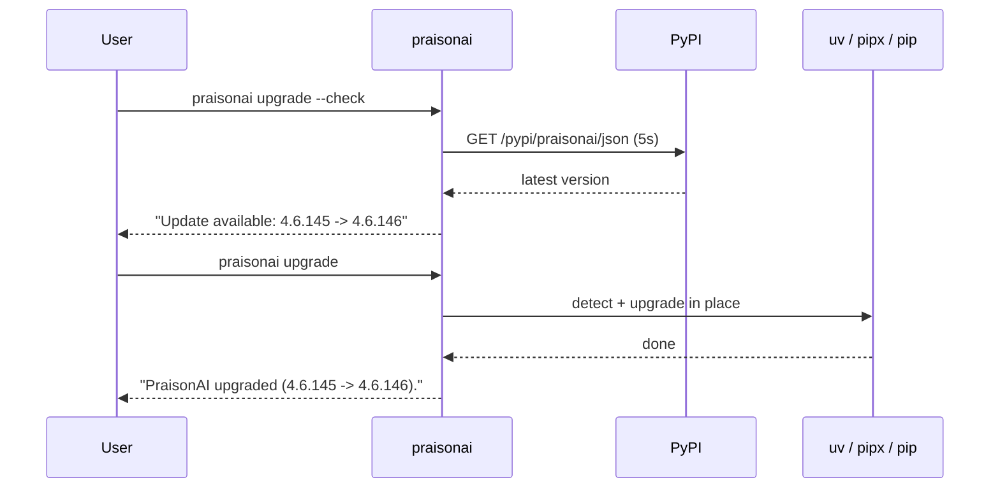

`praisonai upgrade` updates the managed CLI in place using whichever tool manager installed it, and `--check` reports whether a newer release exists without touching anything.



## Quick Start

<Steps>
<Step title="Check for a newer version">
```bash
praisonai upgrade --check
```
Queries PyPI (5s timeout) and prints `Update available: X.Y.Z -> X.Y.Z+1` or `You are on the latest version (X.Y.Z).`
</Step>

<Step title="Upgrade in place">
```bash
praisonai upgrade
```
Detects the manager (`uv` → `pipx` → `pip`) and runs the matching upgrade command.
</Step>
</Steps>

---

## How It Works

`praisonai upgrade` mirrors the one-line installer's detection order and only ever touches the CLI binary.



| Detected manager | Upgrade command |
|------------------|-----------------|
| `uv` | `uv tool upgrade praisonai` |
| `pipx` | `pipx upgrade praisonai` |
| `pip` (library install) | `pip install --upgrade praisonai` |

<Note>
This is **CLI self-management only** — `praisonaiagents` (the SDK) is never touched by `praisonai upgrade`.
</Note>

---

## Options

`praisonai upgrade` takes a single flag.

| Flag | Description |
|------|-------------|
| `--check` | Report whether a newer version exists without upgrading. |

### JSON output

Add `--output json` for machine-readable output.

<CodeGroup>
```json --check
{"current": "4.6.145", "latest": "4.6.146", "update_available": true}
```
```json upgrade
{"manager": "uv", "previous": "4.6.145", "current": "4.6.146"}
```
</CodeGroup>

`--check` also warms the background update-check cache, so long-lived installs surface the [update hint](/docs/features/praisonai-update-hint) on next start without their own network round-trip.

---

## Common Patterns

Check first, then upgrade in CI.

```bash
if praisonai upgrade --check --output json | grep -q '"update_available": true'; then
  praisonai upgrade
fi
```

Non-interactive fleet upgrade — `upgrade` never prompts, so it is safe to run unattended.

```bash
praisonai upgrade
```

---

## Non-Managed Installs

When PraisonAI was installed with plain `pip` (library/embedded use), automatic upgrade is unsupported.

```
Automatic upgrade is not supported for a 'pip' install.
Upgrade manually with: pip install --upgrade praisonai
```

If `--check` cannot reach PyPI, it exits non-zero:

```
Could not check for updates (network error).
```

---

## Best Practices

<AccordionGroup>
<Accordion title="Check before upgrading in automation">
Run `praisonai upgrade --check --output json` and gate the upgrade on `update_available` so pipelines only reinstall when a new release exists.
</Accordion>

<Accordion title="Let the installer pick the manager">
The one-line installer provisions `uv tool` or `pipx`. Keep that managed environment so `praisonai upgrade` can update in place without manual `pip` commands.
</Accordion>

<Accordion title="Combine with the update hint">
Leave the [background update hint](/docs/features/praisonai-update-hint) on. `--check` warms its cache, so subsequent starts remind you to upgrade without any network call.
</Accordion>
</AccordionGroup>

---

## Related

<CardGroup cols={2}>
  <Card title="praisonai uninstall" icon="trash" href="/docs/features/praisonai-uninstall">
    Cleanly remove the managed install
  </Card>
  <Card title="Update Hint" icon="bell" href="/docs/features/praisonai-update-hint">
    Non-blocking "update available" notice
  </Card>
  <Card title="Installer Internals" icon="gear" href="/docs/install/installer">
    How install.sh provisions the CLI
  </Card>
  <Card title="Quick Install" icon="bolt" href="/docs/install/quickstart">
    One-liner install
  </Card>
</CardGroup>
