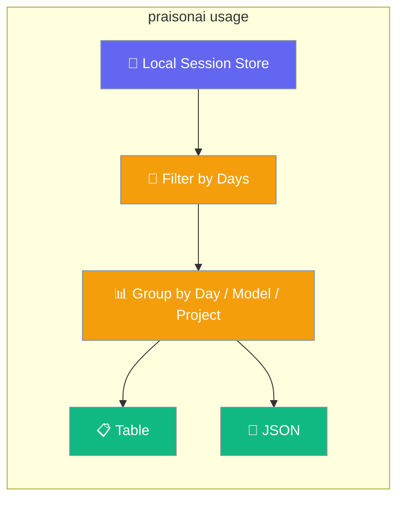
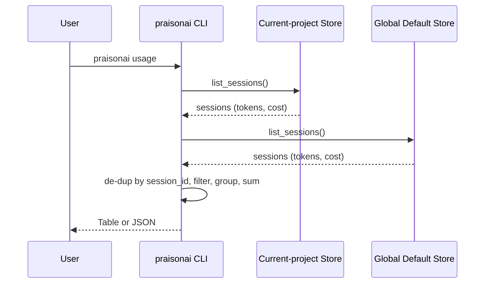
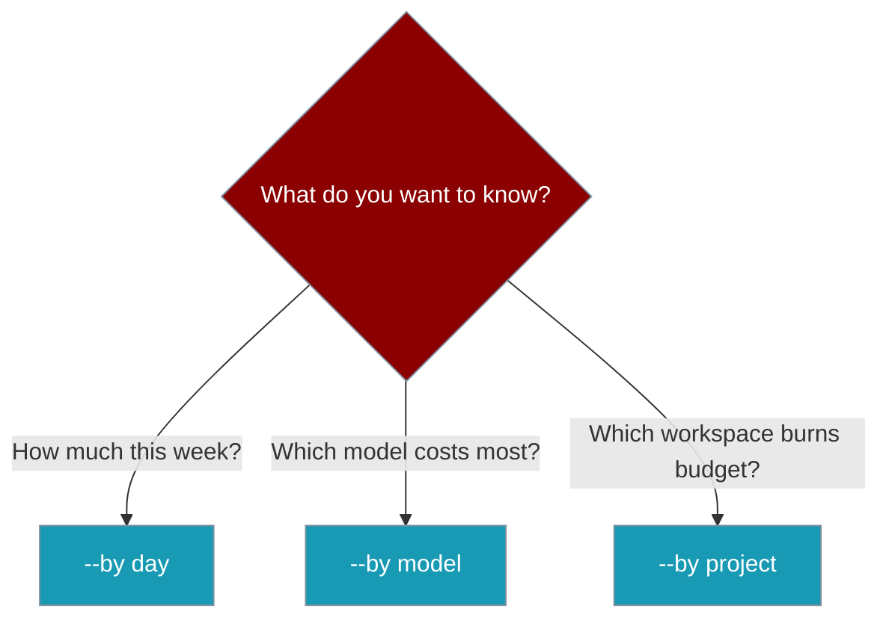

See how many tokens and dollars your agents have spent — locally, with one command, no external service.

```bash
praisonai usage
```



<Note>Run `praisonai` at least once so a session exists — otherwise the report is empty.</Note>

## Quick Start

<Steps>
<Step title="See your spend">

```bash
praisonai usage
```

</Step>

<Step title="Change the grouping">

```bash
praisonai usage --by model
praisonai usage --by project
```

</Step>

<Step title="Narrow the window or script it">

```bash
praisonai usage --days 7
praisonai usage --json
```

</Step>
</Steps>

---

## How It Works



The command reads the already-persisted `total_tokens` and `cost` fields on each session record in the local session store, filters by `--days`, groups by `--by`, and renders a table or JSON. No new data is written, no network calls, no configuration.

| Behaviour | Detail |
|-----------|--------|
| Two stores read | Without `--project`, both the current-project store and the global default store are read, tagged `current` / `global`. |
| De-duplication | Sessions shared across both stores are collapsed by `session_id`. |
| Bounded scan | Up to `100,000` sessions per store are read. |
| Cost source | The persisted `cost` uses the same `ModelPricing` table as `praisonai tracker`, so numbers match. |

<Note>Cost values match `praisonai tracker` — both read from the same pricing reference.</Note>

---

## Choosing `--by`

Pick the dimension that answers your question.



`day` sorts chronologically; `model` and `project` sort by highest token count first.

---

## Options

| Option | Short | Type | Default | Values | Description |
|--------|-------|------|---------|--------|-------------|
| `--days` | `-d` | `int` | `30` | any int; `0` = all | Only include sessions updated in the last N days. |
| `--by` | `-b` | `str` | `day` | `day` \| `model` \| `project` | Group rows by dimension. Invalid values exit `1`. |
| `--project` | `-p` | `str` | `None` | any project id | Restrict to a specific project's session store. |
| `--json` | — | `bool` | `False` | flag | Emit machine-readable JSON instead of a table. |

An invalid `--by` value prints `--by must be one of: day, model, project` and exits with code `1`.

---

## Output Formats

<Tabs>
<Tab title="Table">

```
┌────────────┬────────┬─────────┐
│ Day        │ Tokens │ Cost    │
├────────────┼────────┼─────────┤
│ 2026-07-19 │ 12,345 │ $0.1234 │
│ Total      │ 12,345 │ $0.1234 │
└────────────┴────────┴─────────┘
```

Zero values render as `-`, and a final `Total` row sums the report.

</Tab>
<Tab title="JSON">

```json
{
  "by": "day",
  "days": 30,
  "project": null,
  "rows": [{"key": "2026-07-19", "total_tokens": 12345, "cost": 0.1234}],
  "total_tokens": 12345,
  "cost": 0.1234,
  "errors": []
}
```

</Tab>
</Tabs>

---

## Empty Stores and Warnings

Empty and broken reports are always distinguishable.

- No sessions yet? The command prints `No usage recorded yet` and exits `0`.
- A damaged or unreadable store surfaces as `Usage may be incomplete: ...` in table mode, or in the top-level `errors` array in JSON mode.

---

## Best Practices

<AccordionGroup>
<Accordion title="Alert on spend in CI">
Wire `praisonai usage --days 7 --json` into a cron or CI job and alert if `cost` exceeds a threshold.
</Accordion>
<Accordion title="Find your most expensive model">
Run `praisonai usage --by model` weekly to see which model your agents actually spend the most on.
</Accordion>
<Accordion title="Compare workspaces">
Use `praisonai usage --project <id>` inside a workspace and `praisonai usage --by project` in the default shell to compare workloads.
</Accordion>
<Accordion title="Script with jq">
`--json` is stable for scripting — pipe into `jq` or a small dashboard rather than parsing the table.
</Accordion>
</AccordionGroup>

---

## Related

<CardGroup cols={2}>
<Card title="Token Usage Protocol" icon="chart-line" href="/docs/features/token-usage-protocol">
  Wire custom sinks and queries (databases, dashboards)
</Card>
<Card title="Sessions" icon="folder" href="/docs/features/sessions">
  The store `praisonai usage` reads from
</Card>
<Card title="Cost Tracker" icon="receipt" href="/docs/cli/tracker">
  Per-run token and cost tracking
</Card>
</CardGroup>
