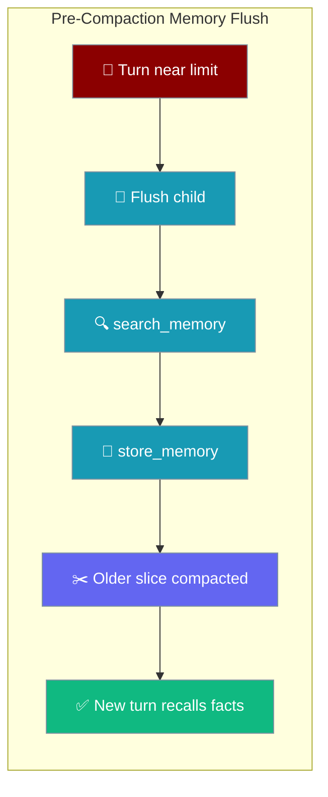
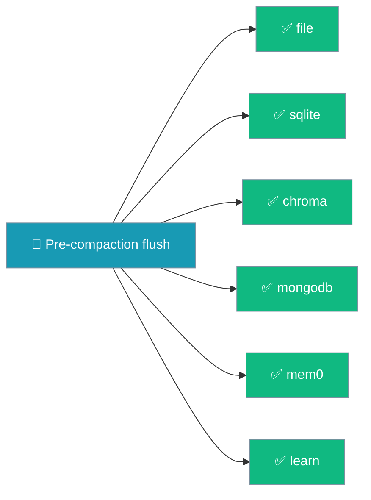
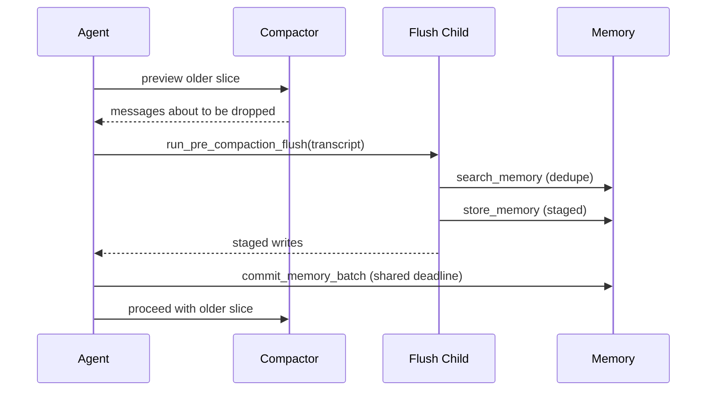

Save durable user facts to long-term memory before context compaction discards the older messages that contain them.



Context compaction is lossy — messages that fall outside the compaction window are gone. This feature runs one bounded child agent with `search_memory` and `store_memory` **before** compaction, so stable user-provided facts in the older slice are saved to long-term memory first. It never blocks compaction: if the child times out or fails, compaction still runs.

<Note>
As of PraisonAI [#4203](https://github.com/MervinPraison/PraisonAI/pull/4203), this flush durably commits staged facts on **every** built-in memory backend — `file`, `sqlite`, `chroma`, `mongodb`, `mem0`, and `learn`. Earlier releases only committed on `FileMemory`; on every other backend the commit raised, the error was silently swallowed, and compaction proceeded having saved nothing.
</Note>

### Supported Backends

Every built-in `Memory` backend now implements `commit_memory_batch` / `acommit_memory_batch`, so the flush persists facts before compaction on all of them.

| Backend | Durable pre-compaction flush |
|---|---|
| `file` | ✅ |
| `sqlite` | ✅ |
| `chroma` | ✅ |
| `mongodb` | ✅ |
| `mem0` | ✅ |
| `learn` | ✅ |



## Quick Start

<Steps>
<Step title="Enable with True">
One bool on `ExecutionConfig` turns the flush on. It stays off by default with zero overhead — the child agent is never constructed.

```python
from praisonaiagents import Agent, ExecutionConfig

agent = Agent(
    name="Support Agent",
    instructions="Help the user with their account.",
    memory=True,
    execution=ExecutionConfig(
        context_compaction=True,
        pre_compaction_memory_flush=True,   # the whole feature
    ),
)

agent.start("Remember my customer id is C-99. My preferred language is French.")
```
</Step>

<Step title="Tune with the config class">
Swap the bool for `PreCompactionMemoryFlushConfig` to set the deadline, token cap, minimum turns, or a cheaper model for the child.

```python
from praisonaiagents import Agent, ExecutionConfig, PreCompactionMemoryFlushConfig

agent = Agent(
    name="Support Agent",
    instructions="Help the user with their account.",
    memory=True,
    execution=ExecutionConfig(
        context_compaction=True,
        pre_compaction_memory_flush=PreCompactionMemoryFlushConfig(
            timeout_seconds=15,
            max_flush_tokens=6000,
            llm="gpt-4o-mini",
        ),
    ),
)

agent.start("Remember my customer id is C-99. My preferred language is French.")
# Long conversation → compaction fires → the flush saves "customer id = C-99"
# and "preferred language = French" to long-term memory before those turns are removed.
```
</Step>
</Steps>

---

## How It Works

The flush fires at the older-slice boundary — exactly the messages that are about to disappear — searches memory to avoid duplicates, stages writes, and commits them only if the child finishes in time.



The child agent has zero autonomy budget (`max_steps=3`, no streaming, no verbose) and cannot recurse into another compaction. Only `user` and `assistant` text is serialised — `tool` messages and non-text parts are dropped.

---

## MemoryFlushResult

The flush returns a frozen `MemoryFlushResult` (importable from `praisonaiagents.compaction`) describing what happened.

| Field | Type | Meaning |
|-------|------|---------|
| `attempted` | `bool` | `True` if the child agent actually ran. |
| `completed` | `bool` | `True` if the child finished and staged writes committed in time. |
| `reason` | `str` | One of the seven values below. |
| `messages_considered` | `int` | Count of user/assistant text messages the flush looked at. |

| `reason` | Plain English |
|----------|---------------|
| `disabled` | Feature turned off in config or via env var. |
| `no_memory` | Parent agent has no memory backend. |
| `below_minimum` | Fewer eligible turns than `min_turns_to_flush`. |
| `empty` | No user/assistant text to flush after filtering. |
| `timeout` | Child exceeded `timeout_seconds`; staged writes discarded. |
| `error` | Child raised; compaction continues unchanged. |
| `completed` | Child finished and writes committed. |

---

## Configuration Options

`PreCompactionMemoryFlushConfig` controls the child agent's budget.

| Option | Type | Default | Description |
|--------|------|---------|-------------|
| `enabled` | `bool` | `True` | Whether the flush runs when this config is assigned to `ExecutionConfig.pre_compaction_memory_flush`. |
| `timeout_seconds` | `float` | `20.0` | Hard wall-clock deadline for the whole flush. Must be finite and positive. |
| `min_turns_to_flush` | `int` | `2` | Skip unless at least this many eligible user/assistant messages exist in the older slice. |
| `max_flush_tokens` | `int` | `8000` | Cap on the transcript handed to the child; oversized transcripts are truncated with a `[transcript truncated]` sentinel. |
| `llm` | `Optional[str]` | `None` | Model for the child agent. `None` falls back to the parent's `agent.llm`. |

<Note>
The nested config defaults to `enabled=True` so `PreCompactionMemoryFlushConfig(...)` is ergonomic. The containing `ExecutionConfig.pre_compaction_memory_flush` slot stays default-off.
</Note>

---

## Environment Overrides

Two environment variables override the code-level config at runtime.

| Env var | Effect |
|---------|--------|
| `PRAISONAI_PRE_COMPACTION_FLUSH` | `1`/`true`/`yes`/`on` force-enables; `0`/`false`/`no`/`off` force-disables. Overrides `enabled`. |
| `PRAISONAI_PRE_COMPACTION_FLUSH_TIMEOUT` | Positive float overrides `timeout_seconds`. |

Invalid values are ignored with a logged warning — the code-level config stands.

---

## Behaviour Guarantees

- **Never blocks compaction.** Every failure path returns a `MemoryFlushResult(attempted=True, completed=False, ...)` and logs a warning; compaction proceeds unchanged.
- **Atomic commit-or-nothing.** Child writes are staged and committed only after successful, in-time completion. A timed-out worker cannot mutate the parent memory store. Each staged write is re-gated by the shared deadline and `commit_guard`; a cancelled or expired flush persists nothing on any backend.
- **Works on every backend.** `commit_memory_batch` maps each staged `add_*` write to the backend's `store_*` method (`add_short_term` → `store_short_term`, `add_long_term` → `store_long_term`) so `sqlite` / `chroma` / `mongodb` / `mem0` / `learn` durably persist facts, not just `file`.
- **Sync path in a daemon thread.** A stuck provider cannot delay process shutdown.
- **Tool payloads excluded.** Only `user` and `assistant` text is serialised.
- **Prompt-injection posture.** The child treats the transcript as data, not instructions, refuses to store credentials or secrets, and uses only the two provided memory tools.

<Warning>
**Deadlock note.** `commit_memory_batch` explicitly does **not** hold the memory `_write_lock` while dispatching writes — each `store_*` method serialises its own SQLite writes under that non-reentrant `threading.Lock`, so nesting would deadlock. If you subclass `Memory` with custom `store_*` methods, keep them responsible for their own locking and do not re-acquire `_write_lock` from `commit_memory_batch`.
</Warning>

The async variant `acommit_memory_batch` prefers a `store_*_async` method when the adapter exposes one; otherwise it offloads the blocking `store_*` call to `asyncio.to_thread` so the event loop stays responsive. Each write is gated by the same deadline / cancellation guard as the sync path, so late or cancelled facts are never persisted after compaction resumes.

---

## Common Patterns

Save user preferences before a chat session's context rotates by enabling the flush alongside compaction:

```python
from praisonaiagents import Agent, ExecutionConfig

agent = Agent(
    name="Concierge",
    instructions="Assist the guest across a long conversation.",
    memory=True,
    execution=ExecutionConfig(
        context_compaction=True,
        pre_compaction_memory_flush=True,
    ),
)
```

Point a cheaper model at the flush child than the parent uses for the main loop:

```python
from praisonaiagents import ExecutionConfig, PreCompactionMemoryFlushConfig

execution = ExecutionConfig(
    context_compaction=True,
    pre_compaction_memory_flush=PreCompactionMemoryFlushConfig(llm="gpt-4o-mini"),
)
```

Wire an app-level metric on `MemoryFlushResult.reason` (count `timeout` vs `completed`) to tune `timeout_seconds` over time.

---

## Best Practices

<AccordionGroup>
<Accordion title="Leave the default timeout unless the flush times out">
The child is capped at `max_steps=3` and rarely needs more than the default `timeout_seconds=20.0`. Raise it only if you observe `reason == "timeout"` dominating.
</Accordion>

<Accordion title="Set a cheap dedicated model for the flush">
When the parent uses an expensive model, pass `llm="gpt-4o-mini"` (or similar). The flush job is short and doesn't need the top-tier model.
</Accordion>

<Accordion title="Tune min_turns_to_flush to skip tiny compactions">
The default `min_turns_to_flush=2` avoids firing on trivial compactions. Raise it if `reason == "below_minimum"` dominates your metrics.
</Accordion>

<Accordion title="Respect the child's security boundary">
The child agent shares the parent's memory backend but cannot access its tools — that's a deliberate boundary. Don't try to bypass it by mutating the child.
</Accordion>
</AccordionGroup>

---

## Advanced

Framework authors wiring the flush into a custom compactor path can call `run_pre_compaction_flush` (async) or `run_pre_compaction_flush_sync` directly. Both need a `parent_agent` shaped like `Agent` — it must expose `_memory_instance` and `.llm`.

```python
from praisonaiagents.compaction.memory_flush import run_pre_compaction_flush_sync

result = run_pre_compaction_flush_sync(agent, messages_to_flush, config=True)
print(result.reason)
```

---

## Related

<CardGroup cols={2}>
<Card title="Context Compaction" icon="scissors" href="/features/context-compaction">
Automatically compact chat history near the token limit.
</Card>
<Card title="Memory" icon="brain" href="/features/advanced-memory">
Long-term memory storage and retrieval.
</Card>
<Card title="Context Compaction Policy" icon="sliders" href="/features/context-compaction-policy">
Choose the strategy that runs after the older-slice boundary.
</Card>
<Card title="Session Compaction Checkpoint" icon="floppy-disk" href="/features/session-compaction-checkpoint">
Persist compaction state across sessions.
</Card>
</CardGroup>
