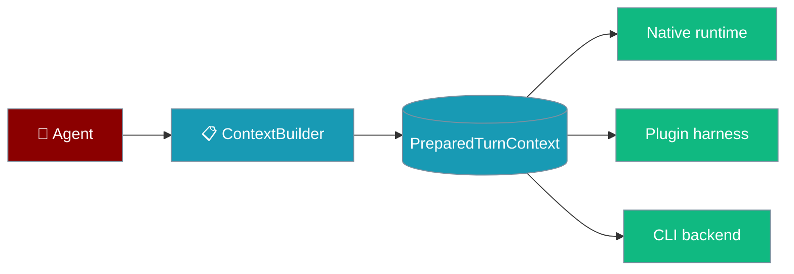
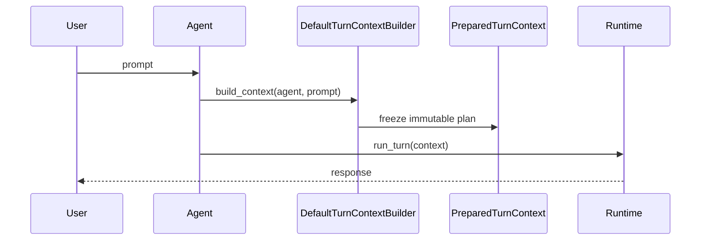

Build one frozen turn plan from an `Agent` and prompt — any runtime (native, plugin, CLI) executes the same context.

```python
from praisonaiagents import Agent
from praisonaiagents.runtime import default_context_builder

agent = Agent(name="Researcher", instructions="Find facts and cite sources.")
context = default_context_builder.build_context(agent, "Who built the Eiffel Tower?")
print(context.to_dict())
```

The user sends a prompt; the runtime builds one shared PreparedTurnContext for the turn.




## Quick Start

<Steps>
<Step title="Simple Usage">

Inspect what the agent will send on the next turn:

```python
from praisonaiagents import Agent
from praisonaiagents.runtime import default_context_builder

agent = Agent(name="Writer", instructions="Summarise pull requests.")
context = default_context_builder.build_context(agent, "Summarise this PR")

print(context.has_tools(), context.get_message_count())
print(context.to_dict())
```

</Step>

<Step title="With Configuration">

Run the same context through a custom harness:

```python
import asyncio
from praisonaiagents import Agent
from praisonaiagents.runtime import default_context_builder
from praisonaiagents.runtime.example_harness import PluginHarnessRuntime

agent = Agent(name="Writer", instructions="Summarise pull requests.")
context = default_context_builder.build_context(agent, "Summarise this PR")

async def run():
    return await PluginHarnessRuntime().run_turn(context)

asyncio.run(run())
```

</Step>
</Steps>

---

## How It Works



| Stage | What happens |
|-------|--------------|
| Build | Resolves model, tools (kwarg → `agent.tools`), transcript, delivery, correlation |
| Freeze | Context is immutable after construction |
| Execute | Any `TurnRuntimeProtocol` runs the same plan |

Key imports: `PreparedTurnContext`, `default_context_builder`, `RuntimeMode`, `DeliveryChannels`.

---

## Tool Resolution

`build_context(agent, prompt, tools=…)` resolves tools from the kwarg first, then the agent:

| Call | Result |
|------|--------|
| `build_context(agent, prompt)` | Uses `agent.tools` |
| `build_context(agent, prompt, tools=None)` | Uses `agent.tools` |
| `build_context(agent, prompt, tools=[])` | No tools this turn (explicit disable) |
| `build_context(agent, prompt, tools=[fn])` | Overrides `agent.tools` with `[fn]` |

```python
from praisonaiagents import Agent
from praisonaiagents.runtime import default_context_builder

def lookup(topic: str) -> str:
    """Return a short fact about the topic."""
    return f"fact about {topic}"

agent = Agent(name="Researcher", instructions="Cite facts.", tools=[lookup])

# 1. Uses agent.tools
ctx1 = default_context_builder.build_context(agent, "Tell me about Paris")
assert ctx1.has_tools()

# 2. tools=None also uses agent.tools (same as omitting the kwarg)
ctx2 = default_context_builder.build_context(agent, "Tell me about Paris", tools=None)
assert ctx2.has_tools()

# 3. tools=[] explicitly disables tools for this turn
ctx3 = default_context_builder.build_context(agent, "Just chat", tools=[])
assert not ctx3.has_tools()
```

<Tip>
Forwarding an optional `tools: Optional[list] = None` from a wrapper is safe — `None` and "not passed" are treated identically.
</Tip>

---

## Configuration Options

| Field | Type | Notes |
|-------|------|-------|
| `runtime_mode` | `RuntimeMode` | `SYNC`, `ASYNC`, `STREAM`, `ASYNC_STREAM` |
| `delivery` | `DeliveryChannels` | Required for streaming modes |
| `correlation` | `SessionCorrelation` | `session_id`, `turn_id`, `agent_id`, `run_id` |

`STREAM` and `ASYNC_STREAM` raise `ValueError` if `delivery.has_streaming()` is false.

---

## Best Practices

<AccordionGroup>
<Accordion title="Treat context as read-only">
Fields are frozen — mutate via hooks, not assignment.
</Accordion>
<Accordion title="Build one context per turn">
Do not cache plans across turns in multi-agent setups.
</Accordion>
<Accordion title="Reuse default_context_builder">
It is a module-level singleton — no need to instantiate your own builder.
</Accordion>
<Accordion title="Match runtime_mode to delivery">
Enable `DeliveryChannels(enable_streaming=True, ...)` before choosing stream modes.
</Accordion>
<Accordion title="Disable tools with an empty list, not None">
`tools=None` (or omitting the kwarg) uses `agent.tools`. Pass an explicit empty list to run a turn with no tools.
</Accordion>
</AccordionGroup>

---

## Related

<CardGroup cols={2}>
<Card title="Runtime Selection" icon="play" href="/docs/features/runtime-selection">
  Model-scoped runtime configuration
</Card>
<Card title="Streaming" icon="signal-stream" href="/docs/features/streaming">
  Stream agent output token-by-token
</Card>
</CardGroup>
