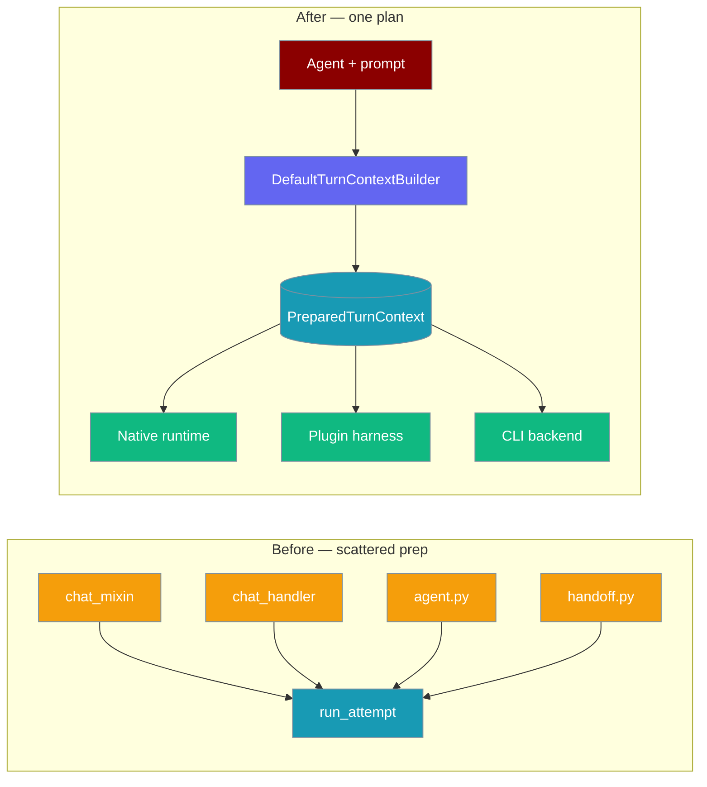
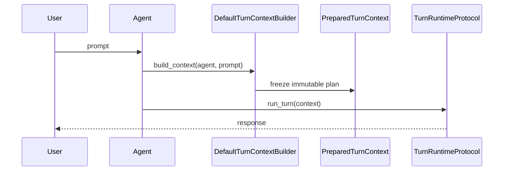
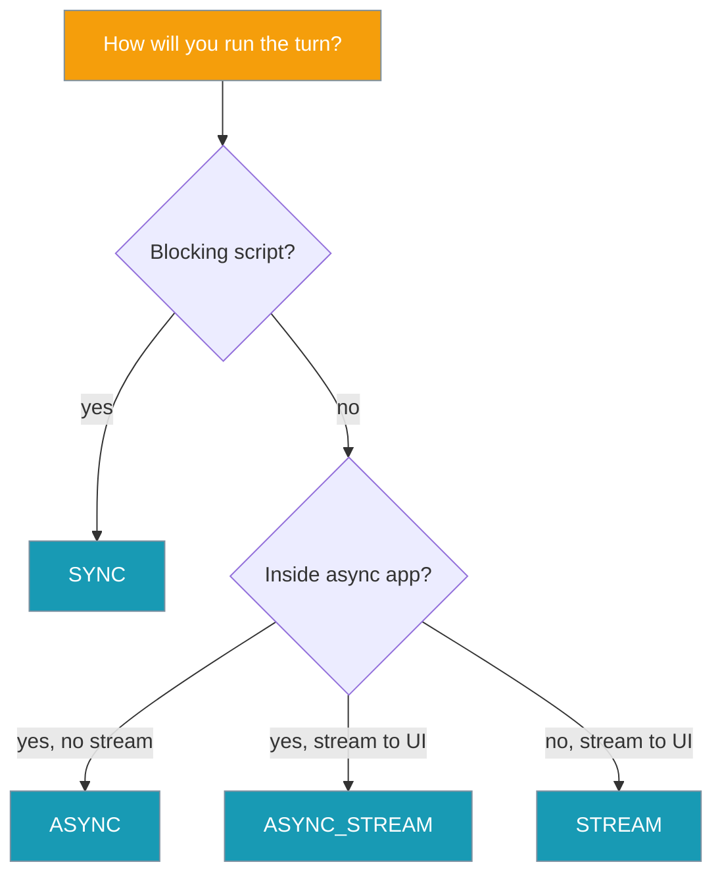

One immutable plan describes a single agent turn — every runtime (native, plugin, CLI) reads the same plan.



## Quick Start

<Steps>
<Step title="Default — nothing to change">
Existing `Agent(...)` code paths are unchanged. `PreparedTurnMixin` / `TurnExecutionMixin` on `Agent` can prepare context behind the scenes when you opt in explicitly.
</Step>

<Step title="Inspect what the agent will do">
```python
from praisonaiagents import Agent
from praisonaiagents.runtime import default_context_builder

agent = Agent(name="Researcher", instructions="Find facts and cite sources.")

context = default_context_builder.build_context(agent, "Who built the Eiffel Tower?")
print(context.to_dict())
```
</Step>

<Step title="Run with your own harness">
```python
from praisonaiagents import Agent
from praisonaiagents.runtime import default_context_builder
from praisonaiagents.runtime.example_harness import PluginHarnessRuntime

agent = Agent(name="Writer", instructions="Summarise pull requests.")
context = default_context_builder.build_context(agent, "Summarise this PR")
result = await PluginHarnessRuntime().run_turn(context)
```
</Step>
</Steps>

## How It Works



| Stage | What happens |
|-------|--------------|
| Build | `default_context_builder.build_context(agent, prompt, **kwargs)` resolves model, tools, transcript, delivery, correlation |
| Freeze | Context is immutable (`frozen=True`, `MappingProxyType` on dict fields) |
| Execute | Any `TurnRuntimeProtocol` implementation runs the same context |

### Public imports

```python
from praisonaiagents.runtime import (
    PreparedTurnContext,
    TurnRuntimeProtocol,
    TurnContextBuilderProtocol,
    ModelReference,
    ToolSchema,
    TranscriptWindow,
    DeliveryChannels,
    SessionCorrelation,
    RuntimeMode,
    DefaultTurnContextBuilder,
    default_context_builder,
    create_default_model_ref,
    create_empty_transcript,
    create_default_delivery,
    create_session_correlation,
)
```

## Picking a Runtime Mode



| Use case | `RuntimeMode` |
|----------|---------------|
| Script, one-shot reply | `SYNC` |
| Inside async app | `ASYNC` |
| Streaming to UI | `STREAM` (requires `DeliveryChannels(enable_streaming=True, ...)`) |
| Streaming inside async app | `ASYNC_STREAM` |

`STREAM` and `ASYNC_STREAM` raise `ValueError` if `delivery.has_streaming()` is false.

## Configuration Options

### `PreparedTurnContext`

| Field | Type | Default | Notes |
|-------|------|---------|-------|
| `model_ref` | `ModelReference` | — | Resolved model id, provider, capabilities |
| `agent_runtime` | `AgentProtocol` | — | Runtime instance for the turn |
| `tools` | `Tuple[ToolSchema, ...]` | `()` | Normalised tool schemas |
| `transcript` | `TranscriptWindow` | — | Conversation slice + system prompt |
| `delivery` | `DeliveryChannels` | — | Stream emitter, callbacks, formatter |
| `correlation` | `SessionCorrelation` | — | session_id / turn_id / agent_id / run_id |
| `runtime_mode` | `RuntimeMode` | `SYNC` | `sync`, `async`, `stream`, `async_stream` |
| `turn_metadata` | `Mapping[str, Any]` | `{}` | Immutable after construction |
| `created_at` | `float` | `time.time()` | Preparation timestamp |

Helpers: `get_tool_by_name(name)`, `has_tools()`, `has_system_prompt()`, `get_message_count()`, `to_dict()`.

### `ModelReference`

| Field | Type | Default |
|-------|------|---------|
| `model_id` | `str` | required |
| `provider` | `str` | required |
| `supports_streaming` | `bool` | `False` |
| `supports_tools` | `bool` | `False` |
| `supports_system_prompts` | `bool` | `True` |
| `max_tokens` | `Optional[int]` | `None` |
| `temperature` | `Optional[float]` | `None` |
| `model_config` | `Mapping[str, Any]` | `{}` |

Raises `ValueError` if `model_id` or `provider` is missing.

### `ToolSchema`

| Field | Type | Default |
|-------|------|---------|
| `name` | `str` | required |
| `description` | `str` | required |
| `parameters` | `dict` | required |
| `callable` | `Optional[Any]` | `None` |
| `source_type` | `str` | `"unknown"` |
| `metadata` | `Mapping[str, Any]` | `{}` |

### `TranscriptWindow`

| Field | Type | Default |
|-------|------|---------|
| `messages` | `Tuple[Mapping, ...]` | required |
| `total_tokens` | `int` | `0` |
| `system_prompt` | `Optional[str]` | `None` |
| `context_metadata` | `Mapping[str, Any]` | `{}` |

### `DeliveryChannels`

| Field | Type | Default |
|-------|------|---------|
| `stream_emitter` | `Optional[StreamEventEmitter]` | `None` |
| `output_formatter` | `Optional[Any]` | `None` |
| `callbacks` | `Tuple` | `()` |
| `async_callbacks` | `Tuple` | `()` |
| `enable_streaming` | `bool` | `False` |
| `enable_metrics` | `bool` | `False` |

Helper: `has_streaming()`.

### `SessionCorrelation`

| Field | Type | Default |
|-------|------|---------|
| `session_id` | `Optional[str]` | `None` |
| `turn_id` | `Optional[str]` | `None` |
| `agent_id` | `Optional[str]` | `None` |
| `run_id` | `Optional[str]` | `None` |
| `parent_id` | `Optional[str]` | `None` |
| `trace_metadata` | `Mapping[str, Any]` | `{}` |

### Utility constructors

- `create_default_model_ref(model_id="gpt-3.5-turbo", provider="openai")`
- `create_empty_transcript(system_prompt=None)`
- `create_default_delivery()`
- `create_session_correlation(session_id=None, agent_id=None)`

## Common Patterns

### Build your own harness

```python
from typing import List
from praisonaiagents.runtime import TurnRuntimeProtocol, PreparedTurnContext, RuntimeMode

class EchoHarness:
    async def run_turn(self, context: PreparedTurnContext) -> str:
        return f"Echo: {context.get_message_count()} messages"

    def supports_runtime_mode(self, mode: RuntimeMode) -> bool:
        return mode in (RuntimeMode.SYNC, RuntimeMode.ASYNC)

    def get_supported_modes(self) -> List[RuntimeMode]:
        return [RuntimeMode.SYNC, RuntimeMode.ASYNC]
```

Implement `TurnRuntimeProtocol`: `async run_turn(context)`, `supports_runtime_mode(mode)`, `get_supported_modes()`.

### Stream to a UI

```python
from praisonaiagents.runtime import DeliveryChannels, RuntimeMode, PreparedTurnContext

delivery = DeliveryChannels(enable_streaming=True, stream_emitter=my_emitter)
# Pass delivery into build_context kwargs; set runtime_mode=RuntimeMode.STREAM
```

### Track turns across services

```python
from praisonaiagents.runtime import create_session_correlation, default_context_builder

correlation = create_session_correlation(session_id="prod-chat-42", agent_id="researcher")
context = default_context_builder.build_context(agent, prompt, session_id=correlation.session_id)
print(context.correlation.turn_id)
```

### Example harness templates

Reference implementations in `praisonaiagents.runtime.example_harness`:

- `PluginHarnessRuntime` — plugin pattern, streaming-aware
- `CLIBackendHarness` — CLI backend pattern
- `demonstrate_harness_integration()` — run with `python -m praisonaiagents.runtime.example_harness`

## Best Practices

<AccordionGroup>
<Accordion title="Treat the context as read-only">
Fields are frozen. Mutations must go through hooks, not field assignment.
</Accordion>

<Accordion title="Build a context per turn, not per agent">
The plan is per-turn for multi-agent safety. Do not cache it across turns.
</Accordion>

<Accordion title="Reuse default_context_builder">
It is a module-level singleton — no need to instantiate `DefaultTurnContextBuilder` yourself.
</Accordion>

<Accordion title="Match runtime_mode to delivery">
`STREAM` / `ASYNC_STREAM` require `DeliveryChannels.has_streaming()` — otherwise construction raises `ValueError`.
</Accordion>
</AccordionGroup>

---

## Related

<CardGroup cols={2}>
<Card title="Runtime Selection" icon="play" href="/docs/features/runtime-selection">
  Model-scoped runtime configuration for each turn
</Card>
<Card title="Streaming" icon="signal-stream" href="/docs/features/streaming">
  Stream agent output token-by-token
</Card>
</CardGroup>
