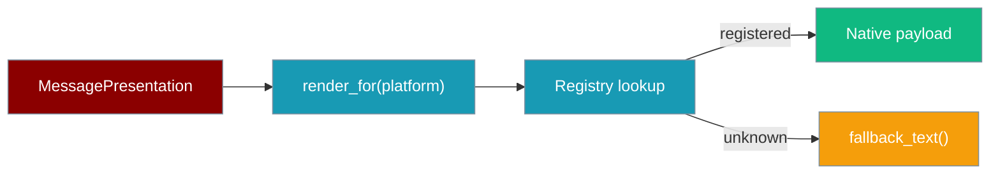
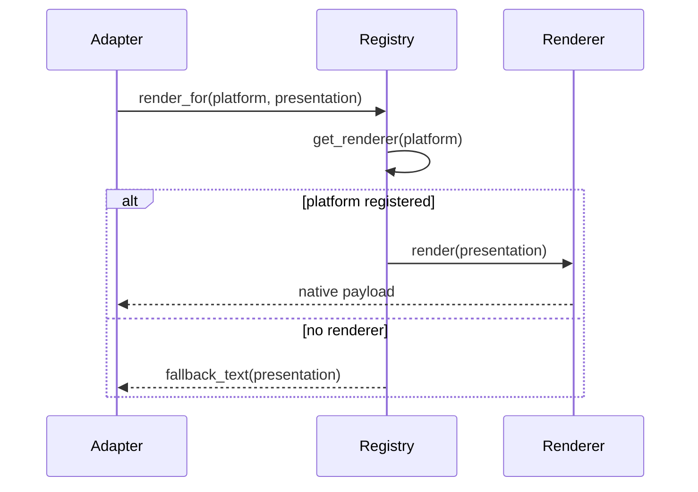

A platform-keyed registry turns one portable `MessagePresentation` into a native payload for each channel, and degrades gracefully to text when a channel has no renderer.



## Quick Start

<Steps>
<Step title="Render for a known channel">

```python
from praisonai_bot.bots._presentation_renderer import render_for
from praisonaiagents.bots import MessagePresentation

presentation = MessagePresentation.approval("Allow file delete?", "appr-1")

payload = render_for("whatsapp", presentation)
# payload["interactive"]["type"] == "button"  → native reply buttons
```

</Step>

<Step title="Degrade unknown channels to text">

```python
from praisonai_bot.bots._presentation_renderer import render_for
from praisonaiagents.bots import MessagePresentation

presentation = MessagePresentation.approval("Allow file delete?", "appr-1")

render_for("email", presentation)
# → {"text": "Allow file delete?\n• Allow Once\n• Deny"}
```

</Step>
</Steps>

---

## How It Works

`render_for(platform, presentation)` resolves the platform's renderer from the registry and returns its native payload; unregistered channels fall back to `fallback_text`.



| Function | Returns | Purpose |
|----------|---------|---------|
| `get_renderer(platform)` | `type` or `None` | Look up the registered renderer class |
| `render_for(platform, presentation)` | `Dict[str, Any]` | Render natively, else fall back to text |
| `fallback_text(presentation)` | `Dict[str, Any]` | Flatten to a readable `{"text": ...}` payload |

---

## The PresentationRenderer Protocol

Every renderer implements the `PresentationRenderer` `Protocol` — two static methods.

| Method | Returns | Purpose |
|--------|---------|---------|
| `get_limits()` | `PresentationLimits` | Channel capability caps used by `adapt_presentation()` |
| `render(presentation)` | `Dict[str, Any]` | Native, platform-specific payload |

Each renderer runs `adapt_presentation` against its own `get_limits()` before mapping blocks, so button overflow, unsupported selects/web-apps, and label truncation are applied uniformly.

---

## Built-in Renderers

| Platform | Renderer | Payload shape |
|----------|----------|---------------|
| `telegram` | `TelegramPresentationRenderer` | `{"text", "reply_markup": {"inline_keyboard": ...}}` |
| `slack` | `SlackPresentationRenderer` | `{"blocks": [...]}` (Block Kit) |
| `discord` | `DiscordPresentationRenderer` | `{"content", "components": [...]}` |
| `whatsapp` | `WhatsAppPresentationRenderer` | `{"text", "interactive": {"type": "button" \| "list", ...}}` |

---

## Graceful Degradation

`fallback_text(presentation)` keeps interactive content readable for channels without a renderer — nothing is silently dropped.

```python
from praisonai_bot.bots._presentation_renderer import fallback_text
from praisonaiagents.bots import (
    MessagePresentation,
    PresentationBlock,
    PresentationButton,
    PresentationAction,
)

presentation = MessagePresentation(blocks=[
    PresentationBlock.make_text("Docs?"),
    PresentationBlock.make_buttons([
        PresentationButton(
            label="Open",
            action=PresentationAction.open_url("https://example.com"),
        ),
    ]),
])

fallback_text(presentation)
# → {"text": "Docs?\n• Open: https://example.com"}
```

Text/context/divider blocks become lines, buttons and select options become `• Label` bullets, and URL buttons inline as `• Label: URL`.

---

## Add a Channel

Write a class with the two static methods, then register it into `_RENDERERS`.

```python
from typing import Any, Dict
from praisonaiagents.bots import (
    MessagePresentation,
    PresentationLimits,
    adapt_presentation,
)
from praisonai_bot.bots._presentation_renderer import _RENDERERS

class MyChannelRenderer:
    @staticmethod
    def get_limits() -> PresentationLimits:
        return PresentationLimits()

    @staticmethod
    def render(presentation: MessagePresentation) -> Dict[str, Any]:
        presentation = adapt_presentation(presentation, MyChannelRenderer.get_limits())
        # map blocks to your channel's native payload
        return {"text": "..."}

_RENDERERS["mychannel"] = MyChannelRenderer
```

`render_for("mychannel", presentation)` now resolves your renderer.

---

## Best Practices

<AccordionGroup>
<Accordion title="Always adapt before mapping blocks">
Run `adapt_presentation(presentation, get_limits())` first so button overflow, label caps, and unsupported selects/web-apps degrade uniformly before you build the native payload.
</Accordion>

<Accordion title="Use render_for, not the class directly, in adapters">
`render_for(platform, presentation)` resolves the renderer and falls back to text for unknown platforms, so adapters stay channel-agnostic.
</Accordion>

<Accordion title="Never drop interactive content">
When a channel can't render a widget, surface it as text (labels, URLs) the way `fallback_text` does — a silently dropped button is worse than a text link.
</Accordion>

<Accordion title="Return the id shape your callback layer expects">
Reply/list-row ids are how taps route back to your handler. Derive stable ids (command, callback value, or URL) and keep them within the channel's id cap.
</Accordion>
</AccordionGroup>

---

## Related

<CardGroup cols={2}>
  <Card title="Bot Presentations" icon="display" href="/docs/features/bot-presentations">
    The portable presentation model and per-channel limits
  </Card>
  <Card title="Message Presentation" icon="layout" href="/docs/features/message-presentation">
    Buttons, menus, and web-app links on agent replies
  </Card>
  <Card title="WhatsApp Bot" icon="whatsapp" href="/docs/features/whatsapp-bot">
    Native interactive rendering on WhatsApp
  </Card>
  <Card title="Channel Capabilities" icon="sliders" href="/docs/features/channel-capabilities">
    Live-edit, reactions, typing, and text limits per channel
  </Card>
</CardGroup>
