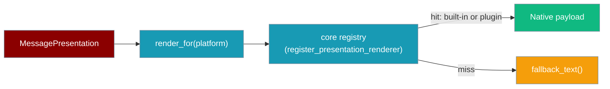
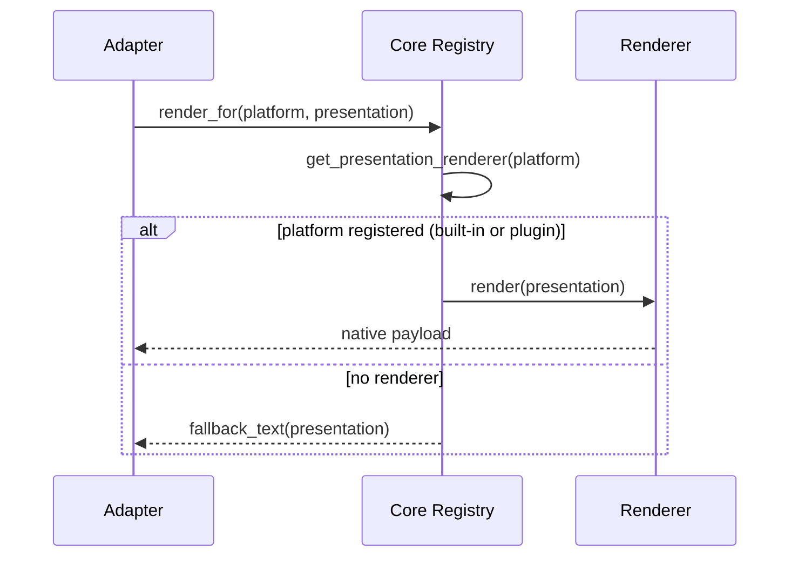
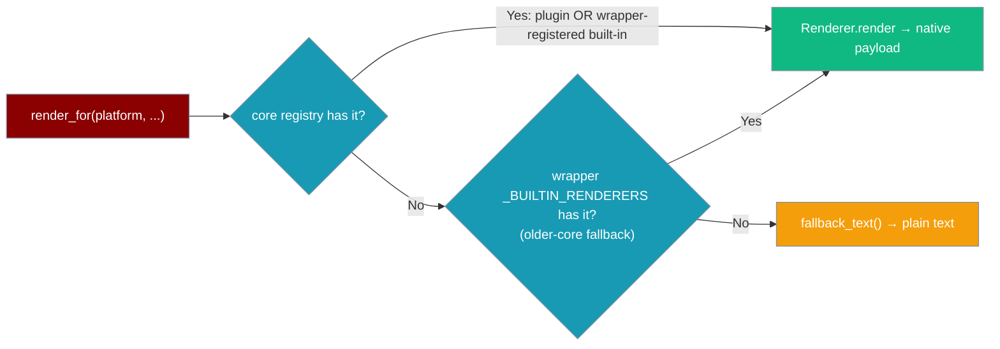

A core, platform-keyed registry turns one portable `MessagePresentation` into a native payload for each channel. Built-in channels and pip-installed plugins register through the same seam — `register_presentation_renderer` — and unknown channels degrade gracefully to text.


```mermaid
graph LR
    P[MessagePresentation] --> R["render_for(platform)"]
    R --> L["core registry<br/>(register_presentation_renderer)"]
    L -->|hit: built-in or plugin| N[Native payload]
    L -->|miss| F["fallback_text()"]

    classDef input fill:#8B0000,stroke:#7C90A0,color:#fff
    classDef process fill:#189AB4,stroke:#7C90A0,color:#fff
    classDef output fill:#10B981,stroke:#7C90A0,color:#fff
    classDef fallback fill:#F59E0B,stroke:#7C90A0,color:#fff

    class P input
    class R,L process
    class N output
    class F fallback
```

## Quick Start

<Steps>
<Step title="Render for a known channel">

```python
from praisonai_bot.bots._presentation_renderer import render_for
from praisonaiagents.bots import MessagePresentation

presentation = MessagePresentation.approval("Allow file delete?", "appr-1")

payload = render_for("whatsapp", presentation)
# payload["interactive"]["type"] == "button"  → native reply buttons
```

</Step>

<Step title="Degrade unknown channels to text">

```python
from praisonai_bot.bots._presentation_renderer import render_for
from praisonaiagents.bots import MessagePresentation

presentation = MessagePresentation.approval("Allow file delete?", "appr-1")

render_for("email", presentation)
# → {"text": "Allow file delete?\n• Allow Once\n• Deny"}
```

</Step>

<Step title="Register a renderer from a plugin">

Any pip-installed channel plugin plugs a native renderer into the core registry — no wrapper edits required.

```python
# In your plugin's setup hook, entry point, or module import:
from praisonaiagents.bots import register_presentation_renderer
from my_matrix_plugin.renderer import MatrixPresentationRenderer

register_presentation_renderer("matrix", MatrixPresentationRenderer)

# Anywhere else in the app:
from praisonai_bot.bots._presentation_renderer import render_for
render_for("matrix", presentation)  # → native Matrix payload
```

</Step>
</Steps>

---

## How It Works

`render_for(platform, presentation)` resolves the platform's renderer through the **core** registry and returns its native payload; unregistered channels fall back to `fallback_text`.


```mermaid
sequenceDiagram
    participant Adapter
    participant Core as Core Registry
    participant Renderer

    Adapter->>Core: render_for(platform, presentation)
    Core->>Core: get_presentation_renderer(platform)
    alt platform registered (built-in or plugin)
        Core->>Renderer: render(presentation)
        Renderer-->>Adapter: native payload
    else no renderer
        Core-->>Adapter: fallback_text(presentation)
    end
```

The registry lives in core (`praisonaiagents.bots`); the wrapper (`praisonai_bot`) only resolves through it and registers the four built-ins at import time.

| Function | Layer | Returns | Purpose |
|----------|-------|---------|---------|
| `register_presentation_renderer(platform, renderer)` | **core** (`praisonaiagents.bots`) | `None` | Register a native renderer for a channel (built-in or plugin) |
| `get_presentation_renderer(platform)` | **core** (`praisonaiagents.bots`) | `type` or `None` | Look up the core registry (case-insensitive) |
| `get_renderer(platform)` | wrapper (`praisonai_bot`) | `type` or `None` | Resolves through core, falls back to the built-in map for older-core resilience |
| `render_for(platform, presentation)` | wrapper (`praisonai_bot`) | `Dict[str, Any]` | Render natively (through `get_renderer`), else `fallback_text` |
| `fallback_text(presentation)` | wrapper (`praisonai_bot`) | `Dict[str, Any]` | Flatten to a readable `{"text": ...}` payload |

---

## The `PresentationRendererProtocol`

Every renderer implements `PresentationRendererProtocol` — two `@staticmethod` methods. The protocol is `@runtime_checkable`, so `isinstance(cls, PresentationRendererProtocol)` works.

| Method | Returns | Purpose |
|--------|---------|---------|
| `get_limits()` | `PresentationLimits` | Channel capability caps used by `adapt_presentation()` |
| `render(presentation)` | `Dict[str, Any]` | Native, platform-specific payload |

Each renderer runs `adapt_presentation` against its own `get_limits()` before mapping blocks, so button overflow, unsupported selects/web-apps, and label truncation are applied uniformly.

Both import paths are valid:

```python
from praisonaiagents.bots import PresentationRendererProtocol              # preferred
from praisonaiagents.bots.presentation import PresentationRendererProtocol  # also valid (back-compat)
```

`register_presentation_renderer` and `get_presentation_renderer` are also exported from the top-level `praisonaiagents.bots` package — no need to reach into the `presentation` submodule.

---

## Validation & Precedence

Registration fails loudly on misuse, and lookups are case-insensitive.

| Trigger | Behaviour |
|---------|-----------|
| `platform` is empty / whitespace-only / non-string | `ValueError` at registration time |
| `renderer` missing callable `get_limits` **or** `render` | `TypeError` at registration time |
| Re-registering an already-registered platform | Silently overrides — **plugins supersede built-ins** by design |
| Mixed-case platform id (`"Matrix"` vs `"matrix"`) | Normalized to lowercase in registration and lookup |

The wrapper registers each built-in **only if the core slot is empty**, so a plugin that registers first for `"telegram"` wins — the built-in never clobbers it.


```mermaid
flowchart LR
    A["render_for(platform, ...)"] --> B{"core registry has it?"}
    B -->|Yes: plugin OR wrapper-registered built-in| C[Renderer.render → native payload]
    B -->|No| D{"wrapper _BUILTIN_RENDERERS has it?<br/>(older-core fallback)"}
    D -->|Yes| C
    D -->|No| E["fallback_text() → plain text"]

    classDef input fill:#8B0000,stroke:#7C90A0,color:#fff
    classDef process fill:#189AB4,stroke:#7C90A0,color:#fff
    classDef output fill:#10B981,stroke:#7C90A0,color:#fff
    classDef fallback fill:#F59E0B,stroke:#7C90A0,color:#fff

    class A input
    class B,D process
    class C output
    class E fallback
```

<Note>
If the installed `praisonaiagents` predates the seam, the wrapper silently falls back to its local built-in map — existing wrapper code keeps working on older cores.
</Note>

---

## Built-in Renderers

| Platform | Renderer | Payload shape |
|----------|----------|---------------|
| `telegram` | `TelegramPresentationRenderer` | `{"text", "reply_markup": {"inline_keyboard": ...}}` |
| `slack` | `SlackPresentationRenderer` | `{"blocks": [...]}` (Block Kit) |
| `discord` | `DiscordPresentationRenderer` | `{"content", "components": [...]}` |
| `whatsapp` | `WhatsAppPresentationRenderer` | `{"text", "interactive": {"type": "button" \| "list", ...}}` |

The wrapper registers all four through the core seam at import time.

---

## Graceful Degradation

`fallback_text(presentation)` keeps interactive content readable for channels without a renderer — nothing is silently dropped.

```python
from praisonai_bot.bots._presentation_renderer import fallback_text
from praisonaiagents.bots import (
    MessagePresentation,
    PresentationBlock,
    PresentationButton,
    PresentationAction,
)

presentation = MessagePresentation(blocks=[
    PresentationBlock.make_text("Docs?"),
    PresentationBlock.make_buttons([
        PresentationButton(
            label="Open",
            action=PresentationAction.open_url("https://example.com"),
        ),
    ]),
])

fallback_text(presentation)
# → {"text": "Docs?\n• Open: https://example.com"}
```

Text/context/divider blocks become lines, buttons and select options become `• Label` bullets, and URL buttons inline as `• Label: URL`.

---

## Add a Channel

Write a class with the two static methods, then register it through the **public core seam** — `register_presentation_renderer`.

```python
from typing import Any, Dict
from praisonaiagents.bots import (
    MessagePresentation,
    PresentationLimits,
    adapt_presentation,
    register_presentation_renderer,
)

class MyChannelRenderer:
    @staticmethod
    def get_limits() -> PresentationLimits:
        return PresentationLimits()

    @staticmethod
    def render(presentation: MessagePresentation) -> Dict[str, Any]:
        presentation = adapt_presentation(presentation, MyChannelRenderer.get_limits())
        # map blocks to your channel's native payload
        return {"text": "..."}

register_presentation_renderer("mychannel", MyChannelRenderer)
```

`render_for("mychannel", presentation)` — and `render_for("MyChannel", ...)`, `render_for("MYCHANNEL", ...)` — now all resolve the same renderer.

---

## Best Practices

<AccordionGroup>
<Accordion title="Register through the core seam, not a private dict">
Call `register_presentation_renderer(platform, MyRenderer)` from `praisonaiagents.bots`. That is the only registration visible to the resolution path everywhere else — a plugin renderer becomes indistinguishable from a built-in.
</Accordion>

<Accordion title="Always adapt before mapping blocks">
Run `adapt_presentation(presentation, get_limits())` first so button overflow, label caps, and unsupported selects/web-apps degrade uniformly before you build the native payload.
</Accordion>

<Accordion title="Use render_for, not the class directly, in adapters">
`render_for(platform, presentation)` resolves the renderer and falls back to text for unknown platforms, so adapters stay channel-agnostic.
</Accordion>

<Accordion title="Never drop interactive content">
When a channel can't render a widget, surface it as text (labels, URLs) the way `fallback_text` does — a silently dropped button is worse than a text link.
</Accordion>

<Accordion title="Return the id shape your callback layer expects">
Reply/list-row ids are how taps route back to your handler. Derive stable ids (command, callback value, or URL) and keep them within the channel's id cap.
</Accordion>
</AccordionGroup>

---

## Related

<CardGroup cols={2}>
  <Card title="Bot Presentations" icon="display" href="/features/bot-presentations">
    The portable presentation model and per-channel limits
  </Card>
  <Card title="Bot Platform Plugins" icon="puzzle-piece" href="/features/bot-platform-plugins">
    Register a channel adapter and its native renderer as a pip-installable plugin
  </Card>
  <Card title="Message Presentation" icon="layout" href="/features/message-presentation">
    Buttons, menus, and web-app links on agent replies
  </Card>
  <Card title="WhatsApp Bot" icon="whatsapp" href="/features/whatsapp-bot">
    Native interactive rendering on WhatsApp
  </Card>
</CardGroup>
