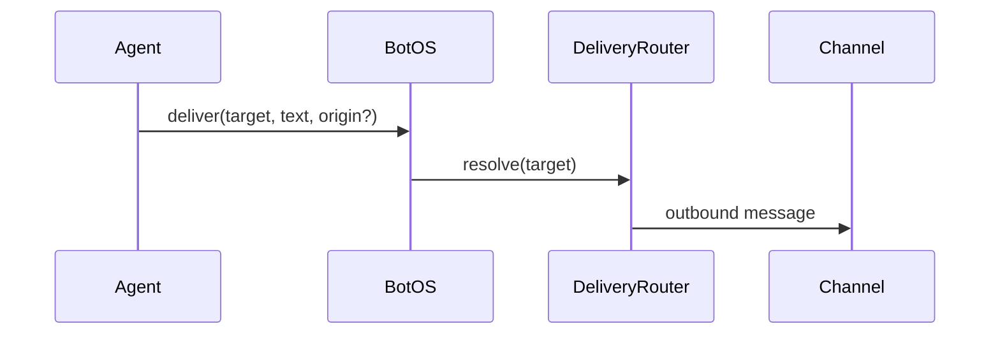
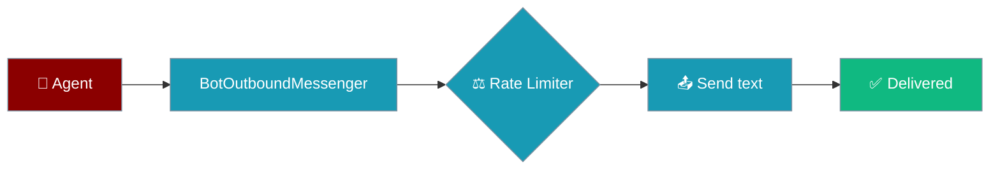

Push outbound messages from an agent-backed bot — reply to the requesting chat, a home channel, or a named alias.

<Note>
Blueprints carry a `default_deliver` (usually `telegram`), so jobs created from [Automation Suggestions](/docs/features/automation-suggestions) land on the right channel out of the box.
</Note>

```python
import asyncio
from praisonai.bots import BotOS, Bot, SessionSource
from praisonaiagents import Agent

agent = Agent(name="ops", instructions="Alert humans about incidents.")
botos = BotOS(bots=[Bot("telegram", agent=agent)])

botos.configure_channels({
    "telegram": {"home_channel": "123456", "aliases": {"ops-alerts": "123456"}},
})

async def notify():
    src = SessionSource(platform="telegram", channel_id="123456")
    await botos.deliver("origin", "Build finished!", origin=src)

asyncio.run(notify())
```

The user triggers an alert; BotOS delivers the agent's message to the target channel.


## Quick Start

<Steps>
<Step title="Simple Usage">

Reply to where the request came from:

```python
import asyncio
from praisonai.bots import BotOS, Bot, SessionSource
from praisonaiagents import Agent

agent = Agent(name="ops", instructions="Send status updates.")
botos = BotOS(bots=[Bot("telegram", agent=agent)])

async def notify():
    src = SessionSource(platform="telegram", channel_id="123456")
    await botos.deliver("origin", "Build finished!", origin=src)

asyncio.run(notify())
```

</Step>

<Step title="With Configuration">

Set home channels and deliver by alias:

```python
botos.configure_channels({
    "telegram": {"home_channel": "123456", "aliases": {"ops-alerts": "123456"}},
})

await botos.deliver("telegram", "Nightly digest ready")
await botos.deliver("ops-alerts", "Disk usage at 90%")
```

</Step>
</Steps>

---

## How It Works



| Target | Resolves to |
|--------|-------------|
| `origin` | Chat that triggered the request (`origin=SessionSource(...)`) |
| `<platform>` | Platform home channel from `/sethome` or config |
| `<platform>:<id>` | Explicit channel ID |
| `<alias>` | Friendly name from `configure_channels` or overlay file |

Resolution order: `origin` → `platform:id` → bare platform → alias. Platform names win over aliases.

Home and observed channels persist to `~/.praisonai/state/channel_directory.json`.

---

## Delivery from Scheduled Runs

For a scheduled agent that isn't hosted inside `BotOS`, use `AgentScheduler(deliver=…)` — same `DeliveryRouter`, no gateway required.

```python
from praisonaiagents import Agent
from praisonai.scheduler import AgentScheduler

agent = Agent(name="Brief", instructions="Summarise the morning news")
AgentScheduler(agent, task="Morning brief", deliver="telegram:123456").start("hourly")
```

<Note>
`origin` works on the lightweight scheduler path when the job has a persisted origin (`ScheduleJob.origin`, captured when the job is created from a bot/webhook request) — it delivers back to the same channel/thread the request came in on. Only `all` still needs the gateway (it enumerates every configured bot). See [Scheduler Delivery](/docs/features/scheduler-delivery) for the full token grammar and precedence rules.
</Note>

---

## Configuration Options

### YAML

```yaml
channels:
  telegram:
    token: ${TELEGRAM_BOT_TOKEN}
    home_channel: "123456"
    aliases:
      ops-alerts: "123456"
```

### Alias overlay

Pre-name channels in `~/.praisonai/state/channel_aliases.json`:

```json
{
  "engineering": { "platform": "discord", "channel_id": "555" },
  "ops": "slack:C111"
}
```

Call `botos.delivery_router.refresh_directory()` periodically so adapters enumerate channels the bot has not yet heard from.

---

## Rate Limiting

Scheduled and background sends share the reply-path rate limiter automatically — no config change required.

Scheduled sends also fire **at most once** per due window across multiple `BotOS` processes — see [BotOS → Multi-Process / HA Deployments](/docs/features/botos#multi-process-ha-deployments).

When the gateway is the process performing the proactive/scheduled send (via `WebSocketGateway._deliver_scheduled_result` — e.g. any `AgentScheduler` job whose `deliver=` resolves inside a running gateway), the send is enqueued into a durable SQLite outbox at `~/.praisonai/state/gateway_outbox.sqlite` before it reaches the router. The `UNIQUE` idempotency key survives a process crash-and-restart, so the same result is never posted twice. See [Durable Delivery → Proactive Path](/docs/features/durable-delivery#proactive-path) for the full contract and comparison against direct `BotOS.deliver(...)`.



| You call | What happens |
|----------|--------------|
| `botos.deliver("ops-alerts", "...")` | Rate-limited per platform via the shared reply-path rate limiter. |
| `botos.deliver("ops-alerts", "...", origin=source)` | Rate-limited with origin context; used for targeted proactive replies. |
| Adapter's `send_message()` returns `False` | Treated as a transient failure. Dead-target flag not tripped. Safe to retry. |

```python
# Scheduled daily digest — proactive send to a named channel
await botos.deliver(
    "ops-alerts",
    "Nightly digest ready",
)
```

```python
# Targeted proactive send with origin context
await botos.deliver(
    "ops-alerts",
    "Build finished",
    origin=source,
)
```

---

## Best Practices

<AccordionGroup>
<Accordion title="Prefer aliases over raw IDs">
Aliases survive renumbering and read better in logs.
</Accordion>
<Accordion title="Set home_channel for each platform">
Bare-platform targets fail without a configured home channel.
</Accordion>
<Accordion title="Do not name aliases after platforms">
`telegram` as an alias will never resolve — platform lookup wins.
</Accordion>
<Accordion title="Handle the bool return">
`deliver()` returns `False` on resolution or send failure — log and retry as needed.
</Accordion>
<Accordion title="Use durable delivery for cross-worker dedup">
`BotOS.deliver` rate-limits sends via the shared reply-path rate limiter, but does not support idempotency deduplication. For dedup across retries or workers, use the reply-path `delivery.send(...)` outbox (see [Durable Delivery](/docs/features/durable-delivery)).
</Accordion>
</AccordionGroup>

---

## Related

<CardGroup cols={2}>
<Card title="BotOS" icon="robot" href="/docs/features/botos">
  Multi-platform orchestration
</Card>
<Card title="Bot Gateway" icon="server" href="/docs/features/bot-gateway">
  Run multiple bots from one server
</Card>
<Card title="Scheduler Delivery" icon="paper-plane" href="/docs/features/scheduler-delivery">
  Deliver scheduled agent results without the gateway
</Card>
</CardGroup>
