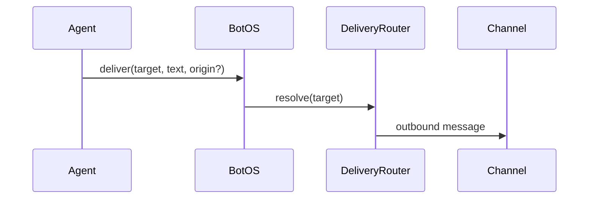
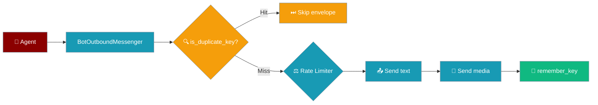

Push outbound messages from an agent-backed bot — reply to the requesting chat, a home channel, or a named alias.

```python
import asyncio
from praisonai.bots import BotOS, Bot, SessionSource
from praisonaiagents import Agent

agent = Agent(name="ops", instructions="Alert humans about incidents.")
botos = BotOS(bots=[Bot("telegram", agent=agent)])

botos.configure_channels({
    "telegram": {"home_channel": "123456", "aliases": {"ops-alerts": "123456"}},
})

async def notify():
    src = SessionSource(platform="telegram", channel_id="123456")
    await botos.deliver("origin", "Build finished!", origin=src)

asyncio.run(notify())
```

The user triggers an alert; BotOS delivers the agent's message to the target channel.


## Quick Start

<Steps>
<Step title="Simple Usage">

Reply to where the request came from:

```python
import asyncio
from praisonai.bots import BotOS, Bot, SessionSource
from praisonaiagents import Agent

agent = Agent(name="ops", instructions="Send status updates.")
botos = BotOS(bots=[Bot("telegram", agent=agent)])

async def notify():
    src = SessionSource(platform="telegram", channel_id="123456")
    await botos.deliver("origin", "Build finished!", origin=src)

asyncio.run(notify())
```

</Step>

<Step title="With Configuration">

Set home channels and deliver by alias:

```python
botos.configure_channels({
    "telegram": {"home_channel": "123456", "aliases": {"ops-alerts": "123456"}},
})

await botos.deliver("telegram", "Nightly digest ready")
await botos.deliver("ops-alerts", "Disk usage at 90%")
```

</Step>
</Steps>

---

## How It Works



| Target | Resolves to |
|--------|-------------|
| `origin` | Chat that triggered the request (`origin=SessionSource(...)`) |
| `<platform>` | Platform home channel from `/sethome` or config |
| `<platform>:<id>` | Explicit channel ID |
| `<alias>` | Friendly name from `configure_channels` or overlay file |

Resolution order: `origin` → `platform:id` → bare platform → alias. Platform names win over aliases.

Home and observed channels persist to `~/.praisonai/state/channel_directory.json`.

---

## Configuration Options

### YAML

```yaml
channels:
  telegram:
    token: ${TELEGRAM_BOT_TOKEN}
    home_channel: "123456"
    aliases:
      ops-alerts: "123456"
```

### Alias overlay

Pre-name channels in `~/.praisonai/state/channel_aliases.json`:

```json
{
  "engineering": { "platform": "discord", "channel_id": "555" },
  "ops": "slack:C111"
}
```

Call `botos.delivery_router.refresh_directory()` periodically so adapters enumerate channels the bot has not yet heard from.

---

## Rate Limiting & Idempotency

Scheduled and background sends now share the reply-path rate limiter and dedup guard automatically — no config change required.



| You call | What happens |
|----------|--------------|
| `botos.deliver("ops-alerts", "...")` with no `idempotency_key` | Rate-limited per platform. No dedup. |
| `botos.deliver(..., idempotency_key="job-42")` | Rate-limited **and** dedup'd within this process (bounded LRU, 4096 keys). A retry with the same key returns success without re-sending. |
| `botos.deliver(..., idempotency_key="job-42")` with attachments | Whole text + media envelope is deduped. Key is recorded only after both text and media succeed — a failed media upload leaves the key retryable. |
| Adapter's `send_message()` returns `False` | Treated as a transient failure. Key not stored. Dead-target flag not tripped. Safe to retry. |

```python
# Scheduled daily digest — safe to retry from cron on transient failure
await botos.deliver(
    "ops-alerts",
    "Nightly digest ready",
    idempotency_key=f"digest-{today.isoformat()}",
)
```

```python
# Notification with attachment — media won't double-upload on retry
await botos.deliver(
    "ops-alerts",
    "Build finished",
    attachments=[BuildLog("/var/log/build.log")],
    idempotency_key=f"build-{build_id}",
)
```

---

## Best Practices

<AccordionGroup>
<Accordion title="Prefer aliases over raw IDs">
Aliases survive renumbering and read better in logs.
</Accordion>
<Accordion title="Set home_channel for each platform">
Bare-platform targets fail without a configured home channel.
</Accordion>
<Accordion title="Do not name aliases after platforms">
`telegram` as an alias will never resolve — platform lookup wins.
</Accordion>
<Accordion title="Handle the bool return">
`deliver()` returns `False` on resolution or send failure — log and retry as needed.
</Accordion>
<Accordion title="Pick a stable idempotency_key for scheduled sends">
Derive the key from the trigger — job ID, cron-timestamp, or inbound message ID. Never use `uuid.uuid4()` inside the retry loop; a new UUID on every call defeats deduplication.

```python
# ✅ Good: derived from a stable trigger
idempotency_key=f"digest-{today.isoformat()}"

# ❌ Bad: new UUID on every call — no dedup across retries
import uuid
idempotency_key=str(uuid.uuid4())
```
</Accordion>
<Accordion title="In-process dedup is best-effort">
The LRU dedup guard holds at most 4096 keys per process. If your cron re-fires the same job on a different worker, the in-memory LRU won't catch it. For cross-worker dedup, use the reply-path `delivery.send(...)` outbox (see [Durable Delivery](/docs/features/durable-delivery)) or an external idempotency store keyed off the same `idempotency_key`.
</Accordion>
</AccordionGroup>

---

## Related

<CardGroup cols={2}>
<Card title="BotOS" icon="robot" href="/docs/features/botos">
  Multi-platform orchestration
</Card>
<Card title="Bot Gateway" icon="server" href="/docs/features/bot-gateway">
  Run multiple bots from one server
</Card>
</CardGroup>
