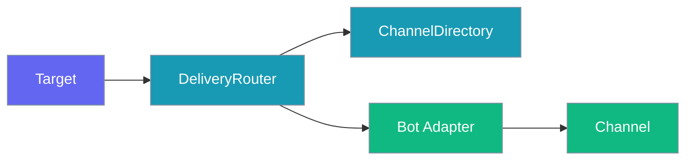
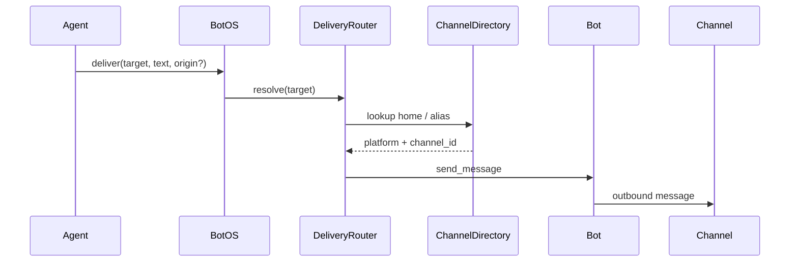
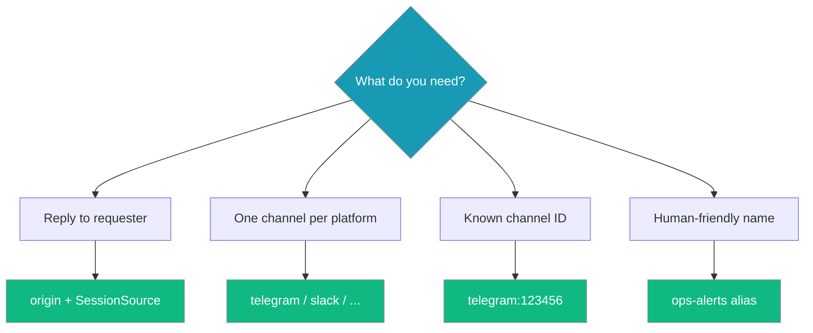

Proactive delivery lets your bot push messages outbound — reply back to the requesting chat, alert a home channel, or target a friendly alias without hardcoding platform IDs in agent code.



## Quick Start

<Steps>
<Step title="Reply to where the request came from">

```python
from praisonai.bots import BotOS, Bot, SessionSource
from praisonaiagents import Agent
import asyncio

agent = Agent(name="ops", instructions="You alert humans about incidents.")
botos = BotOS(bots=[Bot("telegram", agent=agent)])

botos.configure_channels({
    "telegram": {"home_channel": "123456", "aliases": {"ops-alerts": "123456"}},
})

async def notify():
    src = SessionSource(platform="telegram", channel_id="123456")
    await botos.deliver("origin", "Build finished!", origin=src)

asyncio.run(notify())
```

</Step>

<Step title="Send to a platform's default channel">

```python
await botos.deliver("telegram", "Nightly digest ready")
```

Requires `home_channel` configured for that platform.

</Step>

<Step title="Send to a named alias">

```python
await botos.deliver("ops-alerts", "Disk usage at 90%")
```

</Step>
</Steps>

## How It Works



| Target | Resolves to | Example |
|--------|-------------|---------|
| `origin` | Chat that triggered the request | `deliver("origin", text, origin=src)` |
| `<platform>` | Platform's `home_channel` | `deliver("telegram", text)` |
| `<platform>:<id>` | Explicit channel | `deliver("telegram:123456", text)` |
| `<alias>` | Friendly name from directory | `deliver("ops-alerts", text)` |

Resolution order: `origin` → `platform:channel_id` → bare platform name → alias. Platform names win over aliases — do not name an alias the same as a platform.

Scheduled jobs use `DeliveryRouter` automatically, defaulting to `"origin"` when delivery context is present.

## Choosing a Target Form



## Configuration

### YAML

```yaml
channels:
  telegram:
    token: ${TELEGRAM_BOT_TOKEN}
    home_channel: "123456"
    aliases:
      ops-alerts: "123456"
      dev-chat: "789012"
```

### Python

```python
botos.configure_channels({
    "telegram": {"home_channel": "123456", "aliases": {"ops-alerts": "123456"}},
    "discord": {"home_channel": "789012"},
})

# Or use the directory directly
botos.delivery_router.directory.add_alias("ops-alerts", "telegram", "123456")
botos.delivery_router.directory.set_home_channel("telegram", "123456")
```

## Common Patterns

### Scheduled digest to a named channel

```python
summary = agent.start("Summarise today's incidents")
await botos.deliver("ops-alerts", summary)
```

### Cross-channel notification from a tool

```python
await botos.deliver("slack:C123ABC", "FYI: deploy complete")
```

## Best Practices

<AccordionGroup>
<Accordion title="Prefer aliases over raw IDs in agent code">
Aliases survive channel renumbering and read better in logs.
</Accordion>

<Accordion title="Always set home_channel for platforms you target by name">
Bare-platform targets fail loudly without a configured home channel.
</Accordion>

<Accordion title="Do not name an alias the same as a platform">
Platform-name lookup wins; the alias becomes unreachable by bare name.
</Accordion>

<Accordion title="Handle the bool return">
`deliver()` returns `False` on resolution or send failure — log and retry as appropriate.
</Accordion>
</AccordionGroup>

## Related

<CardGroup cols={2}>
  <Card title="BotOS" icon="robot" href="/docs/features/botos">
    Multi-platform orchestration
  </Card>
  <Card title="Bot Gateway" icon="server" href="/docs/features/bot-gateway">
    Run multiple bots from one server
  </Card>
</CardGroup>
