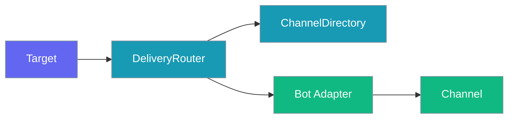
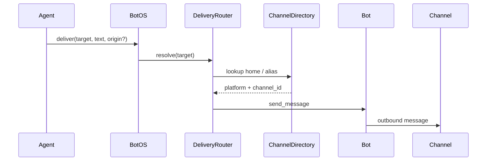
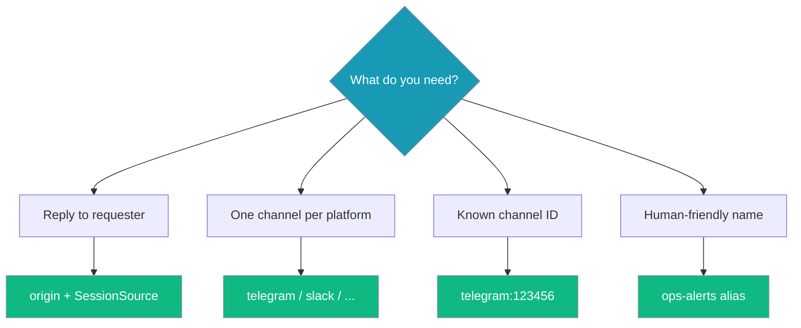
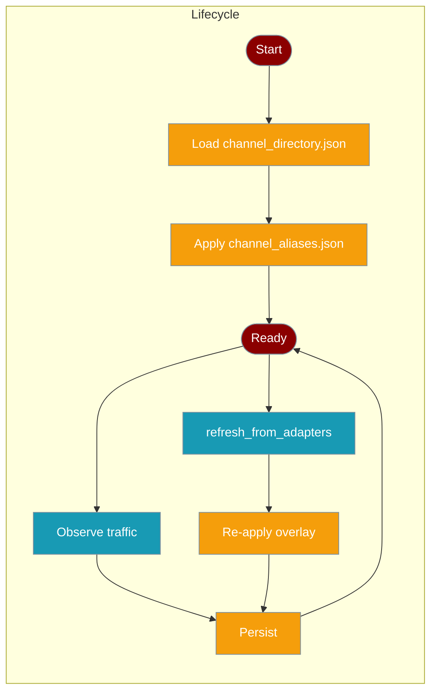
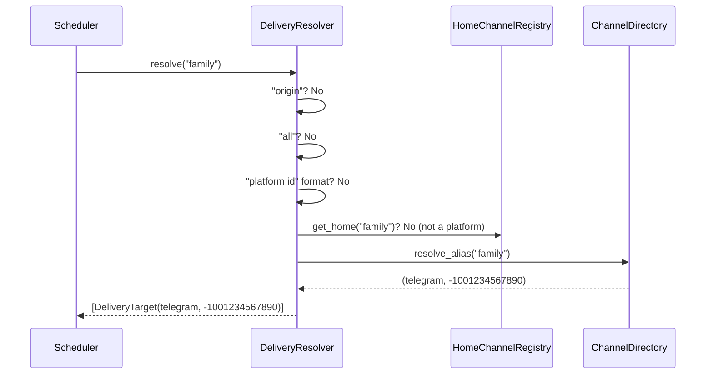

Proactive delivery lets your bot push messages outbound — reply back to the requesting chat, deliver to a **home channel** set with `/sethome`, or target explicit delivery tokens without hardcoding IDs in every job.

## Home Channels (`/sethome`)

Mark a chat once as the platform default for scheduled deliveries. Settings persist to `~/.praisonai/state/home_channels.json`.

```bash
# In Telegram (or any bot chat):
/sethome

# Then schedule without a numeric chat id:
praisonai schedule add "daily-news" -s daily -m "Summarise AI news" --deliver telegram
```

| Delivery token | Resolves to |
|---|---|
| `origin` | Chat where the job was created (`--channel` + `--channel-id` required at creation) |
| `<platform>` (e.g. `telegram`) | That platform's home channel from `/sethome` |
| `<platform>:<chat_id>[:<thread_id>]` | Explicit target |
| `all` | Fan-out to every platform with a configured home channel |

See [Bot Chat Commands](/docs/features/bot-commands#sethome) for the `/sethome` command.



## Quick Start

<Steps>
<Step title="Reply to where the request came from">

```python
from praisonai.bots import BotOS, Bot, SessionSource
from praisonaiagents import Agent
import asyncio

agent = Agent(name="ops", instructions="You alert humans about incidents.")
botos = BotOS(bots=[Bot("telegram", agent=agent)])

botos.configure_channels({
    "telegram": {"home_channel": "123456", "aliases": {"ops-alerts": "123456"}},
})

async def notify():
    src = SessionSource(platform="telegram", channel_id="123456")
    await botos.deliver("origin", "Build finished!", origin=src)

asyncio.run(notify())
```

</Step>

<Step title="Send to a platform's default channel">

```python
await botos.deliver("telegram", "Nightly digest ready")
```

Requires `home_channel` configured for that platform.

</Step>

<Step title="Send to a named alias">

```python
await botos.deliver("ops-alerts", "Disk usage at 90%")
```

</Step>
</Steps>

## How It Works



| Target | Resolves to | Example |
|--------|-------------|---------|
| `origin` | Chat that triggered the request | `deliver("origin", text, origin=src)` |
| `<platform>` | Platform's `home_channel` | `deliver("telegram", text)` |
| `<platform>:<id>` | Explicit channel | `deliver("telegram:123456", text)` |
| `<alias>` | Friendly name from directory | `deliver("ops-alerts", text)` |
| `<platform>:<id>` | Observed channel from traffic or adapter refresh | Surfaced in `describe_targets()` as `kind: "observed"` |

Resolution order: `origin` → `platform:channel_id` → bare platform name → alias. Platform names win over aliases — do not name an alias the same as a platform.

Scheduled jobs use `DeliveryRouter` automatically, defaulting to `"origin"` when delivery context is present.

## Choosing a Target Form



## Configuration

### YAML

```yaml
channels:
  telegram:
    token: ${TELEGRAM_BOT_TOKEN}
    home_channel: "123456"
    aliases:
      ops-alerts: "123456"
      dev-chat: "789012"
```

### Python

```python
botos.configure_channels({
    "telegram": {"home_channel": "123456", "aliases": {"ops-alerts": "123456"}},
    "discord": {"home_channel": "789012"},
})

# Or use the directory directly
botos.delivery_router.directory.add_alias("ops-alerts", "telegram", "123456")
botos.delivery_router.directory.set_home_channel("telegram", "123456")
```

## Persistence

Home and observed channels auto-persist to `~/.praisonai/state/channel_directory.json` and reload on start — reachable targets survive restarts.

```python
from pathlib import Path
from praisonai.bots.delivery import ChannelDirectory

# Default paths — channels survive restarts automatically
directory = ChannelDirectory()
directory.set_home_channel("telegram", "123456")
directory.observe_channel("discord", "555")

# Restart your process — channels are still reachable
directory2 = ChannelDirectory()
# telegram:home and discord:555 are immediately available
```

Custom paths for multi-tenant or containerised deployments:

```python
directory = ChannelDirectory(
    persist_path=Path("/var/lib/myapp/dir.json"),
    aliases_path=Path("/var/lib/myapp/aliases.json"),
)
```

| Arg | Type | Default | Description |
|---|---|---|---|
| `persist_path` | `Optional[Path]` | `~/.praisonai/state/channel_directory.json` | Home + observed channels. Atomic write via temp file + `os.replace`. |
| `aliases_path` | `Optional[Path]` | `~/.praisonai/state/channel_aliases.json` | Hand-editable alias overlay re-applied on every load + refresh. |

<Note>
Persistence is best-effort — failures are logged and never raised. Your bot keeps running even if the state directory is read-only.
</Note>



## Pre-Naming Channels (Alias Overlay)

Drop a JSON file at `~/.praisonai/state/channel_aliases.json` to pre-name channels before they produce any traffic.

```json
{
  "engineering": { "platform": "discord", "channel_id": "555" },
  "ops": "slack:C111"
}
```

Both long form and shorthand (`"platform:channel_id"`) are accepted. Invalid entries are skipped with a warning.

With the overlay in place, the agent can deliver to `"engineering"` even without prior messages from that channel:

```python
from praisonai.bots.delivery import ChannelDirectory

directory = ChannelDirectory()
# engineering and ops are already reachable — no traffic needed
await botos.deliver("engineering", "Deploy complete")
```

Editing the file and calling `refresh_directory()` (or restarting) honours alias deletions. Aliases added in code via `add_alias()` are never pruned by the overlay.

## Refreshing from Live Adapters

`refresh_directory()` enumerates every configured adapter and merges their channels into the directory — channels the agent has never been messaged from become reachable immediately.

```python
# Gateway background loop — call this periodically
botos.delivery_router.refresh_directory()
```

Lower-level API for direct adapter access:

```python
from praisonai.bots.delivery import ChannelDirectory

directory = ChannelDirectory()
directory.refresh_from_adapters({
    "discord": discord_bot,
    "slack": slack_bot,
})
```

Adapter contract: adapters must expose `list_channels()` returning an iterable of objects with a `.id` attribute (or plain strings). Adapters without `list_channels` are silently skipped; adapter errors are caught and logged, never raised.

**User flow this enables:**

1. User asks the agent: *"Post a summary to the engineering channel."*
2. The agent has never received traffic from that channel.
3. Because the gateway's background `refresh_directory()` already enumerated the Discord adapter, `"engineering"` is in the directory.
4. `deliver("engineering", summary)` succeeds.

## Common Patterns

### Scheduled digest to a named channel

```python
summary = agent.start("Summarise today's incidents")
await botos.deliver("ops-alerts", summary)
```

### Cross-channel notification from a tool

```python
await botos.deliver("slack:C123ABC", "FYI: deploy complete")
```

### Periodic refresh in a gateway loop

```python
import asyncio

async def background_refresh(botos, interval=300):
    while True:
        botos.delivery_router.refresh_directory()
        await asyncio.sleep(interval)

asyncio.create_task(background_refresh(botos))
```

## Best Practices

<AccordionGroup>
<Accordion title="Prefer aliases over raw IDs in agent code">
Aliases survive channel renumbering and read better in logs.
</Accordion>

<Accordion title="Always set home_channel for platforms you target by name">
Bare-platform targets fail loudly without a configured home channel.
</Accordion>

<Accordion title="Do not name an alias the same as a platform">
Platform-name lookup wins; the alias becomes unreachable by bare name.
</Accordion>

<Accordion title="Handle the bool return">
`deliver()` returns `False` on resolution or send failure — log and retry as appropriate.
</Accordion>

<Accordion title="Use the alias overlay for pre-production setup">
Pre-populate `channel_aliases.json` before deploying — channels become reachable without needing to send a message first.
</Accordion>

<Accordion title="Call refresh_directory() on a background loop">
Adapters enumerate live channels; a 5-minute refresh keeps the directory current without hammering APIs.
</Accordion>
</AccordionGroup>

## Friendly Aliases for Scheduled Delivery

The gateway `DeliveryResolver` now accepts an optional `directory=` parameter backed by `ChannelDirectory`. This means the same friendly alias names you define for interactive chat work as scheduled-delivery targets — no more hardcoding platform IDs in cron jobs.

**Backward compatibility:** when `directory=` is not passed (any existing code that builds its own `DeliveryResolver`), behaviour is byte-for-byte unchanged. Aliases only ever resolve names that are not already known platform names.

### Worked Example

**1. Define aliases in the overlay file** (`~/.praisonai/state/channel_aliases.json`):

```json
{
  "family": { "platform": "telegram", "channel_id": "-1001234567890" },
  "ops": "slack:C0123ABCDEF"
}
```

**2. Schedule a job using the alias as the delivery target:**

```python
import asyncio
from praisonai.bots import BotOS, Bot
from praisonaiagents import Agent

agent = Agent(name="digest", instructions="Summarise today's news")
botos = BotOS(bots=[Bot("telegram", agent=agent), Bot("slack", agent=agent)])

summary = agent.start("Summarise today's top AI news")
asyncio.run(botos.deliver("family", summary))
```

The resolver looks up `"family"` in `ChannelDirectory` and routes to `telegram:-1001234567890`.

**3. Resolved target:**

| Alias | Resolved platform | Resolved channel_id |
|---|---|---|
| `family` | `telegram` | `-1001234567890` |
| `ops` | `slack` | `C0123ABCDEF` |

### Resolution Order



### Alias Resolution Order Table

| Step | Token form | Resolves to |
|---|---|---|
| 1 | `origin` | The chat where the job was created (requires `origin=` to be set) |
| 2 | `all` | Every connected platform's home channel (fan-out) |
| 3 | `platform:chat_id[:thread_id]` | Validated explicit target |
| 4 | Bare platform name (e.g. `telegram`) | That platform's home channel from `/sethome` |
| 5 | **Bare alias name** (not a platform) | Looked up via `directory.resolve_alias(name)` |
| 6 | Unknown | Warning logged; returns `[]` |

<Warning>
Platform-home tokens always win over aliases. An alias named `telegram`, `slack`, or `discord` will resolve as the platform home — never as the alias. Choose alias names that cannot be confused with platform names.
</Warning>

## Related

<CardGroup cols={2}>
  <Card title="BotOS" icon="robot" href="/docs/features/botos">
    Multi-platform orchestration
  </Card>
  <Card title="Bot Gateway" icon="server" href="/docs/features/bot-gateway">
    Run multiple bots from one server
  </Card>
</CardGroup>
