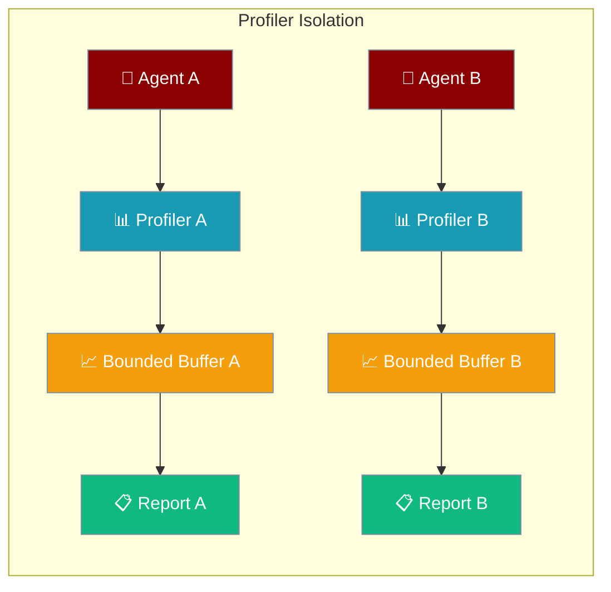
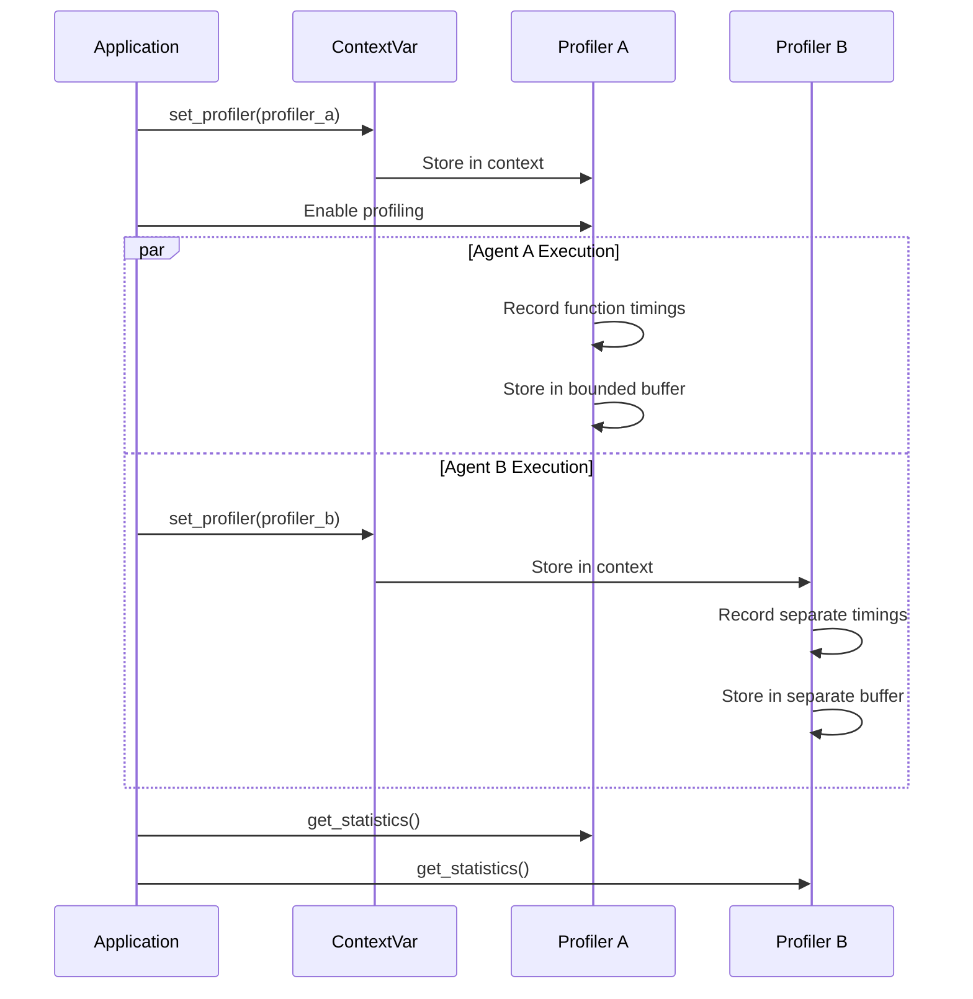

Per-agent profiler isolation enables independent performance monitoring across multiple concurrent agents using context-aware profiling.



## Quick Start

<Steps>
<Step title="Enable Per-Agent Profiling">
Create isolated profilers for different agents to avoid mixing performance data.

```python
from praisonaiagents import Agent
from praisonai.profiler import _ProfilerImpl, set_profiler, get_profiler

# Create agent-specific profiler
agent_profiler = _ProfilerImpl(max_records=5000)
set_profiler(agent_profiler)

agent = Agent(
    name="DataAgent",
    instructions="Process data efficiently"
)

# Run with isolated profiling
response = agent.start("Analyze quarterly sales")
```
</Step>

<Step title="Multi-Agent Isolated Profiling">
Use separate profilers for concurrent agents to prevent performance data mixing.

```python
import asyncio
from praisonaiagents import Agent
from praisonai.profiler import _ProfilerImpl, set_profiler

async def run_agent_with_profiler(name, task):
    # Each agent gets its own profiler instance
    profiler = _ProfilerImpl(max_records=10000)
    set_profiler(profiler)
    
    agent = Agent(name=name, instructions=f"Handle {name} tasks")
    result = await agent.run_async(task)
    
    # Get isolated performance data
    stats = get_profiler().get_statistics()
    return result, stats

async def main():
    # Run multiple agents concurrently with isolated profiling
    results = await asyncio.gather(
        run_agent_with_profiler("SalesAgent", "Process Q4 sales data"),
        run_agent_with_profiler("MarketAgent", "Analyze market trends"),
        run_agent_with_profiler("ReportAgent", "Generate monthly report")
    )
    
    for result, stats in results:
        print(f"Performance - P95: {stats['p95']:.2f}ms")
```
</Step>
</Steps>

---

## How It Works



| Component | Purpose | Context Scope |
|-----------|---------|--------------|
| `_ProfilerImpl` | Per-instance profiler class | Agent-specific |
| `get_profiler()` | Get current context profiler | Thread/async local |
| `set_profiler()` | Install profiler in context | Thread/async local |
| `max_records` | Bounded buffer size | Per instance |

---

## Configuration Options

### ProfilerImpl Constructor

```python
from praisonai.profiler import _ProfilerImpl

profiler = _ProfilerImpl(
    max_records=10000  # Buffer size per profiler (default: 10k)
)
```

| Parameter | Type | Default | Description |
|-----------|------|---------|-------------|
| `max_records` | `int` | `10000` | Maximum records per buffer before rotation |

### Context Management

```python
from praisonai.profiler import get_profiler, set_profiler

# Get current profiler
current = get_profiler()

# Install new profiler in current context
set_profiler(my_profiler)

# Context-aware: different async tasks see different profilers
```

---

## Common Patterns

### Agent-Specific Performance Monitoring

```python
from praisonaiagents import Agent
from praisonai.profiler import _ProfilerImpl, set_profiler, get_profiler

class PerformanceAgent:
    def __init__(self, name, max_records=5000):
        self.name = name
        self.profiler = _ProfilerImpl(max_records=max_records)
        
    async def run_with_profiling(self, task):
        # Set agent-specific profiler
        set_profiler(self.profiler)
        
        agent = Agent(name=self.name, instructions="Complete tasks efficiently")
        
        # All operations in this context use this profiler
        with self.profiler.block("task_execution"):
            result = await agent.run_async(task)
            
        return result
        
    def get_performance_report(self):
        stats = self.profiler.get_statistics()
        return {
            "agent": self.name,
            "p50_ms": stats['p50'],
            "p95_ms": stats['p95'], 
            "p99_ms": stats['p99'],
            "total_operations": stats['count']
        }

# Usage
sales_agent = PerformanceAgent("SalesAgent")
marketing_agent = PerformanceAgent("MarketingAgent")

# Run with isolated profiling
await sales_agent.run_with_profiling("Process Q4 data")
await marketing_agent.run_with_profiling("Analyze campaigns")

# Get separate performance reports
sales_perf = sales_agent.get_performance_report()
marketing_perf = marketing_agent.get_performance_report()
```

### Function-Level Profiling

```python
from praisonai.profiler import get_profiler

async def data_processing_task():
    profiler = get_profiler()  # Get context profiler
    
    with profiler.block("data_loading"):
        data = await load_data()
        
    with profiler.block("data_transformation"):
        transformed = await transform(data)
        
    with profiler.block("data_storage"):
        await store_results(transformed)
        
    return transformed
```

### Bounded Buffer Management

```python
# Large buffer for long-running agents
long_runner = _ProfilerImpl(max_records=50000)

# Smaller buffer for quick tasks  
quick_task = _ProfilerImpl(max_records=1000)

# Buffer automatically rotates when full
set_profiler(long_runner)
for i in range(60000):  # More than max_records
    with get_profiler().block(f"operation_{i}"):
        pass  # Only last 50k operations kept
```

---

## Best Practices

<AccordionGroup>
<Accordion title="Create profiler per agent for isolation">
Always use separate profiler instances for different agents to prevent data mixing:

```python
# ✅ Good: Isolated profilers
agent1_profiler = _ProfilerImpl(max_records=10000)
agent2_profiler = _ProfilerImpl(max_records=10000)

async def run_agent1():
    set_profiler(agent1_profiler)
    # Agent 1 operations...

async def run_agent2():
    set_profiler(agent2_profiler) 
    # Agent 2 operations...

# ❌ Bad: Shared profiler
shared = _ProfilerImpl()
# Both agents would mix performance data
```
</Accordion>

<Accordion title="Size buffers appropriately for workload">
Choose buffer sizes based on expected operation count:

```python
# High-frequency agent: Large buffer
high_freq = _ProfilerImpl(max_records=100000)

# Batch processing: Medium buffer  
batch = _ProfilerImpl(max_records=10000)

# Quick tasks: Small buffer
quick = _ProfilerImpl(max_records=1000)
```
</Accordion>

<Accordion title="Use context blocks for granular timing">
Profile specific operations with descriptive block names:

```python
profiler = get_profiler()

with profiler.block("llm_call"):
    response = await llm.generate(prompt)
    
with profiler.block("tool_execution"):
    result = await tool.execute(args)
    
with profiler.block("response_formatting"):
    formatted = format_response(response, result)
```
</Accordion>

<Accordion title="Monitor memory with profiler isolation">
Each profiler tracks memory independently:

```python
with get_profiler().memory("memory_intensive_task"):
    # Large data processing
    process_large_dataset()
    
# Memory tracking is per-profiler instance
memory_stats = get_profiler().get_memory_records()
```
</Accordion>
</AccordionGroup>

---

## Backward Compatibility

<Note>
The global `Profiler` class is now a `ProfilerCompat` instance that delegates to `get_profiler()`. 
Existing code using `Profiler.enable()`, `Profiler.block()`, etc. continues to work unchanged:

```python
# Still works - uses context profiler
from praisonai.profiler import Profiler

Profiler.enable()
with Profiler.block("legacy_operation"):
    do_work()

# Equivalent new style
from praisonai.profiler import get_profiler

profiler = get_profiler()
profiler.enable()
with profiler.block("new_operation"):
    do_work()
```

However, `isinstance(x, Profiler)` and `class Foo(Profiler):` will break as `Profiler` is no longer a class.
</Note>

---

## Related

<CardGroup cols={2}>
<Card title="Agent Architecture" icon="user" href="/docs/concepts/agents">
  Learn about multi-agent patterns
</Card>
<Card title="Observability Overview" icon="chart-line" href="/docs/observability/overview">
  Complete observability system
</Card>
</CardGroup>