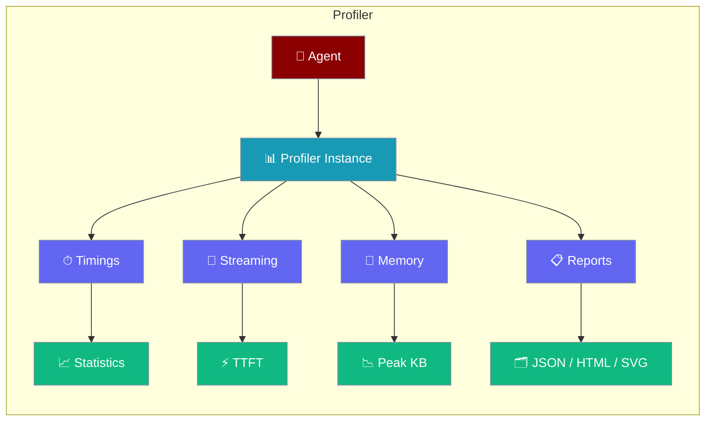
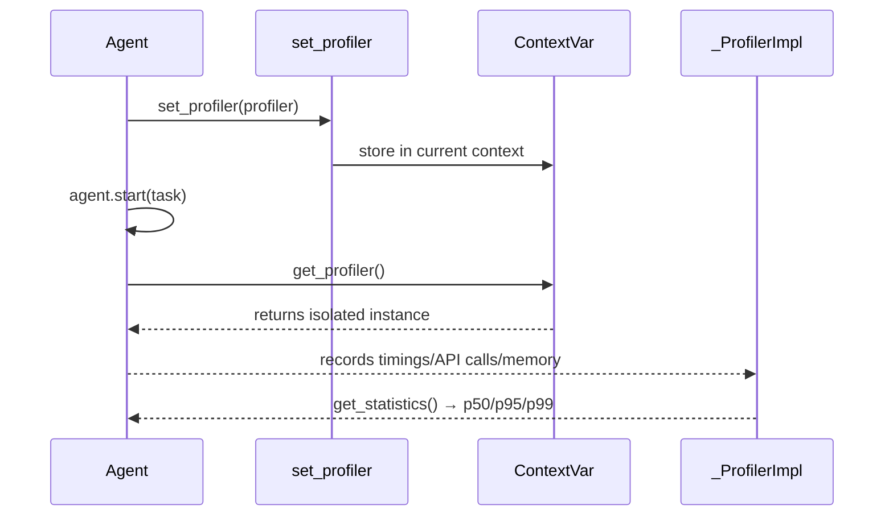
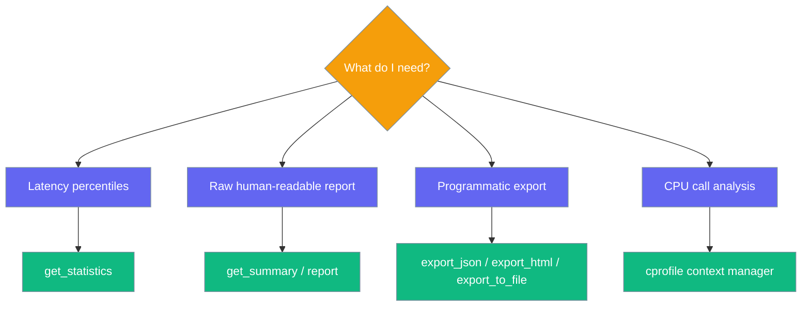

Profile agent execution with per-agent isolation, latency percentiles, memory snapshots, and HTML/JSON reports.

```python
from praisonaiagents import Agent
from praisonai.profiler import _ProfilerImpl, set_profiler, get_profiler

set_profiler(_ProfilerImpl())
agent = Agent(name="assistant", instructions="Be helpful")
agent.start("Explain quicksort in one paragraph")
get_profiler().print_summary()
```

The user runs the agent; the profiler captures latency, streaming, and memory for that turn.



## Quick Start

<Steps>
<Step title="Simple Usage">

Profile a single agent turn and print P95 latency:

```python
from praisonaiagents import Agent
from praisonai.profiler import _ProfilerImpl, set_profiler, get_profiler

profiler = _ProfilerImpl(max_records=5000)
set_profiler(profiler)

agent = Agent(name="DataAgent", instructions="Process data efficiently")
agent.start("Analyse quarterly sales")

stats = get_profiler().get_statistics()
print(f"P95: {stats['p95']:.2f}ms")
```

</Step>

<Step title="With Configuration">

Isolate profilers across concurrent agents:

```python
import asyncio
from praisonaiagents import Agent
from praisonai.profiler import _ProfilerImpl, set_profiler, get_profiler

async def run_with_profiler(name, task):
    set_profiler(_ProfilerImpl(max_records=10000))
    agent = Agent(name=name, instructions=f"Handle {name} tasks")
    result = await agent.run_async(task)
    return result, get_profiler().get_statistics()

async def main():
    results = await asyncio.gather(
        run_with_profiler("SalesAgent", "Process Q4 sales data"),
        run_with_profiler("MarketAgent", "Analyse market trends"),
    )
    for _, stats in results:
        print(f"P95: {stats['p95']:.2f}ms")

asyncio.run(main())
```

</Step>
</Steps>

---

## How It Works

Profilers live in a `ContextVar` — each async task or thread sees its own instance when you call `set_profiler()`.



| API | Purpose |
|-----|---------|
| `_ProfilerImpl(max_records=...)` | Bounded buffer per profiler instance |
| `set_profiler(profiler)` | Install profiler in current context |
| `get_profiler()` | Read context profiler (creates default if unset) |
| `profiler.block("name")` | Time a code block |
| `get_statistics()` | P50, P95, P99 latency summaries |

The legacy `Profiler` class delegates to `get_profiler()` — existing `Profiler.block()` calls still work.

---

## Statistics

`get_statistics()` returns percentile timing data for all recorded operations.

```python
from praisonaiagents import Agent
from praisonai.profiler import _ProfilerImpl, set_profiler, get_profiler

profiler = _ProfilerImpl()
set_profiler(profiler)
profiler.enable()

agent = Agent(instructions="Summarise this document")
agent.start("Write a summary of the Q3 report")

stats = get_profiler().get_statistics()
print(f"p50={stats['p50']:.1f}ms  p95={stats['p95']:.1f}ms  p99={stats['p99']:.1f}ms")
print(f"mean={stats['mean']:.1f}ms  std_dev={stats['std_dev']:.1f}ms")
print(f"min={stats['min']:.1f}ms  max={stats['max']:.1f}ms")
```

Filter by category:

```python
api_stats = get_profiler().get_statistics(category="api")
```

| Key | Description |
|-----|-------------|
| `p50` | Median latency (ms) |
| `p95` | 95th percentile latency (ms) |
| `p99` | 99th percentile latency (ms) |
| `mean` | Average latency (ms) |
| `std_dev` | Standard deviation (ms) |
| `min` | Minimum latency (ms) |
| `max` | Maximum latency (ms) |

---

## Data Retrieval

Retrieve raw records for custom analysis:

```python
from praisonai.profiler import get_profiler

profiler = get_profiler()

api_calls     = profiler.get_api_calls()       # List[APICallRecord]
streaming     = profiler.get_streaming_records()  # List[StreamingRecord]
memory        = profiler.get_memory_records()  # List[MemoryRecord]
line_data     = profiler.get_line_profile_data()  # Dict[str, Any]
```

Store custom line-profile output:

```python
profiler.set_line_profile_data("my_function", {"total_ms": 42.0})
```

---

## Async Streaming

Profile streaming LLM responses with the async context manager:

```python
import asyncio
from praisonaiagents import Agent
from praisonai.profiler import _ProfilerImpl, set_profiler, get_profiler

async def main():
    profiler = _ProfilerImpl()
    set_profiler(profiler)
    profiler.enable()

    agent = Agent(instructions="Stream a story")

    async with get_profiler().streaming_async("llm.chat") as tracker:
        async for chunk in agent.stream_async("Tell me a short story"):
            tracker.chunk()
            print(chunk, end="", flush=True)

    records = get_profiler().get_streaming_records()
    print(f"\nTTFT: {records[-1].ttft_ms:.1f}ms  Total: {records[-1].total_ms:.1f}ms")

asyncio.run(main())
```

<Note>
Use `record_streaming(name, ttft_ms, total_ms, chunk_count=0, total_tokens=0)` to manually record a streaming operation without using the context manager.
</Note>

---

## cProfile & Memory

Wrap heavy blocks with `cProfile` or `tracemalloc`:

<Tabs>
<Tab title="cProfile">

```python
from praisonaiagents import Agent
from praisonai.profiler import _ProfilerImpl, set_profiler, get_profiler

profiler = _ProfilerImpl()
set_profiler(profiler)
profiler.enable()

agent = Agent(instructions="Summarise this document")

with get_profiler().cprofile("summarise"):
    agent.start("Summarise the Q3 earnings report")

print(get_profiler().get_statistics())
```

</Tab>
<Tab title="Memory Tracking">

```python
from praisonaiagents import Agent
from praisonai.profiler import _ProfilerImpl, set_profiler, get_profiler

profiler = _ProfilerImpl()
set_profiler(profiler)
profiler.enable()

agent = Agent(instructions="Process large data")

with get_profiler().memory("data_processing"):
    agent.start("Analyse all 10,000 rows in the dataset")

records = get_profiler().get_memory_records()
print(f"Peak: {records[-1].peak_kb:.1f} KB")
```

</Tab>
<Tab title="Memory Snapshot">

```python
from praisonai.profiler import get_profiler

snapshot = get_profiler().memory_snapshot()
print(f"Current: {snapshot['current_kb']:.1f} KB")
print(f"Peak:    {snapshot['peak_kb']:.1f} KB")
```

</Tab>
</Tabs>

Use `record_memory(name, current_kb, peak_kb)` to store a manual memory snapshot:

```python
get_profiler().record_memory("after_load", current_kb=512.0, peak_kb=768.0)
```

---

## Flamegraph

Export call-graph data for use with external renderers such as [speedscope](https://www.speedscope.app/) or [flamegraph.pl](https://github.com/brendangregg/FlameGraph):

```python
from praisonaiagents import Agent
from praisonai.profiler import _ProfilerImpl, set_profiler, get_profiler

profiler = _ProfilerImpl()
set_profiler(profiler)
profiler.enable()

agent = Agent(instructions="Run a complex pipeline")
agent.start("Execute the monthly reporting pipeline")

data = get_profiler().get_flamegraph_data()
# Returns: [{"name": ..., "value": ..., "file": ..., "line": ...}, ...]

get_profiler().export_flamegraph("profile.svg")
```

<Warning>
`export_flamegraph` writes a placeholder SVG containing node counts (`nodes=<count>`). It is **not** a rendered flamegraph. Load the returned data from `get_flamegraph_data()` into an external renderer like speedscope for a visual flamechart.
</Warning>

---

## Report Exporters

<Tabs>
<Tab title="JSON">

```python
from praisonai.profiler import get_profiler

json_str = get_profiler().export_json()
print(json_str)
```

</Tab>
<Tab title="HTML">

```python
from praisonai.profiler import get_profiler

html_str = get_profiler().export_html()
with open("report.html", "w") as f:
    f.write(html_str)
```

</Tab>
<Tab title="File Export">

```python
from praisonai.profiler import get_profiler

get_profiler().export_to_file("report.json", format="json")
get_profiler().export_to_file("report.html", format="html")
```

</Tab>
</Tabs>

| Method | Returns | Description |
|--------|---------|-------------|
| `export_json()` | `str` | JSON summary of all profiling data |
| `export_html()` | `str` | Minimal HTML report — title, total time, slowest-op table |
| `export_to_file(filepath, format="json")` | `None` | Write JSON or HTML to disk |
| `export_flamegraph(filepath)` | `None` | Write placeholder SVG for external renderer |

---

## Which API Should I Use?



| Goal | Method |
|------|--------|
| Latency p50 / p95 / p99 | `get_statistics()` |
| Human-readable console report | `report()` / `get_summary()` |
| Machine-readable data | `export_json()` |
| Web dashboard | `export_html()` / `export_to_file(path, "html")` |
| CPU call-graph analysis | `cprofile("name")` context manager |
| Streaming TTFT data | `streaming_async("name")` or `streaming("name")` |
| Memory footprint | `memory("name")` or `memory_snapshot()` |

---

## Import Forms

<Tabs>
<Tab title="Recommended (per-agent isolation)">

```python
from praisonai.profiler import get_profiler, _ProfilerImpl, set_profiler

profiler = _ProfilerImpl(max_records=10000)
set_profiler(profiler)
profiler.enable()

with get_profiler().cprofile("block"):
    agent.start("task")
```

</Tab>
<Tab title="Compat (legacy flat call surface)">

```python
from praisonai.profiler import Profiler

Profiler.enable()

with Profiler.cprofile("block"):
    agent.start("task")

stats = Profiler.get_statistics()
```

</Tab>
</Tabs>

<Note>
**Singleton behaviour change (PR #2546):** `ProfilerCompat` (exposed as `Profiler`) is now a singleton — repeated `Profiler()` calls return the **same** instance. Code that relied on creating separate `Profiler()` instances for isolation must switch to `_ProfilerImpl` + `set_profiler()` instead.
</Note>

---

## Configuration Options

| Parameter | Type | Default | Description |
|-----------|------|---------|-------------|
| `max_records` | `int` | `10000` | Buffer size before rotation |
| `PRAISONAI_PROFILE_MAX` | env | `10000` | Global default buffer cap |
| `PRAISONAI_PROFILE` | env | `""` | Set to `1` / `true` / `yes` to auto-enable profiling |

<Card title="Profiler SDK Reference" icon="code" href="/docs/sdk/reference/praisonai/classes/Profiler">
  Auto-generated API reference for all Profiler methods
</Card>

---

## Best Practices

<AccordionGroup>
<Accordion title="Create one profiler per agent">
Separate `_ProfilerImpl` instances prevent mixed timings in concurrent runs. Use `set_profiler()` inside each agent's async task.
</Accordion>
<Accordion title="Size buffers for workload">
Use larger `max_records` for high-frequency agents; smaller for quick tasks. The default 10,000 covers most workloads.
</Accordion>
<Accordion title="Use descriptive block names">
`profiler.block("llm_call")` and `profiler.block("tool_execution")` produce readable reports. Avoid generic names like `"step1"`.
</Accordion>
<Accordion title="Prefer get_profiler over global Profiler">
New code should call `get_profiler()` for context-aware isolation. The `Profiler` compat alias is for existing codebases only.
</Accordion>
<Accordion title="Export after the run completes">
Call `export_json()` or `export_html()` after all agent tasks finish to capture the full session in one report.
</Accordion>
</AccordionGroup>

---

## Related

<CardGroup cols={2}>
<Card title="Observability Overview" icon="chart-line" href="/docs/observability/overview">
  Traces, metrics, and logging
</Card>
<Card title="Profiling" icon="gauge" href="/docs/features/profiling">
  Broader performance profiling options
</Card>
</CardGroup>
