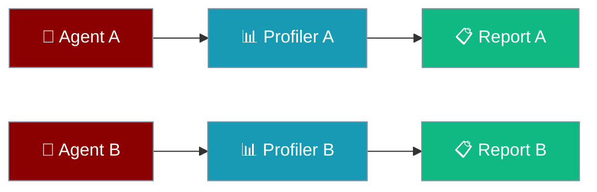

Give each agent its own profiler so concurrent runs do not mix timing data.

```python
from praisonaiagents import Agent
from praisonai.profiler import _ProfilerImpl, set_profiler, get_profiler

profiler = _ProfilerImpl(max_records=5000)
set_profiler(profiler)

agent = Agent(name="DataAgent", instructions="Process data efficiently")
response = agent.start("Analyse quarterly sales")
stats = get_profiler().get_statistics()
print(f"P95: {stats['p95']:.2f}ms")
```



## Quick Start

<Steps>
<Step title="Simple Usage">

Profile a single agent turn:

```python
from praisonaiagents import Agent
from praisonai.profiler import _ProfilerImpl, set_profiler, get_profiler

profiler = _ProfilerImpl(max_records=5000)
set_profiler(profiler)

agent = Agent(name="DataAgent", instructions="Process data efficiently")
agent.start("Analyse quarterly sales")

print(get_profiler().get_statistics())
```

</Step>

<Step title="With Configuration">

Isolate profilers across concurrent agents:

```python
import asyncio
from praisonaiagents import Agent
from praisonai.profiler import _ProfilerImpl, set_profiler, get_profiler

async def run_with_profiler(name, task):
    set_profiler(_ProfilerImpl(max_records=10000))
    agent = Agent(name=name, instructions=f"Handle {name} tasks")
    result = await agent.run_async(task)
    return result, get_profiler().get_statistics()

async def main():
    results = await asyncio.gather(
        run_with_profiler("SalesAgent", "Process Q4 sales data"),
        run_with_profiler("MarketAgent", "Analyse market trends"),
    )
    for _, stats in results:
        print(f"P95: {stats['p95']:.2f}ms")

asyncio.run(main())
```

</Step>
</Steps>

---

## How It Works

Profilers live in a `ContextVar` — each async task or thread sees its own instance when you call `set_profiler()`.

| API | Purpose |
|-----|---------|
| `_ProfilerImpl(max_records=...)` | Bounded buffer per profiler instance |
| `set_profiler(profiler)` | Install profiler in current context |
| `get_profiler()` | Read context profiler (creates default if unset) |
| `profiler.block("name")` | Time a code block |
| `get_statistics()` | P50, P95, P99 latency summaries |

The legacy `Profiler` class delegates to `get_profiler()` — existing `Profiler.block()` calls still work.

---

## Configuration Options

| Parameter | Type | Default | Description |
|-----------|------|---------|-------------|
| `max_records` | `int` | `10000` | Buffer size before rotation |
| `PRAISONAI_PROFILE_MAX` | env | `10000` | Global default buffer cap |

---

## Best Practices

<AccordionGroup>
<Accordion title="Create one profiler per agent">
Separate `_ProfilerImpl` instances prevent mixed timings in concurrent runs.
</Accordion>
<Accordion title="Size buffers for workload">
Use larger `max_records` for high-frequency agents; smaller for quick tasks.
</Accordion>
<Accordion title="Use descriptive block names">
`profiler.block("llm_call")` and `profiler.block("tool_execution")` make reports readable.
</Accordion>
<Accordion title="Prefer get_profiler over global Profiler">
New code should call `get_profiler()` for context-aware isolation.
</Accordion>
</AccordionGroup>

---

## Related

<CardGroup cols={2}>
<Card title="Observability Overview" icon="chart-line" href="/docs/observability/overview">
  Traces, metrics, and logging
</Card>
<Card title="Profiling" icon="gauge" href="/docs/features/profiling">
  Broader performance profiling options
</Card>
</CardGroup>
